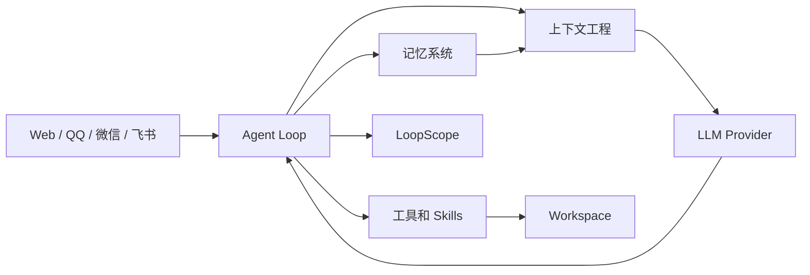
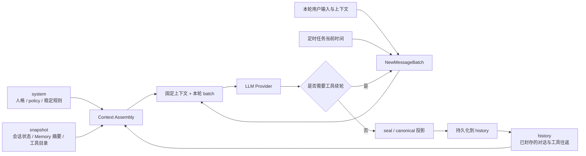
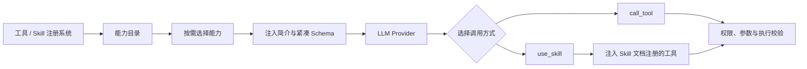

<div align="center">


# 咕咕

### Agent UI，必须先有 UI。

咕咕的想法：把散落的看板、日历、笔记、文件和画布放到一起，让用户和 Agent 在同一个地方做事。

*这是一个 Vibe Coding 项目，欢迎通过 Issue 和 PR 参与改进。*

[](https://gugugu.site)
[](LICENSE)
[](frontend/)
[](backend/)

[中文](README.md) ｜ [English](README_en.md) ｜ [在线预览](https://gugugu.site)

</div>

## 能做什么

| 领域 | 能力 |
| --- | --- |
| Agent | 多轮对话、工具调用、联网搜索、定时任务和流式响应 |
| 工作空间 | 管理项目、阶段、任务、日历、提醒、文件、笔记、终端和无限画布 |
| 信息获取 | 联网搜索、站内全文搜索、Knowledge / RAG、文件内容检索和相似图搜索 |
| 长期上下文 | 记忆用户习惯、近期状态、知识和行为模式，支持跨对话延续上下文 |
| 主题与外观 | 支持多种配色、Aero / Mono 样式，以及亮色、暗色和跟随系统模式 |
| 沙盒执行 | 在隔离环境中运行 Shell 命令，提供工作目录、执行状态和资源边界 |
| 多用户与租户 | 多用户账户、账户级数据隔离和独立配置 |
| 权限与安全 | 用户身份、资源归属、会话权限、管理员后台和危险操作确认门 |
| 即时通讯 | 接入 QQ、微信、飞书等渠道，支持私聊、群聊、消息归一化、上下文会话和通知推送 |
| 管理后台 | 管理用户、模型、BYOK、搜索、邮件通知、文件存储、日志和系统服务 |
| 国际化 | 支持中文、英文和日文界面，前端文案通过统一 i18n 管理 |
| 开发观测 | 使用 LoopScope 查看 Agent Loop、Token、Cache、Tool Call 和性能诊断 |
| 部署运维 | Docker Compose 部署、统一入口、健康检查、日志、数据卷和备份支持 |

## 为什么做咕咕？

本人原本是一名插画师，以前经常遇到一种情况：和客户约好的稿子忘了记录，后来忙着忙着也就忘了，平时也有一些文件管理上的苦恼。

后来有段时间尝试了下 QwenPaw，发现 Agent 在记录项目、整理文档和想法上效率很高。但找了一圈，没有发现一个顺手的 UI：Agent 记录的大量文档，最后还是需要自己去本地找，或者让 Agent 发回来再自己整理。

咕咕一开始只有项目管理功能，但后来慢慢加上了交互 Runtime、文件系统、看板、画布、Shell 和沙盒。现在它已经比最初大了很多，相信这些功能也不只是我一个人用得到。

> 如果最后还是一个聊天框，为什么要叫 Agent UI？

欢迎试用，也欢迎前往 [gugugu.site](https://gugugu.site) 在线体验，或者按照下方的说明在本地部署。不过服务器能力有限，在线体验时可能会没那么流畅。最后，也欢迎提 Issue 和 PR。

## 功能预览

<table>
  <tr>
    <td width="50%" valign="top">
      
      <h3>看板</h3>
      <p>项目、阶段、任务和截止日期组成真实的项目工作流。</p>
    </td>
    <td width="50%" valign="top">
      
      <h3>文件系统</h3>
      <p>文件、项目和个人资料在同一套工作空间中持续沉淀，支持本地磁盘和 OSS 存储。</p>
    </td>
  </tr>
  <tr>
    <td width="50%" valign="top">
      
      <h3>画布</h3>
      <p>把便签、项目、文件和日历活动放到自由画布中，建立可视化关系。</p>
    </td>
    <td width="50%" valign="top">
      
      <h3>Admin</h3>
      <p>管理模型、用户、配置、日志、反馈和系统运行状态。</p>
    </td>
  </tr>
  <tr>
    <td colspan="2" valign="top">
      
      <h3>LoopScope</h3>
      <p>观察 Agent Loop、Token、Cache、Tool Call 和运行性能。</p>
    </td>
  </tr>
</table>

---

### 咕咕对话

<table>
  <tr>
    <td width="25%" valign="top">
      
      <h3>管理日程</h3>
      <p>用自然语言创建和推进项目、安排日程，也可以把重复工作交给定时任务。</p>
    </td>
    <td width="25%" valign="top">
      
      <h3>记录想法</h3>
      <p>随时告诉咕咕想法，让它快速记录笔记、整理内容，或创建思维画布继续展开。</p>
    </td>
    <td width="25%" valign="top">
      
      <h3>即时通讯</h3>
      <p>通过即时通讯渠道与咕咕对话，随时记录事项、查询信息和推进任务。</p>
    </td>
    <td width="25%" valign="top">
      
      <h3>多平台支持</h3>
      <p>在不同平台之间延续咕咕的 Agent 能力，也支持群聊中的上下文理解和成员权限隔离。</p>
    </td>
  </tr>
</table>

## 快速开始

### 前置要求

- Docker 20+ 和 Docker Compose v2
- 可访问的模型 Provider 或 BYOK 配置
- 首次启动需要 PostgreSQL、Redis 和网络访问

### 国内网络环境

国内用户进行源码开发、重新构建镜像或安装依赖时，可以按需使用镜像源。Preview Compose 默认直接拉取已经构建好的镜像，不需要先安装 Python 或 Node 依赖。

```bash
# pnpm / npm 依赖
corepack pnpm install --registry=https://registry.npmmirror.com

# 本地安装 Python 依赖
python -m pip install -i https://pypi.tuna.tsinghua.edu.cn/simple -r backend/requirements.txt

# Dev Compose 重新构建镜像时使用清华 PyPI 镜像
PIP_INDEX_URL=https://pypi.tuna.tsinghua.edu.cn/simple \
  docker compose -f docker-compose.dev.yml up -d --build
```

镜像源只影响当前命令；也可以根据网络情况改用官方源或其他可信镜像。

### Preview Compose（推荐）

```bash
git clone https://github.com/Coffeiz/Gugu-web.git
cd Gugu-web
cp .env.example backend/.env
# 编辑 backend/.env，填写 SECRET_KEY 和模型配置
# Preview Compose 还要显式设置不会写入仓库的管理员和数据库密码
export GUGU_ADMIN_PASSWORD="$(openssl rand -base64 32)"
export GUGU_DB_PASSWORD="$(openssl rand -base64 32)"
docker compose up -d
```

基础变量可以这样配置：

```dotenv
# backend/.env：后端应用配置
SECRET_KEY=请替换为随机长字符串
AI__PROVIDER=qwen
AI__API_KEY=请填写模型服务商密钥

# 项目根目录 .env：Compose 和管理员配置
GUGU_ADMIN_USERNAME=admin
GUGU_ADMIN_PASSWORD=请替换为管理员密码
GUGU_DB_PASSWORD=请替换为数据库密码
```

也可以在启动前使用 `export GUGU_ADMIN_PASSWORD=...` 临时设置管理员密码。完整的 Compose 参数和配置位置见 [部署指南](docs/DEPLOY.md)。

默认 Compose 使用已经构建好的 `latest` 镜像，不挂载源码，也不运行开发服务器。它会同时启动 PostgreSQL、Redis 和内置的 SearXNG 搜索服务，不需要另外安装联网搜索后端。

启动后访问：

- 咕咕：<http://localhost:9595>
- Admin：<http://localhost:9595/admin/>

首次运行会初始化数据库并执行迁移。Admin 账号由 `GUGU_ADMIN_USERNAME` 和 `GUGU_ADMIN_PASSWORD` 控制；普通 Compose 要求显式设置 `GUGU_ADMIN_PASSWORD` 作为容器运行时密码，不会使用公开默认密码。

需要 Shell 沙盒时，再显式启用：

```bash
docker compose --profile sandbox up -d
```

开发者需要源码挂载和 Vite 开发服务器时，使用 [Dev Compose](docker-compose.dev.yml)：

```bash
docker compose -f docker-compose.dev.yml up -d
```

开发环境还可以访问：

- Backend API 文档：<http://localhost:8000/docs>
- LoopScope Collector：<http://localhost:4320>

LoopScope 需要先登录咕咕，访问咕咕的 `/dev` 页面，再点击页面里的 LoopScope 入口；这样才能带上当前账号上下文，看到自己账号的数据。直接打开 Collector 地址不会正常显示对应数据。

## 配置

README 只保留配置索引，完整变量和运行规则将在 `docs/configuration.md` 中整理。

| 配置用途 | 说明 |
| --- | --- |
| Database | 主数据存储，默认使用 PostgreSQL |
| Redis | 消息、会话和 Runtime 状态 |
| LLM / BYOK | 模型 Provider 和个人 API Key |
| Search | 内置 SearXNG Web Search 与站内搜索后端 |
| Mail | 用户反馈和系统邮件通知 |
| IM | QQ、微信、飞书连接 |
| LoopScope | Agent 链路和性能观测 |
| Sandbox | Shell 执行环境和网络出口 |

部署细节见 [简版部署指南](docs/DEPLOY.md)，复杂的生产排障见 [运维部署文档](docs/ops/DEPLOY.md)。

## Workspace

咕咕不是把项目、日历、文件和笔记分散成几个孤立页面，而是把它们放在同一个持续使用的工作空间里。用户和 Agent 看到的是同一套数据，也可以直接在这套数据上继续操作。

项目、阶段、任务、日历、提醒、文件、笔记和无限画布彼此关联。可以从项目找到文件和截止日期，也可以把项目、文件和想法拖到画布上继续整理。

<table>
  <tr>
    <td width="50%" valign="top">
      
      <h3>项目看板</h3>
      <p>用阶段、任务、截止日期和拖拽排序管理项目进展，阶段和待办会同步反映在进度条上。</p>
    </td>
    <td width="50%" valign="top">
      
      <h3>日历</h3>
      <p>项目的开始、截止和阶段节点会出现在日历里，可以直接查看和编辑，也可以创建日程活动并设置提醒。</p>
    </td>
  </tr>
  <tr>
    <td width="50%" valign="top">
      
      <h3>笔记与想法</h3>
      <p>随手记录零碎想法，之后可以随时回来翻看。</p>
    </td>
    <td width="50%" valign="top">
      
      <h3>画布与关系</h3>
      <p>项目、文件、便签和日历活动都可以放到画布上，整理它们之间的关系。</p>
    </td>
  </tr>
  <tr>
    <td width="50%" valign="top">
      
      <h3>文件系统</h3>
      <p>管理个人和项目文件，支持在不同区域之间移动、复制和粘贴，并可使用本地磁盘或 OSS 存储。</p>
    </td>
    <td width="50%" valign="top">
      
      <h3>定时任务</h3>
      <p>把重复工作交给咕咕按计划执行，并通过通知或即时通讯渠道接收结果。</p>
    </td>
  </tr>
</table>

看板支持跨列拖拽和排序，文件可以在不同容器之间移动，画布支持自由落点和关系整理。复杂交互由独立的 [`gugu-interaction-runtime`](https://github.com/Coffeiz/Gugu-interaction-runtime) 驱动。Agent 创建的项目、任务、日历活动和文件会直接出现在工作空间里，用户在界面上的修改也会成为 Agent 后续可以继续使用的真实状态。

## Agent

咕咕的 Agent 可以读取和操作用户所见的数据与功能，拥有与用户等价的系统操作能力，不局限于聊天或某一项能力。

### Channels

同一个 Agent Loop 可以从网页和即时通讯渠道进入，渠道只负责连接和消息适配，身份、会话、上下文、权限和工具仍由共享后端统一处理。

> **推荐优先使用 QQ。** 目前 QQ 渠道经过了最多的适配和优化，在群聊、消息引用、流式回复、文件处理和交互控件方面支持最完整。

| 功能 | Web | QQ | 微信 | 飞书 |
| --- | --- | --- | --- | --- |
| 文本对话 | 支持 | 支持 | 支持 | 支持 |
| 流式输出 | 支持 token 流 | C2C 支持流式消息，群聊按 Round 发送 | 按 Round 发送 | 支持卡片流式更新 |
| 私聊 | 支持 | C2C | 支持 | 支持 |
| 群聊 | 不适用 | 支持 @ 和群聊策略 | 支持 | 支持 |
| 消息引用 | 支持 | 支持文本和附件引用 | 支持媒体引用，文本原文能力有限 | 支持回复引用 |
| @ 咕咕 | 支持 | 支持 | 按平台消息内容 | 支持 |
| 文件与图片 | 支持 | 支持 | 支持 | 支持 |
| 语音输入 | 浏览器上传 | 按平台能力 | 支持转写 | 按平台能力 |
| 交互式回复 | Web UI | Inline Keyboard | 文本选项 | 交互卡片 |

### Agent Loop

Runtime 统一处理上下文、模型 Round、工具选择、工具执行和受控续轮。支持工具调用、联网搜索、定时任务、流式响应，以及 QQ、微信、飞书等即时通讯入口。相关设计见 [Agent 文档](docs/agent/00-INDEX.md) 和 [Agent Loop](docs/agent/03-AGENT-LOOP.md)。



### 上下文工程

把系统提示、能力目录、对话历史、工具结果、Memory 和 RAG 组织成稳定、可恢复的上下文，并区分可缓存的稳定内容和每轮更新的动态内容。相关设计见[上下文工程文档](docs/agent/04-CONTEXT-ENGINEERING.md)。

咕咕将一次 Agent 请求的上下文分成几个边界清晰的区域：稳定规则放在 `system`，会话级且可复用的能力和状态放在 `snapshot`，已封存的对话与工具往返放在 `history`，本轮新增内容由 `batch` 组织；只有确实需要 provider 临时信息时才使用 `dynamic tail`。这样既方便多轮恢复，也能让稳定前缀参与 Provider 缓存。

这套架构的一个明确目标是：**第一轮完成上下文预热后，从第二轮开始保持可复用的稳定前缀**。`system`、稳定 `snapshot` 和已封存的 `history` 按固定顺序组装；`batch` 会先稳定地并入当前请求，确认后再进入 `history`。`system` 开头只注入按用户时区计算的当前日期和星期（每天最多变化一次，不包含时分秒）；用户消息时间、RAG 结果、群聊身份和工具续轮等本轮事实进入 `batch`。普通 Web/IM 请求不再额外注入当前时间 `dynamic tail`。只有明确需要 provider-only 临时信息的路径才使用 `dynamic tail`，避免每轮产生无意义的重复上下文。

这项设计在 2026-09-01 的连续会话复测中得到验证：4 个模型分别预热 1 轮后连续执行 20 个 case，简介模式的累计 Provider input 比全量模式低约 **20%–59%**，平均约 **42%**。这说明稳定前缀可以在多轮请求中持续复用；全量模式略高的缓存率来自更大的 Schema 前缀，不能抵消其更高的总上下文成本。

**缓存率与上下文稳定性**

| Schema 模式 | Provider input 变化 | 缓存率 | 上下文工程含义 |
| --- | ---: | ---: | --- |
| 简介模式（默认） | 相比全量模式节省约 **20%–59%**，平均约 **42%** | **98.47%–99.04%** | 用更小的稳定能力目录保持第二轮起的可复用前缀，复杂工具按需补充 Schema |
| 全量模式 | 基准 | **98.72%–99.41%** | 完整 Schema 形成更大的稳定前缀，缓存率略高但总上下文成本更高 |

缓存率定义为 `cache_read / provider_input`，实际命中率仍由 Provider 的缓存策略决定，不能把架构保证的前缀稳定性等同于服务商的命中承诺。详见 [Schema 模式复测报告](docs/reports/2026-09-01-TEST-LLM-16-5TOOLS-MULTI-MODEL-RETEST.md)。



| 区域 | 主要内容 | 生命周期 |
| --- | --- | --- |
| `system` | 人格、行为规则、安全策略和稳定的 Agent 工作原则 | 跨会话复用，尽量保持不变 |
| `snapshot` | 会话信息、长期上下文摘要、能力目录、工具短简介与字段签名 | 会话级持久化，变化时重新生成 |
| `history` | 已持久化的用户消息、模型回复、工具调用、工具结果、Skill 使用和关键上下文事件 | 支持多轮恢复、压缩和回放 |
| `batch` | 当前用户消息、姿态、消息时间、RAG 结果、IM/工作区提醒，以及本轮模型与工具往返 | 先保证本轮连续提交；成功收尾后封存为 canonical history |
| `dynamic tail` | 特定 Provider 请求才需要的实时临时信息 | 可选；只对本次请求有效，不进入 history，也不污染稳定前缀 |

`batch` 不会把 Provider 返回的消息直接散落追加到上下文中。每轮先由统一组装器生成一个 `NewMessageBatch`，固定本轮消息顺序和元数据；提交时同时保留 provider 投影与 canonical 投影，封存后再追加到 `history`，收尾阶段将 canonical batch 持久化。下一次请求从已持久化的 history 恢复，而不是从 Provider wire 格式反推历史。

上下文的组装顺序保持稳定：`system` 提供跨会话规则，`snapshot` 放在 history 之前形成固定前缀，已封存的 `history` 后接当前 `batch`。普通 Web/IM 请求的消息时间、RAG 和群聊运行上下文都在 `batch` 内；定时任务的当前时间也通过 `batch` 注入。`dynamic tail` 只作为可选的 provider-only 边界，新增消息始终插在它之前；因此工具续轮、压缩和跨 Provider 转换时都不会把临时信息误写进历史或打乱稳定前缀。

### 工具和 Skills

工具负责读取和修改工作空间，Skills 负责提供可复用的任务知识和操作流程。咕咕为工具和 Skills 制作了一套注册系统，可以快速注册、组织和接入新的能力；能力目录按需注入工具 Schema，在保持可用性的同时减少不必要的 Token 消耗。执行时仍由代码校验权限、参数和危险操作；在群聊中还会按群组、成员和发起者隔离数据与工具权限，避免同群成员互相越权访问。相关设计见[工具与 Skill 文档](docs/agent/05-TOOLS-AND-SKILLS.md)。

在简介模式下，系统默认向模型注入全部已授权工具的 `description_short` 和自动生成的可用字段签名，同时注入当前可用 Skills 的短简介。业务工具需要更复杂的结构时，可通过 `get_tool_schema` 按需获取完整 Schema，实际操作时通过 `call_tool` 调用；Skills 通过 `use_skill` 后，系统才会读取 Skill 文档中注册并选择的工具，将这些工具的 Schema 注入后继续完成任务。



| 环节 | 作用 |
| --- | --- |
| 注册系统 | 用统一定义快速注册工具和 Skills，声明名称、用途、参数与执行入口 |
| 能力目录 | 先向 Agent 展示可用能力，避免每轮发送所有完整 Schema |
| 按需注入 | 根据任务注入相关能力的简介和字段信息，在保持可调用性的同时减少 Token 消耗 |
| 工具调用 | 模型根据任务选择工具并生成 `call_tool` 请求，由 Runtime 解析参数后执行 |
| Skills 调用 | 模型通过 `use_skill` 加载对应 Skill；系统再注入该 Skill 文档中注册并选择的工具 Schema |
| 执行校验 | 由代码最终校验权限、参数和危险操作；群聊中按群组、成员和发起者隔离数据访问与工具权限，再执行实际能力 |

#### Schema 模式取舍

咕咕目前保留两种工具 Schema 注入模式：

| 模式 | 首轮注入内容 | 适合场景 |
| --- | --- | --- |
| 简介模式（默认） | 全部已授权工具的 `description_short`、自动生成的可用字段签名和 Skills 短简介；复杂工具再按需获取完整 Schema | 日常任务、工具较多或更关注 Token 成本 |
| 全量模式 | 开始时直接注入全部已授权工具的完整 Schema | 参数结构复杂、准确性优先且上下文预算充足 |

在 2026-09-01 的 4 个模型、5 个目标工具、每组预热 1 轮并连续测试 20 轮的复测中，简介模式的累计 Provider input 比全量模式低约 **20%–59%**，四个模型平均约 **42%**；固定能力声明本身约减少 **43%–63%**。这组数据用于说明两种模式的 Token 成本取舍；缓存率和稳定前缀属于上方上下文工程区域的[缓存率与上下文稳定性](#缓存率与上下文稳定性)。完整测试口径见 [Schema 模式复测报告](docs/reports/2026-09-01-TEST-LLM-16-5TOOLS-MULTI-MODEL-RETEST.md)。

### 记忆系统

咕咕会在对话和任务完成后进行异步反思，把值得长期保留的信息整理为可复用的上下文。它不只是保存聊天记录，也会记住用户偏好、工作习惯、项目状态、重要约定、近期进展和经过确认的事实；临时闲聊、重复内容和不确定信息不会直接成为长期记忆。

每次 Agent Loop 开始时，系统会根据当前用户、会话和任务按需加载近期状态、相关长期记忆与检索结果，再交给上下文工程统一组织。Memory 负责结构化的个人上下文，Knowledge / RAG 负责从项目、文件、笔记和历史内容中检索相关知识，两者互相补充，而不是把全部历史内容一次性塞进模型上下文。

记忆、Knowledge 和 RAG 都遵循用户与工作空间隔离规则。群聊中会进一步区分群组、成员和消息发起者，只加载当前请求有权访问的记忆与知识，避免不同用户之间共享或串用私人上下文。相关设计见 [Memory 与 Reflection](docs/agent/07-MEMORY-AND-REFLECTION.md) 和 [RAG 与 Knowledge](docs/agent/06-RAG-AND-KNOWLEDGE.md)。

| 能力 | 作用 |
| --- | --- |
| 异步反思 | 在主对话之外整理值得保留的事实、偏好和任务经验，减少对当前回复速度的影响 |
| Memory | 保存用户偏好、习惯、项目状态、近期进展和长期上下文，并在相关任务中按需加载 |
| Knowledge / RAG | 从项目、文件、笔记和历史内容中检索与当前问题相关的知识 |
| 隔离与权限 | 按用户、工作空间、群组、成员和消息发起者限制记忆与知识的读取范围 |

### 可观测性

LoopScope 是咕咕 Agent 的开发观测和排障工具，用来还原一次请求实际经过的上下文、模型 Round、工具调用和输出链路，帮助定位“Agent 为什么这样做”和“哪一步变慢了”。它只记录和展示诊断信息，不参与工具执行、业务决策或运行状态修改；当前通过 `/dev` 进入咕咕账号对应的 LoopScope 工作区。

| 功能 | 可以查看什么 |
| --- | --- |
| Conversation / Monitor | 在同一 Session 内进行真实对话，或切换到 Run/Span 监控视图 |
| Run / Session | 按会话查看一次 Agent Run 的状态、来源、耗时、输入输出摘要和跨进程关联信息；Run 列表支持分页 |
| Round | 查看每一轮 LLM 请求、模型输出、工具调用、续轮和最终结果 |
| Context / Assembly | 查看 `system`、`snapshot`、`history`、`batch` 和动态尾部如何组成 Provider 输入，以及每部分的来源和长度 |
| Token Usage | 查看 input、output、cache read/write、fresh input、total 和缓存率 |
| Prefix Diff | 对比相邻 Round 或 Run 的 Provider 输入，定位稳定前缀最早从哪里发生变化 |
| Tool Call | 查看工具名称、参数形状、结果摘要、耗时、父子关系和执行状态 |
| Schema 诊断 | 查看实际注入的工具 Schema 数量、字节/token 估算、digest，以及 Schema 错误和恢复原因 |
| Skill 诊断 | 查看 Skill 正文是否加载、加载耗时、内容长度和关联工具 Schema 注入情况 |
| 性能与错误 | 定位 Prompt、Memory、RAG、数据库、工具、Provider、渠道和输出阶段的耗时、失败或取消 |
| 导出与辅助页面 | 多选导出 `loopscope-run-export` v2 JSON，并使用 `/tokens`、`/changelog`、`/settings` |

#### 如何进入

1. 先登录咕咕。
2. 访问咕咕的 `/dev` 页面。
3. 在开发工具中选择 **LoopScope**，打开观测工作区。
4. 回到咕咕发送消息或执行操作，再在 LoopScope 中选择对应的 Session 查看 Run、Round、Tool 和上下文详情。

必须从已登录的咕咕 `/dev` 页面进入。这个入口会把当前账号的 API 地址和临时登录上下文通过浏览器 `postMessage` 传给 LoopScope；直接打开 `4319` 前端地址或 `4320` Collector 地址，不会自动关联当前账号的数据。Collector 不可用时不会阻塞咕咕的回复、工具执行或消息落库。详细说明见 [LoopScope 文档](docs/agent/11-LOOPSCOPE.md)。

## 安全与隔离

咕咕的 Agent 可以读取和修改真实的项目、文件、日历与外部渠道，因此安全边界由数据归属、工具校验和执行环境共同保证，而不是只依赖模型自己遵守提示词。

### 用户与数据隔离

- 业务资源通过统一的所有权查询入口校验用户归属；不存在的资源和不属于当前用户的资源对外统一表现为“未找到”，避免资源枚举。
- 项目、文件、笔记、记忆、Knowledge / RAG 和工作空间按用户及工作空间隔离。
- QQ、微信、飞书等渠道会保留平台用户、群组和发起者身份；群聊中的记忆、知识、工具权限和工作区访问会按群组与成员范围进一步限制。

### Agent 工具安全

- 工具执行前由 Runtime 统一进行 Schema、参数、用户归属、权限和运行环境校验。
- 写入和删除不是同一等级：不可逆操作声明为 destructive，并通过确认交互和短期确认 Token 拦截；未确认时不会直接执行。
- 工具和 Skills 的可发现、可注入、可调用、可执行是不同状态，最终权限以服务端 dispatch 校验为准，不能仅凭模型收到的 Schema 判断已经获得访问权。

### Shell 沙盒

- Shell 默认使用 `sandbox` 范围和 `network=none`；范围在每次调用开始时固定，绑定工作区时只能访问该工作区对应目录。
- 沙盒执行通过 `sandboxd` 和 Docker 承载，包含目录边界、配额、生命周期和执行超时控制；`sandboxd` 不可用时不会回退到本机执行。
- `system` 范围是明确开启的宿主机执行能力，不属于默认沙盒；危险命令、宿主机范围和受控 egress 网络都需要额外配置或确认。
- 受控 egress 只允许沙盒使用配置的 HTTP(S) 代理和隔离 Docker 网络；默认保持断网。

### 凭据与诊断数据

- API Key、Token、数据库密码和渠道凭据不写入 URL、Git 或普通日志；可见错误经过脱敏，诊断日志使用受限出口。
- 日志和安全事件使用 fingerprint 记录关联信息，不直接记录用户正文、附件内容或原始身份标识。
- LoopScope 是开发诊断工具，可以在受控界面查看 Trace 正文，但不参与工具执行和业务决策；Collector 不可用时不阻塞 Agent 主链路。

更多实现细节见[工具与 Skills 文档](docs/agent/05-TOOLS-AND-SKILLS.md)、[上下文工程文档](docs/agent/04-CONTEXT-ENGINEERING.md)、[工作区 Shell 沙盒设计](docs/prds/【已完成】PRD-SHELL-1-工作区SHELL沙盒.md)和[LoopScope 文档](docs/agent/11-LOOPSCOPE.md)。

## 项目结构

```text
gugu/
├─ frontend/      Web 工作空间与 Admin 前端
├─ backend/       API、Agent、Memory、Tools 与数据服务
├─ loopscope/     Agent 可观测系统
├─ docker/        部署与运行环境
└─ docs/          产品、架构、运维与开发文档
```

后端仍处于持续演进中，具体模块边界以 [Backend 文档](docs/backend/OVERVIEW.md) 和 [Agent 架构文档](docs/agent/02-ARCHITECTURE.md) 为准。

## 开发

### 环境准备

```bash
corepack enable
corepack pnpm install
```

### 设计规范

新增或修改前端界面时，应优先复用现有的设计令牌、共享组件和主题变量，不要在页面里重复定义孤立的颜色、字号、间距、圆角或阴影。新增用户可见文案时应接入统一 i18n，不要直接写死在组件中。登录后访问 [`/design`](http://localhost:5173/design) 可以查看当前运行时实际使用的设计令牌、主题和组件状态；具体视觉与交互约束见[设计规范](agentskills/design/SKILL.md)。

### 启动前端

```bash
corepack pnpm --filter gugu-web dev
```

### 启动后端

```bash
cd backend
python -m venv .venv
source .venv/bin/activate
pip install -r requirements.txt
make dev-web
```

### 常用检查

```bash
corepack pnpm --dir frontend typecheck
corepack pnpm --dir frontend test:run
corepack pnpm --dir frontend build
cd backend && PYTHONPATH=. .venv/bin/pytest
```

前端复杂拖拽和画布交互依赖已发布的 `gugu-interaction-runtime` npm package。Runtime 本身是独立仓库，不在咕咕 workspace 中直接编译。

## 项目状态

咕咕当前仍处于快速迭代阶段，适合个人部署、体验和参与开发。

| 状态 | 含义 |
| --- | --- |
| ✅ Stable | 已有持续使用和回归验证的能力 |
| 🚧 In Development | 主要流程可用，仍在快速调整 |
| 🧪 Experimental | 设计或实现仍可能发生较大变化 |

### Roadmap

- 持续提升 Agent 工具调用准确性和可观测性
- 完善 Memory 与 Knowledge 的长期使用体验
- 扩展文件、画布和项目之间的协同操作
- 完善 QQ、微信、飞书等外部连接
- 补充安装、部署和备份文档

## 贡献

这是一个 *Vibe Coding 项目*。大量实现由 AI 辅助完成，但架构、产品方向、代码审查和验收由人工负责。

欢迎通过 Issue 报告问题、提出建议，也欢迎通过 Pull Request 贡献改进。

提交前建议完成：

```bash
corepack pnpm --dir frontend typecheck
corepack pnpm --dir frontend test:run
corepack pnpm --dir frontend build
cd backend && PYTHONPATH=. .venv/bin/pytest
```

Bug 修复应尽量补充对应的 regression test；报告问题时请提供复现步骤、运行环境、相关日志和脱敏后的截图，不要提交密钥、Token 或用户隐私数据。

## License

本项目使用 [Apache License 2.0](LICENSE)。

## 联系方式

问题反馈和合作联系请优先使用 GitHub [Issues](https://github.com/Coffeiz/Gugu-web/issues)。

- Email：<mailto:coffeiz216@gmail.com>
- 个人主页：[coffeiz.space](https://coffeiz.space)
- QQ 群：`929152357`
