<div align="center">


# Gugu

### Agent UI. UI first.

Gugu brings scattered kanban boards, calendars, notes, files, and canvases into one place so people and Agents can work on the same workspace.

This is a *Vibe Coding project*. Issues and pull requests are welcome.

[](https://www.gugugu.site)
[](LICENSE)
[](frontend/)
[](backend/)

[中文](README.md) ｜ [English](README_en.md) ｜ [Live Demo](https://www.gugugu.site)

</div>

## What It Can Do

| Area | Capabilities |
| --- | --- |
| Agent | Multi-turn conversations, tool calling, web search, scheduled tasks, and streaming responses |
| Custom Skills | Create and maintain your own task knowledge and operating procedures, so Gugu can load your workflows on demand |
| Workspace | Projects, stages, tasks, calendars, reminders, files, notes, terminals, and an infinite canvas |
| Information access | Web search, full-text search, Knowledge / RAG, file retrieval, and similar-image search |
| Long-term context | User habits, recent state, knowledge, and behavior patterns across conversations |
| Themes and appearance | Multiple palettes, Aero / Mono styles, and light, dark, or system-following modes |
| Sandbox execution | Run Shell commands in an isolated environment with working-directory and resource boundaries |
| Multi-user and tenancy | User accounts, account-level data isolation, and independent configuration |
| Permissions and security | Identity, resource ownership, session permissions, an admin console, and confirmation gates for dangerous operations |
| Messaging | QQ, WeChat, and Feishu integrations with direct messages, group chats, normalized messages, shared context, and notifications |
| Admin console | Models, BYOK, search, mail notifications and subscription publishing, file storage, logs, and system services; users can also configure personal SMTP for proactive mail and scheduled-task reports |
| Internationalization | Chinese, English, and Japanese UI support with centralized frontend translations |
| Observability | LoopScope views for Agent Loops, tokens, cache, tool calls, and performance diagnostics |
| Deployment | Docker Compose deployment with a unified entry point, health checks, logs, volumes, and backup support |

## Why Gugu?

I originally worked as an illustrator. I often ran into a very ordinary problem: I would agree on a commission with a client, forget to write it down, and then lose track of it while busy with other work. I also had plenty of everyday frustrations around file management.

After trying QwenPaw for a while, I found that an Agent could be extremely effective at recording projects, organizing documents, and capturing ideas. But I could not find a UI that felt right. The documents an Agent created still had to be found locally, or sent back by the Agent and organized manually.

Gugu started as a project management tool. Over time it grew to include an interaction runtime, file system, kanban board, canvas, Shell, and sandbox management. It is now much bigger than the original idea, and I believe these capabilities can be useful to more people than just me.

> If the end result is still just a chat box, why call it Agent UI?

Try it at [www.gugugu.site](https://www.gugugu.site), or deploy it locally using the instructions below. The online demo runs on limited resources, so responses may occasionally be slower. Issues and pull requests are welcome.

## Feature Preview

<table>
  <tr>
    <td width="50%" valign="top">
      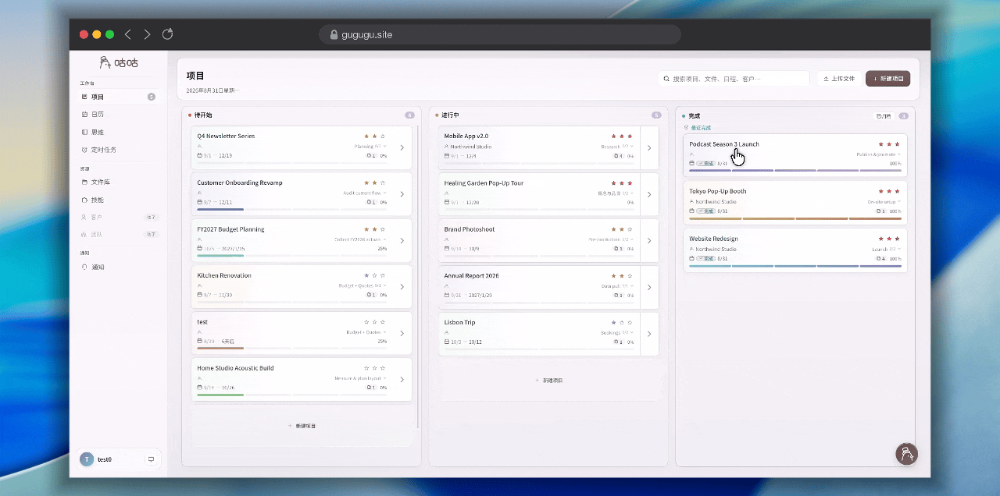
      <h3>Kanban</h3>
      <p>Projects, stages, tasks, and deadlines form a real project workflow.</p>
    </td>
    <td width="50%" valign="top">
      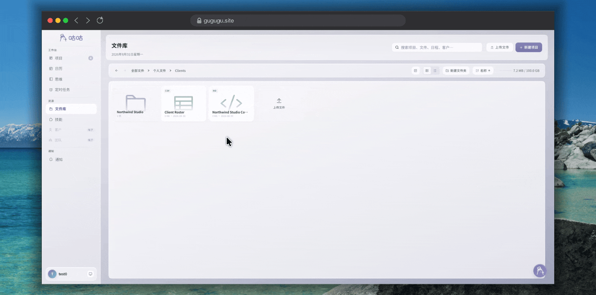
      <h3>File System</h3>
      <p>Files, projects, and personal materials continue to accumulate in one workspace, with local disk and OSS storage support.</p>
    </td>
  </tr>
  <tr>
    <td width="50%" valign="top">
      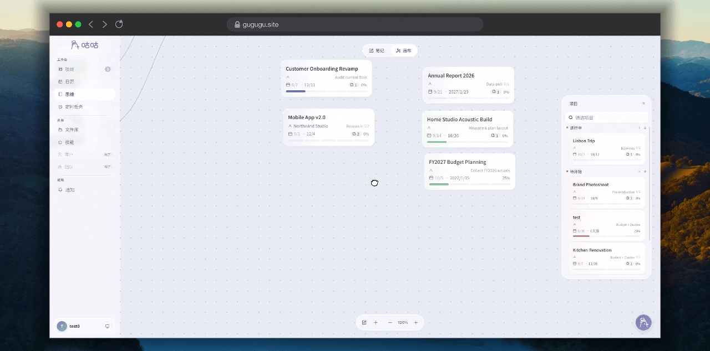
      <h3>Canvas</h3>
      <p>Place notes, projects, files, and calendar events on a freeform canvas to build visual relationships.</p>
    </td>
    <td width="50%" valign="top">
      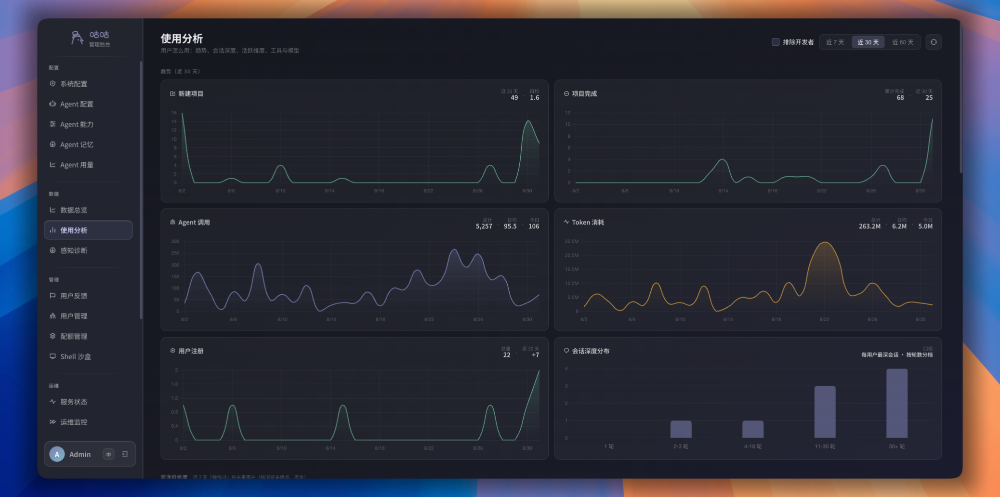
      <h3>Admin</h3>
      <p>Manage models, users, configuration, logs, feedback, and system status.</p>
    </td>
  </tr>
  <tr>
    <td colspan="2" valign="top">
      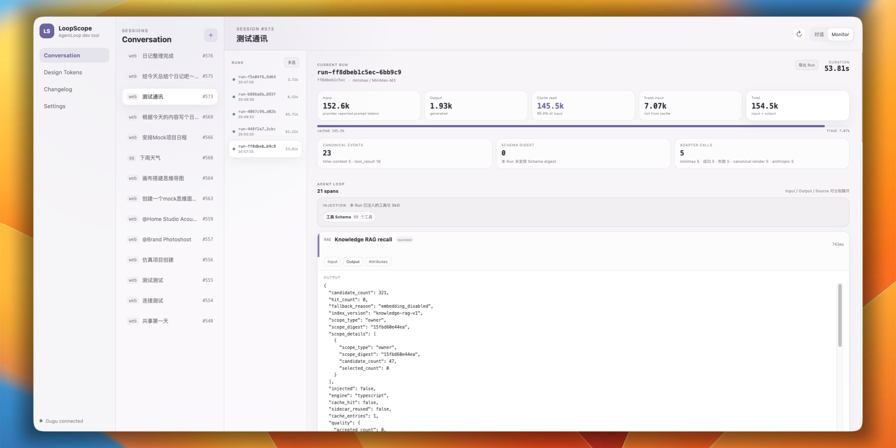
      <h3>LoopScope</h3>
      <p>Inspect Agent Loops, tokens, cache, tool calls, and runtime performance.</p>
    </td>
  </tr>
</table>

### Agent Conversations

<table>
  <tr>
    <td width="25%" valign="top">
      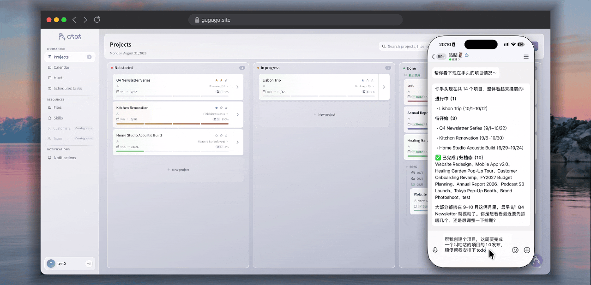
      <h3>Manage Schedule</h3>
      <p>Use natural language to create projects, plan schedules, and hand recurring work to scheduled tasks.</p>
    </td>
    <td width="25%" valign="top">
      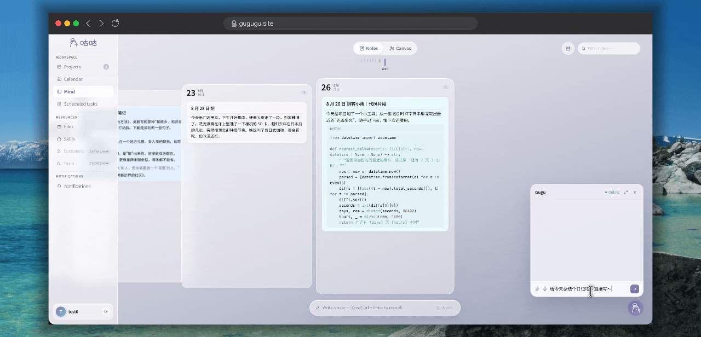
      <h3>Capture Ideas</h3>
      <p>Tell Gugu what is on your mind and let it quickly write notes, organize content, or create a mind canvas to explore further.</p>
    </td>
    <td width="25%" valign="top">
      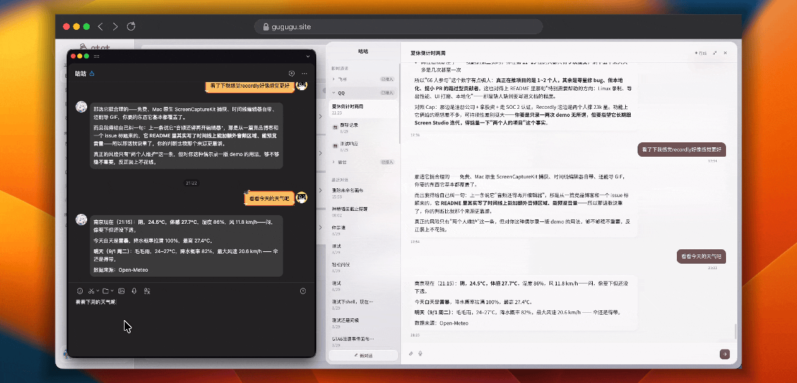
      <h3>Messaging</h3>
      <p>Use a messaging channel to record items, look up information, and move tasks forward.</p>
    </td>
    <td width="25%" valign="top">
      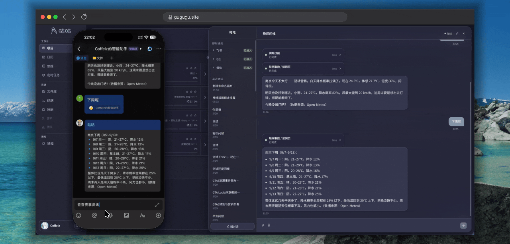
      <h3>Multi-platform Support</h3>
      <p>Continue using Gugu's Agent capabilities across platforms, including context-aware group workflows with member isolation.</p>
    </td>
  </tr>
</table>

## Tool Groups

Gugu's tools are organized by capability groups. The Agent selects the appropriate combination for each task, so users do not need to remember individual tool names.

| Tool group | What it can do | Example |
| --- | --- | --- |
| Projects and tasks | Create projects, stages, and tasks; track progress and deadlines | “Build my release plan for this week” |
| Calendar and reminders | Create events, set reminders, and check schedules | “Remind me to follow up tomorrow afternoon” |
| Files and knowledge | Read, organize, and search files; retrieve project knowledge | “Find the relevant proposal in the project files” |
| Notes and memory | Capture ideas, maintain long-term memory, and carry context forward | “Remember how I prefer to work” |
| Search and information | Search the web and workspace, and extract webpage content | “Look up the latest documentation for this library” |
| Canvas and relationships | Create notes and organize relationships between projects, files, and events | “Turn these ideas into a relationship map” |
| Scheduled tasks | Run recurring work on a schedule and report the results | “Send me a project progress email every Monday” |
| Messaging | Talk through QQ, WeChat, Feishu, and other channels; receive notifications | “Check the project status in the group” |
| Email | Send proactive mail through personal SMTP and deliver scheduled-task reports | “Email this summary to the client” |
| Shell and sandbox | Run commands, process files, and execute scripts within permission and resource boundaries | “Check the build and generate a report” |
| Images and media | Analyze images and work with visual information | “Find the issue in this screenshot” |

## Quick Start

### Requirements

- Docker 20+ and Docker Compose v2.20+
- A model provider API key (BYOK)
- Network access for the first start, including PostgreSQL, Redis, and image registries

### One-command deployment (Recommended, linux/amd64)

```bash
git clone https://github.com/Coffeiz/Gugu-web.git
cd Gugu-web
cp .env.standalone.example .env
mkdir -p backend && touch backend/.env
# Edit the root .env and set SECRET_KEY, GUGU_DB_PASSWORD, and model configuration.
# You may also put application settings in backend/.env; an admin password is generated on first start if omitted.
# The user-data directory defaults to /data on the host and must exist before
# startup (compose fails when the bind source is missing):
sudo mkdir -p /data && sudo chown "$(id -u):$(id -g)" /data
docker compose up -d
```

Basic variables:

```dotenv
# Project-root .env: standalone Compose configuration
SECRET_KEY=replace-with-a-long-random-string
GUGU_DB_PASSWORD=replace-with-a-database-password
GUGU_WEB_IMAGE=coffeiz/gugu-web:latest

# backend/.env: optional application configuration
AI__PROVIDER=qwen
AI__API_KEY=your-provider-api-key

# backend/.env: optional admin configuration; a random password is generated if omitted
ADMIN_USERNAME=admin
ADMIN_PASSWORD=replace-with-an-admin-password
# Public site origin used in email verification and password-reset links
GUGU_PUBLIC_APP_URL=http://localhost:9595
```

When deploying behind a domain or an Nginx reverse proxy, set `GUGU_PUBLIC_APP_URL` to the complete URL users actually open, such as `https://gugu.example.com`. Nginx provides the shared entry point and proxy headers, while the backend uses this same value for external links instead of exposing an internal address such as `localhost:8000`.

The default Compose setup pulls one standalone application image containing the frontend, Nginx, Uvicorn, worker, and IM gateway. It does not mount source code or run a development server. It starts Gugu, PostgreSQL, Redis, and the bundled SearXNG search service.

Open:

- Gugu: <http://localhost:9595>
- Admin: <http://localhost:9595/admin/>

The first run initializes the database and applies migrations. If `ADMIN_PASSWORD` is omitted, a random password is generated, saved to `backend/.env`, and printed once; there is no public default admin password.

See the [Deployment Guide](docs/DEPLOY.md) for the complete Compose parameters and configuration locations.

To enable the Shell sandbox:

```bash
docker compose --profile sandbox up -d
```

Developers who need source mounts and Vite should use [Dev Compose](docker-compose.dev.yml):

```bash
docker compose -f docker-compose.dev.yml up -d
```

Development endpoints:

- Backend API docs: <http://localhost:8000/docs>
- LoopScope Collector: <http://localhost:4320>

LoopScope must be opened from a logged-in Gugu `/dev` page by selecting the LoopScope entry. Opening the Collector directly will not associate the current account or show its data.

## Configuration

The README keeps configuration at index level. See [Deployment Guide](docs/DEPLOY.md) for the complete Compose setup and configuration locations.

| Configuration | Purpose |
| --- | --- |
| Database | Primary data storage, using PostgreSQL by default |
| Redis | Messages, sessions, and Runtime state |
| LLM / BYOK | Model providers and personal API keys |
| Search | Bundled SearXNG web search and in-app search |
| Mail | Admin system SMTP and personal SMTP; proactive Agent email and scheduled-task reports; Admin templates, previews, test sends, and Chinese/Japanese/English update emails with subscription controls |
| IM | QQ, WeChat, and Feishu connections |
| LoopScope | Agent traces and performance observability |
| Sandbox | Shell execution environment and network egress |

## Workspace

Gugu does not split projects, calendars, files, and notes into isolated islands. It puts them in one persistent workspace where users and Agents see and operate on the same data.

Interaction data follows a “local immediate feedback, server-side eventual convergence” model. The shared `InteractionSync` coordinates local mutations, server responses, and real-time cross-tab events so individual pages do not need to reimplement optimistic-state orchestration. See the [local interaction and server synchronization PRD](docs/prds/【已完成】PRD-UI-7-本地交互与服务端同步一致性.md) for the detailed boundaries and implementation status.

Projects, stages, tasks, calendars, reminders, files, notes, and the infinite canvas are connected. A project can lead to its files and deadlines, while projects, files, and ideas can be placed on the canvas for further organization.

<table>
  <tr>
    <td width="50%" valign="top">
      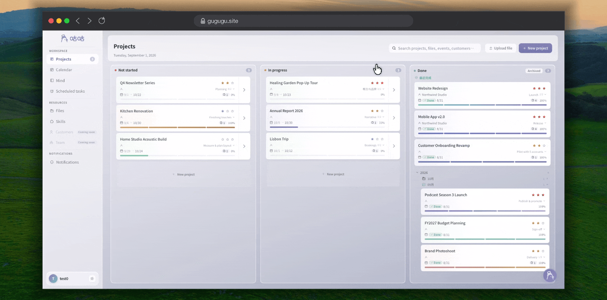
      <h3>Projects</h3>
      <p>Manage progress with stages, tasks, deadlines, and drag-and-drop ordering. Project milestones are also visible in the calendar.</p>
    </td>
    <td width="50%" valign="top">
      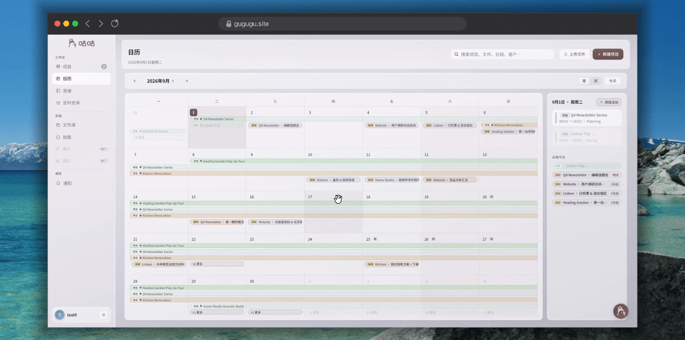
      <h3>Calendar</h3>
      <p>Project start dates, deadlines, and stage milestones appear in the calendar and can be viewed and edited there.</p>
    </td>
  </tr>
  <tr>
    <td width="50%" valign="top">
      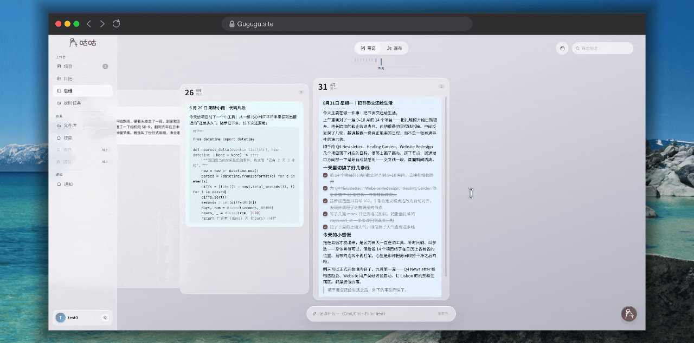
      <h3>Notes and Ideas</h3>
      <p>Capture small ideas and come back to them whenever you need.</p>
    </td>
    <td width="50%" valign="top">
      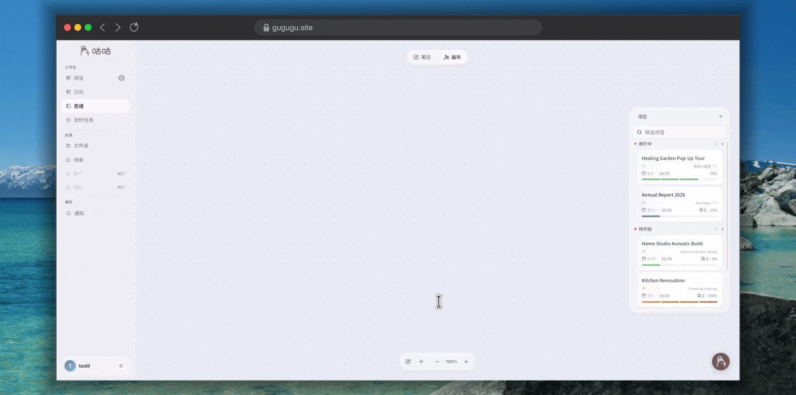
      <h3>Canvas and Relationships</h3>
      <p>Place projects, files, notes, and calendar events on the canvas and organize their relationships.</p>
    </td>
  </tr>
  <tr>
    <td width="50%" valign="top">
      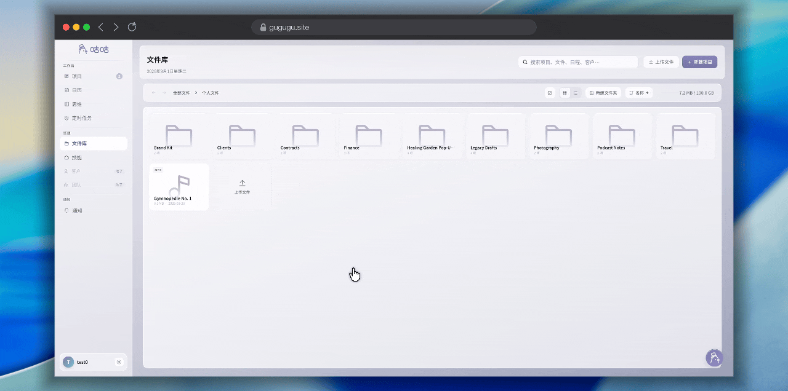
      <h3>File System</h3>
      <p>Manage personal and project files, move, copy, and paste them across areas, and use local disk or OSS storage.</p>
    </td>
    <td width="50%" valign="top">
      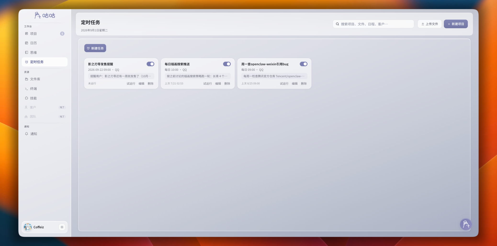
      <h3>Scheduled Tasks</h3>
      <p>Let Gugu run recurring work on schedule and send results through notifications or messaging channels.</p>
    </td>
  </tr>
</table>

Complex drag-and-drop and canvas interactions are powered by the independent [`gugu-interaction-runtime`](https://github.com/Coffeiz/Gugu-interaction-runtime) package. Project, task, calendar, and file changes made by an Agent appear directly in the workspace, while changes made in the UI become state the Agent can use later.

## Agent

Gugu's Agent can read and operate on the data and functions users see. It is designed to work beyond a chat interface or a single isolated capability.

### Channels

The same Agent Loop can be entered from the Web and messaging channels. Channels adapt messages; the shared backend owns identity, sessions, context, permissions, and tools.

> **QQ is currently the most extensively adapted channel.** It has the broadest support for group chats, message quotes, streaming replies, file handling, and interactive controls.

| Feature | Web | QQ | WeChat | Feishu |
| --- | --- | --- | --- | --- |
| Text conversation | Supported | Supported | Supported | Supported |
| Streaming output | Token streaming | C2C streaming; round-based in groups | Round-based | Streaming card updates |
| Direct messages | Supported | C2C | Supported | Supported |
| Group chats | N/A | @ mentions and group policies | Supported | Supported |
| Message quotes | Supported | Text and attachment quotes | Media quotes; limited raw text | Reply quotes |
| Mention Gugu | Supported | Supported | Platform-dependent | Supported |
| Files and images | Supported | Supported | Supported | Supported |
| Voice input | Browser upload | Platform-dependent | Transcription | Platform-dependent |
| Interactive replies | Web UI | Inline Keyboard | Text options | Interactive cards |

### Agent Loop

The Runtime coordinates context, model rounds, tool selection, execution, and controlled follow-up rounds. It supports tool calling, web search, scheduled tasks, streaming responses, and messaging entry points. See the [Agent docs](docs/agent/00-INDEX.md) and [Agent Loop](docs/agent/03-AGENT-LOOP.md).

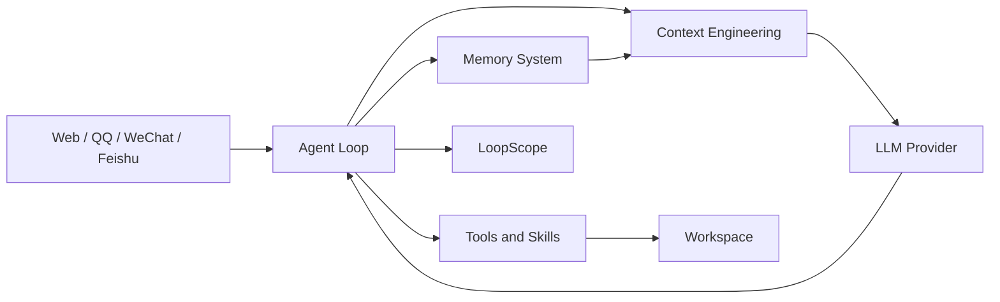

### Context Engineering

Context engineering organizes system prompts, capability catalogs, conversation history, tool results, Memory, and RAG into a stable, recoverable context. It separates cacheable stable content from dynamic content that changes each request. See the [Context Engineering docs](docs/agent/04-CONTEXT-ENGINEERING.md).

Gugu divides each Agent request into clear regions: stable rules in `system`, reusable session state and capabilities in `snapshot`, sealed conversation and tool exchanges in `history`, new facts organized in `batch`, and the `dynamic tail` only for provider-specific temporary information. This supports multi-turn recovery and lets the stable prefix participate in provider caching.

The architecture has a clear goal: **keep a reusable stable prefix from the second conversation round onward**. `system`, stable `snapshot`, and sealed `history` are assembled in a fixed order; `batch` is incorporated into the current request before being persisted into `history`. The start of `system` contains only the current date and weekday calculated from the user's timezone, changing at most once per day and excluding the time of day. Message timestamps, RAG results, group identity, and tool follow-ups are facts for the current round and belong in `batch`. Ordinary Web and IM requests do not add a separate current-time `dynamic tail`; only provider-specific paths that explicitly need temporary information use it.

The design was validated in a continuous-session retest on September 2, 2026: four models were warmed up for one round and then ran 20 cases each, with all eight test groups completing without history compaction. Across the four models, description mode used **25.72% less cumulative Provider input** than full mode. MiniMax used **3.98% more** in description mode because it triggered more follow-up rounds, showing that stable-prefix savings must be considered together with round count. See the [Schema mode retest report](docs/reports/2026-09-02-TEST-LLM-16-5TOOLS-MULTI-MODEL-RETEST.md).

**Cache Rate and Context Stability**

| Schema mode | Provider input | Cache rate | Context engineering meaning |
| --- | ---: | ---: | --- |
| Full mode (default) | Baseline | **99.28%–99.50%** | Keeps a larger complete-Schema prefix; prioritizes accuracy but has higher total context cost |
| Description mode | 25.72% lower across four models; individual savings of **30.25%–45.47%**, while MiniMax increased by **3.98%** | **98.46%–98.99%** | Uses a smaller stable capability catalog to reduce context cost and loads complex Schemas on demand |

Cache rate is defined as `cache_read / provider_input`. Provider cache policies still determine actual hits, so architectural prefix stability should not be treated as a provider guarantee. See the [Schema mode retest report](docs/reports/2026-09-02-TEST-LLM-16-5TOOLS-MULTI-MODEL-RETEST.md).

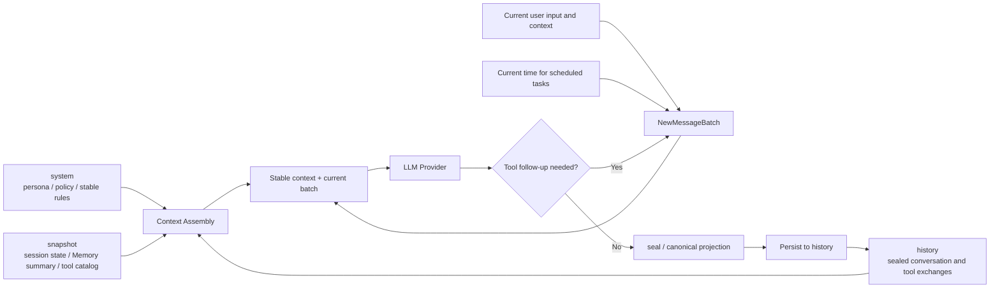

| Region | Main contents | Lifecycle |
| --- | --- | --- |
| `system` | Persona, behavior rules, security policy, and stable Agent principles | Reused across sessions and kept as stable as possible |
| `snapshot` | Session information, long-term context summaries, capability catalog, short tool descriptions, and field signatures | Persisted at session scope and regenerated when it changes |
| `history` | Persisted user messages, model replies, tool calls and results, Skill usage, and key context events | Supports multi-turn recovery, compaction, and replay |
| `batch` | Current user message, stance, message time, RAG results, IM/workspace reminders, and this round's model/tool exchanges | Submitted as one continuous batch, then sealed into canonical history |
| `dynamic tail` | Real-time temporary information required by a specific provider request | Optional; valid only for the current request and never persisted to history |

Each round is assembled as a `NewMessageBatch` with a fixed message order and metadata. The provider projection and canonical projection are retained together; canonical history is persisted after the run finishes. The next request restores persisted history instead of reconstructing it from provider wire format.

The stable assembly order is `system`, `snapshot`, sealed `history`, and the current `batch`. New messages are always inserted before the optional `dynamic tail`, so tool follow-ups, compaction, and cross-provider conversion do not write temporary information into history or disturb the stable prefix.

### Tools and Skills

Tools read and modify the workspace, while Skills provide reusable task knowledge and operating procedures. Gugu uses a registration system so capabilities can be registered, organized, and connected quickly. The capability catalog injects tool Schemas on demand to keep capabilities available while reducing unnecessary token use. Execution still validates permissions, parameters, and dangerous operations in code; group chats also isolate data and tool permissions by group, member, and sender.

In description mode, the model receives `description_short`, generated available-field signatures, and short descriptions for all authorized tools and Skills. Complex tools can request a full Schema through `get_tool_schema`, and actual execution goes through `call_tool`. After `use_skill`, the selected registered tools are loaded and their Schemas are injected. The current default is full mode.

The Runtime still validates ownership, permissions, parameters, and dangerous operations on the server side. In group chats, data access and tool permissions are isolated by group, member, and message sender. See the [Tools and Skills docs](docs/agent/05-TOOLS-AND-SKILLS.md).

Detailed editor contracts and tool Schema conventions are documented in the [tool registration and development guide](backend/agent/tools/README.md).

#### Schema Mode Trade-offs

| Mode | Initial injection | Best for |
| --- | --- | --- |
| Full mode (default) | Full Schema for all authorized tools from the start | Complex parameter structures, accuracy-first workflows, and larger context budgets |
| Description mode | `description_short`, generated field signatures, and short Skill descriptions for all authorized capabilities; complex tools load their full Schema on demand | Larger tool catalogs or lower token cost |

In the September 2, 2026 retest of four models and five target tools, with one warm-up round followed by 20 continuous rounds, description mode reduced fixed injection cost by about **51.86%–54.13%**. Across the four models, Provider input fell **25.72%** and total tokens fell **25.51%**. Full mode completed 20/20 cases for all four models; description mode completed 16/20–20/20. MiniMax used **3.98%** more input in description mode because of additional follow-up rounds. See the [Schema mode retest report](docs/reports/2026-09-02-TEST-LLM-16-5TOOLS-MULTI-MODEL-RETEST.md).

### Memory System

Gugu performs asynchronous reflection after conversations and tasks, turning useful facts into reusable context. It can retain preferences, habits, project state, agreements, recent progress, and confirmed facts without treating temporary chatter or uncertain information as long-term memory.

Memory, Knowledge, and RAG follow user and workspace isolation rules. Group chats further distinguish groups, members, and message senders, loading only information the current request can access. See [Memory and Reflection](docs/agent/07-MEMORY-AND-REFLECTION.md) and [RAG and Knowledge](docs/agent/06-RAG-AND-KNOWLEDGE.md).

Each Agent Loop loads recent state, relevant long-term memories, and retrieval results for the current user, session, and task, then passes them to context engineering for assembly. Memory provides structured personal context; Knowledge / RAG retrieves relevant information from projects, files, notes, and history instead of inserting the entire history into the model context.

| Capability | Purpose |
| --- | --- |
| Asynchronous reflection | Organizes durable facts, preferences, and task experience outside the main conversation to reduce impact on response latency |
| Memory | Stores preferences, habits, project state, recent progress, and long-term context for on-demand loading |
| Knowledge / RAG | Retrieves knowledge relevant to the current request from projects, files, notes, and history |
| Isolation and permissions | Limits memory and knowledge reads by user, workspace, group, member, and message sender |

### Observability

LoopScope is Gugu Agent's development observability and debugging tool. It reconstructs context, model rounds, tool calls, and output paths without participating in execution or business decisions.

| Feature | What it shows |
| --- | --- |
| Conversation / Monitor | Real conversation and Run/Span monitoring within the same Session |
| Run / Session | Status, source, duration, summaries, cross-process correlation, and paginated Run history |
| Context / Assembly | How `system`, `snapshot`, `history`, `batch`, and the dynamic tail form Provider input |
| Token Usage | Input, output, cache read/write, fresh input, total, and cache rate |
| Prefix Diff | The first Provider input change between adjacent rounds or Runs |
| Tool / Schema | Tool arguments, results, Schema digest, validation errors, and recovery details |
| Skill diagnostics | Skill loading, duration, content size, and related Schema injection |
| Performance and errors | Prompt, Memory, RAG, database, tool, Provider, channel, and output latency or failures |
| Export and helper pages | Multi-select `loopscope-run-export` v2 JSON export, plus `/tokens`, `/changelog`, and `/settings` |

#### How to Open LoopScope

1. Log in to Gugu.
2. Open the Gugu `/dev` page.
3. Select **LoopScope** in the developer tools.
4. Return to Gugu and send a message or perform an action, then select the matching Session in LoopScope.

LoopScope must be opened from the logged-in Gugu `/dev` page. The entry point passes the current account's API address and temporary development context through browser `postMessage`; directly opening the `4319` frontend or `4320` Collector does not associate the current account's data. If the Collector is unavailable, Gugu replies, executes tools, and persists messages normally. See the [LoopScope docs](docs/agent/11-LOOPSCOPE.md).

## Security and Isolation

Because Gugu's Agent can read and modify real projects, files, calendars, and external channels, its security boundary is shared by data ownership, tool validation, and execution environments rather than relying on model instructions alone.

### User and Data Isolation

- Business resources use a centralized ownership check. Missing resources and resources owned by another user have the same external response to reduce enumeration risk.
- Projects, files, notes, memories, Knowledge / RAG, and workspaces are isolated by user and workspace.
- QQ, WeChat, and Feishu preserve platform user, group, and sender identity. Group memory, knowledge, tool permissions, and workspace access are further restricted by group and member scope.

### Agent Tool Security

- The Runtime validates Schema, parameters, ownership, permissions, and execution environment before dispatch.
- Irreversible operations declare `destructive` and are blocked behind confirmation interactions and short-lived confirmation tokens until explicitly approved.
- Capability discovery, Schema injection, tool calling, and execution are separate states. Final access is decided by server-side dispatch, not by the Schema shown to the model.

### Shell Sandbox

- Shell defaults to `sandbox` scope and `network=none`; scope is fixed at the start of each call, and a bound workspace can access only its corresponding directory.
- Sandbox execution runs through `sandboxd` and Docker with directory boundaries, quotas, lifecycle management, and timeouts. If `sandboxd` is unavailable, execution does not fall back to the host.
- `system` scope is an explicitly enabled host execution capability, not the default sandbox. Dangerous commands, host scope, and controlled egress require additional configuration or confirmation.
- Controlled egress is limited to a configured HTTP(S) proxy and isolated Docker network, and the sandbox remains offline by default.

### Credentials and Diagnostics

- API keys, tokens, database passwords, and channel credentials are not written to URLs, Git, or ordinary logs. Visible errors are redacted and diagnostic logs use restricted outputs.
- Logs and security events use fingerprints for correlation instead of raw user content or identity values.
- LoopScope is a development diagnostic tool and does not execute tools or make business decisions. An unavailable Collector does not block the Agent's main path.

For implementation details, see the [Tools and Skills docs](docs/agent/05-TOOLS-AND-SKILLS.md), [Context Engineering docs](docs/agent/04-CONTEXT-ENGINEERING.md), [workspace Shell sandbox design](docs/prds/【已完成】PRD-SHELL-1-工作区SHELL沙盒.md), and [LoopScope docs](docs/agent/11-LOOPSCOPE.md).

## Project Structure

```text
gugu/
├─ frontend/      Web workspace and Admin frontend
├─ backend/       API, Agent, Memory, Tools, and data services
├─ loopscope/     Agent observability system
├─ docker/        Deployment and runtime environments
└─ docs/          Product, architecture, operations, and development docs
```

The backend is still evolving; use the [Backend overview](docs/backend/OVERVIEW.md) and [Agent architecture docs](docs/agent/02-ARCHITECTURE.md) as the source of truth for module boundaries.

## Development

### Setup

```bash
corepack enable
corepack pnpm install
```

### Design Guidelines

When adding or changing frontend UI, reuse the existing design tokens, shared components, and theme variables before introducing new values. Avoid repeating standalone colors, type sizes, spacing, radii, or shadows inside page components. New user-facing copy must use the centralized i18n system instead of being hard-coded in components. After signing in, open [`/design`](http://localhost:5173/design) to inspect the runtime design tokens, themes, and component states. See the [design guidelines](agentskills/design/SKILL.md) for detailed visual and interaction rules.

### Start the frontend

```bash
corepack pnpm --filter gugu-web dev
```

### Start the backend

```bash
cd backend
python -m venv .venv
source .venv/bin/activate
pip install -r requirements.txt
make dev-web
```

### Checks

```bash
corepack pnpm --dir frontend typecheck
corepack pnpm --dir frontend test:run
corepack pnpm --dir frontend build
cd backend && PYTHONPATH=. .venv/bin/pytest
```

Complex frontend drag-and-drop and canvas interactions depend on the published `gugu-interaction-runtime` npm package. The Runtime is maintained in a separate repository and is not compiled directly inside this workspace.

## Project Status and Roadmap

Gugu is still evolving quickly. The table below lists capabilities already available and the main directions ahead.

| Status | Capability / direction | Description |
| --- | --- | --- |
| ✅ Stable | Workspace | Projects, calendars, file system, notes, canvas, and scheduled tasks form a complete personal workspace. |
| ✅ Stable | Agent | Agent Loop, tools and Skills, web search, Memory, Knowledge / RAG, and multi-platform messaging remain available. |
| ✅ Stable | Development and observability | Interaction Runtime and LoopScope support complex interactions, run-chain observability, and performance diagnosis. |
| 🚧 In development | Desktop app | Make local-file editing and operating-system actions more convenient. |
| 🚧 In development | Mobile app | View project progress and schedules anywhere. |
| 🧪 Experimental | Sub-agent system | Improve context quality and task execution efficiency. |

Status meanings: “Stable” means the capability is used continuously and covered by regression checks; “In development” means the main flow works but is changing quickly; “Experimental” means the design or implementation may change substantially.

## Contributing

This is a *Vibe Coding project*. Much of the implementation is AI-assisted, while architecture, product direction, code review, and acceptance remain human responsibilities.

Issues, suggestions, and pull requests are welcome.

Before submitting a change, please run the relevant checks:

```bash
corepack pnpm --dir frontend typecheck
corepack pnpm --dir frontend test:run
corepack pnpm --dir frontend build
cd backend && PYTHONPATH=. .venv/bin/pytest
```

Bug fixes should include regression tests where practical. Please provide reproduction steps, environment details, relevant logs, and redacted screenshots. Do not commit secrets, tokens, or personal data.

## License

This project is licensed under the [Apache License 2.0](LICENSE).

## Contact

For issues and collaboration, please use GitHub [Issues](https://github.com/Coffeiz/Gugu-web/issues).

- Email: <mailto:coffeiz216@gmail.com>
- Website: [coffeiz.space](https://coffeiz.space)
