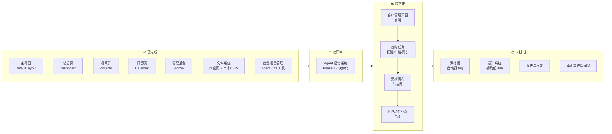

# 路线图 · Roadmap

> 当前版本：**0.8.x**　|　最后更新：2026-06-22

本文件汇总产品下一阶段的方向。详细规划见 [docs/wishlist.md](docs/wishlist.md)。

---

## 节点图

---

## 文字版

### ✅ 已完成

- 主界面（DefaultLayout、侧边栏、顶栏、玻璃拟态）
- 总览页（统计卡片、项目列表、日历面板、文件面板）
- 项目页（三列看板、拖拽、ProjectModal / NewProjectModal）
- 日历页（月视图、项目横跨条、事件管理）
- 管理后台（登录、配置热更新、邀请码、审计/系统日志、Agent 用量统计）
- **文件系统**：四空间架构（项目 / 思维 / 素材 / 个人），本地 + 阿里云 OSS 双后端，预览/缩略图/回收站
- **自然语言管理（AI Agent）**：独立 `backend/agent/` 包，SSE 流式，双 provider；**23 工具**覆盖项目/日历/文件（读写整理 + 生成 Word/PDF/Excel）/客户/聚合；删除二次确认保底；对话历史持久化 + token 配额。详见 [docs/agent.md](docs/agent.md)

### 🚧 进行中 / 接下来

1. **Agent 记忆系统（Phase 2）** — reflection / compressor / persona / `.agent` 用户档案，让咕咕从助理变伙伴（首次问昵称、自主观察积累认知）
2. **客户管理页面** — 后端 API + Agent 工具已就绪，缺前端页
3. **定时任务** — 按周期自动提醒 / 归档 / 同步
4. **思维画布** — 节点图创意空间，可挂文件
5. **团队 / 企业版（ToB）** — 多租户、权限体系

### 📋 未排期

- 素材板（自动打 tag）
- 通知系统（截稿前 48h 自动触发）
- 报表与导出
- 桌面客户端同步