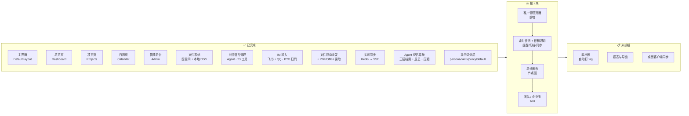

# 路线图 · Roadmap

> 当前版本：**0.11.1**　|　最后更新：2026-06-24

本文件汇总产品下一阶段的方向。详细规划见 [docs/wishlist.md](docs/wishlist.md)。

---

## 节点图

---

## 文字版

### ✅ 已完成

- 主界面（DefaultLayout、侧边栏、顶栏、玻璃拟态）
- 总览页（统计卡片、项目列表、日历面板、文件面板）
- 项目页（三列看板、拖拽、ProjectModal / NewProjectModal）
- 日历页（月视图、项目横跨条、事件管理）
- 管理后台（登录、配置热更新、邀请码、审计/系统日志、Agent 用量统计）
- **文件系统**：四空间架构（项目 / 思维 / 素材 / 个人），本地 + 阿里云 OSS 双后端，预览/缩略图/回收站
- **自然语言管理（AI Agent）**：独立 `backend/agent/` 包，SSE 流式，多 provider；**23 工具**覆盖项目/日历/文件（读写整理 + 生成 Word/PDF/Excel）/客户/聚合；删除二次确认保底；对话历史持久化 + token 配额。详见 [docs/agent.md](docs/agent.md)
- **IM 接入（飞书 + QQ · BYO 扫码自连）**：每用户自带 bot，扫码自动连接（飞书 OAuth 设备授权 / QQ bind_task），凭据 AES 入库；`supervisor` 统一从 `user_bots` 拉起网关；飞书交互卡片渲染、秒回表情、新会话 AI 标题
- **文件双向收发 + 文档读取**：网页/飞书/QQ 收发文件（`chat_attach` 暂存 + `send_file`）；`read_file` 读 PDF/Word/Excel/PPT（`doctext`：pdftotext + LibreOffice）
- **实时同步**：Redis pub/sub → SSE，挂在工具执行唯一入口 `dispatch` 上，IM/Agent 的改动实时推到网页（按 `events:{user_id}` 隔离频道，无跨用户扇出）
- **Agent 记忆系统（Phase 2 · 伙伴化）**：私有 `.agent/` 三层档案（facts 稳定事实 / daily 近期 / memory 长期），对话后 fire-and-forget **反思**提炼、daily 攒够自动**压缩**沉淀；`remember` 主动记忆工具；persona 人格 + builder 注入「此刻的项目/日程/记忆」
- **提示词分层**：persona（角色）/ skills（执行规则·铁律）/ policy（内容红线·对外口径）/ default（数据模板）四层，后台可分别编辑；含执行策略（任务分级、成本意识、不可逆 confirm）与多模态看图

### 🚧 进行中

- _（里程碑之间，下一项待锁定 —— 见下方「接下来」候选）_

### 🔜 接下来

1. **客户管理页面** — 后端 `clients` API + Agent 工具已就绪，缺前端页（低风险快赢）
2. **定时任务 + 截稿主动通知** — 按周期自动提醒 / 归档 / 同步；复用已就绪的 IM 出口 + APScheduler，把「今天/48h 内到期」主动 DM 给用户（把咕咕从被动工具做成会惦记你的伙伴）
3. **思维画布** — 节点图创意空间，可挂文件
4. **团队 / 企业版（ToB）** — 多租户、权限体系

### 📋 未排期

- 素材板（自动打 tag）
- 报表与导出
- 桌面客户端同步
