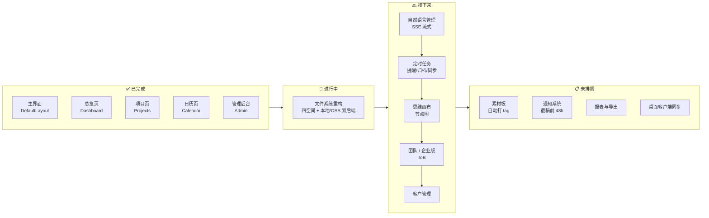

# 路线图 · Roadmap

> 当前版本：**0.3.0**　|　最后更新：2026-06-18

本文件汇总产品下一阶段的方向。详细规划见 [docs/wishlist.md](docs/wishlist.md)。

---

## 节点图

---

## 文字版

### ✅ 已完成

- 主界面（DefaultLayout、侧边栏、顶栏、玻璃拟态）
- 总览页（统计卡片、项目列表、日历面板、文件面板）
- 项目页（三列看板、拖拽、ProjectModal / NewProjectModal）
- 日历页（月视图、项目横跨条、事件管理）
- 管理后台（登录、配置热更新）

### 🚧 进行中

- **文件系统重构**：四空间架构（项目 / 思维 / 素材 / 个人），本地 + 阿里云 OSS 双后端，Admin 面板可热切换

### 🔜 接下来

1. **自然语言管理** — 对话完成项目 / 文件 / 提醒操作（SSE 流式，接通义千问）
2. **定时任务** — 按周期自动提醒 / 归档 / 同步
3. **思维画布** — 节点图创意空间，可挂文件
4. **团队 / 企业版（ToB）** — 多租户、权限体系
5. **客户管理** — 客户信息归档与关联

### 📋 未排期

- 素材板（自动打 tag）
- 通知系统（截稿前 48h 自动触发）
- 报表与导出
- 桌面客户端同步