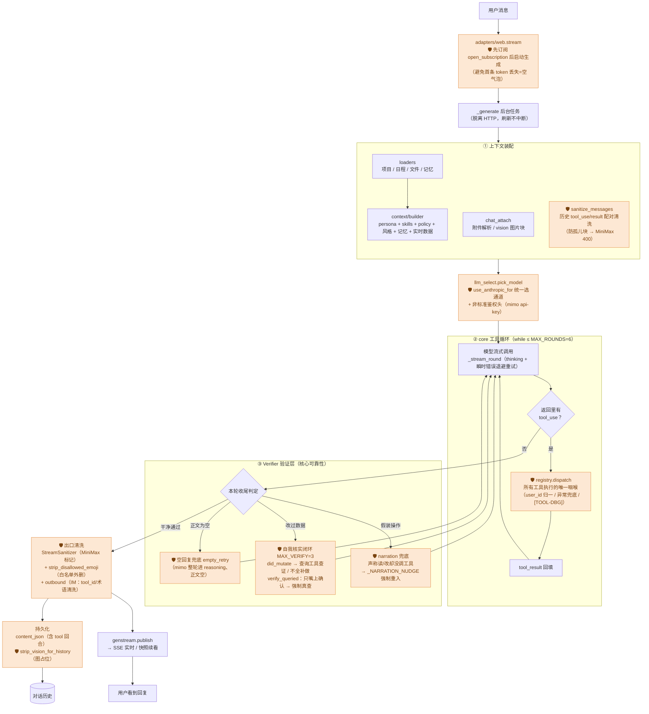
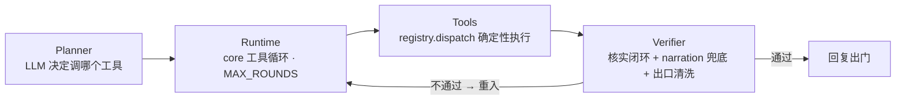
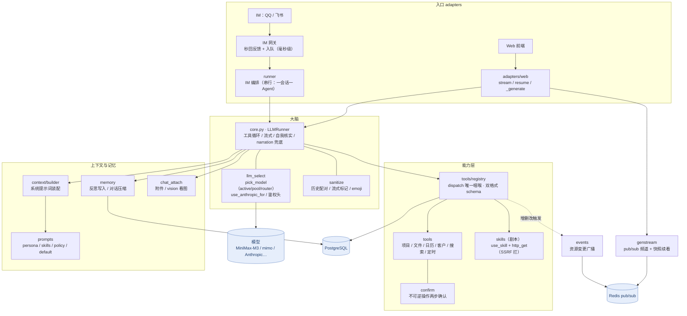

# Agent 架构图

> 咕咕 Agent 的两张架构全景：
> - **图一 · 可靠性执行架构**：一轮对话怎么从用户消息走到回复，每个确定性守卫挂在链路哪个点（回答「怎么保证说做了就真做了」）。
> - **图二 · 全系统模块全景**：有哪些模块、各自干啥、怎么连（回答「系统长什么样」）。
>
> 文字详解见 [`agent.md`](agent.md)（模块全景）、[`agent-reliability.md`](agent-reliability.md)（可靠性工程）、[`agent-决策环.md`](agent-决策环.md)（一轮内部步骤）。

---

## 图一 · 可靠性执行架构（一轮对话）

一轮对话不是「调一次大模型」的黑盒，是**带守卫的流水线**：上下文装配 → 模型 → 工具循环 → 验证层 → 出口清洗 → 回复。🛡 标记处是**确定性守卫**（代码兜底，不靠模型自觉）。

**四层抽象**（OpenClaw 同款 Planner→Runtime→Tools→Verifier，Verifier 不通过则回灌重跑）：

> **守卫成色**（详见 [agent-reliability.md](agent-reliability.md) §二）：✅硬 = emoji strip / 出口清洗 / confirm 两步 / SSRF / genstream 竞态；🟡半硬 = narration 兜底、自我核实（检测是代码、纠偏靠再喂 prompt）；🔴软 = 「明确请求要执行」目前仅 prompt 约束，是当前最大缺口。

---

## 图二 · 全系统模块全景

入口（Web / IM）→ 大脑（core 工具循环）→ 能力（tools/skills）/ 上下文记忆，底座是模型与存储。

---

## 读图要点

- **可靠性的本质**（图一）：模型只在「② 工具循环」里**决定调哪个工具**；它**对不对、做没做、说没说谎**，由两侧的确定性守卫（① 装配前清洗 / ③ 验证层 / 出口清洗）兜底。这是 [agent-reliability.md](agent-reliability.md) 的「坑→守卫，别坑→prompt」落到图上的样子。
- **唯一咽喉**（图二）：所有工具执行只过 `registry.dispatch` 一个点——观测、鉴权、异常、`[TOOL-DBG]` 全挂这里，是「先可观测、再优化」的抓手。
- **底座是模型**：图一③的一串 mimo 专属兜底（`empty_retry`、空回复重试）反向说明——弱模型靠工程补，强模型省一半事；可靠性场景默认走强工具模型（见 reliability §五）。

> 本图随架构演进更新；任何「现状 → 演进」的取舍记录见 [agent-reliability.md](agent-reliability.md)「一页纸总结」。
