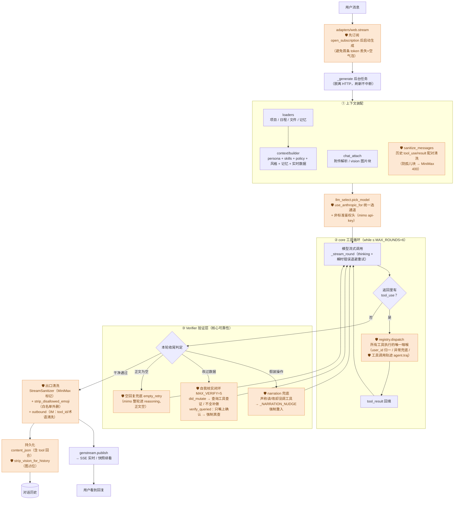
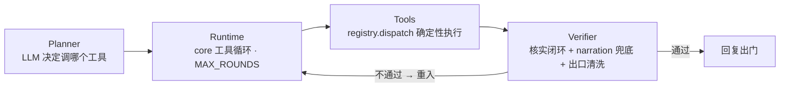
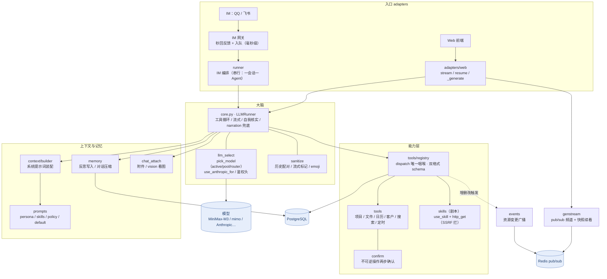
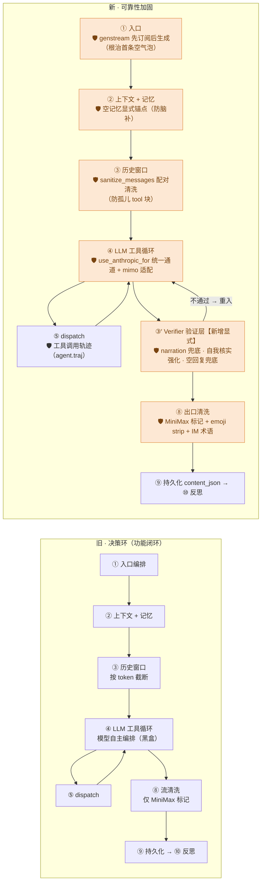

# Agent 架构图

> 咕咕 Agent 的两张架构全景：
> - **图一 · 可靠性执行架构**：一轮对话怎么从用户消息走到回复，每个确定性守卫挂在链路哪个点（回答「怎么保证说做了就真做了」）。
> - **图二 · 全系统模块全景**：有哪些模块、各自干啥、怎么连（回答「系统长什么样」）。
>
> 文字详解见 [`00-总览.md`](00-总览.md)（模块全景）、[`03-可靠性.md`](03-可靠性.md)（可靠性工程）、[`02-决策环.md`](02-决策环.md)（一轮内部步骤）。

---

## 易读概述

### 这两张图在讲什么

如果把咕咕的后端想象成一座工厂，这两张图分别回答两个不同的问题：

- **图一回答「一件产品是怎么造出来的」**：用户发一条消息，到咕咕回一句话，中间经过了哪些质检站？每个质检站是干什么的？——这张图的重点不是"聊天功能怎么实现"，而是**"怎么防止咕咕说了没做、做错了不知道"**。
- **图二回答「这座工厂有哪些车间，车间之间怎么送料」**：网页和 IM（飞书/QQ）算两个进料口，中间是同一套"大脑"车间，大脑连着"能干什么"（工具）和"记不记得"（记忆）两个车间，最后落到数据库和 Redis 这两个仓库。

### 为什么要专门画一张「可靠性执行架构图」

普通的架构图通常只画"数据怎么流动"，但咕咕作为一个会替用户改文件、建项目、删数据的 AI，光有数据流是不够的——**更重要的是"每一步有没有人在检查"**。图一里每个橙色标记（🛡）的地方，都是一处**不依赖模型自觉、靠代码强制检查**的关卡：比如模型说"我已经把文件改好了"，代码会真的去数据库查一遍"改动是不是真的生效了、有没有漏改的地方"，查不对就打回去重做。这套思路参考了业界成熟的开源 Agent 框架（OpenClaw）的设计经验，好经验不是"教模型更听话"，而是"假设模型有时候会偷懒或出错，所以关键步骤必须有代码兜底"。

### 三张图各自的角色

本文其实有三张图（历史上是逐步演进补充的）：

1. **图一（可靠性执行架构）**：聚焦"一轮对话"内部，四层抽象（Planner 决定用什么工具 → Runtime 跑循环 → Tools 真正执行 → Verifier 验证结果对不对），验证不通过就打回重跑。
2. **图二（全系统模块全景）**：拉远视角看整个系统由哪些模块组成，数据怎么在它们之间流动。
3. **图三（新旧对比）**：把"功能能跑通的旧版本"和"加固过可靠性的新版本"并排放在一起看，直观感受这两天/这段时间具体多打了哪些补丁——这不是纯历史存档，而是用来说明"咕咕的可靠性是一步步加固出来的，不是一次性设计好的"。

看这三张图时，记住一句话：**模型只负责"决定调哪个工具"这一件事，它做得对不对、做没做、有没有说谎，全部由图上的确定性守卫兜底**——这也是 [`03-可靠性.md`](03-可靠性.md) 反复强调的核心设计哲学在图上的直接体现。

---

## 专业细节

> **核实说明（写在最前）**：本节内容已对照 `backend/agent/core.py`、`backend/agent/adapters/web.py`、`backend/app/core/events.py` 等源码逐项核对。图上标注的函数名、常量名（`MAX_ROUNDS=6`、`MAX_VERIFY=5`、`_looks_like_narration`、`_is_decision_dodge`、`open_subscription`、`sanitize_messages`、`registry.dispatch`、`agent.traj` 等）与当前代码一致，未发现需要更新的技术细节。原文中提到的"守卫成色"分类（✅硬/🟡半硬/🔴软）在 [`03-可靠性.md`](03-可靠性.md) 第二节「可靠性守卫层」里以表格形式存在（标注方式略有出入：该文档用纯文字「硬/半硬」而非 emoji，但分类内容一致，链接指向依然有效）。

### 图一 · 可靠性执行架构（一轮对话）

一轮对话不是「调一次大模型」的黑盒，是**带守卫的流水线**：上下文装配 → 模型 → 工具循环 → 验证层 → 出口清洗 → 回复。🛡 标记处是**确定性守卫**（代码兜底，不靠模型自觉）。

**四层抽象**（OpenClaw 同款 Planner→Runtime→Tools→Verifier，Verifier 不通过则回灌重跑）：

> **守卫成色**（详见 [03-可靠性.md](03-可靠性.md) 第二节「可靠性守卫层」）：✅硬 = emoji strip / 出口清洗 / confirm 两步 / SSRF / genstream 竞态；🟡半硬 = narration 兜底、自我核实（检测是代码，纠偏靠再喂 prompt）；🔴软 = 「明确请求要执行」目前仅 prompt 约束，是当前最大缺口。**核实**：该文档目前用纯文字「硬 / 半硬」标注同一套分类，无 emoji 记号，但对照的失败模式与本图一致，链接内容仍准确。

---

### 图二 · 全系统模块全景

入口（Web / IM）→ 大脑（core 工具循环）→ 能力（tools/skills）/ 上下文记忆，底座是模型与存储。

> **核实**：图中 `tools`（项目/文件/日历/客户/搜索/定时）只是举例性质的列举，不是完整清单——**完整工具清单以 [`00-总览.md`](00-总览.md)「工具清单」一节为准**（当前共 59 个已接线工具，逐个对照 `backend/agent/tools/*.py` 的 `Tool(name=...)` 声明核实过）。`EVT`（events 模块）的挂点确认为 `registry.dispatch`（`backend/app/core/events.py` 的 `RESOURCE_BY_TOOL` 映射表），与图上 `REG -.->|"增删改触发"| EVT` 的画法一致。

---

### 图三 · 新旧对比（决策环 → 可靠性加固）

同一条主轴（[`02-决策环.md`](02-决策环.md) 的 ⓪–⑩ 功能闭环），左是「功能可用」的旧版，右是这两天补的**确定性守卫**后的版本。橙色 = 新增/硬化的守卫。**主轴没变，变的是每个坑上多了代码兜底，而不是多写 prompt。**

**增量明细**（旧 → 新各加了什么硬守卫）：

| 阶段 | 旧（决策环） | 新增的确定性守卫 |
| --- | --- | --- |
| ① 入口 | 后台生成 + genstream 续看 | **先订阅后生成**（`open_subscription`）根治首条空气泡 |
| ② 上下文 | 记忆非空才注入 | **空记忆显式锚点**（防无素材脑补共同历史）；emoji 出口 strip |
| ③ 历史 | 按 token 截断 | **`sanitize_messages` 位置配对**清洗（防孤儿 tool_result → MiniMax 400） |
| ④ 循环 | 双 provider 各自判通道 | **`use_anthropic_for` 唯一通道判定** + mimo 双 API / thinking / `api-key` 头适配 |
| ③′ 验证 | 仅「自我核实」（改后查证） | **显式 Verifier 层**：narration 兜底（说做了没做 → 重入）、`verify_queried` 强制真查、mimo 空回复兜底 |
| ⑤ 派发 | dispatch 唯一咽喉 | + **结构化工具调用轨迹**（`agent.traj`→gugu.log，已落地 P1） |
| ⑧ 出口 | 仅清 MiniMax 标记 | + **emoji 白名单 strip** + IM 出口术语清洗 |

> 一句话：旧版「能跑通」，新版在**真实性三大坑**（动嘴不动手 / 不核对 / 自作主张）上从「靠 prompt 自觉」往「代码兜底」硬化——演进全景与未竟项见 [`03-可靠性.md`](03-可靠性.md)。

---

## 读图要点

- **可靠性的本质**（图一）：模型只在「② 工具循环」里**决定调哪个工具**；它**对不对、做没做、说没说谎**，由两侧的确定性守卫（① 装配前清洗 / ③ 验证层 / 出口清洗）兜底。这是 [03-可靠性.md](03-可靠性.md) 的「坑→守卫，别坑→prompt」落到图上的样子。
- **唯一咽喉**（图二）：所有工具执行只过 `registry.dispatch` 一个点——观测、鉴权、异常全挂这里；**结构化工具调用轨迹已落地**（每次调用经 `agent.traj` 落一行 JSON → gugu.log / Debug 面板，P1），「调没调工具」翻一眼即知，是「先可观测、再优化」的地基。
- **底座是模型**：图一③的一串 mimo 专属兜底（`empty_retry`、空回复重试）反向说明——弱模型靠工程补，强模型省一半事；可靠性场景默认走强工具模型（见 reliability 第六节「模型是底座」）。

> 本图随架构演进更新；任何「现状 → 演进」的取舍记录见 [03-可靠性.md](03-可靠性.md)「一页纸总结」（第七节）。
