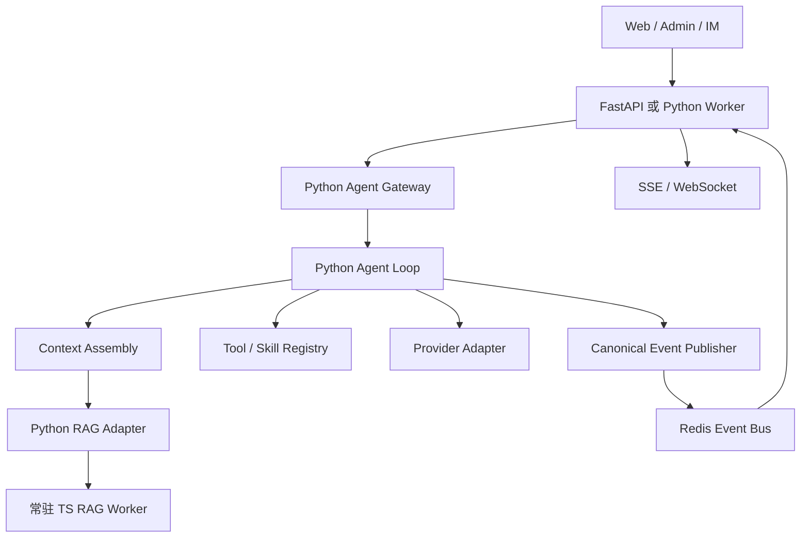

# Agent 架构

## Owner 规则

同一个 session/run 只能由一个 Agent owner 执行。生产启动项只包括 `gugu-backend`、`gugu-worker`、`gugu-supervisor` 和可选的 `gugu-sandboxd`；TS RAG worker 是 Python sidecar 的受控依赖，不提供业务 API。

公开数据查询必须经过 ownership 校验；destructive 工具必须经过确认门；外部 URL 使用统一安全校验。沙盒是执行隔离边界，危险命令分类只决定确认策略，不能替代操作系统隔离。
