# 咕咕 · Agent 决策环

> 一次「用户说话 → 咕咕回应」内部到底走了哪些步、每步谁负责、哪些做了哪些没做。
> 模块全在 `backend/agent/`。架构总览见 [`00-总览.md`](00-总览.md)，本文专讲**运行时的一轮决策**。

---

## 易读概述

### 这套机制解决什么问题

用户发一句话，到咕咕回话之间，其实发生了一长串事——查上下文、想要不要用工具、真去执行、把结果说给用户听、事后记住这次聊了啥。如果不把这串事拆清楚，就很容易出现"咕咕说做了但其实没做""改了东西却没人知道""想不起来上次聊过啥"这类问题。

本文把这一整条链路画成一个环形流程图，标出每一步"谁负责、目前做没做、还差什么"，方便日后排查"某个环节是不是掉链子了"。

### 为什么这么设计

- **只有一步是真正的"决策"**：模型自主决定要不要调工具、调哪个、调几次、什么时候收尾。其它步骤要么是确定性地把材料递给模型（查上下文、裁历史），要么是把模型的决定落地执行（派发工具、发通知、存数据）。这样划分的好处是：出问题时能很快定位——是"模型判断错了"还是"某个确定性步骤本身出了 bug"。
- **记忆是"被动上桌"、工具是"主动去拿"**：记忆在对话一开始就自动摆上桌面（哪怕模型不看也占了 token），工具则是模型觉得不够用时才主动伸手去调。两种"让咕咕知道过去"的方式代价不同，不能混为一谈。
- **模型的"决定"上面还盖了一层兜底**：光靠提示词让模型"说到做到"并不可靠（尤其换成能力较弱的模型时），所以在无工具收尾前检查“说了没做/该做不做”；成功写工具则紧接着进入读回复查。两类情况都会被代码检测并重入循环。这层机制的详细设计在 [`03-可靠性.md`](03-可靠性.md)。
- **IM（飞书/QQ 等）比网页多一道前置关卡**：因为 IM 消息要先进队列排队、由后台 worker 串行处理，如果不在最前面拦一道，"还在吗""算了"这种简单确认就得排到队尾才被看到，用户会觉得咕咕反应迟钝。所以 IM 路专门加了一个轻量分类器，在消息真正进入主流程之前就把这类闲聊短路掉。

---

## 专业细节

### 一、全景：一轮对话的决策环

```
用户消息
  │
  ⓪ IM 前置路由（仅 IM）  agent/router.py + runtime_state.py
  │    据 Redis 状态机短路「还在吗/算了/嗯」→ 不入队、不进主模型，网关直接回；其余才入队
  │    （IM 按用户串行 user_gate：同用户任务进行中其后续消息排在锁后、worker 看不到，故必须在网关层拦）
  │
┌─┴──────────────────────────────────────────────────────────────┐
│ ① 入口编排   gateway/web.py（网页流式） │ agent/runner.py（IM 非流式）│
│    配额检查 → 取上下文 → 找/建会话 → 存用户消息                      │
└─┬──────────────────────────────────────────────────────────────┘
  │
  ② 上下文构建  context/loaders.py + context/builder.py
  │    取 项目/日历/文件概览 + 记忆 → 拼 system prompt（记忆在这步【自动注入】）
  │
  ③ 历史窗口    context/tokens.py
  │    最近消息按 token 预算从新往回裁剪（CJK 感知）
  │
  ┌─┴── 决策核心 ────────────────────────────────────────────────┐
  │ ④ LLM 工具循环  core.py（LLMRunner，MAX_ROUNDS=6）               │
  │    模型读上下文 → 决定【调不调工具、调哪个、调几次、何时收尾】    │
  │      ├ 要调 → tool_call → ⑤ 派发 → 结果回灌 → 再想 / 成功写入则复查 │
  │      └ 不调/想收尾 → ④′ 真实性守卫 → 过则流式吐正文 token        │
  │ ④′ 真实性守卫（无工具收尾时确定性兜底「说了没做」）              │
  │    ① 假装(narration) ② 驳回(decision) → 检测到 → 注入 nudge 逼真调│
  │    ③ 成功改数据(自我核实 MAX_VERIFY) → 立刻逼查证/补做。命中即重入 │
  │ ⑤ 工具派发  tools/base.py registry.dispatch（所有执行唯一咽喉）  │
  │    执行（每次独立 DB 会话）+ 轨迹 agent.traj + 注册期契约 fail-fast│
  │    危险操作走 ⑥ 确认；成功后 ⑦ 发实时事件；可带 _artifact 推 UI  │
  └─┬────────────────────────────────────────────────────────────┘
  │
  ⑧ 流清洗   agent/sanitize.py（过滤 MiniMax 漏标记）
  │
  ⑨ 收尾     持久化回复+用量 → 生成会话标题 → 发实时事件 →
  │          ⑩ 对话后反思（fire-and-forget）
  │
回复送达（网页 SSE 流 / IM 平台 API）
```

**一句话抓重点**：环里**唯一真正"决策"的是第④步**——模型自主编排工具。其它步要么是确定性的喂料（②③），要么是把模型的决定落地（⑤⑦⑨⑩）。记忆在②就摊上桌（被动），工具在④按需抽（主动）。**④′ 真实性守卫**在④的"决定"上加一道**确定性兜底**——模型「说了没做 / 该做不做」时检测并逼它真做，**提示词软、守卫硬**（弱模型 mimo 尤其靠这层），详见 [`03-可靠性.md`](03-可靠性.md)。

---

### 二、每一步负责什么 · 已做/未做

#### ⓪ IM 前置路由 + 状态机（仅 IM · Phase 1.7）

| 文件 | 负责 |
|------|------|
| `agent/router.py` | 关键词 + 状态机轻量分类：`classify(text)` → progress/cancel/emotion/ack/agent；`decide(text, state, *, current_puid, active_puid)` 出动作（reply 短路 / cancel 置标志 / no_permission 无权取消 / agent 入队）|
| `agent/runtime_state.py` | Redis 状态机（`IDLE/THINKING/SEARCHING/GENERATING`，带 TTL 防卡死）+ 取消标志 + 活跃 loop 集合。**worker 写、网关读** |

- ✅ **网关入队前拦一手**（`feishu._on_message` / `qq.on_c2c_message_create`）：任务进行中的「还在吗/算了/嗯」**不进队列、不进主模型**，网关据当前状态直接回话术（还在想哦~/正在查资料~/先不继续啦~）。
- ✅ **关键架构洞察**：worker 虽有界并发，但**按用户串行（user_gate 进程内锁）**——同一用户任务进行中，其后续消息排在该用户的锁后、worker 当时看不到，所以状态查询/取消**必须在网关层**据 Redis 状态短路，进不了 worker。这是整个设计的支点（并发化不改变这一点：同用户仍保序）。
- ✅ **状态打点**：worker `handle` 进入即 THINKING、结束清；core 工具循环据 `TOOL_STATE`（web_search→SEARCHING、create_document→GENERATING）打细粒度。
- ✅ **自然语言取消**：网关置 `agentcancel` 标志 → core 工具循环检查命中即中断；`AgentResponse.cancelled` 透传 → worker 不补发。检查点有二：**每轮 LLM 开始前**（轮顶）+ **流式输出途中每 24 token**（`_CANCEL_CHECK_EVERY`，`core.py`）。后者是关键补丁——单轮长回答没有「下一轮」，只靠轮顶检查切不掉，必须在流式循环里查、命中即关闭 stream 断开上游请求。
- ✅ **「取消」无条件识别**：`取消` 这个词不受 `len(t) <= 12` 限制，只要消息包含「取消」即判 CANCEL（解决「@咕咕 取消」这类带前缀长消息漏判）；其余取消词（算了/不用）仍只在短消息上判。
- ✅ **取消权限隔离**：`runtime_state` 维护活跃 loop 集合（`agentactive:{platform}:{bot_id}:{scope_id}`，群聊按 chat_id、私聊按 sender.id），loop 启动记录发起者 puid、结束移除。用户发「取消」时，若当前会话有活跃 loop 但当前用户不是发起者 → 返回 `no_permission`（「这个不是你的任务哦，咕咕还在忙～」），不写取消标志、不入队；发起者本人取消则正常中断。并发多 loop 时集合含多个 puid，各自只能取消自己的任务。
- ⚠️ **误判取舍**：整条匹配 + 短词才判取消/情绪，**宁漏判进主模型、不误判短路**（「算了」仅在忙时当取消，空闲时可能是「算了换个想法」→ 交主模型）。
  - **情绪/催词用「句首锚定」、不是子串**：只在句首、或「你/咕咕」前缀时判（「怎么这么慢」「你怎么这么慢」）；否则带话题主语的「**法拉利**怎么这么慢」「这电脑太慢」会被误当成催咕咕而短路（实战踩过）。
  - **催促（emotion）和取消（cancel）同理——只在咕咕真在忙时才拦**：busy → 回状态化的「还在想/正在弄」安抚；**空闲催促 → 不拦、交主 Agent**（空闲没在干活，回「在的你说」是答非所问）。注意「在吗/好了吗」这类**在场/进度查询（progress）**则空闲也答「在的你说」，是对的——和催促区分开。**「取消」同理：空闲时没有任务可取消，交主模型、不触发「好的，那先不继续啦～」的 ACK。**
- ⚠️ **仍有的固有局限**：取消粒度约 24 token（亚秒级延迟，短于 24 token 的回答会说完）；**工具执行途中**（如慢的 web_search / 文档生成）不查取消，得等该工具跑完到下个检查点；WAITING_CONFIRM 状态预留但未接删除二次确认；网页路不走前置路由（有停止键/输入锁，价值低）；小模型意图分类（🅼 需 GPU）。

##### 消息流架构图

> 两个独立进程（网关 `gugu-supervisor` / 大脑 `gugu-worker`）靠 Redis 通信。状态查询/取消由**网关层**据 Redis 短路——worker 有界并发但**按用户串行（user_gate）**，同用户后续消息排在锁后进不去，这是支点。

```mermaid
flowchart TD
    U([用户 · 飞书 / QQ])

    subgraph GW["网关进程 · 常驻长连（lark WS / botpy）"]
        direction TB
        G1[网关收到消息<br/>_on_message] --> G2[Intent Router<br/>decide&#40;text, 状态&#41;]
        G2 -.->|进度·情绪·确认| G3[短路回复]
        G2 -.->|忙时算了| G4[取消 · 置标志]
        G2 -->|其余| G5[入队 produce]
    end

    subgraph RD["Redis · 共享"]
        direction TB
        R1[(STREAM<br/>消息队列)]
        R2[(agentstate<br/>状态机 · TTL)]
        R3[(agentcancel<br/>取消标志)]
        R4[(imsession<br/>会话续接)]
    end

    subgraph WK["Worker 进程 · 有界并发 + 按用户串行(user_gate)"]
        direction TB
        W1[消费 · 并发派发<br/>Semaphore + per-user 锁] --> W2[置 THINKING set_state] --> W3[Core LLM 循环<br/>MAX_ROUNDS=6]
        W3 --> W4["流式输出 · 查取消<br/>轮顶 ＋ 每 24 token ★"]
        W4 -->|有 tool_use| W5[dispatch 工具<br/>SEARCHING/GEN 态] --> W3
        W4 -->|无| W6[finally 清状态<br/>clear state ＋ cancel] --> W7[回发用户<br/>_send ＋ 文件]
    end

    U --> G1
    G3 -.->|直接回复·不入队| U
    G4 -.->|回『先不继续啦』| U
    G5 --> R1 --> W1
    W2 -->|写| R2
    R2 -.->|读| G2
    G4 -->|写| R3
    R3 -.->|查取消 ★| W4
    W7 -.->|回复| U

    classDef gw fill:#EEEDFE,stroke:#534AB7,color:#26215C;
    classDef rd fill:#FAEEDA,stroke:#854F0B,color:#412402;
    classDef wk fill:#E1F5EE,stroke:#0F6E56,color:#04342C;
    classDef cancel fill:#FAECE7,stroke:#993C1D,color:#4A1B0C;
    class G1,G2,G3,G5 gw;
    class R1,R2,R4 rd;
    class R3,G4 cancel;
    class W1,W2,W3,W4,W5,W6,W7 wk;
```



> ★ = 本次新增（流式途中查取消，可中途真正打断生成）。之前只在轮顶查，单轮长回答打不断——见上方「自然语言取消」。

#### ① 入口编排（两条路）

| 路 | 文件 | 负责 |
|----|------|------|
| 网页 | `gateway/web.py` `stream()` + `_generate()` | 同步做配额/上下文/建会话/存用户消息 → 把生成丢到**后台任务** `_generate`（发事件到 `genstream` 频道、自己持久化），`stream()` 只转发频道。**生成脱离请求**：刷新/断连杀不掉、回复不丢 |
| IM（飞书/QQ） | `agent/runner.py` `run_collect()` | 非流式：同样流程，但把 core 的流式输出 `_collect` 成"完整一段"回复（bot 不流式）|

- ✅ 两条路共用 ②③④⑤ 的同一套大脑，只是输出形态不同（流 vs 整段）。
- ✅ **网页生成解耦 + 刷新续看**：`agent/genstream.py` 是按会话的生成流频道（Redis pub/sub）+ 状态快照；浏览器刷新后经 `GET /sessions/{id}/stream`（`web.resume()`）补已生成内容再续订阅。根治"刷新丢回复"。
- ✅ 配额拦截在网页路（`web.py`）：精力/配额不足直接友好拒，不进模型。
- ✅ **配额「硬拦截 + 冻结记账」**（核实更正：原文写「能力降级到只读工具集 `light_tool_names`」，**代码中查无此物**——`profiles/base.py` 没有该属性、`quota.py` 无降级逻辑）：精力耗尽 web/IM/定时任务三路一律**不启动生成**、直接回「咕咕累了」，连只读查询一起拦；柔性体现在记账（单轮 token 按 6h 剩余额度封顶、满额冻结不倒扣，窗口整点自然解冻）。详见 [`12-精力系统.md`](12-精力系统.md)。
- ⚠️ **编排归属**：会话持久化/配额/用量记在 adapter 里（务实），没单设 service 层。

**核实说明（本次会话核对过 `runner.py`）**：`run_collect()` 内附件解析调用为
```python
aug_text, attach_cards, aug_images, aug_media = await chat_attach.resolve_for_message(
    user_id, getattr(req, "attachments", None) or [], req.message, model_cfg=model_cfg)
```
`resolve_for_message` 返回四元组 `(aug_text, cards, images, media)`，`model_cfg` 显式传入本轮真正要跑的模型（IM 走 `pick_model` 可能选到 pool/router 里的非顶层模型），据此判 vision/media 能力，避免"喂图给看不了图的模型"或"能看图却没喂"的不一致。这一段代码与本文档描述一致，**未发现脱节**。

#### ② 上下文构建（记忆在这步自动注入）

| 文件 | 负责 |
|------|------|
| `context/loaders.py` | 从 DB/存储取料：项目、日历事件、文件概览（文件夹+最近 25 文件）、记忆（facts/daily）|
| `context/builder.py` | 组装 system prompt：persona → 风格 → 技能索引 → 记忆段（状态快照/事实/长期/近期）→ 来源·渠道 → 数据上下文（今天/项目[:25]/日历[:10]/文件）|

- ✅ **"今天"** 用 `datetime.now()`（服务器本地时间）注入，咕咕知道当前日期。
- ✅ **persona 最先加载**（`prompts/persona.md`，所有 profile 共享）：伙伴人格 + 执行/推进/记录/决策**四态**。
- ✅ **记忆仅非空时注入**（TA 当前状态 → 我对你的了解 → 长期记忆 → 最近记忆），空记忆不烧 token。
- ✅ 文件概览每轮注入，根治"读不到最新文件"。
- ✅ **`summary.md` 当前状态快照已落地**：反思顺带产出「用户当下在忙什么」，注入记忆段最前（`## TA 最近的状态`），见 ③ 反思。
- ✅ **当前对话来源 / 通知渠道已注入**（`_source_block`）：本次来自 QQ/飞书/网页 + 各 IM 渠道是否已连——治「用户正用 QQ 聊、咕咕却说没绑让扫码」。

#### ③ 连续会话历史与压缩 baseline

| 文件 | 负责 |
|------|------|
| `context/session_history.py` | 按消息 id 正序读取连续历史；压缩后从 session baseline 水位之后追加，避免跨 run 的滑动窗口破坏 prompt cache 前缀 |
| `context/tokens.py` | CJK 感知 token 估算、工具块计数和压缩预算；不再作为 runner/web 的跨 run 历史窗口 |

- ✅ 未压缩 session 按数据库 id 正序连续追加，不再按最近 N 条滑动裁剪；Web、IM collect、IM stream 共用同一个 loader。
- ✅ **分层摘要压缩已落地**（`context/compress_conv.py`）：token 超阈值后台把最老一批消息**滚动总结**成 summary（合并上一版、不从头重压），并写入 `baseline_message_id`；后续只追加 baseline 之后的新消息，旧消息仍保留在数据库。

#### ④ LLM 工具循环 ★决策核心★

| 文件 | 负责 |
|------|------|
| `core.py` `LLMRunner` | Anthropic / OpenAI 两路统一循环，`MAX_ROUNDS=6`。模型自主决定调不调工具、调哪个、调几次、何时收尾 |

- ✅ **单次流式调用**：边出正文 token 边判断 tool_use（修了早期"探测-再流式"双调用导致的敷衍）。
- ✅ **多轮工具**：一轮里模型可连续调多个工具，结果回灌后继续想，最多 6 轮（配合执行准则+强工具，超限报友好提示）。
- ✅ **自我核实闭环（`MAX_VERIFY=5`）**：成功调用已识别的写工具后，工具结果一回灌就立刻注入「系统自检」，让模型用查询工具查证真生效/完整；工具返回 `error` 不触发。**通过即停（自检轮只查没改 → 结束），不是固定 5 轮**；补做了就再自检一轮，封顶 5；只读任务不触发。`note_get` / `note_search` 也算有效读回，避免笔记已读回仍重复复查。复查过程文字不显示，读回后的最终确认正常展示。当前仍是模型选择查询工具，尚未做到按 mutation receipt 确定性核对同一对象与字段；详见 [`03-可靠性.md`](03-可靠性.md)。
- ✅ **④′ 真实性守卫（无工具收尾时确定性兜底「说了没做」，两路同构）**：除自我核实外再加两道——**narration 兜底**（`_looks_like_narration` 抓「让我读…读到了…改好了/已创建/已是X格式」等叙述或完成断言 **+ 本轮零工具** → `_NARRATION_NUDGE` 逼真调）；**决策守卫**（`_is_decision_dodge` 抓「用户明确命令改 **+** 回复『不用改/已合理』驳回 **+** 零工具」→ `_DECISION_NUDGE` 逼执行或问清）；mimo 空回复 `empty_retry` 兜底。各封顶 1 次重入。覆盖真实性三大坑「动嘴不动手 / 改了不核对 / 自作主张不做」。**提示词软、守卫硬**——M3 提示词就够，弱模型 mimo 全靠此层（live 真实循环已验证守卫自动接管）。详见 [`03-可靠性.md`](03-可靠性.md)。**核实说明**：本次核对 `core.py`，此外还有一道 `_announces_intent`（意图守卫 B，见 [`33-多步执行与防停顿.md`](33-多步执行与防停顿.md)）——检测「宣告将来式意图（我去/这就/让我…）却本轮零工具」，同样封顶 1 次重入，问句/征询硬排除。本文档原文未单独列出该守卫，本次已在此补上。
- ✅ **prompt 缓存**：system prompt 打 `cache_control: ephemeral`，省重复 token。
- ✅ Anthropic 路：流式吐字 + `get_final_message` 取 tool_use；OpenAI 路：`tool_calls` 分发。
- ✅ **IM 协作取消**：每轮开头检查取消标志（`_im_cancelled`），命中即中断收尾（见 ⓪）；dispatch 前据工具打细粒度状态（`_im_set_tool_state`）。web 路无 imctx，这两处恒 no-op。
- ✅ **决策前置路由已落地（Phase 1.7）**：「算了/还在吗/嗯」在 ⓪ 网关层短路、不进主模型——见上「⓪ IM 前置路由」。原"所有消息都进主模型"的最大洞已补（仅 IM 路）。
- 🅼 **最后做**：小模型意图分类替换关键词版（需自托管 GPU，暂无条件）。

#### ⑤ 工具派发

| 文件 | 负责 |
|------|------|
| `tools/base.py` `registry.dispatch` | **所有工具执行的唯一咽喉**（web/IM 共用）：按名找工具 → 每次开独立 DB 会话执行 → 异常包 try/except 当错误结果回灌（不冲垮对话）→ 抽 `_artifact` → 发实时事件 → 落一行调用轨迹 |

- ✅ **47 个工具**，9 个 skill：项目(16)/日历(4)/文件(14)/客户(4)/回收站(3)/聚合(2)/记忆(1)/搜索(1)/对话查看(2)。详见 [`00-总览.md`](00-总览.md) 工具清单。
- ✅ **工具异常隔离**：单个工具崩 → 返回 `{"error":...}` 给模型解释，对话继续（不再整轮报错）。
- ✅ **Skill 一等公民**：profile 组合 skill 名，工具名由 registry 派生（加工具改一处）。
- ✅ **多用户隔离**：所有工具按 `user_id` 查询（铁律）。
- ✅ **工具调用轨迹（可观测）**：每次 dispatch 落一行 JSON（`{tool, args摘要, ok, ms, user}`，三出口全覆盖）到 `agent.traj` logger → gugu.log / Debug 面板，`grep '"t": "tool"'` 即得整条轨迹（reliability P1）。
- ✅ **注册期契约 fail-fast**：`SkillRegistry.add` 校验重名/空名/`type=object` schema/handler 可调用，违约启动期抛 `ToolContractError`，不留到运行时静默失效（reliability P4①）。
- ⚠️ **未做：IM 慢工具进度声明**——IM 非流式，多步工具循环期间用户完全看不到中间反馈；讨论稿见 [`proposals/IM慢工具进度声明-设计.md`](proposals/IM慢工具进度声明-设计.md)（Runtime 在 dispatch 时读工具自带的 `start_message` 模板发一条声明，绝不让模型自己现场生成这句话——避免「说了没做」的新失信场景）。

#### ⑥ 危险操作二次确认

| 文件 | 负责 |
|------|------|
| `agent/confirm.py` | 不可逆删除工具：未带 `confirm=true` → 返回影响详情、**不执行**；用户同意后模型带 `confirm=true` 再调一次才删 |

- ✅ 显式 confirm 参数（物理保底：不带 confirm 绝不删）。
- ✅ 改自早期"跨轮强制"（ContextVar+消息序号）——那版与模型"先文字征询"的自然行为冲突、反复确认删不掉，已废弃。

#### ⑦ 实时事件（改完即时反映网页）

| 文件 | 负责 |
|------|------|
| `app/core/events.py` + `backend/app/api/v1/live.py` + 前端 `stores/live.ts` | 改动型工具成功 → `publish(user_id, 资源)`；IM 一轮后 → canonical `sessions` payload → Redis pub/sub → FastAPI Live SSE → 前端消费统一事件 |

- ✅ 项目/日历/文件/客户改动 → 网页对应视图自动刷新（web+IM 都覆盖）。
- ✅ IM 消息 → 网页会话列表刷新 + 正打开该会话则**追加气泡**（消息级增量）。
- ✅ 按 `events:{user_id}` 隔离频道，无跨用户扇出。
- ⚠️ **未做**：web 自身聊天未 publish → 同账号多网页标签不互相同步（站内 IM 时补）。

#### ⑧ 流清洗

| 文件 | 负责 |
|------|------|
| `agent/sanitize.py` | 过滤 MiniMax 经 Anthropic 兼容端点偶发漏进 token 流的 `]<]minimax` tool-call 标记（处理跨块）|

- ✅ 前缀感知匹配：正常文本立即透传，只在末尾疑似标记前缀时缓冲。

#### ⑨ 收尾持久化

- ✅ 存工具调用轮次（anthropic）+ 回复 + 用量（`AgentUsage`）；**报错不入历史**。
- ✅ **会话标题**：新会话首轮回复后 LLM 起 ≤10 字标题（web 与 IM 同口径，失败回退首句截断）。
- ✅ 发实时事件（见⑦）。

#### ⑩ 对话后反思（记忆写入）

| 文件 | 负责 |
|------|------|
| `agent/memory/reflection.py` | 对话结束后**单次非流式** LLM 调用，提炼 `{facts_add/facts_remove, daily, summary, perception}` 增量写盘；`schedule()` fire-and-forget（不阻塞、失败不影响）|

- ✅ **四层记忆**：`facts.md`（长期事实，反思调和重写去重）+ `daily.md`（近期滚动 30 条）+ `memory.md`（daily 老条目压缩沉淀，`compress.compact`）+ `summary.md`（当前状态快照，反思顺带产出、增量演进）。
- ✅ **`daily→memory.md` 分层压缩已落地**（`memory/compress.py`）：daily 攒到 40 条触发，最老的 LLM 沉淀进 memory、daily 留最近 30。
- ✅ **`summary.md` 当前状态快照已落地**：和反思同一次 LLM 调用顺带产出，注入记忆段最前（见 ②）。
- ✅ 反思提示词文件化（`prompts/reflection.md`，Admin 可改），规则收紧：只记用户本人、不记推测/评判、宁少勿多。
- ✅ 主动记忆路径：`remember` 工具（用户说"记住X"）。
- ✅ **反思增量化（Phase 2b · delta）**：反思只吐 `facts_add` / `facts_remove`（这轮的增删），由 `store.apply_facts_delta` 应用到 facts.md，**不再回显整份 facts**。根治了「facts 一多 → 输出超 max_tokens → 截断 → JSON 解析失败 → 静默返回 `{}`、老用户反思全废」的老坑；max_tokens 因此回落到固定值。旧 prompt（回显整份 `facts`）仍兼容回退。
- ✅ **per-user 解读先验 lens（Phase P2 · v1）**（`agent/memory/lens.py` + `.agent/lens.json`）：第 5 类记忆——「怎么读懂这个用户」的偏置规则（如『「还行」→ 多半不太行』）。**事件驱动**（反思多吐一个 `lens_hint` 字段、零热路径 LLM）；**防过拟合双闸**（模型自律 + 候选须复现 `PROMOTE_AT` 次、以「触发语」为键合并同义改写才提拔）；confidence 新规则 0.6、印证↑、按 `LENS_HALF_LIFE=30d` 衰减、低于 `RETIRE_EFF` 退休；`builder` 注入成「解读镜片」**偏置不独裁**、按 effective 选话术档。⚠️ v1 未做：被反驳时 confidence↓（靠衰减自然淘汰）。
- ✅ **Phase 2b 已落地**：`facts.json` **结构化**（每条 kind=observed/inferred、conf、importance、ts；反思增量增删改 `apply_facts_ops`，命中相似条印证升 conf、否则新增；`observed` 不衰减、`inferred` 按半衰期淡出；注入按 effective×importance 过滤排序；旧 facts.md 自动迁移）+ `events/bus.py` **事件总线**（`MemoryUpdated` 发布 + 审计 listener，Core 不耦合下游）+ **控制命令** `/memory`（看记得啥）/`/forget`（忘掉一条）。**算法详解（数据结构/置信公式/相似度阈值理由/衰减半衰期表）见 [`00-总览.md`](00-总览.md)「记忆算法详解 §A–§D」。**
- ⚠️ **2b 仍未做**：facts 完整来源链（现只标 kind、不记哪轮对话/原文）、`/newchat`（网页 UI 已有）、lens 反驳↓通道。
- ⚠️ 反思 token 暂不计入用户配额。

---

### 三、两种「记忆/历史」别混淆

环里有**三种**让咕咕"知道过去"的机制，职责不同：

| 机制 | 在哪步 | 谁触发 | 给什么 | 代价 |
|------|--------|--------|--------|------|
| **历史窗口** | ③ | 确定性，每轮 | 当前会话最近消息原文 | 占固定 token |
| **记忆** | ② | 确定性，每轮自动注入 | 提炼的事实/偏好（结论）| 占固定 token |
| **查看历史对话**（`conversations` skill）| ④ 工具循环内 | **模型按需调** | 其它 session 的原始对话原文 | 调一次才花 token |

- 记忆 = 开局摊桌上的牌（被动、省 token、丢细节）。
- `search_conversations`/`read_conversation` = 牌库（模型觉得不够时主动抽、有细节、关键词匹配非语义）。

---

### 四、已做 / 未做 速查

#### ✅ 已做（决策环已闭环可用）

- 入口编排（web 流式 + IM 非流式）、配额拦截
- 上下文构建（项目/日历/文件/记忆/今天/**当前来源·通知渠道**）、persona + 四态对话模式
- 历史窗口（token 预算裁剪）
- LLM 工具循环（单次流式、多轮工具、MAX_ROUNDS=6、prompt 缓存、双 provider）
- **④′ 真实性守卫**（无工具收尾兜底「说了没做」：narration + 决策守卫 + 意图守卫 + 自我核实 + mimo 空回复，提示词软守卫硬，live 已验）
- **可观测**：工具调用轨迹 `agent.traj`（P1）+ 工具注册契约 fail-fast（P4①）
- 47 工具 + 统一派发 + 工具异常隔离 + 多用户隔离
- **IM 前置路由 + 状态机**（Phase 1.7 关键词版）：状态查询/取消/闲聊网关层短路、自然语言取消轮间中断
- 危险操作二次确认
- 实时事件（改动→网页刷新、IM 消息→追加气泡）
- 流清洗、收尾持久化、会话 AI 标题
- 对话后反思（**四层记忆**：facts/daily/memory/summary，含 daily→memory 压缩 + 当前状态快照）+ 主动记忆 + 联网搜索（配额）
- 对话历史分层摘要压缩（`compress_conv`，超预算滚动总结并作为 baseline history 首条注入；不重复写入 system/reminder）
- 查看历史对话（跨 session 搜/读）
- IM 接入：飞书/QQ BYO 扫码自动连接、队列+worker+supervisor 架构

#### ⚠️ 未做（按修订后的实际推进顺序）

> 原则：按「**让咕咕明天更有用 + 现在最痛**」排，不按「agent 该有哪些模块」堆。**分期/扩量权威见 [`../ops/并发优化ROADMAP.md`](../ops/并发优化ROADMAP.md)**（P0–P4 + ①–⑨ + 压测）；下表为决策环视角的摘要。

| 档 | 项 | 影响 / 为什么是这个位置 |
|----|----|------------------------|
| ~~**① 现在**~~ ✅ | ~~**轻量 Intent Router + State Manager**~~ **已落地**（关键词版，IM 路）：状态查询/取消/闲聊网关层短路，自然语言取消轮间中断（见 ⓪ / Phase 1.7）| 当前最大的洞，已补。小模型分类版留待有 GPU |
| ~~**②**~~ ✅ | **配额硬拦截**（核实更正：非「降级到只读集」，代码无 `light_tool_names`，耗尽即全拦、记账柔性封顶，见上文）+ ~~**地基加固**~~ ✅（服务状态页 + 死 consumer 清理）+ **worker 有界并发**（P1，~6×）| P1/P2 已完成 |
| **②′ 余项** | **主动触达**（异常沉默/情绪关注）| 截稿提醒已改用户自定义（定时任务面板）；情绪/沉默感知仍未做 |
| ~~**③**~~ ✅ | ~~**`summary.md` 状态快照**~~ **已落地** + ~~daily→memory 分层压缩~~ ✅ + ~~对话历史摘要压缩~~ ✅ | 便宜、对上下文有用，已做 |
| | **按需的记忆 2b**（`facts.json` 结构化 / importance / 事件总线 / 控制命令）| 只做用得上的；现在早期、没溢出，避免过早优化（分层压缩已做、不在此列） |
| **④ 谨慎/按需** | Insight / Goal / **Planner**（Phase 4）| ⚠️ 别预先造规划框架——工具循环已是轻量 planner；等具体反复痛点再加 |
| | **多 Profile 路由** `router.py`、**MCP 外部工具**（Phase 3）| 现单 Profile 直连；按需 |
| **⑤ 可能不做/无条件** | **多 Agent** | 单用户 PM 伙伴多半不需要，复杂度爆炸，别投机性建 |
| | **微信接入** | ~~封号风险高~~ **可走官方 iLink Bot API**（`ilinkai.weixin.qq.com`）：扫码授权 → bearer token → `getupdates` long-poll 收 + HTTP send，**非逆向、无封号风险**。模式同飞书/QQ 官方 bot，可仿 `gateway/feishu.py`/`qq.py` 加 `wechat.py`。参考 [QwenPaw](https://github.com/agentscope-ai/QwenPaw) `app/channels/wechat`。⚠️ 待确认 iLink Bot（`bot_type=3`）的开放/申请门槛 |
| | 🅼 小模型意图分类 | 需自托管 GPU，暂无条件 |
| | web 多标签同步 / 已读送达在线状态 | 站内 IM 时再说 |

---

> 相关文档：[`00-总览.md`](00-总览.md)（架构总览 + 完整工具清单 + 现状）、[`01-架构图.md`](01-架构图.md)（架构全景图：可靠性执行 + 系统模块 + 新旧对比）、[`03-可靠性.md`](03-可靠性.md)（可靠性工程 + 守卫层 + P0–P4 Roadmap）、[`../ops/并发优化ROADMAP.md`](../ops/并发优化ROADMAP.md)（分期/扩量 + 压测）、[`20-IM接入架构.md`](20-IM接入架构.md)（IM 队列架构）、[`../devlog.md`](../devlog.md)（踩坑记录）。
