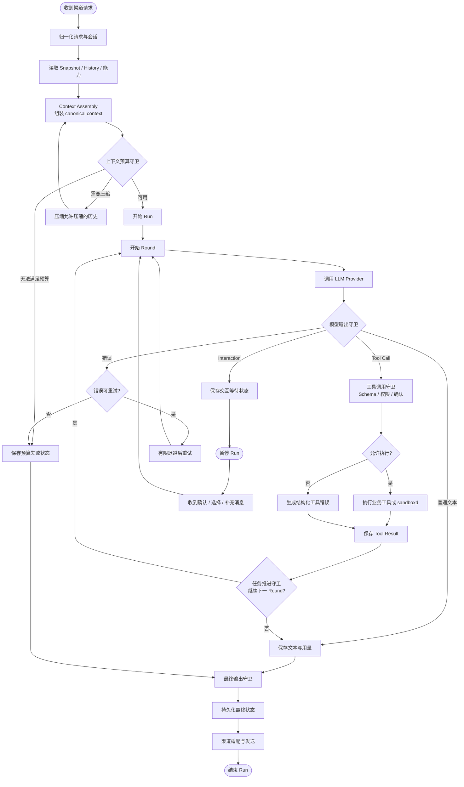
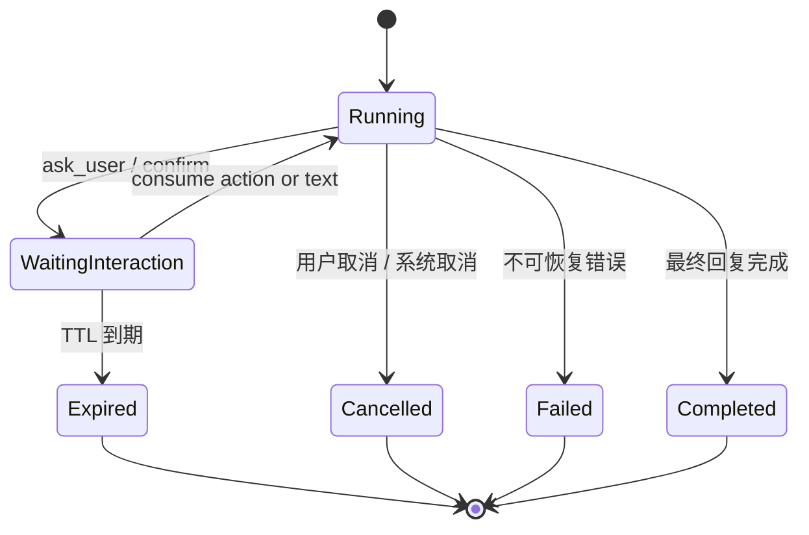

# Agent Loop

> 本文描述当前 Agent 的执行循环。`Run`、`Round`、工具调用和交互等待是执行状态，不等同于某个渠道的展示消息。

## 1. 核心概念

### Run

一次用户请求或一次恢复任务的完整执行单元。Run 负责承载会话、上下文、用量、最终状态和 LoopScope 诊断。

一个 Run 可以因为工具调用、内部核验、模型重试或用户交互而包含多个 Round。

### Round

一次实际的模型请求及其结果。Round 可能产生普通文本、一个或多个 Tool Call、交互请求、错误或取消事件。

### Tool Call

模型声明调用某个工具及其参数。工具调用必须经过 Schema 校验、权限校验和必要的确认门，不能因为模型已经声明就直接执行。

### Interaction

需要用户选择、确认或补充信息时创建的持久化等待状态。Run 在等待期间暂停，收到有效 action 或文本后恢复原会话，而不是新建一条无关任务。

## 2. 执行结构



## 3. 当前执行阶段

### 3.1 请求归一化

Gateway 将网页或 IM 平台的文本、附件、引用、平台身份、群聊信息和会话标识转换为统一 Agent request。平台差异在这里被收敛，不能把 QQ 或微信的原始事件直接当作模型消息。

### 3.2 会话和上下文准备

Runner 找到或创建 `ConversationSession`，读取 Snapshot 和已经持久化的 History，再准备本轮需要的 Memory、Knowledge、RAG 和能力信息。

上下文由 Context 层统一组装为 provider-neutral 结构。当前用户消息、RAG block、工具历史和交互状态按照 canonical 顺序进入本轮；Provider 只在发送边界做协议转换。

上下文组装是 Agent Loop 的准备阶段，不是某个 Provider 或渠道的职责。组装结果需要同时满足三项约束：语义上能让模型理解当前任务，结构上能被不同 Provider 转换，边界上不会把运行时权限或内部诊断误当成用户内容。Snapshot、History、当前 Run 的新增事实和可选动态上下文之间保持明确区分；已经进入 canonical history 的事实不能因为重新组装而被静默改写或重复追加。

上下文组装还负责为后续诊断提供来源和长度信息，但不负责执行 RAG、压缩历史或决定工具权限。它调用这些模块提供的结果，并把结果组合成统一输入。

### 3.3 LLM Round

每个 Round 调用一次模型。模型可能返回：

- 普通文本：本轮可以进入收束阶段。
- 一个或多个工具调用：逐个或并行执行后，把结果作为下一轮上下文继续发送。
- `ask_user` 或确认请求：创建 Interaction 并暂停 Run。
- 可重试错误：按统一重试策略再次调用。
- 不可恢复错误、取消或预算耗尽：结束 Run 并保留实际失败状态。

模型输出的阶段性文本可以被 Web 或 IM 流式展示，但展示过程不代表消息已经完成持久化。

### 3.4 工具执行

```text
模型 Tool Call
    -> 解析 name / arguments
    -> 获取或确认 Schema
    -> 校验 JSON 类型和必填字段
    -> 用户归属与能力权限校验
    -> destructive confirmation（如需要）
    -> 执行业务服务或 sandboxd
    -> 生成 canonical Tool Result
```

工具返回成功或失败都必须形成 Tool Result。失败结果需要包含可供模型修正的结构化原因和使用提示；Runner 不应把工具失败伪装成自然语言成功回复。

### 3.5 工具续轮

工具结果持久化后，Core 根据是否还有待处理的工具调用和任务状态决定是否进入下一 Round。下一 Round 必须保留当前 Run 中已经发生的 assistant tool call 与对应 tool result，不能只保留最后一个结果，也不能重复追加同一结果。

如果模型没有继续调用工具，才进入最终收束；如果任务要求核验，核验也是同一 Run 内的后续 Round。

### 3.6 最终收束

最终收束阶段只输出面向用户的实际结果：完成内容、未完成原因、必要的后续操作。内部工具标签、确认过程、系统 reminder 和诊断信息不应泄漏到用户回复。

## 4. 横切守卫

守卫不是一个独立的 Round，而是贯穿模型调用、工具执行和最终收束的确定性控制层。守卫负责在进入下一阶段前检查状态和输出是否符合系统约束；模型不能通过自然语言绕过守卫。

当前守卫主要包括：

- **工具调用守卫**：检查工具名称、参数结构、必填字段和 JSON 类型；参数错误时返回结构化修正提示，不重复提交相同参数。
- **权限守卫**：根据 Admin 开关、用户设置、会话状态、渠道身份和注册表结果决定工具是否可见、可调用；提示词不能扩大权限。
- **确认守卫**：对 destructive 操作要求有效的用户确认和一次性凭证，校验用户、操作摘要、目标身份和有效期。
- **工具结果守卫**：没有真实工具回执时不得声称完成；工具失败必须保留为失败事实，不能被普通文本覆盖。
- **任务推进守卫**：识别需要继续工具调用、内部核验、交互等待或最终收束的状态，避免只生成“我来处理”之类的意图播报后提前结束。
- **上下文预算守卫**：根据当前 Run 的 provider usage 和模型预算决定是否进入压缩或失败收束，不能把超预算错误伪装成正常回复。
- **输出守卫**：渠道发送前清理内部标签、系统提示、工具标识和不应外显的诊断内容，同时保留用户需要看到的真实结果。

守卫的共同原则是：守卫失败应停止当前不安全或不完整的路径，并留下结构化状态；不能用 fallback 文案掩盖真实错误，也不能让不同渠道各自实现一套判断。

## 5. 交互暂停与恢复



交互 action 只携带服务端可验证的 prompt 标识和一次性 token。用户身份、会话和原始工具上下文留在服务端，消费时重新校验归属、过期时间和状态，消费成功后必须使原 action 失效，避免重复点击造成重复执行。

## 6. 取消、超时和重试

- **用户取消**：停止当前 Run 的后续工具和模型调用，并持久化取消状态。
- **模型瞬时错误**：只对明确可重试的错误有限重试，不把所有异常都重复提交。
- **工具超时**：工具返回超时结果，Runner 根据任务状态决定结束或继续；Shell 执行器还必须回收实际执行资源。
- **交互过期**：原等待状态不能继续消费，用户需要重新发起或重新回答。
- **上下文预算不足**：只压缩允许压缩的历史部分；压缩失败不能伪造成功，也不能把系统提示词和当前请求一并丢弃。
- **Run 结束**：无论成功、失败、取消还是过期，都应留下可查询的状态和必要的 LoopScope trace。

## 7. 多渠道行为

Web 通常消费完整流式事件；QQ、微信和飞书根据平台能力选择文本、键盘或交互卡片。渠道可以隐藏工具输入、压缩进度或调整 Markdown 展示，但以下事实必须一致：

- 工具调用和工具结果属于同一个 Run。
- 交互等待必须真正暂停，而不是让模型继续生成假设答案。
- 最终回复来自同一 Run 的最终状态。
- 刷新或重新打开会话后，从 canonical history 重新渲染，而不是依赖内存中的流式缓存。

## 8. 可观测性

LoopScope 以 Run 为入口显示 Round 和 Span。重点记录：

- 每轮模型输入、输出、上下文用量和缓存命中。
- 工具调用的名称、耗时、状态、参数校验结果和结果摘要。
- RAG、上下文组装、压缩、重试和交互等待阶段。
- 最终 Run 状态及取消、失败或超时原因。

真实用户输入、附件内容和凭据不能进入普通日志；诊断输出需遵循脱敏规则。

## 9. 不属于 Agent Loop 的职责

- 渠道 UI 如何排版工具气泡，不属于 Core loop。
- Provider 的 wire message 字段映射，不应改变 canonical history。
- 工具内部如何查询数据库或调用外部服务，不应复制到 Runner。
- Shell 的容器隔离、网络和配额由 sandboxd / executor 负责，Core 只负责调用契约和结果接收。
- 记忆和 Knowledge 是否长期保存由反思流程决定，不由每个 Round 自动推断为永久事实。
