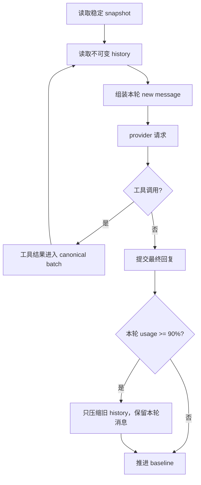

# Context Engineering

上下文由稳定前缀、snapshot、history 和本轮新消息组成。snapshot 保存当前可复用的系统事实；history 保存已经提交的 canonical batch；new message 只保存当前请求，不能把动态时间或临时控制块永久写入 history。

动态时间只在本轮 new message 中出现；姿态、RAG 和工具声明按各自稳定性与 digest 规则处理。RAG 召回结果用于当前上下文，并由水位阻止当前消息被本轮自召回。

缓存优化的原则是保持前缀字节和消息顺序稳定。不能为了去重而删除已经进入 history 的内容，也不能在不同 gateway 中使用不同的组装逻辑。
