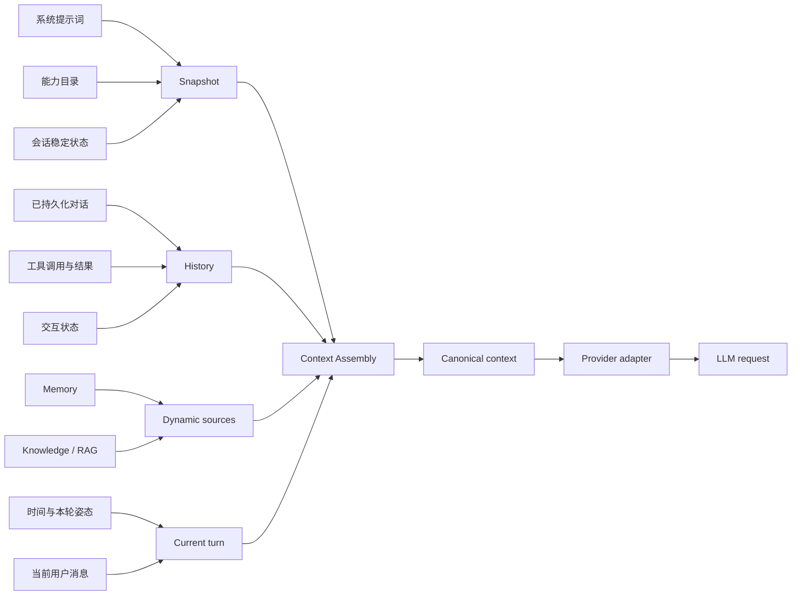
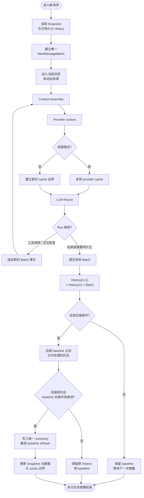

# 上下文工程

> 本文描述 Agent 当前如何管理模型上下文的组成、边界、生命周期和缓存稳定性。具体字段和 provider 转换以 `backend/agent/context/` 及对应测试为准。

## 1. 上下文工程的目标

上下文工程负责把一次 Agent Run 所需要的多类信息，组织成稳定、可恢复、可被不同模型供应商消费的 canonical context。

它同时解决四个问题：

- 模型需要知道哪些稳定背景和当前事实。
- 哪些内容应该进入持久化 History，哪些只属于当前轮。
- 上下文增长后如何只处理允许压缩的历史部分。
- 多轮调用之间如何保持消息边界和前缀稳定，尽量复用 provider cache。

上下文工程不负责决定用户权限、不执行工具，也不把某个 Provider 的消息格式当作系统事实。

## 2. 上下文组成



### Snapshot

Snapshot 是会话级稳定上下文的缓存边界，通常包括系统提示词、能力目录以及在会话生命周期内可复用的稳定状态。它有 hash、revision 和 TTL，用于判断是否可以继续复用。

Snapshot 不是完整对话历史，也不是每轮都重新追加的动态消息。Snapshot 变化时需要建立新的稳定边界，不能静默修改已经进入 History 的事实。

### History

History 是已经持久化的会话事实，包含用户消息、助手消息、工具调用、工具结果、交互状态和必要的压缩 baseline。它是刷新页面、切换渠道和恢复 Run 时重建上下文的依据。

工具调用与对应结果必须作为完整语义单元保留；一个助手消息发出多个并行工具调用时，所有结果都必须保留并正确关联。

### Current turn

Current turn 是本轮尚未形成普通历史事实的输入和动态内容，包括当前用户消息、当前时间、必要的姿态变化和本轮 RAG 结果。它通过统一的 Batch/turn 组装进入本轮请求，不能由 Web、IM 或 Provider 各自追加一份。

### Dynamic sources

Memory、Knowledge、RAG、项目状态等动态来源由各自服务产生结构化结果，再交给 Context Assembly 组合。召回结果是否注入由 scope、去重、质量和字符预算决定；没有有效命中时不应生成空的上下文块。

## 4. Canonical Context Assembly

当前组装代码集中在 `backend/agent/context/assembly/`，并由 `run_context.py` 作为 Agent Run 的准备入口。组装职责大致分为：

| 组件 | 职责 |
|---|---|
| `system.py` | 组织稳定系统提示词边界 |
| `snapshot.py` | 生成可复用的 Snapshot 消息 |
| `history.py` | 从持久化消息恢复 canonical History |
| `batch.py` | 表示本轮新增消息集合，保持顺序和边界 |
| `turn.py` | 维护本轮姿态、时间、用户消息和动态内容 |
| `messages.py` | 提供消息结构和公共类型 |

Canonical Assembly 的输出不绑定 Anthropic、OpenAI 或 Ollama。Provider adapter 可以将它转换为供应商需要的 wire format，但不能删除工具结果、改变角色语义或重新排序历史。

## 5. 稳定性与缓存边界

`Batch`、`History`、baseline 和 provider cache 属于同一条生命周期，不能分别维护成互相独立的上下文区域。`Batch` 表示本轮新增事实；它先参与当前请求，确认需要持久化后再追加到 History；baseline 只在压缩事务成功后推进；缓存则复用没有变化的稳定前缀。



这条生命周期中的增量关系是：

```text
History(n) + Batch(n+1) = History(n+1)
```

- `History` 只表示已成功持久化的事实；`Batch` 只表示当前 Run 的新增事实。
- 各来源只向同一个 Batch 提供片段，由统一组装器决定顺序、边界和 canonical 身份。
- 工具调用、工具结果和交互恢复继续追加到同一个 Run，不能拆成多个动态尾部。
- 普通新增只追加 Batch，不会重写旧 History；只有压缩事务可以替代已覆盖的旧历史。
- 压缩失败或发现并发 baseline 已推进时，保留原 History 和 baseline，不覆盖新结果。

缓存稳定依赖的不只是 Snapshot 文本，还包括消息顺序、role、content block 类型、工具调用关联和 Batch 边界。以下内容会破坏前缀或语义稳定性：

- 同一动态 reminder 在不同阶段重复追加。
- 重新组装时改变已持久化 History 的文本或顺序。
- 把本轮临时内容写进下一轮不应复用的动态尾部。
- 并行工具结果缺失、乱序或使用不稳定的关联字段。
- Provider adapter 为了展示方便修改 canonical history。

### 5.1 完成度与缓存实测

当前上下文工程的组装、压缩、baseline、工具注入边界和 LoopScope 观测已经落地。时效性与缓存率的取舍是：当前用户消息、时间、RAG/Memory 结果和工具结果每轮重新组装；system、稳定 Snapshot、能力目录和未变化的历史保持稳定并置于可复用前缀。目标是让动态信息保持新鲜，同时避免无关内容提前打断 cache boundary。

当前实测结果来自 devserver 真实预设和真实 session，采用最新的 2026-08-26 报告口径：每组连续 20 个 run，排除 Round 1 冷启动，只统计 Round 2–20 的 57 个稳定 run：

| 模型 | 稳定段缓存率（Round 2–20） | 稳定段输入 / 新鲜 / 命中 |
|---|---:|---|
| MiniMax-M3 | `99.31%` | `1,032,445 / 7,165 / 1,025,280` |
| GLM（glm-4.5-air） | `99.68%` | `944,348 / 3,036 / 941,312` |
| DeepSeek（deepseek-v4-flash） | `99.61%` | `1,085,822 / 4,222 / 1,081,600` |
| 合计 | `99.53%` | `3,062,615 / 14,423 / 3,048,192` |

Round 1 不纳入稳定段结论：MiniMax/GLM 的 Round 1 继承了此前测试留下的热缓存，DeepSeek 的 Round 1 则是未额外预热的冷启动/边界重建样本。完整逐轮数据见 [MiniMax、GLM 与 DeepSeek 真实 Agent 20 轮对话/工具协议测试报告](../reports/2026-08-26-TEST-CACHE-MINIMAX-GLM-DEEPSEEK-20RUN.md)；缓存变化定位由 [11-LoopScope.md](./11-LOOPSCOPE.md) 的 Prefix Diff 和 Cache Diagnostics 提供。

### 5.2 工具 Schema 模式的缓存取舍

2026-09-01 的 5 工具连续会话复测显示，简介模式和全量模式都能形成稳定的可缓存前缀，但缓存率和上下文体积需要分开判断：

| 模式 | Provider input 节省 | 缓存率范围 | 上下文工程含义 |
|---|---:|---:|---|
| 简介模式（默认） | 相对全量模式约 `20%–59%`，四模型平均约 `42%` | `98.47%–99.04%` | 用较小的稳定能力目录换取更低的每轮上下文成本；复杂工具按需补充 Schema |
| 全量模式 | 基准 | `98.72%–99.41%` | 完整 Schema 更容易保持固定前缀，但被缓存的前缀本身更大，不能据此推断总消耗更低 |

这里的缓存率定义为 `cache_read / provider_input`，不是缓存 Token 数占比，也不是 Provider 计费折扣。上下文工程应优先观察稳定前缀是否被重复利用，再结合 `provider input`、`fresh input`、上下文长度和首个 Prefix Diff 判断实际成本；不能只追求更高的缓存率。该轮完整数据见 [LLM-16 5 工具多模型 Schema 模式复测](../reports/2026-09-01-TEST-LLM-16-5TOOLS-MULTI-MODEL-RETEST.md)。

## 6. 压缩与 baseline

压缩只处理超过当前 baseline、且允许被摘要替代的历史内容。系统提示词、Snapshot、当前用户消息和未完成工具事务不属于普通压缩对象。

压缩完成后，摘要和新的 baseline 一起成为会话的持久状态；下一轮从新的 baseline 继续组装，而不是把旧摘要和原始历史重复注入。压缩任务需要按 Session 串行，避免后台压缩、手动 `/compact` 和正在运行的 Run 互相覆盖。

压缩失败时必须保留原 History 和 baseline，返回可诊断的失败状态；不能因为压缩失败直接丢弃本轮，也不能以“已整理”代替真实结果。

### 6.1 超大历史的分块滚动摘要

当允许压缩的历史输入过大时，不能把全部内容一次性提交给摘要模型。当前实现位于 `backend/agent/context/compaction.py` 和 `compress_conv.py`：

```text
待压缩旧 History
        -> 保留最近约 20,000 字符的完整消息
        -> 更早内容按最多 48,000 字符分块
        -> 每块生成摘要，并把上一块摘要作为下一块的已有摘要
        -> 得到最终滚动摘要
        -> 摘要不超过 10,000 字符后才推进 baseline
```

- 总输入不超过 96,000 字符时，优先走一次分支摘要调用，减少额外 LLM 往返并保持稳定前缀。
- 总输入超过 96,000 字符时，切换为 rolling fallback；每个块最多 48,000 字符，按历史顺序逐块合并。
- 分块以消息/工具事务为基本单位，不拆散未完成工具事务；单条超长消息只能在最终预算保护路径中截断。
- 摘要生成期间不修改真实会话；所有块完成并通过摘要格式、长度和 baseline 水位校验后，才原子写入唯一 summary 并推进 `baseline_message_id/hash`。
- 分块摘要失败、摘要为空、超出上限或发现 baseline 已被其他任务推进时，保留旧 History 和旧 baseline，不提交部分结果。

这里的 96,000/48,000/20,000/10,000 是当前实现阈值，属于压缩算法参数；触发时机、重试、并发锁和 CAS 失败处理属于可靠性专题。

Baseline 是 History 中已经被摘要覆盖的稳定边界，不是当前请求的临时截断位置。它通过持久化消息 ID、摘要 hash 和 Snapshot 元数据共同表示；上方生命周期图已经把 Batch 追加、压缩事务和 baseline 推进放在同一条线上。

baseline 推进遵循以下关系：

```text
旧 baseline
  + 已追加但尚未压缩的 History
  -> 压缩允许处理的旧 History
  -> 写入唯一 summary
  -> baseline_message_id/hash 推进到摘要覆盖范围
  -> 保留未覆盖的 History 和后续新增 Batch
```

- 新 Batch 只会把 baseline 之后的新事实追加到 History，不会自动移动 baseline。
- 压缩任务只处理当前 baseline 之后、已完成且允许摘要的历史段。
- 未完成工具事务、等待中的交互、当前用户消息和系统 Snapshot 不得被错误纳入压缩段。
- 压缩结果写回前必须确认 baseline 没被其他压缩任务推进，避免旧任务覆盖新结果。
- 压缩成功后，下一次上下文读取以新的 summary 和 baseline 为起点；没有被摘要覆盖的消息继续原样保留。

## 7. 工具与 Skill 注入

能力上下文分为目录信息和具体 Schema：

- 工具目录提供名称和短描述，用于让模型知道有哪些能力。
- 模型或 Agent 明确需要某工具时，再注入该工具的 Schema。
- Skill 提供处理方法和约束，不新增工具权限；读取结果可按会话生命周期复用。
- 工具调用和结果照常进入 canonical History，不需要为了 Schema 注入再复制一份历史。

当 Run 内需要更换或新增工具时，应刷新当前能力声明，并确保下一次模型请求看到与实际 dispatch 一致的 Schema。上一轮已经稳定声明且仍然有效的能力不应无故重复生成，避免破坏前缀。

## 8. RAG、Memory 与当前消息边界

自动 RAG 应基于本轮用户消息和“本轮开始前”的可用历史进行召回。当前消息已经写入数据库后，检索对话来源仍需使用本轮消息水位或等价边界，避免把刚发出的消息再次召回并作为新的上下文注入。

RAG 结果是本轮上下文的一部分，不等于 Memory 或 Knowledge 的写入。Memory 和 Knowledge 的长期保存由各自反思流程决定；Context Assembly 只消费它们返回的当前结果。

## 9. Provider 适配边界

```text
canonical context
    -> provider adapter
    -> provider wire messages
    -> model response
    -> canonical tool/text/interaction events
```

Provider adapter 负责角色映射、工具协议、流式 delta 和供应商特有字段。它不负责：

- 重建会话历史。
- 决定 RAG、Memory 或 Skill 是否注入。
- 把字符串形式的布尔值、数组或对象当作等价类型发送。
- 删除无法识别但对工具关联有意义的字段。

## 10. 诊断信息

上下文诊断应能区分：

- Snapshot 是否复用及其 revision。
- History、当前 Batch 和动态来源各自的长度。
- provider context usage、模型预算和压缩判定。
- RAG 是否命中、是否注入以及过滤原因。
- 消息顺序、结构变化和 cache 前缀变化点。

诊断用于 LoopScope 和受限日志，不应把系统内部的预算、权限或工具细节泄漏给普通用户消息。

## 11. 当前边界

- 上下文主组装仍由 Python Agent 负责。
- TypeScript 主要参与 RAG lexical index/search，不负责完整 Context Assembly。
- 不同 Provider 的 wire format 可以不同，但 canonical history 必须保持一致。
- 具体压缩阈值、字段格式和消息顺序应在实现文档与测试中维护，本文只记录稳定原则。
