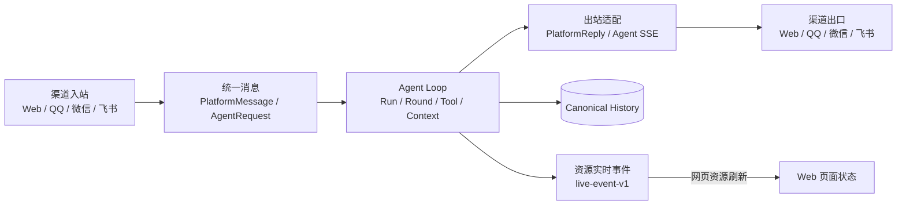

# 渠道接入与消息协议

> 本文描述 Gugu Agent 当前实际支持的 Web、QQ、微信和飞书渠道。渠道只负责平台连接、消息归一化和出站适配；身份、会话、上下文、权限、工具和 Agent Loop 由共享后端负责。具体字段和平台 API 以代码为准。

## 1. 范围与当前状态

| 渠道 | 入站连接 | Agent 入口 | 出站方式 | 当前状态 |
|---|---|---|---|---|
| Web | HTTP API；流式响应使用 SSE | `app.api.v1.agent`、`agent.gateway.web` | Agent SSE、普通 API 响应 | 主要网页对话入口 |
| QQ | QQ Bot Gateway WebSocket | `agent.gateway.qq` -> Redis Stream -> `agent.im.loop` | QQ Bot HTTP API；文本、Markdown、文件、键盘和群成员 mention | 已接入 C2C 和群聊 |
| 微信 | iLink HTTP long-poll (`getupdates`) | `agent.gateway.wechat` -> Redis Stream -> `agent.im.loop` | iLink HTTP API；文本和媒体，回复依赖 `context_token` | 已接入私聊、群聊、引用和媒体 |
| 飞书 | Lark SDK WebSocket 事件连接 | `agent.gateway.feishu` -> Redis Stream -> `agent.im.loop` | 飞书消息 API；文本、卡片、文件和图片 | 已接入私聊、群聊、交互卡片和媒体 |

`backend/app/core/events.py` 的用户级 Redis Pub/Sub -> SSE 是网页资源实时更新总线，不是 IM 渠道，也不替代 QQ/微信/飞书的入站连接。终端的 PTY WebSocket 是另一套交互协议，同样不属于本文的 IM Gateway。

当前业务后端仍由 Python/FastAPI 承担。渠道网关、worker、Agent Loop 和出站适配均在 Python `backend/agent/` 中；TypeScript 仅承担 RAG lexical worker 等专项 sidecar。

## 1.1 渠道功能支持矩阵

下表按当前代码和测试描述能力边界：`完整` 表示有独立实现并纳入统一 Loop，`降级` 表示通过文本或其他平台通用形式实现，`不适用` 表示该能力不是该渠道的传输方式。

| 功能 | Web | QQ | 微信 | 飞书 |
|---|---|---|---|---|
| 文本入站 | 完整 | 完整 | 完整 | 完整 |
| 文本出站 | 完整 | 完整 | 完整 | 完整 |
| 增量 token 流 | 完整，Agent SSE | 降级为按 Round 发送 | 降级为按 Round 发送 | 降级为按 Round 发送 |
| 多 Round 分段 | Web 事件流展示 | 完整，独立发送每个非空 Round | 完整，统一收集后发送 | 完整，统一收集后发送 |
| 私聊 | 完整 | C2C | c2c | p2p 归一为 c2c |
| 群聊 | 不适用 | 完整，支持 @/被动记录策略 | 完整，依赖 iLink 群字段 | 完整，依赖 chat_id |
| 引用文本 | 完整 | 完整，独立 `quoted_text` | 不支持还原文字原文；仅保留平台摘要或不支持占位 | 完整，解析回复引用 |
| 引用附件 | Web attachment reference | 完整 | 支持识别图片/文件等引用媒体，下载/解密后暂存 | 完整，媒体适配 |
| 图片/文件入站 | 上传附件 | 完整 | 完整，含 iLink 媒体解密 | 完整 |
| 图片/文件出站 | Web 文件事件/下载 | 完整，有平台大小限制 | 完整，有平台大小限制 | 完整，有平台大小限制 |
| 语音入站 | 浏览器上传/附件 | 按平台事件能力 | 完整，使用 iLink ASR 转写 | 按平台事件能力 |
| Bot mention | Web UI 语义 | 完整，官方 `<qqbot-at-user>`；可拆成独立消息 | 依平台消息内容 | 依飞书 mention 内容 |
| 工具进度消息 | SSE 事件 | 完整，纯文本/Markdown 适配 | 文本适配 | 文本/卡片适配 |
| `ask_user` 交互 | Web 交互 API | Inline Keyboard，失败降级文本 | 文本选项 | 交互卡片，失败降级文本 |
| Markdown | Web 前端渲染 | 按会话格式，失败降级纯文本 | 平台文本适配 | 转换为文本/卡片元素 |
| 键盘/卡片交互 | Web UI | 键盘 | 降级文本 | 卡片 |
| typing 状态 | Web 前端生成态 | 由 IM 活动状态适配 | typing ticket，失败时不阻塞 | 由平台适配能力决定 |
| 回复关联 | session/run | QQ `msg_id` | `context_token` | 飞书消息关联 |
| 入站连接 | HTTP/SSE | Bot Gateway WebSocket | iLink HTTP long-poll | Lark SDK WebSocket |
| 网页资源实时更新 | 用户级 SSE | 通过后端事件反映到 Web | 通过后端事件反映到 Web | 通过后端事件反映到 Web |

“网页资源实时更新”指 Web 的 `live-event-v1` 用户事件流，不表示 QQ、微信或飞书收到资源变更推送；IM 渠道只有在实际发送出站消息时才会触达平台用户。平台能力不对称时，统一语义优先，展示形式由 `agent.im.replies` 和对应 Gateway 负责。

## 1.2 消息架构图



图中有四条需要保持独立的边界：

1. 所有渠道先进入统一消息入口，Agent Loop 是唯一的共享处理层；平台连接和展示差异留在入口/出口适配器。
2. Agent Loop 内部虽然包含 Run、Round、Tool 和 Context，但在渠道架构中只抽象为一个处理层，不为每个平台复制一套。
3. 出口回到原渠道：Web 使用 Agent SSE，QQ、微信、飞书使用各自的发送 API；这不是把平台原始消息重新交给 Agent。
4. canonical history 是持久事实源，Agent stream event 和 `live-event-v1` 是实时事件，PlatformReply 是出站适配结构；平台气泡如何拆分不能反向改变历史语义。

## 消息处理主链路

渠道文档的核心是下面这条链路。平台差异只在两端收敛，中间的消息处理由共享 IM Loop 完成。

```text
1. 平台收到消息
   Web / QQ / 微信 / 飞书
        |
2. 入站适配
   解析正文、发送者、owner、群/私聊、引用、附件、mention
        |
3. 统一消息
   PlatformMessage + owner_user_id + channel/bot/scope 字段
        |
4. 进入处理队列
   Web 直接进入 Agent Gateway；IM 进入 Redis IM inbound stream
        |
5. worker 调度
   幂等去重 -> 防抖合并 -> 同会话串行 -> 并发上限
        |
6. Agent Loop
   Actor/权限 -> Session -> Context -> Run/Round -> Tool/Interaction
        |                         ^
        |                         |
        +---- 失败/确认/工具结果 --+
        |
7. 形成结果
   canonical history + Agent stream event + PlatformReply
        |
8. 出站适配
   Web SSE / QQ API / 微信 iLink API / 飞书消息 API
        |
9. 用户看到回复
   平台展示层可以拆分、降级或换成卡片，但不改变历史语义
```

### 消息处理中的关键判断

1. **先确认归属，再处理内容**：`owner_user_id` 是 bot 绑定的 Gugu 用户，`platform_user_id` 是当前发言人；不能通过昵称或发言人 ID 猜 owner。
2. **先确定 scope，再读上下文**：平台、bot、群/私聊和会话 ID 共同确定 Session，避免不同 bot、群和私聊串历史。
3. **先统一消息，再进入模型**：引用、附件、mention 和平台特有字段由 Gateway 解析，Agent 不直接消费 QQ/微信/飞书 SDK 对象。
4. **被动消息与主动消息分开**：群聊普通消息可以只落库并累计反思，不应因为进入 Agent Loop 就自动回复；只有满足 @、群配置或其他主动条件时才运行回复。
5. **处理中允许多 Round**：工具调用、工具结果、确认和重试属于同一个 Run；不能把每个渠道的展示气泡误当成一个新的 Run。
6. **结果按平台能力发送**：Web 可以收到 token 流，IM 通常按 Round、工具状态、交互和最终文本发送；平台不支持卡片或 Markdown 时只做明确降级。
7. **回复完成后仍要保留事实**：最终消息、工具调用/结果、引用和附件引用进入 canonical history；实时流断开时，重新加载仍以历史为准。

### 消息状态

```text
received -> normalized -> queued -> processing
                                      |
                       +--------------+--------------+
                       |                             |
                 waiting interaction             completed
                       |                             |
                    resumed                       failed/cancelled
```

`received` 到 `normalized` 属于 Gateway；`queued` 到 `processing` 属于 worker/IM Loop；模型和工具状态属于 Run/round；平台发送属于出站适配。每一阶段都不得用下一阶段的展示文案伪造成功状态。

## 2. 责任边界

```text
平台连接 / 原始事件
        -> Gateway 解析与归一化
        -> Redis IM_INBOUND_STREAM
        -> worker 去重、防抖、会话串行化
        -> agent.im.loop
        -> Run / Round / Context / Tool / Memory
        -> 统一出站 parts
        -> 平台发送适配器
```

### 2.1 Gateway 负责什么

- 建立和维护平台连接，处理鉴权、心跳、重连、过期事件和平台特有错误。
- 从原始事件提取文本、附件、引用、消息 ID、发言人和会话信息。
- 将平台身份和 bot 归属写入统一 payload，不能在 worker 中凭昵称猜测用户归属。
- 处理平台必须在入队前完成的协议动作，例如 QQ 事件确认、微信媒体下载解密和飞书卡片动作接收。
- 将统一出站请求转换为平台 wire format，并根据平台能力做有限降级。

### 2.2 Gateway 不负责什么

- 不自行组装完整 LLM 上下文，不复制 `runner` 或 `context` 的逻辑。
- 不自行决定模型是否运行；群聊是否被动记录、是否回复由统一 IM Loop 和显式配置决定。
- 不绕过 `ActorResolver`、权限注册过滤、工具 dispatch 校验和 destructive 确认门。
- 不把平台展示文本当作 canonical history；消息、工具调用、工具结果和交互状态由共享持久化链路保存。

### 2.3 worker 与 IM Loop

`backend/worker.py` 负责 Redis Stream 消费、幂等去重、防抖、有界并发、同会话串行化和优雅退出。实际业务编排集中在 `backend/agent/im/loop.py`：

1. 通过 `PlatformMessage` 统一旧版 dict payload。
2. 解析 owner 账户和当前平台发言人，创建 `ActorContext`。
3. 按 bot、平台、会话类型和会话 ID 找到或创建 `ConversationSession`。
4. 生成 `AgentRequest`，带上群聊、引用、附件、角色、能力和记忆策略。
5. 记录被动群消息，或运行共享 Agent Loop。
6. 将文本、工具进度、交互、附件和最终回复交给 `agent.im.replies`。

同一会话保持输入顺序；不同会话可以并发执行。防抖只合并短时间内同一会话的连续输入，不改变消息的 owner、bot 或 scope。

## 3. 统一入站身份

IM payload 的核心身份字段如下：

| 字段 | 含义 | 约束 |
|---|---|---|
| `owner_user_id` | BYO bot 绑定的 Gugu 用户 | 由 bot 配置决定，不能用当前发言人替代 |
| `platform` | `qq`、`wechat` 或 `feishu` | 进入 Loop 后作为来源标识 |
| `channel_id` / `platform_bot_id` | 当前 bot 或渠道配置 ID | 用于 bot 隔离、路由和出站凭据选择 |
| `platform_user_id` | 当前发言人的平台稳定 ID | 不是 Gugu owner ID，也不是昵称 |
| `platform_user_name` | 当前平台展示昵称 | 仅用于展示和近期成员信息，不能作为身份主键 |
| `chat_type` | 内部统一为 `group` 或 `c2c` | 飞书 `p2p` 在归一化时转为 `c2c` |
| `chat_id` | 群 ID；私聊通常为空 | 群会话作用域的稳定标识 |
| `message_id` | 平台事件/消息 ID | 用于回复关联或幂等；微信当前用 `context_token` 兼容 |
| `context_token` | 平台回复所需的短期上下文凭证 | 微信回复必须透传，其他渠道通常为空 |

`agent.im.identity.resolve_owner_account()` 只根据 owner 绑定解析 Gugu 用户；`agent.im.actor.ActorResolver` 再根据平台、bot、会话和发言人解析 `owner`、`member` 或 `unknown` 角色。member/unknown 不能因为 payload 缺少角色就升级为 owner。

## 4. 会话与上下文作用域

### 4.1 会话路由

会话键至少包含：

```text
platform + bot_id + chat_type + scope_id
```

群聊的 `scope_id` 是群 ID；私聊的 `scope_id` 是平台用户 ID。相同用户在不同 bot、不同群、群聊和私聊之间不能共用会话锁或历史。Redis 路由是加速缓存，缺失时必须回查数据库，不能因为缓存 miss 创建同一群的重复会话。

### 4.2 owner 与 member

- owner 是 bot 绑定的 Gugu 账户，拥有 owner 上下文和账户级能力，实际仍受 Admin、用户设置和会话权限限制。
- member 是群内其他平台用户，使用受限 Agent 请求和成员可用工具集合。
- `im_context` 使用 `ContextVar` 透传当前平台、消息、群、发言人、角色、可用工具和微信 `context_token`，供工具层主动发送进度或平台回复。
- 群聊是否读取群消息、是否回复、是否维护群组/成员记忆由 bot 配置和反思任务共同决定；渠道不能自行放大范围。

### 4.3 群聊被动消息

QQ 当前支持全量群消息进入网关；`group_requires_at`、`group_read_enabled`、`group_memory_enabled` 和 `member_memory_enabled` 在 payload 中传入统一 Loop。符合被动记录条件的消息：

- 进入同一群的 `ConversationSession`；
- 不等待正在运行的主动 Agent，使用独立被动锁保持写入顺序；
- 不向群发送模型回复；
- 按游标和反思任务策略累计群消息，达到当前阈值后异步反思；
- 被 @ 或满足回复策略时才进入主动 Agent 路径。

当前成员批量记忆反思由 `agent.memory.reflection_jobs` 和 `agent.memory.im_reflection` 负责，不由 Gateway 单独读取某个成员的历史。

## 5. 平台适配

### 5.1 QQ

实现位置：`backend/agent/gateway/qq.py`。

- 使用 QQ Bot Gateway WebSocket 接收 C2C、`GROUP_AT_MESSAGE_CREATE` 和配置允许的群消息。
- 优先使用 QQ 提供的 `user_openid`/`member_openid` 等稳定平台 ID；群消息保留 `group_openid`。
- 解析引用、附件、QQ 表情和群成员 mention；引用正文与当前正文分开存储。
- 入队前执行必要的事件确认和即时反馈，普通业务消息写入 `IM_INBOUND_STREAM`。
- C2C 与群聊分别调用 `/v2/users/.../messages` 和 `/v2/groups/.../messages`。
- 群 mention 使用官方 `<qqbot-at-user id="..." />` 形式；发送层可把 mention 部分拆为独立消息，再发送普通正文，避免平台把标签显示成纯文本。
- 普通文本按会话消息格式发送；Markdown 被平台拒绝时只在可判定的失败场景降级为纯文本。
- QQ Inline Keyboard 失败时由统一出站层发送文本选项，不能让键盘失败阻塞 Agent 结果。

### 5.2 微信

实现位置：`backend/agent/gateway/wechat.py`。

- 微信 iLink 当前采用 HTTP long-poll `getupdates`，不是 WebSocket。
- 只接受用户到 bot 的消息，跳过 bot 自己发出的回环消息。
- 文本、语音转写、图片、文件和引用消息先归一化；媒体按 iLink 规则下载、解密并暂存。
- iLink 没有可直接复用的独立消息 ID 时，使用入站 `context_token` 作为兼容去重/回复关联字段。
- 回复必须透传本条消息的 `context_token`；拿不到 typing ticket 时只关闭 typing 能力，不阻塞消息入队。
- 网关重连和拉取失败采用有限等待重试；入队失败不盲目重推同一非幂等消息。

### 5.3 飞书

实现位置：`backend/agent/gateway/feishu.py`。

- 使用 Lark SDK WebSocket 接收事件，不把飞书 webhook 的 HTTP 事件当作当前主连接模型。
- 校验 `app_id` 和事件新鲜度，丢弃错投或过期事件。
- 将 `open_id` 作为 `platform_user_id`，将 `chat_id` 和 `chat_type` 转换为统一会话字段；`p2p` 归一为 `c2c`。
- 解析文本、富文本、回复引用、卡片动作和媒体消息。
- 普通回复通过飞书消息 API 发送；工具交互优先使用卡片，卡片不可用时由 `agent.im.replies` 发送带选项序号的文本。
- Markdown 表格、加粗等内容在出站层转换为飞书卡片元素或文本，不能改变 canonical history。

### 5.4 Web

实现位置：`backend/app/api/v1/agent.py`、`backend/agent/gateway/web.py`。

- Web 对话通过 HTTP `POST /api/v1/agent/chat` 启动，响应以 SSE 流式返回；恢复、取消和会话消息由 Agent API 提供。
- Web 使用 Gugu JWT 作为直接身份，不需要 `owner_user_id` 与平台用户 ID 的双层映射。
- 前端资源同步使用 `GET /api/v1/live/stream`，后端从 Redis 用户频道和全局广播频道转成 `live-event-v1` SSE。
- Web 的事件订阅只通知资源变更，例如 projects、files、mind、sessions、terminals；客户端收到事件后刷新或应用 canonical payload。
- Web SSE 不能作为 QQ、微信或飞书的消息传输替代；IM 回复仍必须经过平台发送 API。

## 6. 统一出站协议

`agent.im.replies` 将 Agent 的最终回复、工具进度、交互请求、附件和媒体转换成平台无关的 parts，再依据 `supported_reply_capabilities()` 选择平台适配：

```text
Agent text/tool/interaction result
        -> reply parts: text | file | image | keyboard | stream
        -> capability check
        -> platform sender
        -> success / structured failure
```

出站规则：

- 普通文本、工具进度和最终回复不能分别维护一套权限或身份；均从当前 IM Context 获取目标。
- 平台不支持某种 part 时，只允许明确的协议降级，例如卡片降级为文本选项；不得伪造发送成功。
- 回复关联 ID、微信 `context_token`、QQ `msg_id` 等平台字段由适配器使用，不进入模型可控的权限判断。
- 多轮 Run 的中间消息和最终消息必须按 Loop 事件顺序发送；展示层的分段不改变 canonical history。
- 出站失败须记录结构化、脱敏的诊断；可重试错误才允许有限重试，非幂等发送不能无限重放。

## 7. 可靠性与生命周期

```text
网关进程/连接
  -> gateway 按 UserBot 配置启停
  -> worker 消费 Redis Stream
  -> 幂等键 + ack
  -> 会话锁 / 被动锁
  -> Agent run
  -> 出站发送
  -> 状态清理、typing 结束、trace 完成
```

- `agent.gateway.gateway` 为每个启用的 `UserBot` 管理网关进程，凭据通过环境变量注入，不放在命令行参数中。
- 网关退出后按存活时长区分秒崩和网络抖动，秒崩使用指数退避，长期运行后退出可快速重启。
- worker 使用 Redis Stream consumer group、稳定 consumer 名和 `imseen` 幂等键；已 claim 的重复消息不能再次执行。
- 同一会话锁保证消息保序；全局运行信号量限制 LLM 并发；被动群消息使用独立锁，不被主动 Run 阻塞写入。
- `ask_user` 等交互回复走快速通道，避免被持有中的会话锁阻塞到提示超时。
- 进程关闭时应依次停止 RAG、PTY、worker 及数据库连接，并等待任务收尾；未收尾的异步任务和未归还连接属于需要修复的运行故障。

## 8. 安全与隐私

- 所有跨用户读取先经过 owner/ownership 校验；平台 ID 只用于平台作用域内映射，不能直接当作 Gugu 用户 ID。
- member/unknown 的上下文、工具和 Memory 范围由代码策略收紧；提示词不能扩大权限。
- token、API key、bot secret、微信 `context_token` 和完整平台凭据不得写入 URL、普通日志、前端响应或 Git。
- 聊天正文、附件名和模型输出日志使用长度、类型和 fingerprint；真实昵称、平台 ID 和群 ID 在可见日志中脱敏。
- 引用和附件必须与当前消息在同一持久化语义中处理，不能因为平台事件拆分而造成跨用户或跨群串联。
- 外部平台请求复用 URL 安全校验，不自动跟随未经校验的重定向；平台错误向用户展示通用错误，详细异常进入受限诊断。

## 9. 测试与现状证据

渠道协议和共享 IM 链路的回归测试集中在 `backend/tests/`：

| 范围 | 代表测试 |
|---|---|
| 统一 payload、chat type、reply parts | `test_im_protocol.py` |
| owner/member 身份和受限策略 | `test_im_identity.py`、`test_im_permissions_types.py` |
| 会话复用、作用域和去重 | `test_im_conversation_key.py`、`test_im_session_reuse.py`、`test_im_dedup.py` |
| QQ Gateway、WebSocket、发送和 mention | `test_qq_raw_ws.py`、`test_qq_raw_send.py`、`test_qq_group_history.py` |
| 飞书事件、交互和媒体 | `test_feishu_gateway_guards.py`、`test_feishu_interactions.py`、`test_feishu_media.py` |
| 微信引用和媒体 | `test_wechat_quotes.py`、`test_im_media_ingress.py` |
| 群成员/群组/私聊反思策略 | `test_im_memory_scopes.py`、`test_im_members.py` |

新增渠道或平台字段时，至少补充：身份归属、私聊/群聊路由、重复事件、引用/附件、权限拒绝、出站失败和重连后的行为测试。平台差异应留在 Gateway/replies 测试；共享行为应在 `agent.im` 和 worker 测试中验证。

## 10. 当前限制与后续工作

- IM 入站仍以 Redis Stream + Python worker 为中心，渠道连接和 Agent 执行分进程；需要运维保证 gateway、worker、Redis 和数据库生命周期一致。
- 平台发送能力不是完全对称：QQ 的 Markdown/键盘、飞书卡片、微信 context token 都需要各自适配，不能假定跨平台 wire format 相同。
- 微信 long-poll、QQ/飞书 WebSocket 和 Web SSE 的连接监控指标应分别统计，不能只看一个“在线”状态。
- 出站多轮消息已由统一 replies 处理，但平台限流、消息长度和附件大小仍应持续补充端到端测试。
- `08-CHANNELS.md` 只记录稳定边界；具体平台 API 变更、故障时间线和一次性排查记录应放在 devlog 或测试中，不在本文累积。
