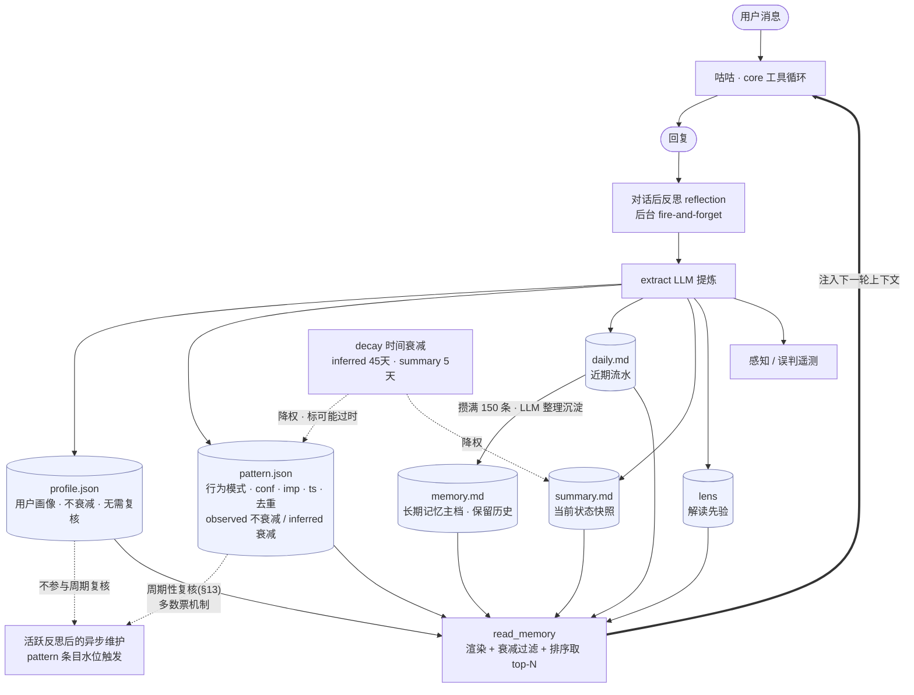
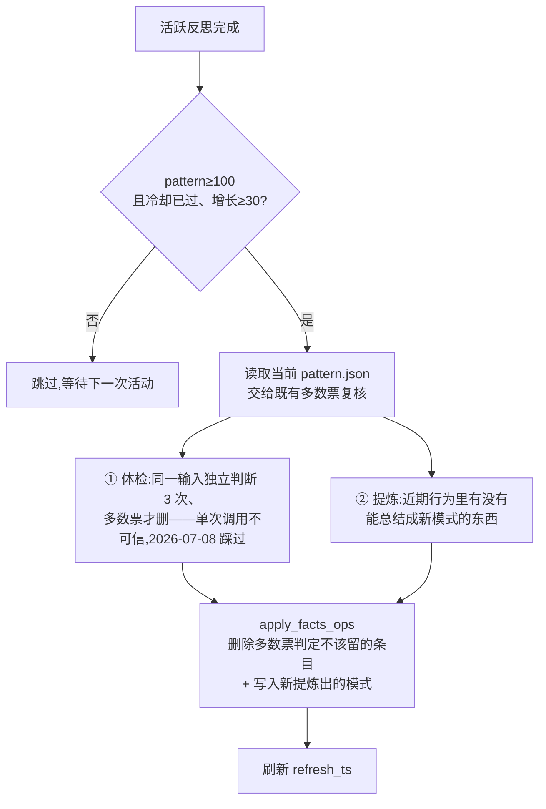

# 记忆系统

> 本文描述 owner 的通用六层记忆和底层读写/压缩能力。IM 群组与平台用户使用独立 namespace，不直接套用 owner 的写入和可见范围；详见 [`PRD-IM-3-群组与成员记忆.md`](../product/PRD/PRD-IM-3-群组与成员记忆.md)。

> 咕咕「伙伴」定位的地基:记忆不是功能,是核心(见 [`00-总览.md`](00-总览.md))。本文讲清这套记忆**有哪几层、怎么写入、怎么衰减、怎么注入**,以及守住的红线。代码在 `backend/agent/memory/` + `backend/agent/decay.py`。

---

## 易读概述

**解决什么问题**：一个能被称为「伙伴」的 AI，最基本的要求是"记得住"——记得用户是谁、最近在忙什么、聊过什么、以及该怎么读懂用户说话的言外之意。如果每轮对话都从零开始，咕咕就只是个没有记忆的问答机器，谈不上陪伴。这套记忆系统就是让咕咕在每一轮对话里，既能"看见"过去积累的信息，又能在对话结束后把这一轮的新信息悄悄记下来，而且记忆会随时间自然"折旧"（旧的、不确定的东西会被淡化，但不会被删除，除非用户主动要求遗忘）。

**大致怎么运作**：
- 咕咕的记忆分成六种不同性质的"抽屉"：**用户画像**（这个人是谁——身份、所在地、稳定喜好，几乎不会变，不需要打折扣）、**行为模式**（这个人做事/做决定的习惯，比如"文件喜欢往哪儿放""建项目喜欢怎么分阶段"，这类会随时间演进，需要置信度和定期回顾）、近期的流水账（这几天都聊了啥）、长期沉淀的记忆（流水账攒多了融合提炼出的长期叙事，项目/事件的来龙去脉主要在这一层）、当下状态快照（用户最近在忙什么），以及"怎么读懂这个用户"的经验规则（比如"这个用户说没事的时候往往是真有事"）。**画像和行为模式都不回答"最近在做什么/做过什么决定"——那是流水账和长期记忆的职责**（见 §2 的具体判据）。
- 每一轮对话开始前，咕咕会把这五个抽屉里当前有效的内容整理好，塞进它的"脑子"（对话上下文）里，这样它才能带着记忆去回复。
- 每一轮对话结束后，后台会安静地做一次"反思"：读一遍刚才聊了什么，从中提炼出新的事实、更新流水账、更新状态快照，必要时还会更新"怎么读懂用户"的经验。这个反思过程是**异步**的，不会拖慢用户等回复的速度，就算反思失败了也不影响这一轮已经给出的回复。
- 记忆不是无限堆积的：流水账攒到一定量会被融合压缩成更精炼的长期记忆；不确定的推断类信息、状态快照会随时间"打折"（置信度降低、标注"可能过时"），但不会被直接删除——这是刻意的设计取舍：**状态会过时，但身份和历史不会**。
- 有一条贯穿全系统的红线："不脑补"——无论是提炼记忆还是压缩记忆，都只整理真实发生、用户明确说过的内容，绝不会让 AI 自己推测出一个新结论然后把它当"事实"记下来。这是为了防止记忆越用越"想当然"，失去可信度。

**不懂代码的读者可以先记住三件事**：① 记忆分六层，各管一摊，不是一锅粥；② 写记忆和读记忆是分开的、异步的，反思失败不会影响当前这句回复；③ 旧信息不会突然消失，只会慢慢"变得不确定"。

---

## 总览图:记忆闭环



**一句话读图**:每轮对话「读」六层记忆注入上下文 → 咕咕回复 → 「写」端后台反思把这轮提炼进 profile/pattern/daily/summary/lens(+感知遥测)→ daily 攒满融合进 memory、衰减件给 summary/inferred-pattern 降权 → 下一轮再「读」。捕捉(写)和注入(读)分离,反思失败不挡回复。profile 只在对话触发式反思里增删,不参与周期性复核(内容几乎不变,没什么可复核的);pattern 两条腿走路——对话触发式反思随手增删 + §13 的按条目水位异步维护做体检。

---

## 专业细节

### 1. 六层记忆总览

`store.read_memory(user_id)` 一次返回六层,注入到每轮对话上下文(`context/builder`):

| 层 | 文件 | 是什么 | 生命周期 |
|---|---|---|---|
| **profile** | `profile.json` | 用户画像——身份/所在地/稳定喜好,几乎不变 | 增量增删改,**不衰减、不参与周期复核** |
| **pattern** | `pattern.json` | 行为/决策模式(结构化,2b),每条带 kind/conf/imp/ts | 增量增删改、衰减、去重、退休、**周期复核(§13)** |
| **daily** | `daily.md` | 本次/近期会话流水(新在上) | 攒到 150 条后沉淀,保留最近 50 条 |
| **memory** | `memory.md` | 长期记忆主档(daily 沉淀整理而来) | 持续保留历史和时间脉络,不因 50 条规则截断 |
| **summary** | `summary.md` | 「用户当下在忙什么/近期重心」快照 | 增量演进 + 时间衰减(半衰期 5 天) |
| **lens** | (lens 存储) | 解读用户的预判先验 | 规则带 conf + 衰减 + 去重 + gated 学习 |

设计意图:**profile=他是谁**,**pattern=他做事/做决定的习惯**,**summary=他现在在忙啥**,**daily/memory=做过聊过的流水→沉淀(项目/事件的具体来龙去脉在这一层)**,**lens=怎么读懂他**。

> 为什么 profile 和 pattern 要拆成两个文件(2026-07-08 定案):最早两者混在一个 `facts.json` 里,靠"是不是关于用户本人"一条规则加一堆例外(项目决策例外、行为规则例外……)来判断,结果模型在主规则和例外之间反复摇摆,同一批数据两次调用删除比例从 40% 跳到 94%。拆开后每个文件只回答一个问题——profile 问"这是不是这个人的稳定属性"，pattern 问"这是不是一条可复用的行为习惯"——不再需要例外清单,判断稳定得多。附带收益:profile 内容天然稳定,不需要衰减/置信度这套机制,`pattern` 才需要;两个文件该不该衰减、该不该周期复核,不用再共用一套逻辑各自将就。

profile 与 pattern **都允许跟 memory 内容重合**(两者是精炼摘要、memory 是完整叙事,同一件事两种详略度不算冗余);但"某个具体项目存了几张参考图"这种纯执行细节不该出现在 profile/pattern 里——那不是重合,是越界记了 memory 该管的事。

**两者都不留**(会被反思/周期复核判定为不该留):
- 某个具体业务/创作项目的执行细节、任务勾选状态、单次创作决策——这些是当下进展,归 summary/daily,沉淀后归 memory
- 一次性的日程/事务提醒("某服务到期了、明天续费"),以及任何**内容本身依赖一个具体日期才成立**的陈述("项目推迟到 8/31 结束")——这类东西天生有保质期,过了那个时间点就失效
- 结构化数据库已经查得到的信息(项目的客户/deadline 就在 `Project` 表里,不用存一份影子副本)
- 推测性且已经过时/被现实推翻的信息、活动本身的信息(不是关于用户的)

> 核实说明:`store.py` 里还有一个 `stance.json`(相处姿态,读作上轮反思判的 `perception.intent`,给「相处方式系统」的行为模块用新鲜度闸)。它不属于这六层记忆本体、不参与 `read_memory` 的返回结构,是另一套系统(companion/相处方式)的输入,故本文不展开,详见 `10-感知系统.md`。

---

### 2. profile.json —— 用户画像(`memory/store.py`)

**定位**:只回答"这个人是谁"——身份/职业/所在地、稳定喜好、长期在意的事。跟具体项目、具体时间点都无关,内容几乎不随时间变化。

**一个实用闸门**:凡是句子里明显带着`最近 / 刚 / 这阵子 / 目前 / 本周 / 这几天`这类阶段性时间色彩,默认就**不是 profile**,应先进 `daily.md` / `memory.md`;只有当它能再往上抽象成稳定画像时,才允许改写后进入 profile。比如:
- `用户最近刚换了新空调` → 这是近期事件,该进 daily/memory,不进 profile
- `用户很在意居住环境舒适度` → 这是稳定画像,可以进 profile

**schema 刻意简单**:`{id, text, ts}`——**没有 kind/conf,不衰减**。因为内容本身就该是稳定的、高置信的,给它套一套"可能是推断、可能会打折"的机制没有意义;真正会演进/需要置信度的东西,该进 pattern 而不是 profile。`ts` 只用来审计"什么时候记的",不参与任何衰减计算。

**注入**:profile 预期规模很小(几条到十几条),**不做相关性挑选,全部注入**——不需要 pattern 那套"超上限按相关性挑"的复杂度。

**周期复核**:profile 不参与 §13 的周期性复核——内容本来就不该变,没什么好体检的。只有对话触发式反思(§7)发现明确矛盾时才会增删。

**一次性迁移债(2026-07-09 已处理)**:profile.json 是全新文件,2026-07-08 拆分时没有旧数据自动搬进来——那之前记的"住哪/是干嘛的"这类身份信息,当时跟着整份旧 `facts.json` 一起进了 `pattern.json`,没被区分出来。`scripts/refresh_memory.py --split-profile` 把 pattern.json 里其实该算画像的条目挑出来搬过去(同样用 §13 那套多数票机制),见该脚本文档注释。

**和 memory.md 的分工**:profile 放的是**稳定结论**,memory 放的是**事件背景/阶段脉络**。所以像`用户最近刚换了新空调`、`最近一阵子在集中处理引用消息识别问题`这种带明显阶段性的描述,即使"是关于用户的",也应该优先进入 `memory.md`,而不是 profile。

---

### 3. pattern.json —— 行为/决策模式(`memory/store.py`)

**定位**:记录用户做事/做决定的**可复用习惯**,不是某次具体决定的内容。判据是"抽象测试":**去掉具体项目名/具体数字/具体日期后,这句话还剩不剩一个能套到其他情境的通用行为模式?** 剩就该记("对 agents 给的方案持审慎态度,要求核实事实"),不剩就不该记("决定咕咕主代码采用 Apache 2.0 协议"是一次具体决策的结果,不是模式,该在 memory/项目文档里)。

也包括少数**每轮都该硬性生效、不能靠"读一段叙事再理解"来生效**的协作规则(如"回复要简洁、别调工具")——memory.md 里可能也有更详细的描述,但 pattern 要留一份精简版保证每轮都在场,不依赖向量检索是否命中。

每条:`{id, text, kind, conf, imp, ts}`

- **kind**:`observed`(用户明说/可直接观察,**不衰减**) vs `inferred`(推断,**置信半衰期 45 天**衰减,`FACTS_INFERRED_HALF_LIFE`)。
- **conf** 置信度、**imp** 重要度、**ts** 写入时间戳。
- **effective**(`_fact_eff`)= `conf × 时间衰减权重`。observed 衰减权重恒 1。

**去重**(`_fact_similar`):两条算「同一条」的判据——归一化相等 / 较短(≥6)是较长的子串 / 字符 bigram Jaccard ≥ 0.7。增量写入时合并,避免堆叠重复。阈值取高(0.7)是刻意保守——短中文条目里「喜欢猫」「喜欢狗」bigram≈0.6,低阈值会把不同条目误并成一条丢信息;宁可留近似重复,绝不误并。维护复核时优先合并近义条目,保留 `observed`/高置信度主条目,不把高价值内容当重复删除。

**注入渲染**(`render_facts(patterns, query, query_vec, vec_map)`):退休 effective 过低的 → 低置信 inferred 标注「不太确定」。选取分两种:
- pattern **未超 `FACTS_INJECT_MAX`(100)** 或没传 query → 全部按 `effective × importance` 排序注入(多数用户全注入)。
- **超上限且有当前消息 query → 相关性优先挑**:① 重要度保底(前 `FACTS_FLOOR_K`=6,核心档案不被挤掉)→ ② 按对 query 的**相关性**填充 → ③ 仍没满用重要度补齐(不浪费预算)。**relevance > importance,importance 兜底**。query 从主路径 `req.message` 经 `read_memory` 穿入。
  - **相关性打分 = 向量语义 或 词法兜底**:embedding 启用且该条有当前模型的向量 → 用 **cosine 语义**(抓「会议」↔「周会」这类同义);否则退回**字 bigram 词法**(共享词才命中)。向量是可选加固,关了/没同步到就是纯词法,零回归。见 §12 向量检索。

**增删改**(`apply_facts_ops`):反思产出 add/remove 后对列表应用一轮;命中已有相似条会「印证」(升 conf、刷新 ts、用户亲述可把 kind 升级成 observed、采更具体的文本);旧 facts.md 首次读取自动迁移成 pattern.json(`_migrate_md`,一律当 observed/中置信,避免被衰减淘汰;迁移后旧 md 文件保留不删,但不再写)。

**周期复核**:pattern 会参与 §13 的按活动量触发的维护——它是会演进的东西(过时的习惯该淡出、新习惯该被总结),不像 profile 那样几乎不变。维护输出以 `merge` 优先,只有明确过时/错误/越界的条目才进入 `remove`;高置信度条目只能作为合并保留项。

---

### 4. daily / memory / 压缩(`memory/compress.py`)

- **daily.md**:每轮反思 append 一句本轮流水(新在上)。
- **压缩触发**:daily 攒到 `DAILY_COMPACT_AT`(150) 条 → 取最老的 100 条,连同已有 `memory.md` 交 LLM **整理**(合并重复、修正矛盾、保留有价值的历史和时间脉络,不因篇幅直接删除) → 写回 memory.md,压缩成功后 daily 只留最近 `DAILY_KEEP_RECENT`(50) 条。`DAILY_HARD_CAP`(175) 只用于压缩失败保护,不能静默丢弃历史。
- ⚠️ **daily 没有 pattern/memory 那套"超量按相关性挑"的机制,是整份原样注入**——`DAILY_KEEP_RECENT` 越大,每轮对话注入的 token 越多,是持续性成本、不是一次性的(2026-07-09 从 30 调到 50 时确认过这个取舍)。
- 由 `reflection` 写完 daily **顺带触发**,失败不影响主流程。
- **防误删兜底**:原本有长期记忆、模型却返回空或明显丢失历史 → 不覆盖、也不裁 daily(避免丢数据)。
- **memory.md 注入与存储分离**:memory.md 允许持续增长,未超 `MEMORY_INJECT_CHARS`(1500 字)时整篇注入;超出后,embedding 启用则切块按 cosine 挑相关块并保留原文顺序;无向量或覆盖不足时使用词法/预算兜底,不把长期主档当成只能保留 50 条的近期窗口。见 §12。

**memory.md 的边界**:它不是第二份 profile/pattern 列表,而是长期叙事层。允许跟 profile/pattern 有少量主题重合,但表达重点应该是**事件经过 / 时间脉络 / 背景上下文**,而不是把已经结构化成结论的画像/模式原句再抄一遍。

---

### 5. summary —— 当前状态快照 + 时间衰减(`memory/store.py` + `decay.py`)

- 一句「用户当下在忙什么/近期重心」,反思里**基于旧快照增量演进**(非空且变了才覆盖,防把快照清空/瞎改)。
- 带更新时间戳 `summary_ts`。注入时按 `decay.weight()` 半衰期衰减(`SUMMARY_HALF_LIFE` = 5 天:5 天权重 0.5、10 天 0.25);越久没更新越标「可能过时」。状态类信息几天就该打折。

---

### 6. lens —— 解读先验(第 4 类记忆,`memory/lens.py`)

- 不是「记住事实」,而是**记住「怎么读懂这个用户」的预判**:规范形如「触发语」→ 含义(如用户说「没事」其实是 X)。
- 每条规则带 confidence + **慢半衰期**衰减 + 去重(触发语是稳定判别键,退化时整句相似匹配)。
- **gated 学习**:不是每次都写,满足门槛才学(避免噪声)。注入时只出 effective ≥ 退休阈的规则、按置信选话术;空则不注入省 token。

---

### 7. 捕捉:对话后反思(`memory/reflection.py`)

每轮(`_worth_reflecting` 过滤掉不值得反思的轻量轮次后)后台 `reflect`:

1. `_extract` 用 LLM 从「本轮 user/assistant + 已有 profile/pattern + 已有 summary」提炼 → `{profile, pattern, daily, summary, perception}`。
2. **profile/pattern**:增量并入各自的 `apply_*_ops`,旧 prompt 回显整份则当 inferred 灰度兼容。
3. **summary**:非空且变了才覆盖。
4. **daily**:append + 触发压缩检查。
5. **perception**:`{intent / ambiguity / emotion / emo_strength}` → 感知遥测(见 [`10-感知系统.md`](10-感知系统.md))。
6. **误判捕获**(`_misperc_llm`/`_misperc_regex`):检测用户在纠正咕咕的误读 → 记 correction,区分「感知误读」vs「数据/执行错」。

reflection 是 fire-and-forget,任何失败不影响主回复。

---

### 8. 衰减共用件(`decay.py`)

置信/新鲜度随时间按半衰期衰减,**只降权 + 标「可能过时」,不删**:
- summary 半衰期 5 天;inferred pattern 45 天;lens 慢半衰期;observed pattern / profile / memory.md 不衰减。
- 无时间戳 → 当新鲜(1.0,兼容旧数据,下次更新补 ts)。
- 设计哲学:状态会过时(打折),身份和历史不会(保留)。
- 权重是**内部数**,调用方据它选离散话术(如「不太确定」「可能过时」),不把数字本身喂给 LLM。

---

### 9. 设计红线

- **0 脑补**(记忆边界):反思提取、压缩融合的 prompt 都钉死「不评判、不推测」——只整理真实发生/明说的,绝不推断出新结论。否则记忆会越积越「想当然」。
- **隐私脱敏**:决策轨迹/感知遥测只留结构不留用户内容(数据最小化,见 [`../security/privacy.md`](../security/privacy.md))。
- **防误删兜底**:压缩/summary 写入遇模型返回空 → 不覆盖,宁可不更新也不丢已有记忆。

---

### 10. 文件地图

```
backend/agent/
├── memory/
│   ├── store.py        # 六层读写 + profile.json/pattern.json 结构/衰减/去重/退休/渲染 + 向量缓存/检索 + stance.json
│   ├── reflection.py   # 对话后反思:提炼 profile/pattern/daily/summary/perception + 误判捕获 + 增量嵌 pattern 向量
│   ├── periodic.py     # 活跃反思后的低频 pattern 维护调度(§13):水位、7 天冷却、异步复核
│   ├── compress.py     # daily 攒够 → 融合进 memory.md + 重嵌 memory 块向量
│   ├── embedding.py    # 向量原语:embed()/cosine()/model_tag()/is_enabled()(独立 pin,见 §12)
│   ├── lens.py         # 解读先验(第4类):规则学习/衰减/注入
│   └── _llm.py         # 记忆用的 complete_json(结构化输出)
│   # 向量缓存(可重建):{uid}/.agent/pattern_vec.json、memory_vec.json(与文本分开存,带 model tag)
├── decay.py             # 时间衰减共用件(summary/lens/pattern 复用,顶层模块,不在 memory/ 目录下)
└── prompts/             # reflection.md / compress.md(可热编辑 / Admin 在线改)
```

> 核实说明:`decay.py` 实际路径是 `backend/agent/decay.py`(顶层,与 `memory/` 平级),不在 `agent/memory/` 目录内,已在上面路径中标注清楚,避免误找。

### 10.1 IM 记忆适配边界

IM 记忆复用本文的底层原语，但不把 `owner_user_id` 直接当作当前发言人的记忆身份。实现时新增的职责应保持如下边界：

| 模块 | 负责 | 不负责 |
|---|---|---|
| `memory/scopes.py` | 构造和校验 `MemoryScope`、生成隔离 key | 不读写文件、不决定上下文权限 |
| `memory/scoped_store.py` | 按 scope 读写 IM 的 profile/summary/daily/memory | 不调用模型、不做角色判断 |
| `memory/im_reflection.py` | group/member 提取、异步写入和 scope 内压缩调度 | 不写 owner namespace、不决定 Gateway 行为 |
| `agent/im/context_policy.py` | owner/member/unknown 的可见范围 | 不执行记忆写入 |
| `agent/im/context_loader.py` | 只读装配当前角色允许的记忆 | 不触发反思和压缩 |

当前这些 IM 专用适配器仍未实现；在实现前，`memory/reflection.py` 和 `memory/compress.py` 只服务 owner，不能直接传入群聊 scope。

---

### 11. 优化方向(待评估)

> **北极星先行**:记忆系统的长期演进方向已在 [`10-感知系统.md`](10-感知系统.md) **§11「Person Model / Relationship 闭环」**定稿——它直接决定本系统的未来形态:① **Hypothesis 五步写协议**(假设→证据→置信→衰减→可推翻)将成为**所有记忆写入的统一协议**(现有 observed/inferred + 半衰期就是它的雏形,要做到全层统一、显式);② **lens 将升级成 Person Model**(观察为真、特质派生,学的内容从「解读触发语」拓宽到人物各面);③ Relationship 层从 daily/memory 蒸馏(最远,先如实存住原材料)。下面各条属于北极星之内或与之兼容的战术优化。

1. ✅ **检索:相关性优先 + 重要度保底,词法已升级到向量**(均已实现,见 §3 + §12):pattern 超上限时按相关性挑、重要度前 6 保底 + 补齐(profile 不做检索,全量注入,见 §2);相关性从字 bigram 词法**升级成 embedding 向量语义**(补上「会议」↔「周会」这类同义召回),memory.md 也做了块级向量检索。**为什么是必经而非可选**:北极星的 Person Model 会把 observation 攒到几百条,「每轮注入哪些」的检索/预算问题比「怎么写入」更难——`render_facts` 这套「相关性+保底+预算」就是未来检索系统的雏形,向量召回是它的地基。**剩余**:向量目前默认关、收益要 pattern>100 / memory>1500 字才兑现(小数据期潜伏);相处镜片的记忆引用、检索排序是同一层的后续消费者。
2. **记忆驱动主动**(护城河「执行闭环」的真正落点):summary + 日历 deadline → 主动早报/提醒;久未推进的意图适时提醒。把「记忆 → 活动提醒工具」打通,让记忆从「知道」变「替你盯着」。(与主动触达草案协同,见感知系统 §8.2「另案」)
3. **记忆可见可编辑**:用户能看到/删/改咕咕记住的东西(信任 + 准确双赢),把禁忌做成用户可设的硬约束。(= 北极星 11.3「Observation 可审计」的用户侧入口)
4. (次要)memory.md 周期再巩固(它本身无去重/退休);用 usage 反哺重要度(被引用的提权、长期没用到的加速衰减)。
5. **用户知识图谱(2026-07-09 讨论、暂缓)**:讨论过要不要给用户建实体/关系图谱。结论是暂缓,先把 §13 的②提炼(从近期行为总结新模式)和常驻自动触发做出来——图谱要解决的"事实之间有什么关系"这个问题,现在的量级(per-user 几十~百来条 pattern)靠 memory.md 叙事 + 向量检索基本够用,图遍历的优势体现不出来,项目也没有图数据库这类基础设施。真要做的话,"每周批量 + 多数票"这套已验证的稳定性机制可以直接套用(图谱的实体/关系判断比 profile/pattern 二选一多好几个维度,单次调用的判断只会更不稳定,不能省投票这一步);但优先级上,§13②比图谱更值得先做——同样是"理解用户随时间变化",②提炼不需要新增任何存储结构。

---

### 12. 向量语义检索(embedding,`memory/embedding.py` + `store.py`)

记忆检索的相关性打分从字 bigram 词法**升级到向量语义**——一层**共享 embedding 基建**(记忆检索是第一个消费者,相处镜片的记忆引用、检索排序是后续)。**默认关闭,全链路退回词法/整篇,零副作用。**

- **模型独立 pin、与聊天解耦**:`EmbeddingSettings`(`app/core/config.py`)独立配置段,**不进 `pick_model` 路由**——聊天模型轮换碰不到向量;换 embedding 模型才需重建。走 OpenAI 兼容 `/embeddings`,key 为空不发 Authorization 头(自托管 Ollama 无需鉴权,如 `qwen3-embedding:0.6b`/1024 维)。admin「Agent 配置·行为」有配置表单 + 连通测试 + 重建按钮。
- **规模**:per-user 几十~几百条,Python 暴力 cosine,**不需要向量数据库**。向量与文本分开存(`pattern_vec.json`/`memory_vec.json`,profile 不需要检索、不建向量),**文本是主数据、向量是可重建缓存**,每条带 `model tag`。
- **自动增量嵌**(不是定时任务):
  - **pattern**:反思写完 pattern(有增删)时 `sync_fact_vecs`——只嵌**没当前模型向量**的条(含历史积压一并补齐),已有的跳过。
  - **memory.md**:compress 每次**重写全文**后 `sync_memory_vecs` 重嵌变动的块(块用文本哈希当 key,旧块 GC、新块补 = 自动重嵌)。
  - **query**:`read_memory` 在 pattern>100 或 memory>1500 字时 embed 当前问句**一次**、pattern/memory 共用(热路径省调用)。
- **换模型语义**:只认与**当前 tag** 匹配的向量,换模型后旧向量忽略 → pattern 退回词法、memory 退回整篇,直到重建。**重建按钮**(`rebuild_all_vecs`)`force` 重算全体用户的 pattern + memory 向量(后台跑 + 进度轮询,期间检索自动退回)。
- **时机**:收益要 pattern>100 / memory>1500 字才兑现(小数据期潜伏),所以现在多为 no-op;是 Person Model 检索基建的地基,先备好。设计见 [`参考/咕咕改进方案-MaiBot借鉴.md`](参考/咕咕改进方案-MaiBot借鉴.md) 改进一。

---

### 13. 周期性反思——按条目水位的低频自动维护

**要解决的问题**:现有反思(§7)只在**对话触发时**运行,一次只看得到"这一轮聊了什么",天然有两个盲区:① pattern 里混入不该留的内容后,除非某轮对话恰好戳中矛盾,否则永远不会被清理(2026-07-08 发现的教训:一条"项目推迟到 8/31"的过时条目,项目后来被拆分改名,但没有哪轮对话直白地推翻过它,于是一直留着);② 跨越多次对话才能看出来的行为模式(创作方向的偏好、卡点规律),单轮反思看不到全局,只能等某次对话恰好聊到才被动记一笔,不会主动去总结。

**方案**:在 §7 的对话触发式反思之外,加一个**按条目数触发**的维护入口,只针对 `pattern.json`(profile 不参与,见 §2)——同一套"提炼→写回"骨架,只是触发源和输入不同,不是新系统。只在活跃反思完成后检查，不扫描沉默用户；达到 100 条且距上次维护至少 7 天，并且比上次记录的水位至少增长 30 条时，才异步启动一次复核。维护水位写入用户私有 `.agent/pattern_maintenance.json`，失败不推进水位，避免失败后被冷却逻辑吞掉。**两件事都是 pattern.json 的维护**:① 体检(该淡出的旧模式清掉、重复模式合并)② 提炼(近期行为里有没有能总结成新模式的东西),都通过 pattern 已有的增删管线写回。



**关键设计点**:
- **多数票机制是必须的,不是可选加固**:同一份 pattern、同一份 prompt,单次调用的删除比例在实测里从 40% 跳到 94%,包括本该保护的条目被误删——不能信单次结果,3 次独立判断取多数票能显著收窄这个不确定性。
- **体检的判据是 §3 的"抽象测试"**(去掉具体项目名/数字/日期还剩不剩通用模式),不是靠列举穷尽的排除清单。
- **不需要给 summary.md 加时间戳/新区块**:早先设想过在 summary.md 里另开一个"长期模式"叙事区块、配一个更长半衰期的时间戳——但 pattern.json 本身就是结构化、带 conf/衰减的存储,「提炼长期模式」直接落进 pattern 的增删管线即可,没必要在 summary.md 里再存一份、还要维护第二套时间戳/衰减参数。
- **不是 ScheduledTask**:语义是"后台发现该刷新了",不是"用户要求某时刻发生某事",不走投递渠道,静默运行,失败不影响任何对话(与 §7 的反思同一哲学:锦上添花,不能拖累主流程)。

**现状(2026-08-04):体检 + 一次性迁移债 + 活跃后的自动触发已实现；②提炼仍沿用后续扩展计划**——

| 部分 | 状态 | 在哪 |
|---|---|---|
| ① 体检/合并(维护 pattern) | ✅ 已实现 | `scripts/refresh_memory.py` 的 `--patterns`(兼容 `--facts`,合并优先、3 次投票) |
| 一次性迁移债:身份内容搬去 profile | ✅ 已实现(2026-07-09 补的,不在最初设计里) | 同文件 `--split-profile`(`_split_profile`,同样 3 次投票) |
| 清遗留文件(facts.json/facts.md/facts_vec.json) | ✅ 已实现 | 同文件 `--cleanup-legacy`(纯文件存在性判断,不涉及 LLM,不需要投票) |
| 管理员一键触发(预览→确认执行,三件事一次做完) | ✅ 已实现 | Admin「Agent 配置 → 行为 → 记忆维护」,`app/api/v1/config.py` 的 `/memory-cleanup/*` |
| ② 提炼(从近期行为总结新模式) | ❌ 未实现 | —— |
| 按条目水位自动触发(活跃后异步维护,不扫描沉默用户) | ✅ 已实现 | `agent/memory/periodic.py`；100 条起步、7 天冷却、每增长 30 条重试 |

也就是说,命令行脚本和 Admin 按钮仍可人工维护；日常对话则在活跃反思完成后按水位异步触发同一套复核逻辑。自动任务保留引用并带用户级锁，失败不影响对话，也不会推进维护水位。
- **pattern 复核逻辑收编进 `agent/memory/`**(而不是留在一次性脚本里),因为它从"迁移债清理"变成了常驻功能;手动触发/调试仍可通过 `scripts/refresh_memory.py --facts` 调用同一份逻辑,不重复维护两份 prompt。
