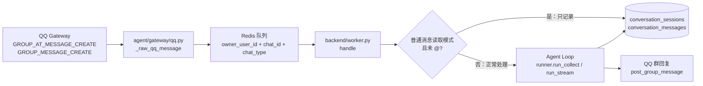

# 群聊消息架构

> **状态**：✅ QQ 群聊已接入“普通消息读取”模式（2026-08-03）
>
> 本文记录群聊消息从平台网关进入 Agent Loop 的完整链路。重点是区分两种行为：**读取消息作为上下文**与**触发咕咕回复**不是同一件事。

## 一、易读概述

### 1.1 当前能力

QQ 群聊目前有三个相关开关：

| 开关 | 作用 |
|---|---|
| `group_chat_enabled` | 是否接收并处理该 bot 的群聊消息 |
| `group_requires_at` | 普通群消息是否需要 @ 咕咕才进入正常回复链路 |
| `group_read_enabled` | 是否保存未 @ 咕咕的普通群消息，供后续 @ 时读取 |

推荐配置是：开启 `group_chat_enabled` 和 `group_read_enabled`，保持 `group_requires_at` 开启。

这时行为如下：

```text
未 @ 咕咕的群消息
  → 保存到该群的会话
  → 不调用模型
  → 不回复

@ 咕咕的群消息
  → 读取该群近期上下文
  → 调用 Agent Loop
  → 回复到原群
```

普通消息读取不会按发言人创建会话，而是按 `group_openid` 共享群会话。这样咕咕在被 @ 时能看到最近的群聊上下文，而不是只看到最后一个人的私聊历史。

### 1.2 重要边界

- 普通消息不会消耗模型调用和回复配额。
- 普通消息会写入数据库，每个群会话最多保留最近 50 条消息记录。
- Agent Loop 读取上下文时只取最近 40 条，并按约 3000 token 再裁剪。
- Redis 中的群会话指针 12 小时过期，但这只影响“下次使用哪条会话”，不会自动删除数据库历史。
- QQ 平台必须实际推送 `GROUP_MESSAGE_CREATE`，并且 bot 后台具备对应群消息权限；关闭“只响应 @”不等于一定能绕过平台权限限制。

## 二、架构链路



### 2.1 网关层：接收与筛选

实现：`backend/agent/gateway/qq.py`

raw WebSocket 收到以下事件：

- `GROUP_AT_MESSAGE_CREATE`：消息中 @ 了机器人。
- `GROUP_MESSAGE_CREATE`：普通群消息。

`_handle_raw_qq_message()` 每次处理群消息都会读取 `user_bots` 的三个开关，不依赖启动时环境变量缓存，因此修改设置后不需要重启 QQ 网关进程。

网关层负责：

1. 判断 bot 是否开启群聊。
2. 根据 `group_requires_at` 和 `group_read_enabled` 决定是否丢弃普通事件。
3. 解析群 ID、发言人 ID、文本、附件、引用消息。
4. 写入统一队列 payload。

网关层不负责调用模型，也不负责决定普通消息是否落库；落库与静默分流由 worker 处理。

### 2.2 队列 payload

群消息进入队列后使用统一的 Agent 请求结构，关键字段如下：

```json
{
  "platform": "qqbot",
  "owner_user_id": "咕咕用户 UUID",
  "channel_id": "user_bots.id",
  "platform_user_id": "member_openid",
  "chat_id": "group_openid",
  "chat_type": "group",
  "message_id": "QQ 消息 ID",
  "text": "群消息正文",
  "quoted_text": null,
  "attachments": [],
  "group_read_enabled": true,
  "group_mentioned": false,
  "trace_id": "链路 trace"
}
```

两个 ID 的职责不能混用：

| 字段 | 含义 | 用途 |
|---|---|---|
| `chat_id` | QQ 群 `group_openid` | 决定回复发到哪个群、决定群会话归属 |
| `platform_user_id` | 群成员 `member_openid` | 标识谁发言、运行状态和取消状态的用户维度 |
| `owner_user_id` | 自带 bot 的咕咕用户 | 数据归属和 Agent 用户身份 |

## 三、数据结构

### 3.1 UserBot 配置

表：`user_bots`

```text
group_chat_enabled : Boolean，默认 false
group_requires_at  : Boolean，默认 true
group_read_enabled : Boolean，默认 false
```

API：`PUT /api/v1/user-bots/{bot_id}`

前端入口：`个人设置 → 接入咕咕 → QQ`

其中 `group_read_enabled` 是“只读取普通消息”的开关，不代表回复开关。它开启后，未 @ 消息进入静默记录分支；@ 消息仍走正常回复。

### 3.2 ConversationSession

表：`conversation_sessions`

群聊复用现有会话表：

```text
id         : 会话 ID
user_id    : owner_user_id 对应的咕咕用户
title      : 首条消息截断后的标题，通常为「群聊记录」或首句
source     : qqbot
created_at : 创建时间
updated_at : 最近写入时间
```

worker 使用 Redis 保存“平台 + 会话键 → session_id”：

```text
imsession:qqbot:<group_openid>
```

群聊使用 `group_openid` 作为会话键；QQ 私聊仍使用发言人的 `platform_user_id`。Redis 指针 TTL 为 12 小时。

### 3.3 ConversationMessage

表：`conversation_messages`

普通群消息只新增一条：

```text
session_id  : 群会话 ID
role        : user
content     : 群消息正文
quoted_text : 引用文本（有引用时）
created_at  : 入库时间
```

普通消息不会创建 assistant 回复，也不会创建 `AgentUsage`。带附件时仍沿用 QQ 网关的附件暂存和引用结构。

## 四、Agent Loop 中的位置

### 4.1 worker 分流点

入口：`backend/worker.py:handle()`

处理顺序简化如下：

```text
resolve owner_user_id
  ↓
按 chat_type 计算 session_key
  - group → chat_id
  - c2c   → platform_user_id
  ↓
读取/创建 session_id
  ↓
组装 AgentRequest
  ↓
QQ 群普通消息 + group_read_enabled + 未 @ ?
  ├─ 是：record_passive_im_message() → 结束
  └─ 否：进入正常 Agent Loop
```

静默记录函数：`backend/agent/runner.py:record_passive_im_message()`

它只做数据库写入，不执行：

- 路由判断。
- 模型调用。
- 工具调用。
- 精力扣除。
- QQ 回复。

### 4.2 被 @ 后的正常链路

被 @ 的消息会继续进入 `run_collect()` 或平台对应的流式入口：

```text
AgentRequest
  → 读取 session 最近消息
  → select_history()
  → 历史消息 + 当前消息进入模型上下文
  → Agent Loop 决策 / 工具调用
  → 生成回复
  → _send() 按 chat_type 调用 qq.send_group()
```

历史读取使用两层限制：

- SQL 查询最多最近 `HISTORY_MAX_MSGS = 40` 条。
- `select_history()` 默认按 `HISTORY_TOKEN_BUDGET = 3000` 裁剪。

因此“数据库里保存了多少”和“本轮模型看到多少”是两个不同问题：数据库当前可无限增长，但单轮上下文不会无限增长。

## 五、开关行为矩阵

| 群聊 | 只响应 @ | 读取普通消息 | 未 @ 普通消息 | @ 咕咕消息 |
|---|---:|---:|---|---|
| 关 | 任意 | 任意 | 丢弃 | 丢弃 |
| 开 | 开 | 关 | 丢弃 | 正常回复 |
| 开 | 开 | 开 | 只记录 | 读取上下文并回复 |
| 开 | 关 | 关 | 正常进入回复链路 | 正常回复 |
| 开 | 关 | 开 | 只记录模式优先 | 读取上下文并回复 |

最后一行表示：`group_read_enabled` 开启时，未 @ 消息优先按“只记录”处理；它不会因为 `group_requires_at` 被关闭而突然触发模型。

## 六、当前限制与后续工作

### 6.1 群聊身份与工具权限（未做）

当前 QQ 群消息虽然能识别 `platform_user_id`，但所有进入 worker 的消息仍以 bot 绑定用户作为 Agent 用户身份，尚未建立“绑定人 / 其他群成员”的工具权限隔离。后续应增加：

```text
UserBot
├── owner_user_id              咕咕账户所有者
├── owner_platform_user_id     绑定 QQ 用户 ID
└── non_owner_allowed_tools    非绑定成员可用工具白名单
```

权限角色建议固定为：

| 角色 | 判定 | 权限 |
|---|---|---|
| `owner` | `platform_user_id == owner_platform_user_id` | 可使用全部工具，仍遵守普通确认门 |
| `non_owner` | 能识别 QQ 用户，但不是绑定人 | 只能聊天和使用白名单工具 |
| `identity_error` | 缺少或无法校验平台用户 ID | 只能聊天，拒绝所有工具 |

第一版的非绑定成员工具策略：

- **网页搜索固定开放**，作为唯一默认的外部只读工具。
- **当前群聊上下文搜索由绑定用户在设置中选择是否开放**。
- 项目查询、文件查询、日历查询、记忆读取和所有 CUD 工具默认 `owner_only`。
- 其他注册过咕咕的用户不会因为注册过账号，就自动获得当前 bot 的内容权限。

工具权限必须在统一 dispatch 层硬校验，不能只靠 prompt 隐藏工具：

```text
模型请求工具
  → 读取 AccessContext（owner / non_owner / identity_error）
  → 检查工具 access + bot 白名单
  → 允许执行或返回无权限
```

工具可以标记为：

```text
chat_safe   可被白名单开放
owner_only  仅绑定人
destructive 需要额外确认门
```

推荐的设置入口是：`个人设置 → 接入咕咕 → QQ → 群聊工具权限`。第一版可按 bot 全局配置；以后如需不同群不同权限，再增加 `user_bot_id + group_openid` 的群级覆盖表。

以上身份绑定、工具白名单和群级权限均为**未做**，当前已实现的“普通消息读取”不能视为已经完成权限隔离。

### 6.2 数据保留现状

当前已经有群级条数上限，但个人化长期记忆还未实现：

- 每个 QQ 群会话的 `conversation_messages` 最多保留最近 50 条。
- 普通消息落库后会清理旧记录；正常 @ 回复完成后也会再次清理，回复和工具记录不会绕过上限。
- 该上限是数据库保留上限，不改变 Agent Loop 的上下文裁剪规则。
- 当前没有按天数删除；用户删除会话或删除用户时，数据库级联会删除对应消息。

50 条上限解决的是短期群上下文的体积问题。群组/member 长期记忆计划为 **未做**，但目标边界已经确定：复用现有 memory 组件，不复用 owner 的记忆空间和完整个人记忆策略。

逻辑目录按平台和 Bot 隔离：

```text
.agent/im/
├── qq/
│   ├── platform-users/{platform_user_id}/
│   │   ├── profile.md
│   │   ├── pattern.md
│   │   └── summary.md
│   └── groups/{group_id}/
│       ├── profile.md
│       ├── daily.md
│       └── memory.md
├── feishu/
└── weixin/
```

实际作用域必须包含 `platform + bot_id`，不能只使用裸的用户 ID 或群 ID：

```text
platform + bot_id + platform_user_id
platform + bot_id + group_id
```

平台用户记忆只保留轻量的个人资料、表达模式和阶段性摘要；群组记忆沿用现有 `profile.md`、`daily.md`、`memory.md` 结构，记录群资料、群性质、成员/角色概览、群规约定、近期群聊和压缩后的稳定群知识。MemberLoop 的上下文读取顺序为：当前群 `daily.md` → 当前群 `memory.md` → 当前群 `profile.md` → 当前发言人的平台用户记忆 → 最近 50 条群消息。

约束：

- 成员个人资料不能自动写入群组记忆。
- 群内公开信息不能反向写入 owner memory。
- 成员记忆不能跨群读取，owner 也不默认读取每个成员的完整个人记忆。
- 提取、压缩和摘要应异步执行，不能阻塞当前群回复。
- 后续必须补齐成员记忆删除、过期、群解散清理和可见范围策略。

### 6.3 平台权限

`GROUP_MESSAGE_CREATE` 是否能收到，仍受 QQ 机器人后台的群消息权限和平台策略限制。应用侧开关只决定收到事件后的处理方式，不能替代平台授权。

### 6.4 隐私边界

群聊普通消息可能包含不希望被机器人长期保存的内容。启用“读取普通群消息”前，产品上应明确提示：

- 消息会保存到 bot 所属咕咕用户的群会话。
- 后续 @ 咕咕时，近期群消息可能进入模型上下文。
- 机器人无法替群成员逐条确认保存意愿，群管理员和使用者应遵守平台及群内规则。

## 七、相关代码

| 模块 | 职责 |
|---|---|
| `backend/agent/gateway/qq.py` | QQ raw WebSocket、事件筛选、payload 构造 |
| `backend/worker.py` | owner 解析、群会话键、静默/正常分流、回复路由 |
| `backend/agent/runner.py` | 静默消息落库、正常 Agent Loop 入口 |
| `backend/app/models/__init__.py` | `UserBot`、`ConversationSession`、`ConversationMessage` 模型 |
| `backend/app/api/v1/user_bots.py` | 群聊开关查询和更新 API |
| `frontend/src/components/common/ProfileModal/ProfileImPane.vue` | QQ 群聊设置 UI |
| `backend/tests/test_qq_raw_ws.py` | QQ 群消息事件与开关回归测试 |
| `docs/agent/20-IM接入架构.md` | 三平台 IM 总体架构与平台差异 |
### 模型上下文中的发言人身份

群会话历史中的每条用户消息都必须保留并携带 `platform_user_id`，同时保留
`platform_user_name` 作为称呼字段。进入模型上下文时，IM 历史格式化层会将二者
附加到对应用户消息前，不能只拼接 `role` 和 `content`，否则模型无法区分不同群成员。

数据库原文和网页展示不拼接这段元数据；它只用于 IM 的内部模型上下文和当前群上下文
工具结果。昵称不能参与身份判断，缺失昵称时使用中性称呼；身份判断只依赖平台用户 ID。
