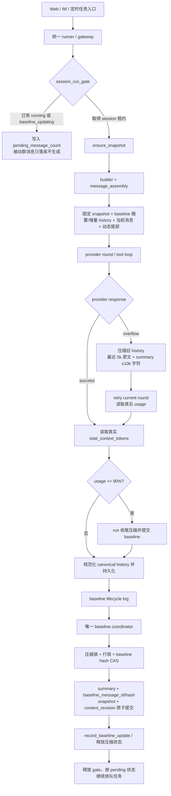
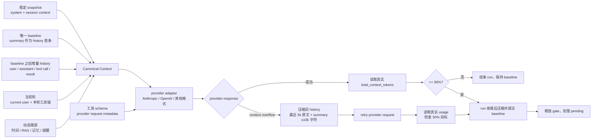

# 咕咕上下文架构与扩展指南

> 状态：现行架构说明（2026-08-24）
>
> 适用范围：Agent 的上下文组装、历史预算、会话串行化、baseline 压缩、RAG/记忆注入和 provider 适配。
> 本文是实现指南，不替代具体产品 PRD；历史文档中出现的 checkpoint、独立 history budget 或入口自维护压缩比例均不再是现行语义。

## 1. 设计目标

上下文生命周期只有一条主线：

```text
唯一 baseline → 追加新历史 → provider request
       ↑                         ↓
       └── overflow/真实 usage ≥90% → 压缩 history ──┘
```

必须同时满足：

- 所有入口（Web、QQ、群聊、私聊、定时任务）复用同一套历史、预算和 session gate；
- provider 返回的真实 usage 是压缩触发和上下文上限判断的唯一事实；`ContextBudget` 保留 provider usage 归一化、分项日志和字符/条数兜底，不再在发送前预计算 token 触发压缩；
- 压缩只处理历史，不重新压缩 system、工具目录、项目/文件/RAG 注入；
- 一个 session 同一时间只能有一个生成任务；压缩或生成期间到达的新消息进入该 session 的 pending 状态；
- provider overflow 分支压缩完成后提交新的 baseline 并重试当前 round；run 收尾压缩只影响下一轮，不重复当前已完成输出；
- 诊断记录数量、token、digest 和阶段，不记录聊天正文、附件正文或密钥。

## 2. 总体架构



### 2.1 上下文组装架构

上下文组装分为“稳定前缀、baseline 历史、当前轮、动态尾部”四层。四层在进入 provider 适配器前合并为 canonical history；工具 schema 随 provider 请求发送，但不混入聊天历史。发送前不使用本地 token 预估触发压缩。



组装顺序固定为：`snapshot → baseline summary/history → current turn → dynamic tail`。provider adapter 只负责把 canonical history 转成供应商格式，不得重新排序、补写 summary 或自行计算历史预算。

### 2.2 请求内顺序

每次主动生成按以下顺序执行：

1. 通过 `session_run_gate(request)` 串行化 session；
2. `ensure_snapshot()` 读取可复用的稳定前缀；
3. 根据唯一 baseline 水位读取增量 history；
4. 组装当前消息、时间 reminder、RAG/记忆和其他动态尾部；
5. 直接调用 provider，记录归一化后的真实 usage；
6. provider overflow 时压缩 history 并 retry；
7. 成功且真实 usage ≥90% 时，在 run 收尾压缩并提交 baseline；
8. 压缩后用 provider 实际 usage 检查 50% 目标，不做本地 token 硬判断；
9. 持久化 canonical 消息，baseline 提交完成后释放 gate；
10. 允许 pending 请求按 session 顺序继续。

## 3. 模块职责

| 模块 | 唯一职责 | 不应做的事 |
| --- | --- | --- |
| `backend/agent/context/budget.py` | 定义 `ContextBudget`、token 估算、原子单元和确定性截断 | 不调用 LLM，不读取数据库，不维护第二套比例 |
| `backend/agent/context/session_history.py` | 从唯一 baseline 之后读取历史并规范化旧记录 | 不自行决定 provider budget，不复制 gateway 逻辑 |
| `backend/agent/context/session_snapshot.py` | 管理稳定 system/snapshot、TTL、hash、revision 元数据 | 不在每轮把动态内容写回 snapshot |
| `backend/agent/context/message_assembly.py` | 定义固定前缀、历史、当前消息、动态尾部顺序 | 不拼接 provider wire JSON |
| `backend/agent/context/builder.py` | 生成稳定 system 与 snapshot 输入 | 不执行搜索、工具或压缩 |
| `backend/agent/context/compaction.py` | 请求内压缩/截断，保护当前轮和工具原子单元 | 不直接提交 baseline |
| `backend/agent/context/compress_conv.py` | baseline 更新、摘要合并、session gate、压缩锁和原子提交 | 不让入口各自维护压缩任务 |
| `backend/agent/core.py` | provider round、overflow 重试和工具循环 | 不为单个渠道复制上下文算法 |
| `backend/agent/runner.py`、`gateway/web.py` | 编排入口、持久化、事件和流式输出 | 不另建 history/budget/gate 实现 |
| `backend/agent/rag/**`、memory 模块 | 按权限提供可注入的动态结果，并报告 token 估算 | 不绕过 budget，不把全文历史塞入 prompt |
| `backend/agent/providers/**` | 将 canonical history/tool 事件转换为 provider wire format | 不修改 baseline 或决定压缩时机 |

## 4. ContextBudget 规范

`ContextBudget` 是 provider usage 归一化与诊断结构，不再在发送前预计算 token 并决定是否压缩。字段仍可记录 provider 返回的分项 usage，或用于本地字符/条数兜底，但不作为正常请求的 token 触发器。

```text
total_context_tokens =
  uncached_input_tokens
  + cached_input_tokens
  + cache_write_tokens
```

- `model_context_tokens`：provider/model 声明的硬上下文上限；
- `soft_limit_tokens`：真实 provider usage 的 90% 观察线，达到后本轮完成再更新 baseline；
- `truncation_limit_tokens`：仅作历史兼容诊断字段，不参与正常触发；
- `compression_cap_tokens`：retry 后用真实 provider usage 检查的 50% 目标，不是本地硬上限；
- `recent_history_keep_tokens`：压缩后保留的最近完整 history 上限，当前为 5k token；工具 call/result 按完整 round 原子保留；
- `history_capacity_tokens`：仅供历史读取的字符/条数兜底换算，不作为 provider token 决策；
- `hard_history_capacity_tokens`：保留兼容诊断，不作为正常发送门槛；
- `dynamic_tail_tokens`：当前轮时间、RAG、记忆、项目/文件摘要等会变化的尾部，必须计入预算；
- `tool_schema_tokens`：当前轮实际暴露给 provider 的工具 schema，不记录 schema 正文到诊断日志。

预算规则：

1. provider 返回的归一化 `total_context_tokens` 是压缩触发的唯一事实；
2. provider overflow 时立即压缩旧 history 并 retry 一次；
3. provider 成功且真实 usage ≥90% 时，本轮完成后压缩并提交 baseline，不打断当前输出；
4. 压缩后再次读取 provider 实际 usage，检查是否达到 50% 目标，不进行本地 token 硬判断；
5. 本地字符/条数限制只用于数据库读取保护、异常 payload 和 overflow 后的最终兜底；
6. 压缩器保留最近 5k token 对应的完整 history，旧 history 全部摘要，最终 summary 不超过 10,000 字符。

压缩结果通过 `CompactionResult` 返回结构化原因；provider usage、baseline 前后水位和 `persisted` 状态必须写入脱敏诊断日志。

## 5. baseline、snapshot 与 revision

### 5.1 唯一 baseline

会话只维护一份有效 baseline：

- `ConversationSession.baseline_message_id`：已纳入摘要/压缩水位的最后消息；
- `baseline_message_hash`：该水位的脱敏身份；
- `ConversationSession.session_context`：与 baseline 配套的稳定 snapshot 输入；
- summary 是 history 的第一条 baseline 消息；数据库保留 `role="summary"` 标记，发送前规范化为普通 `role="user"` 历史消息。
- summary 不进入动态尾部，不作为 system/snapshot 的第二份状态，也不重复复制到固定前缀。

原始 `ConversationMessage` 保留，用于审计、重新索引和必要的回溯；每轮只读取 baseline 之后的增量。baseline 提交采用压缩锁、数据库行锁和 hash CAS，避免两个 worker 覆盖彼此结果。

### 5.2 snapshot

snapshot 是可复用的稳定上下文前缀，不是另一条历史水位：

- 包含稳定 system、session 信息、IM 能力边界、长期摘要指纹和必要的 revision 元数据；
- 普通对话轮次不重建 snapshot，也不把动态尾部写回 snapshot；
- TTL 到期、显式业务失效或 baseline 更新后才重建/更新；
- `context_revision` 只表示业务上下文版本，不保存正文，不等于每轮必须刷新；
- snapshot hash 用于命中、诊断和缓存边界，不能替代权限检查。

### 5.3 provider/API 格式切换

`provider_history.py` 记录最近一次历史所用的 provider/API format。检测到 provider 或 API 格式变化时，只清理不兼容的 thinking/reasoning 签名块，保留普通文本、工具调用和工具结果。清理发生在发送边界并只做一次，不能在 Web、IM gateway 各自实现。

## 6. session gate 与 pending

`compress_conv.session_run_gate()` 是所有主动生成入口的统一门：

- `execution_state`：`idle`、`running` 或 `baseline_updating`；
- `active_run_id`：当前任务身份；
- `pending_message_count`：session 自身持久化的排队事实；
- Redis lease 只负责跨 worker 的互斥和租约，不是 pending 的唯一事实来源；
- 被动群消息仍可落库，但不因排队状态触发新的回复生成；
- 生成和 baseline 更新结束后释放 gate，排队消息按 session 顺序继续。

禁止：同一 session 在 Web、IM、定时任务各维护一把本地锁；用 Redis key 推断业务 pending；生成过程中并发修改同一 baseline。

## 7. 压缩与重试

### 7.1 provider overflow 压缩

`compaction.py` 只压缩 history：

- 保护当前用户消息及当前 round 的工具上下文；
- 工具 call 与对应 result 是不可拆分原子单元；
- 优先把旧 history 交给摘要模型合并已有 baseline summary；
- 最近 5k token 对应的完整 history 原文保留，其余全部进入摘要；
- 单次摘要输入和最终滚动 summary 均限制在 10,000 字符内；
- 摘要失败必须显式失败，不能伪造“已压缩”；
- 压缩后直接 retry provider；不再依赖本地 token 预检；
- retry 成功后读取 provider usage，记录 50% 目标是否达成。

### 7.2 baseline 更新

`compress_conv.py` 在 provider 成功且真实 usage ≥90%，或 overflow 压缩 retry 成功后，强制调度 baseline 更新；显式 `/compact` 可同步等待。更新事务包括 summary、baseline id/hash、snapshot context 和事件记录。baseline 提交完成前不得释放 session gate；后台更新失败必须留下脱敏诊断并保留可恢复状态。

## 8. RAG、记忆和动态注入

RAG、daily、profile、pattern、群/成员记忆、项目/文件/笔记摘要都属于动态或业务上下文，不属于 baseline 原文：

- 查询前按权限和当前 scope 过滤；
- 返回结构化结果和 token/字符估算，统一计入 `dynamic_tail_tokens`；
- 已在 snapshot 中覆盖的内容通过 digest 去重；
- 不允许把用户无权访问的数据交给“让模型自行判断”的提示词；
- 不允许为省事把完整 memory.md、全量群历史或全量文件索引注入每轮；
- RAG 失败应记录脱敏错误并跳过该注入，不阻断主对话；
- 记忆写入、压缩和索引更新通过事件/后台任务执行，不在 provider round 内持有数据库连接。

## 9. Provider 与工具扩展指南

### 新增上下文来源

1. 在独立模块读取并完成权限过滤；
2. 返回 `{text/data, source, digest, estimated_tokens}` 等结构化结果；
3. 明确属于固定前缀、baseline 伴随内容还是动态尾部；
4. 在 `message_assembly` 接入，并把估算计入 `ContextBudget`；
5. 添加空结果、超预算、跨用户权限和 snapshot 去重测试；
6. 不在 gateway 里复制拼接逻辑。

### 新增 provider adapter

1. 在 `backend/agent/providers/` 实现 payload、历史、工具和错误格式转换；
2. 输入必须来自 canonical history 和统一 PromptMessages；
3. provider 专属 thinking、cache marker、tool schema 清洗只留在 adapter；
4. 不修改 `ContextBudget`、baseline 或 session gate；
5. 补充普通文本、工具往返、格式切换和 provider overflow 的回归测试。

### 新增工具或 Skill

1. registry 声明 schema、权限、destructive 和 confirm；
2. Skill 只保留短索引和工作流，详细 schema 按需暴露；
3. 工具事件以 canonical 形式保存；
4. provider adapter 在发送边界渲染，不把 provider wire JSON 写入 canonical history；
5. LoopScope 只记录工具名/数量/digest/耗时等脱敏信息。

## 10. 禁止的旧模式

- 新增 `checkpoint`、`checkpoint_snapshot` 或第二份 baseline 语义；
- 新增 `history_budget`、`effective_budget` 等与 `ContextBudget` 并行的预算入口；
- 入口先加载全量历史，再依赖 provider 报错后补救；
- 每轮重建稳定 system/snapshot，破坏缓存前缀；
- 把 summary 作为 provider 不能识别的 `role="summary"` 直接发送；
- 用正则从 assistant 文本猜工具调用；
- 用 fallback/空回复吞掉真实异常；
- 在日志打印聊天正文、附件、base64、签名 URL、完整 schema 或真实用户标识；
- 在一次 provider round 持有数据库连接或把连接对象跨 await 传递。

## 11. 测试与观测清单

至少覆盖：

- Web、QQ 私聊、QQ群、定时任务共用同一 session history 与 gate；
- baseline 命中、TTL 重建、baseline CAS 冲突和 pending 排队；
- provider 实际 usage ≥90%、context overflow、retry 后 50% usage 目标、超大单条消息；
- 工具 call/result 原子截断、overflow 压缩后 round 重试、provider 字符/条数兜底；
- provider/API 格式切换时 thinking 清理一次且不会重复；
- RAG/记忆动态尾部计入预算并遵循权限；
- 进程重启后 execution state、baseline 和 pending 不产生重复任务；
- 诊断日志不包含正文和凭据。

建议验证：

```bash
cd backend
.venv/bin/pytest -q
```

当前与本指南直接相关的测试包括 `tests/test_context_budget.py`、`tests/test_compaction.py`、`tests/test_session_execution_gate.py`、历史转换和 provider adapter 测试。全量测试中若有与上下文无关的既有失败，应单独记录原因，不得用放宽预算掩盖。

## 12. 相关文档

- [PRD-AGENT-4：统一 ContextBudget 上下文压缩重构](../product/PRD/PRD-AGENT-4-统一ContextBudget上下文压缩重构.md)
- [Agent 会话快照与增量上下文架构重构方案（已完成）](../refactor/【已完成】Agent会话快照与增量上下文架构重构方案.md)
- [后端开发约定](../../agentskills/backend/SKILL.md)
- [上下文预算基线设计（历史参考）](./context/context-budget-baseline-design.md)

历史参考文档中的 checkpoint 术语只用于解释迁移背景；新增代码和新文档统一使用 baseline、snapshot、ContextBudget、session gate 和 pending 这些现行概念。
