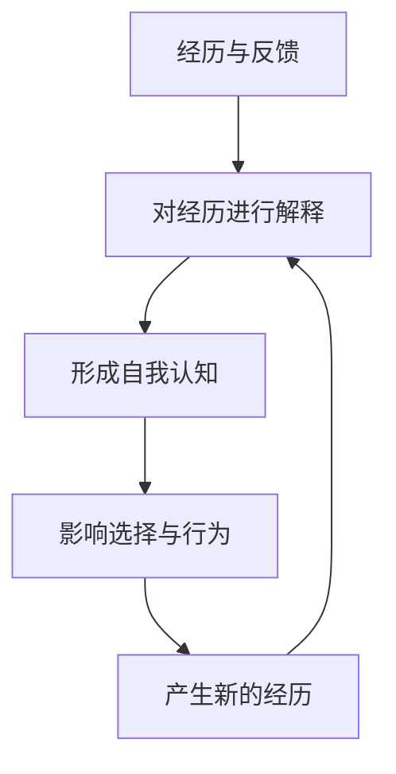
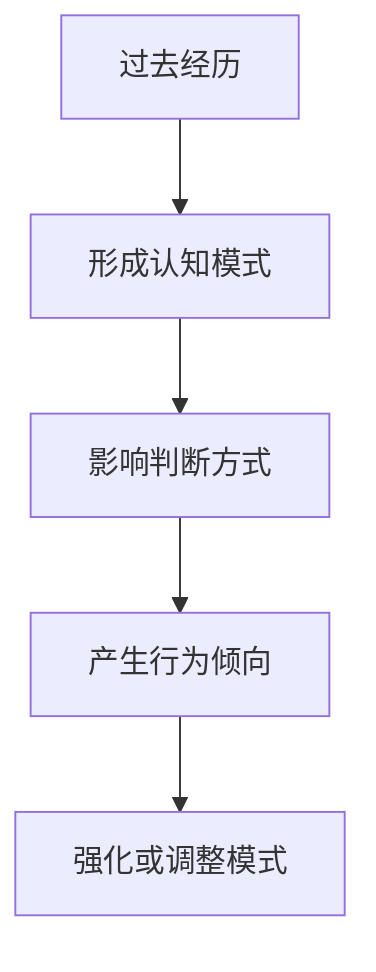

# 00-简述

## 为什么需要重构

随着咕咕的发展，需要重新思考如何理解用户，以及如何真正帮助一个人成长。

帮助一个人并不只是完成任务或解决眼前的问题，更重要的是理解这个人的经历、目标、状态和行为模式，并在合适的时候提供支持。

本文档尝试从心理学和人的成长过程出发，探索如何理解一个人，以及如何帮助他成为自己想成为的人。

## 目标

本文档尝试从三个方面理解人与成长：

1. 人的构成
    - 理解一个人由什么因素组成，以及这些因素如何影响行为

2. 人的成长
   - 理解一个人为什么变化，以及如何形成目标和行动

3. 如何帮助人
   - 探索如何在理解一个人的基础上提供支持


# 1-人的构成

## 简述

理解一个人，需要理解他如何形成现在的自己，以及驱动他行动的原因。

人的行为并不是孤立产生的，而是受到过去经历、自我认知、内在驱动力、行为模式和目标方向等因素共同影响。

本章尝试从人的形成过程和行为驱动因素出发，建立对人的基础理解。

## 目录

***1.1 经历与记忆***

理解一个人的过去如何影响现在。

***1.2 自我认知***

理解一个人如何看待自己。

***1.3 内在驱动力***

理解一个人为什么行动。

***1.4 行为模式***

理解一个人通常如何行动。

***1.5 目标与理想自我***

理解一个人想成为怎样的人。

---

## 1.1 经历与记忆

### 核心问题

一个人的过去不会直接决定现在，但过去经历会通过记忆、解释和意义建构影响一个人的认知、行为和选择。

理解一个人，不仅需要知道他经历过什么，更需要理解这些经历如何塑造了他。

---

### 叙事身份理论（Narrative Identity）

叙事身份理论认为，人会通过构建关于自己的生命故事来理解自己。

过去经历并不是简单的信息集合，而是经过个人解释后，形成关于“我是谁”的认知。

其过程可以表示为：

```text
经历
↓
记忆
↓
解释
↓
形成身份认知
↓
影响未来选择
```

例如：

同样经历一次失败：

一个人可能认为：

“我失败了，说明我不适合做这件事。”

另一个人可能认为：

“这次失败让我知道了需要改进的方法。”

相同的事件，因为不同的解释，会形成不同的自我认知和行为模式。

---

### 对理解一个人的意义

因此，理解一个人不能只关注：

- 做过什么
- 完成过什么
- 发生过什么事件

还需要理解：

- 这些事情对他意味着什么
- 他如何解释自己的经历
- 这些经历形成了哪些长期模式

---

### 对 Agent 的启发

对于一个帮助人的系统，记忆不应该只是保存事实，而应该逐渐理解事实背后的意义。

例如：

普通记录：

> 用户曾经创业失败。

更有价值的理解：

> 用户经历过创业失败，因此形成了“先验证再投入”的决策倾向。

因此，理解一个人的经历应该从：

```text
事件（Event）
↓
解释（Interpretation）
↓
影响（Impact）
↓
模式（Pattern）
```

逐渐形成对一个人的长期理解。

---

## 1.2 自我认知

### 核心问题

一个人如何理解自己，以及这种理解如何影响他的选择和行为？

人的行动不仅受到实际能力和外部条件影响，也受到他对自身身份、能力和价值的判断影响。

这种判断不一定完全符合客观事实，但会真实地影响一个人选择什么目标、是否愿意尝试，以及如何面对困难。

---

### 自我概念（Self-concept）

自我概念指一个人对“我是谁”的整体理解。

它可能包括：

- 我是怎样的人
- 我拥有哪些能力
- 我重视什么
- 我在关系和社会中扮演什么角色
- 我通常如何面对问题

自我概念并不是固定不变的。一个人会根据过去经历、他人的反馈和对事件的解释，不断形成和调整对自己的认识。

其过程可以表示为：



例如，同样是一个没有完成的项目，一个人可能认为：

> “我就是一个无法坚持的人。”

也可能认为：

> “这个项目的方向并不适合我。”

不同的解释会形成不同的自我认知，并影响下一次选择。

---

### 自我效能（Self-efficacy）

自我概念回答的是：

> 我是怎样的人？

自我效能回答的是：

> 我相信自己能否完成这件事？

一个人是否采取行动，并不只取决于他实际拥有的能力，也取决于他是否相信自己能够做到。

因此，需要区分：

- 一个人实际具有什么能力
- 一个人认为自己具有什么能力

即使两个人的实际能力相近，自我效能不同，也可能产生完全不同的行动意愿和坚持程度。

---

### 对理解一个人的意义

理解一个人，不能只观察他的能力和行为，还需要理解：

- 他如何描述自己
- 他认同哪些身份
- 他认为自己擅长或不擅长什么
- 他对自身能力有怎样的判断
- 哪些自我认知正在支持或限制他的行动

因此，理解一个人不仅是判断“他能做什么”，也是理解“他认为自己能做什么”。

同时需要注意：

> 自我认知不是客观事实，而是一个人当前对自己的理解。

它可能准确，也可能受到过去经历、情绪和外部评价的影响。

---

### 对 Agent 的启发

Agent 不应该只建立关于用户的事实画像，还需要理解用户如何看待自己。

例如：

行为事实：

> 用户很少公开展示自己的作品。

用户的自我认知：

> 用户认为自己不擅长表达。

Agent 的理解：

> 用户可能更习惯通过作品本身表达，而不是通过公开交流表达。

这三者不应该被混为一谈。

对于 Agent 而言，需要区分：

```text
行为事实
↓
用户对自己的理解
↓
Agent 基于观察形成的假设
```

Agent 不应该直接把用户当前的自我评价当作永久结论，也不应该通过表达强化用户的负面标签。

例如，应避免：

> “你就是一个容易拖延的人。”

而可以表达为：

> “你似乎更容易在方向不明确时停止推进，这可能不完全是执行力的问题。”

Agent 对自我认知的理解，应当用于选择更合适的表达和支持方式，而不是替用户定义他是谁。

理解用户如何看待自己，最终是为了帮助他验证、调整并逐渐形成更清晰的自我认识。

---

## 1.3 内在驱动力

### 核心问题

一个人为什么愿意行动，又为什么能够持续行动？

人的行为可能受到奖励、压力、责任和外部要求推动，也可能来自兴趣、认同和自身选择。

这些动机都能促使人采取行动，但它们带来的心理体验、持续性和成长结果并不相同。

因此，理解一个人的内在驱动力，不只是知道他想完成什么，还需要理解：

- 他为什么想做这件事
- 这个目标是否来自自身选择
- 他是否相信自己能够做到
- 这件事是否与重要的人或关系产生连接

---

### 自我决定理论（Self-Determination Theory）

自我决定理论认为，人具有主动探索、学习和成长的倾向。

当一个人的基本心理需求得到支持时，他更容易形成自主而稳定的动机；当这些需求长期受到阻碍时，即使仍然采取行动，也可能更多来自压力、控制或对失败的恐惧。

自我决定理论提出了三个基本心理需求：

#### 自主（Autonomy）

自主指一个人感受到自己的行为来源于自身意愿和选择。

它并不等于完全独立，也不意味着拒绝他人的建议，而是：

> 即使受到他人帮助，我仍然认同这是自己的选择。

当自主需求得到支持时，一个人通常更愿意承担责任，也更容易长期投入。

当自主需求受到阻碍时，行动可能变成：

- 被要求完成
- 为了避免批评
- 为了满足他人期待
- 在压力下被迫选择

#### 能力（Competence）

能力指一个人感受到自己能够理解、掌握并完成当前面对的事情。

它并不等同于客观能力，而是一种对自身有效性的体验。

一个人需要看到：

- 自己能够采取行动
- 行动能够产生结果
- 自己正在逐渐进步
- 面对的挑战并非完全无法控制

当任务长期过于困难、缺乏反馈或无法看到进展时，能力感会下降，行动意愿也可能随之减弱。

#### 连接（Relatedness）

连接指一个人感受到自己与他人存在真实的关系，并且能够被理解、接受和关心。

人不仅希望独立完成事情，也希望自己的行动与重要的人、群体或价值产生联系。

连接需求可能表现为：

- 希望被理解
- 希望得到支持
- 希望与他人共同完成事情
- 希望自己的行动能够帮助或影响别人
- 希望感受到归属

连接并不是依赖，而是感受到自己并非孤立地行动。

---

### 动机的内化

人的动机并不是简单分为“外在动机”和“内在动机”。

同一件事情可能最初来自外部要求，但随着理解和认同，逐渐转化为个人愿意承担的目标。

例如，一个人最初运动可能是因为医生要求，之后可能逐渐认为健康对自己的生活很重要，最终将运动视为自己生活方式的一部分。

这个过程可以表示为：


因此，真正影响行动持续性的，不只是动机有多强，也包括动机与自我之间的关系。

一个目标可能看起来非常重要，但如果用户并不认同它，行动仍然难以持续。

---

### 对理解一个人的意义

理解一个人的行为，不能只观察：

- 他是否采取了行动
- 他完成了多少任务
- 他是否表现得足够积极

还需要理解：

- 这件事是不是他真正想做的
- 他是在主动选择，还是在承受压力
- 他是否感受到自己有能力推进
- 他是否在行动中得到支持和连接
- 这个目标是否已经成为他认同的一部分

同样的行为，背后的动机可能完全不同。

例如，两个人都在持续工作：

一个人可能因为享受创造并认同目标；

另一个人可能因为害怕落后和让别人失望。

表面的投入相似，但他们需要的支持并不相同。

因此，理解内在驱动力，不是给用户贴上“自主型”或“连接型”的标签，而是理解在当前情境中，哪些心理需求得到了满足，哪些需求正在受到阻碍。

---

### 对 Agent 的启发

Agent 不应该只推动用户完成目标，还需要关注目标背后的动机质量。

例如，用户说：

> 我应该把这个项目做完。

Agent 不应直接默认这是用户真正认同的目标，而可以进一步理解：

- 用户为什么认为自己应该完成
- 这个目标来自个人选择还是外部期待
- 用户是否仍然认同这个项目的价值
- 当前阻碍来自方向、能力感还是缺乏支持

Agent 的表达和行动应尽量支持三个基本需求：

#### 支持自主

- 提供选择，而不是直接替用户决定
- 解释建议的原因，而不是只给出命令
- 区分“用户想做”和“用户觉得自己应该做”
- 尊重用户拒绝、暂停和调整目标的权利

#### 支持能力

- 将行动拆解到可完成的程度
- 提供及时而具体的反馈
- 帮助用户看到已经取得的进展
- 避免让一次失败成为对整体能力的判断

#### 支持连接

- 先理解用户当前的感受和处境
- 让用户感受到自己的目标被认真对待
- 在适合的情况下提醒用户与他人建立协作和支持
- 关注目标对他人、关系和长期价值的意义

Agent 还需要区分三种信息：

```text
用户正在做什么
↓
用户为什么说自己要做
↓
Agent 对其深层动机形成的可修正假设
```

Agent 对用户动机的判断不应该成为固定结论。

例如，不应该直接定义：

> 用户缺乏自主性。

而应理解为：

> 用户当前似乎主要受到外部期待推动，可能尚未形成对目标的充分认同。

内在驱动力的理解，最终不是为了更有效地操控用户行动，而是为了选择一种更能保护用户自主、增强能力感并建立连接的支持方式。

---

## 1.4 行为模式

### 核心问题

一个人通常如何行动，以及这些稳定的行为方式如何形成？

人的行为并不是每一次都重新计算，而是在过去经历、自我认知和环境反馈的影响下，逐渐形成稳定的模式。

这些模式会影响一个人：

- 如何面对问题
- 如何做出选择
- 如何处理困难
- 如何推进目标

因此，理解一个人不仅需要知道他做过什么，还需要理解他通常是如何行动的。

---

### 认知图式理论（Schema Theory）

认知图式理论认为，人会根据过去的经历形成理解世界和处理信息的认知结构。

这些结构帮助人快速判断环境，并影响后续行为。

其过程可以表示为：



例如：

一个人过去经常通过快速尝试获得反馈，可能形成：

> 遇到问题先行动，再调整。

另一个人过去因为错误选择受到较大损失，可能形成：

> 做决定前需要充分分析和确认。

两种模式没有绝对的好坏，而是在不同环境中产生不同影响。

---

### 习惯与行为自动化（Habit Formation）

除了认知模式，人也会形成重复性的行为习惯。

习惯通常来自：

```text
触发条件
↓
行为
↓
结果反馈
```

长期重复后，行为会变得更加自动化。

例如：

面对新任务：

有人习惯：

```text
拆解目标
↓
制定计划
↓
开始执行
```

有人习惯：

```text
收集大量信息
↓
不断比较
↓
延迟开始
```

这些行为模式会影响目标推进方式。

---

### 对理解一个人的意义

理解一个人，不能只观察单次行为。

一次失败可能来自：

- 环境因素
- 当前状态
- 特殊事件

而长期重复出现的行为，才更可能反映稳定模式。

需要关注：

- 他通常如何开始一件事情
- 他如何面对不确定性
- 他如何处理失败和反馈
- 他倾向独立解决还是寻求帮助
- 他如何做取舍和决策

同时需要注意：

行为模式不是固定人格。

它是在过去环境中形成的适应方式，也可以随着新的经历和反馈发生变化。

---

### 对 Agent 的启发

Agent 不应该简单记录：

> 用户曾经没有完成某个任务。

而应该观察：

> 用户在什么情况下容易停滞，以及通常如何恢复行动。

例如：

普通记录：

> 用户多次延期任务。

更有价值的理解：

> 用户并不是缺少执行力，而是在目标不明确时容易停止推进；当目标拆解清晰后，执行情况明显改善。

因此，Agent 需要从：

```text
单次行为（Event）
↓
重复行为
↓
行为模式（Pattern）
↓
预测和支持方式
```

逐渐形成对用户行动方式的理解。

行为模式可以帮助 Agent 判断：

- 什么样的提醒方式更有效
- 什么样的任务拆解更适合用户
- 用户当前阻碍来自哪里
- 什么时候应该鼓励行动，什么时候应该帮助重新思考

但 Agent 不应该给用户固定标签。

例如：

不要认为：

> 用户是拖延型人格。

而应该理解：

> 用户在高不确定性任务中更容易延迟行动。

这种基于情境的理解，更接近真实的人。