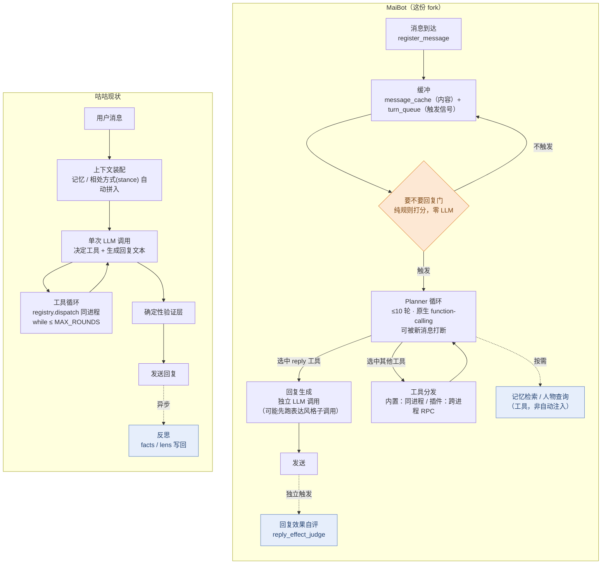

# 外部项目调研 · MaiBot 的 Agent 决策链路

> **性质：外部项目架构调研，不是咕咕自己的设计文档。** 目的是对着一个同类 AI 陪伴项目的真实实现，看它在"要不要回复、怎么决策、怎么调工具、怎么记忆"这些咕咕也要面对的问题上做了什么取舍，供后续设计参考、不代表咕咕会照搬。
>
> **调研对象**：<https://github.com/Mai-with-u/MaiBot>，2026-07-03 `git clone --depth 1` 的快照。**这份快照是深度改过的 fork（内部代号 "MaiSaka"）**，不是 vanilla MaiBot——仓库里 `src/chat/heart_flow/` 目录名还留着原项目的叫法，但里面只剩 3 个几十行的薄壳文件，真正的决策引擎已经整体搬到 `src/maisaka/` 下（`runtime.py`/`reasoning_engine.py`/`chat_loop_service.py`/`turn_gates.py` 等）。读这份文档时如果去翻 MaiBot 官方仓库对不上号，原因就在这——调研的是这个 fork 版本的实现，不是上游主线。
>
> 调研方式见文末「调研方法说明」。关联：咕咕自己的决策环见 [`../02-决策环.md`](../02-决策环.md)；记忆系统见 [`../11-记忆系统.md`](../11-记忆系统.md)；感知/相处方式系统见 [`../10-感知系统.md`](../10-感知系统.md)。

---

## 一句话总览

MaiBot（这份 fork）是「重决策链路」：一条消息进来，先过一道纯规则打分的"要不要回复"门（零 LLM），过了之后进一个可被打断的 **Planner 循环**（最多 10 轮，每轮一次原生 function-calling 调用，只选工具不吐正文），选中 `reply` 工具后才触发**独立的第二次调用**生成真正的回复文本；工具分发是**进程隔离 + 自定义 RPC**，不是同进程注册表；记忆检索是**模型按需主动调的工具**，不是自动拼进 prompt。

咕咕现在是「轻热路径、重异步」：单次调用打完一轮，工具在同进程内通过 registry 直接分发，记忆/相处方式在对话开始时就自动拼进上下文，学习靠对话后异步反思补全。两边是完全不同的取舍方向，各有代价，不是谁更"对"。

---

## 架构图对比

橙色是"决策/守卫点"，蓝色是"异步/按需触发、不阻塞主链路"的部分。图上最直观的三处差异对应第 11 节表格：MaiBot 在进模型之前多一道纯规则的门（省调用成本），主链路本身是"选工具"和"吐正文"两次调用叠一个可打断的多轮循环（换更强的规划力，代价是延迟）；咕咕是单次调用打完、确定性验证层兜底、反思放到链路外异步补（响应快，学习有滞后）。

---

## 1. 消息接收与缓冲

消息从 `ChatBot.message_process()`（`bot.py:445`）进来，经过滤/去重/命令拦截后，交给 `HeartFCMessageReceiver.process_message()`（`heartflow_message_processor.py:24`）：存库，取/建对应会话的 `MaisakaHeartFlowChatting` 实例（`HeartflowManager` 是个 LRU 缓存，上限 100 个活跃会话、24h 过期），调用 `chat.register_message(message)`。

**缓冲拆成两条解耦的线**（都在 `runtime.py`）：

- `self.message_cache: list[SessionMessage]`（`runtime.py:158`）——真正存消息内容的列表，`_last_processed_index` 指针记录处理到哪了，处理过的会被裁掉（上限 200 条）。
- `self._internal_turn_queue: asyncio.Queue[Literal["message","timeout","proactive"]]`（`runtime.py:160`）——**只传触发信号，不传内容**。三种触发源：新消息进来且门通过（`_enqueue_message_turn`）、Planner 自己调 `wait` 工具的超时（`_schedule_wait_timeout`）、插件主动发起的 proactive 任务（`_queue_proactive_turn`）。

也就是"有没有新东西"和"新东西是什么"是分开的——队列只负责叫醒消费循环，内容另外从 `message_cache` 里读。这个解耦咕咕目前没有（咕咕是单条消息进来直接同步走完一轮）。

---

## 2. "要不要回复"门——纯规则打分，零 LLM 调用

这是跟咕咕差异最大的一处。`register_message` 调 `_schedule_message_turn()`，实际决策委托给 `MessageTurnScheduler.schedule_message_turn()`（`turn_scheduler.py:57`），逐步检查（均为同步、无 `await`、无模型调用，多份独立调查 grep 全文件确认零匹配）：

1. `focus_mode_manager.can_decide()`——是否持有"焦点"（同一时间该把注意力给谁的互斥机制，`focus/manager.py`，纯状态判断，无 LLM）。
2. `idle_backoff.should_delay(pending_count)`（`idle_backoff.py:67-95`）——指数退避：群聊连续判定"空闲结束"会让下次判定间隔翻倍（封顶），避免在冷群里空转。
3. `@` 提及等强制触发条件，直接绕过后面的打分。
4. 主打分逻辑二选一（配置开关）：
   - **`ReplyNecessityTurnGate`**（`turn_gates.py:32`）→ `score_reply_necessity()`（`reply_necessity.py:127`）：正则/关键词打分——@/提及 +100、私聊 +40、直接请求词（"帮我/能不能"）+20、疑问句 +15、征求意见 +20、短反应词（"哦/嗯"）-25，再叠加"待处理消息数/触发阈值"的压力项、空闲时长的加成项、"最近连续自己回复太多次"的压制项，固定阈值 `REPLY_NECESSITY_TRIGGER_SCORE = 65` 触发。
   - **`FrequencyThresholdTurnGate`**（`turn_gates.py:122`）——退化方案，纯数消息条数够不够阈值，外加"空闲时长换算成等效消息数"的补偿逻辑。

门没过就不进后面的 LLM 循环——这一步是这套系统里**唯一**不产生任何调用成本的决策点，咕咕现在没有等价物（每条消息都会进模型判断）。

---

## 3. Planner 循环——可中断、多轮、只选工具不吐正文

门过了之后，常驻的后台任务 `MaisakaReasoningEngine.run_loop()`（`reasoning_engine.py:974`）消费队列信号，进入内层循环：`while round_index < MAX_INTERNAL_ROUNDS`（上限 10 轮，`runtime.py:70`），每轮调 `_run_planner_request()` → `chat_loop_service.chat_loop_step()`（`chat_loop_service.py:821`）。

**这一步的 LLM 调用是原生 function-calling**：把工具 schema 通过 `tools=` 参数原样传给模型（不是自定义的文本协议），模型回一个结构化的 `tool_calls`（`reasoning_engine.py:643`）。Planner **不直接产出对用户可见的回复文本**——它只决定"这轮要不要调用 `reply`/`wait`/`send_emoji`/`switch_chat` 等工具、传什么参数"。

**可中断**：循环进行中如果来了新消息，会抛 `ReqAbortException` 中止当前请求（`reasoning_engine.py:1046-1063`），带一个"打断节流"控制器防止打断过于频繁；中止后要等 1 秒静默窗口（`_message_debounce_seconds`，`runtime.py:173`）才重新发起。

---

## 4. 工具/插件分发——两层架构，进程隔离

这是全套调研里**最值得单独拎出来看的架构分歧点**。分两层，不是二选一：

- **LLM ↔ host 这层：原生 function-calling**（跟第 3 节一致，模型看到的、返回的都是标准工具调用结构）。
- **host ↔ 插件这层：自定义 RPC/IPC 协议，跨进程**。每组插件被拉起成独立的 OS 子进程（`runner_main.py:1218`，`asyncio.create_subprocess_exec`），host 和插件进程之间走一套自己实现的传输层——4 字节长度前缀 + MsgPack 编码的 Envelope，支持 UDS/TCP/命名管道三种传输（`transport/{uds,tcp,named_pipe}.py`）。插件侧通过装饰器（`@Tool`/`@Action`/`@Command`）+ manifest JSON 声明自己的能力，host 侧汇总成统一的工具列表喂给模型；模型选中某个插件工具后，host 序列化一次 RPC 请求发过去，等插件进程执行完回传结果。

从模型的视角看，内置工具和插件工具是**同一种东西**（都是原生 function-calling 目标），分不出差异；但插件工具在底下多绕了一次进程间通信。**代价是每次插件调用多一次序列化+IPC 往返延迟，换来的是插件崩溃不拖垮主进程、可以用非 Python 语言实现插件**。

咕咕现在是同进程内 `registry.dispatch()` 直接分发，没有这层隔离——好处是延迟低、实现简单，坏处是任何一个工具的未捕获异常理论上离主进程更近。这不是说咕咕该照抄进程隔离（那对当前规模是过度设计），只是记一笔"如果哪天要支持用户自定义/第三方插件，这是个现成的隔离范式参考"。

---

## 5. 回复生成——独立于 Planner 的第二次调用

Planner 选中 `reply` 工具后，`builtin_tool/reply.py:131` 的 `handle_tool` 被触发，调用 `replyer.generate_reply_with_context()`（`maisaka_generator_base.py:694`），这是**一次完全独立的 LLM 调用**：单独的 prompt（人设+表达风格+对话历史+"回复理由"），不带工具 schema，专门产出最终可见的回复文本，最多重试 3 次。

> 调研过程中有一份 agent 报告在这一点上自相矛盾（先说"只有一次调用、Planner 自己直接吐正文"，后文又描述了这次独立调用）——已核对另外 4 份独立报告的行号引用，全部一致确认"Planner 选工具 + 独立回复生成"是两次调用，采信这个版本，前者的说法是那份报告自己总结时的失误。

生成前还可能先跑一次**独立的表达风格选择子调用**（`_run_expression_selector`，`reply.py:25`），选完语气再喂给生成调用——所以"选了要回复"到"回复真的生成"之间，实际可能是 2 次 LLM 调用叠在一起。

---

## 6. 挂在 Planner 循环上的其他子 Agent 调用

除了 Planner 本身和回复生成，还有几个**按需触发**的子 Agent 调用，全部走同一个 `run_sub_agent` 通用原语（`runtime.py:1335`），各自带独立的 system prompt：

| 子调用 | 位置 | 作用 |
|---|---|---|
| `behavior_scenario_analyzer` | `reasoning_engine.py:213/229` | 总结/分析当前对话场景，产出"行为模式参考"喂给后续 Planner prompt |
| `reply_effect_judge` | `runtime.py:1420` | **让模型给自己刚发的上一条回复的效果打分**（严格 JSON 输出的评分器 prompt）——一种"回复后立即自评"的自我评估调用，触发时机比咕咕的异步反思更即时。这个分数具体怎么反哺下游决策，调研没能确认（值得后续单独查一次，如果想借鉴这个模式的话） |
| `expression_selector` | `builtin_tool/reply.py:27` | 见第 5 节，选语气风格 |
| emoji 选择 | `builtin_tool/send_emoji.py:385` | 从候选表情里选一个要发的，可能走 VLM |
| 中期记忆摘要 | `memory/mid_term.py:155` | 记忆子系统内部用，跟回复决策无关 |
| "对这个人的印象"注入 | `memory/heuristic_injector.py:181` | 往 Planner 上下文里塞一段启发式印象描述 |

一次"认真"的完整循环理论上限：1~10 轮 Planner + 场景分析 + 效果自评 + 表达风格选择 + 回复生成（+ 可能的 emoji 选择）——比表面看到的"1 次 planner + 1 次生成"重得多，但这些子调用大多是条件触发（比如没决定发表情就不会去选表情），不是每轮全跑。

---

## 7. 记忆系统（`src/A_memorix/`）——一般记忆按需检索，人物画像自动注入，两种策略并存

第一轮调研笼统说"记忆是模型按需调用的工具，不自动注入"——细读后发现**这只对一般语义/情节记忆成立，人物画像是例外**，需要拆开说：

- **短期**：`self._chat_history` 进程内列表，有窗口上限，冷启动从库里恢复最近上下文。
- **长期 `A_memorix`**：独立子系统，其实是个 `git subtree`（上游 `https://github.com/A-Dawn/A_memorix.git`，`MaiBot_branch` 分支），有自己的 `MODIFICATION_POLICY.md`——仓库根目录的 `CLAUDE.md`/`AGENTS.md` 都明确要求"改动涉及 `src/A_memorix` 先读这份改动政策"，说明这是刻意保持独立、谨慎对待的一块。体量不小（核心代码近 5 万行），向量库（API 适配器 + INT8 量化的多个向量池）+ 图库 + BM25 稀疏检索 + 类 PageRank 的图关系召回混合检索；显式区分"情节"（episode，短期语义分段）和"人物画像"（person_profile，长期总结版本化）。
  - **一般语义/情节记忆——按需检索**：暴露成 `search_memory` 工具，Planner 觉得需要才主动调，不自动拼进每轮 prompt。
  - **人物画像——每轮自动注入**：见第 8 节，`collect_person_profile_candidates()` 每轮自动挑最多 3 个相关人物、自动查画像、自动拼进 Planner 上下文，**不经过工具调用这一层**。
  - 写入统一走异步后台 worker 队列（fire-and-forget），不阻塞回复路径。

**设计取舍**：自动注入的好处是模型不用"想起来要查"、覆盖率更稳；按需检索的好处是省 token、不会把不相关的记忆片段硬塞进每轮上下文稀释注意力。MaiBot 自己在"人物是谁"这类大概率每轮都用得上的信息上选了自动注入，在"具体聊过什么细节"这类未必每轮都需要的信息上选了按需检索——不是非此即彼，是按信息的"每轮命中概率"分别选的策略。咕咕目前对记忆整体是前者（自动上桌），这是个明确的、可以拿来对比讨论的分歧点。

---

## 8. 人物关系模型——身份档案和"个人相处偏好"是两个分开的模块

这一节第一轮调研只覆盖了 `person_info.py`，细读后发现**这不是完整答案**——个人层面的"沟通习惯/相处偏好"其实是另一个独立子系统在管，两者要分开看：

**`person_info.py`——薄身份登记表，不建模沟通风格。** `Person` 类（`person_info.py:183-506`）持有的是 `person_name`/`nickname`/`is_known`/`know_times`/`know_since`/`last_know`（认识多久）、扁平的 `memory_points: list[str]`（离散事实，格式 `"分类:内容:权重"`，用编辑距离判重去重）、`group_cardname_list`（各群昵称历史）——是一张身份卡，不涉及"这个人喜欢怎么被回应"。它把更丰富的事实转手交给长期记忆：`store_person_memory_from_answer()`（`person_info.py:509-601`）直接调 `memory_service.ingest_text(source_type="person_fact", ...)` 写进 A_memorix，自己不留存。

**真正的"个人聊天方式画像"在 `src/A_memorix/core/utils/person_profile_service.py`，按 `person_id`（跨群唯一的个人身份）建档，不是按群/会话。** 这是回答"MaiBot 怎么学习*用户个人*聊天方式"最准确的落点：

- 画像分六块（`profile_text.py:8-24`，`PROFILE_SECTION_TITLES`）：身份设定、关系设定、稳定了解、**相处偏好**（互动偏好/雷点/沟通习惯/喜欢或讨厌的相处方式——就是这块）、近期互动、不确定信息、维护备注。
- 填充靠 LLM 分类：`PersonProfileService._classify_profile_evidence`（`person_profile_service.py:707`）把原始证据材料分拣进上面几个桶，"相处偏好"桶的分类指令原文就是"互动偏好、雷点、沟通习惯、喜欢/讨厌的相处方式"。
- 每轮触发：`collect_person_profile_candidates()`（`src/maisaka/memory/person_profile.py:144`）挑出这轮相关的最多 3 个人（发言者/被 @ 的人/被回复的人），`build_person_profile_injection_messages()`（同文件 216-268 行）查画像、拼成"【人物画像-内部参考】……使用时把它当作对当前人物的背景理解；若与当前对话冲突，以当前对话为准"这样一段话，跟第 9 节的群体表达/行为学习结果并行（`asyncio.gather`）一起注入 Planner 的 prompt（挂点 `reasoning_engine.py:494`）。

**跟第 9 节 `learners/` 的关键区别**：`learners/` 三个学习器按 `session_id`（群/会话）建模，学的是"这个群集体怎么说话"；`person_profile_service` 按 `person_id` 建模，学的是"这一个人的相处偏好"，两条线独立运作、互不覆盖，都会被注入同一次 Planner 请求。

整体比咕咕"反思驱动的 stance 行为模块"要**拆得更细、更结构化**（六个固定分类桶 + 显式的按证据分类），但不确定它是否也会像 stance 那样"主动改变回应方式的判断逻辑"本身，还是纯粹作为背景信息参考——这点调研没有进一步验证，如果要借鉴这个分桶思路值得先确认清楚。

---

## 9. `learners/`——群体/会话层面的表达与行为学习，离线批量，推理时基本不过 LLM

`src/learners/` 是**群体/会话层面**的学习（对应第 8 节 `person_id` 层面的个人画像），三个职责分开的学习器：

- **`ExpressionLearner`（说话风格/句式）——明确只学用户，排除机器人自己**。抽取用的 prompt（`prompts/zh-CN/learn_style.prompt`）原文写着"请从上面这段群聊中提取**用户**的语言风格和说话方式"，并且直接要求"不要总结 SELF 的发言……不要重复学习你自己的发言"；代码里也有硬过滤（`expression_learner.py:653-655`），凡是源自机器人自己消息的候选一律丢弃。产出是 `situation→style` 规律（"当 XXX 场景时，可以用 YYY 说法"，含"有没有特殊的梗"），按 `session_id` 存进 `Expression` 表。**读取不是直接注入**：`MaisakaExpressionSelector`（`src/chat/replyer/maisaka_expression_selector.py`）先按向量相似度或加权随机取一批候选，再用一次**独立的 LLM 子调用**从候选里挑 0~5 条，格式化成"当'XXX'时，可以用'YYY'来表达"拼进回复生成的 prompt（`maisaka_generator_base.py:480-527`）。这套机制是给"融入群聊"设计的重实现，不适合直接照搬，但"按个人镜像说话调调"这个思路对咕咕有启发——想法记在 [`语气镜像-想法笔记.md`](语气镜像-想法笔记.md)。
- **`JargonLearner`/`JargonMiner`（黑话/梗）——用户和机器人的话都会被纳入候选**，落库前过滤掉机器人昵称本身。候选词出现次数攒到 `[4, 8, 25, 100]` 这几个阈值时，跑一套三段式含义推断（`jargon_miner.py:404-603`）：先结合上下文猜含义、再脱离上下文单猜一次、最后对比两次结果——如果两次猜的意思太接近，说明这词"不用上下文也能懂"，判定不算黑话。存储按 `session_id` 记计数（`session_id_dict` 列），够条件可标 `is_global` 跨群通用。**读取路径这次调研没找全**：`jargon_explainer.search_jargon()` 是现成的查询 API，但没找到 `src/learners/`/`runtime.py` 之外真正调用它把黑话含义塞回实时回复 prompt 的地方——可能是走某个插件/工具层没搜到，也可能目前只是个还没接线的只读 API，这点标记为"未确认"，不当成"确认没有"。
- **`BehaviorLearner`——学的是"应对策略"而非说话方式**：标了 `actor_type`（其他用户/群体集体/机器人自己）和 `learning_type`（观察到的 vs 自我反思出的），把"群友这么做过"和"我这么应对效果好不好"分开记。**读取端明确不用 LLM 做最终选择**（`behavior_selector.py:276` docstring 原话"不再使用 LLM 做最终选择"）——按场景标签重合度 × 历史成功率等权重做确定性打分排序，取 top 3 拼进 Planner 上下文，属于第 9 节三个学习器里唯一在推理时完全零 LLM 调用的一个。

**触发机制**（三者共用）：不是定时器，是**上下文裁剪的副产物**——`reasoning_engine.py:1404-1411` 在每轮对话把旧消息从活跃上下文窗口裁掉时，把被裁掉的消息丢给 `_trigger_trimmed_history_learning()`（`runtime.py:1780-1840`），过一道 30 秒冷却（`_min_extraction_interval`）+ 攒够 10 条可学习消息（`min_messages_for_extraction=10`）的门，通过后一次性并发（`asyncio.gather`）跑三个学习器各自的批处理。学习本身不占用回复路径的实时延迟，但触发时机绑定在"上下文该裁了"这个节点上，不是独立的心跳。

---

## 10. 调度模式——纯事件驱动，没有心跳

多份独立调查交叉确认：**全代码库找不到任何固定间隔的心跳/轮询循环**。`run_loop()` 是阻塞在 `await queue.get()` 上的事件消费者，唯一的"定时"行为都是**一次性的延时任务**——Planner 自己请求的 `wait` 超时、防抖静默窗口、"焦点冷却"计时器（`focus/runtime_mixin.py`，sleep 一次就完事，要再触发得重新武装）。状态推进只有三种来源：消息到达、Planner 自己请求的等待到期、插件发起的主动任务——没有任何时钟驱动的"定期巡检所有会话"逻辑。

---

## 11. 跟咕咕的对比小结

| 维度 | MaiBot（这份 fork） | 咕咕现状 |
|---|---|---|
| 每轮 LLM 调用数 | 1~10 轮 Planner + 若干条件触发的子调用 | 固定 1 次 |
| "要不要回复"判定 | 纯规则打分，零 LLM | 进模型判断 |
| 工具分发 | 原生 function-calling → 跨进程 RPC 到插件子进程 | 原生调用 + 同进程 `registry.dispatch` |
| 长期记忆 | 一般语义/情节记忆按需调工具查；**人物画像每轮自动注入**（不经工具），两种策略并存 | 对话开始自动拼进上下文 |
| 人物/关系模型 | 拆两层：`person_info.py` 是薄身份登记表（不建模风格）；真正的个人相处偏好在 `A_memorix` 的 `person_profile_service`，按 `person_id`（跨群）分六桶建档，每轮自动注入 | 反思驱动的 stance 行为模块，常驻影响回应 |
| 自我评估 | 每次回复后独立打分（`reply_effect_judge`） | 异步反思批量处理 |
| 风格/表达学习 | 主要学**用户/群体**怎么说话（Expression/Jargon 明确排除机器人自己），只有 Behavior 单独学机器人自身；离线批量学、推理时查表不过模型 | （见 [`../10-感知系统.md`](../10-感知系统.md) 现状） |
| 调度模式 | 纯事件驱动，一次性延时任务，无心跳 | 单轮同步走完，无常驻循环 |

**取舍方向**：MaiBot 用更多次调用、更复杂的编排换来更强的规划/工具选择能力和进程级隔离，代价是延迟和成本；咕咕用单次调用+异步反思换来响应快、成本低，代价是单轮决策力较弱、学习/自评有滞后。两条路线服务的产品形态本来就不同（MaiBot 面向的是持续在场的群聊角色扮演，咕咕是响应式陪伴助手），不构成直接的"该学谁"，更适合当作"遇到具体问题时，看看另一条路线怎么处理同一个子问题"的参考库。

---

## 调研方法说明

通过 `git clone --depth 1` 把仓库拉到本地（现挪到 `/Users/coffeiz/Desktop/workspace/MaiBot`），分三轮共派了 10+ 次 Agent（部分是主动追问/纠错后重跑）分别读 `src/chat/heart_flow/`、`src/maisaka/`（`runtime.py`/`reasoning_engine.py`/`chat_loop_service.py`/`turn_gates.py`/`turn_scheduler.py`/`idle_backoff.py`/`reply_necessity.py`/`focus/`/`memory/person_profile.py`）、`src/plugin_runtime/`（`transport/`/`protocol/`/`host/`/`runner/`）、`src/A_memorix/`（含 `core/utils/person_profile_service.py`/`profile_text.py`）、`src/person_info/`、`src/learners/`（`expression_learner.py`/`jargon_learner.py`/`jargon_miner.py`/`behavior_learner.py`/`behavior_selector.py`/`behavior_pattern_store.py` 等）的实际源码，逐条给出 `file:line` 引用，而不是只看 README。三轮里各有一处结论被后续调查订正：① "每轮几次 LLM 调用"——用多份独立报告交叉核对确定（第 5 节）；② "`learners/` 学的是谁的说话方式"——直接读源码+提示词原文核实后发现主要学用户不学机器人自己（第 9 节）；③ "个人聊天风格怎么建模"——起初只查到 `person_info.py`（一张薄身份卡），后续深挖才找到真正建模"相处偏好"的是 `A_memorix` 里独立的 `person_profile_service`（第 7、8 节）。整份调研没有实际运行这个项目、没有做行为测试，纯静态代码阅读，如果 fork 后续有大改，结论会过期。
