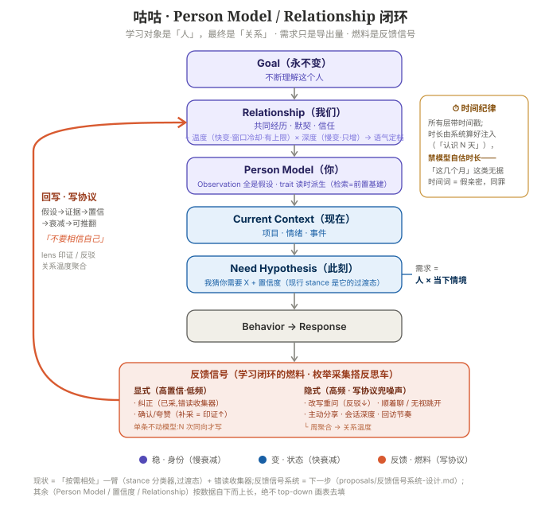
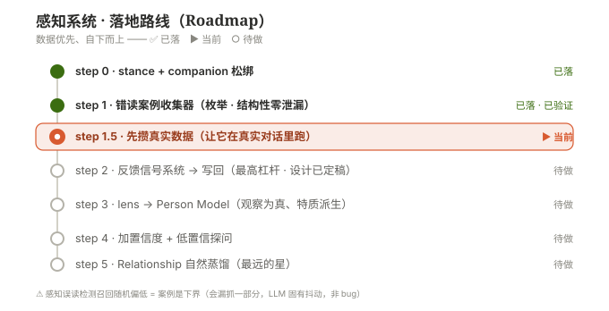

# 咕咕 · 感知系统（Perception）架构升级

> **状态:草案 v0.6（2026-07-01），待评审。** 聚焦**优化聊天的感知能力**——咕咕「读懂用户当前需要什么」。
> **v0.6 变更**:落定**感知选择改「反思驱动 stance」+ persona 纯人格 + 行为模块 1:1 stance（新增 companion/execution/record/query）+ stance per-user 带新鲜度衰减**——见新增 **§2.6**（它覆盖 §2 热路径图 / §3.1 拆分 / §3.2 select / §3.3 的相应部分）。起因:真实反馈「咕咕总在推进项目、想闲聊时没闲聊感」。
> v0.5 变更:新增 **§4.1 完整文件结构**（现状 + ✦新增/待改，含 6 层落到哪个文件）；**§5.1 全局诊断 Admin 面板**（总体均值/intent 分布/误判率/异常标红，挂现有 Admin 区）。
> v0.4 变更:新增 **§2.5 完整架构全景图**（运行时 × 6 层 × 学习闭环，标到实际文件 + ✦新增标记）；**§3.0 整体 6 层架构 + 现有零件映射**（Identity/World Model/Behavior Skills/**Capabilities**/Interaction Preference/Expression；点明只有"抽 skills + 做厚 World Model/lens"两件是新的）；**Capability 层精确定位**（≈现有工具、选工具归 function-calling、感知只软引导不硬关工具——需求链会断）；改名按 "Observation(读)→World Model(整合)"。
> v0.3 变更:① 需求类型重切 **3 家族 ~8 型 + 需求链**，补上 27 缺的 Being-with 家族（§1.5）；② persona **拆分方案**——身份留「贯穿价值 + 姿态地图」、打法抽成模块；实时靠 World Model 软偏置点亮、增量拆遥测先行。
> v0.2:吸收 GPT 分层图 + 命名（World Model/Observations/Decision Policy/Capability Modules），补回「热路径/异步」维度；Lens 自学 vs Decision Policy 只人调；Lens 事件驱动；模块先做细粒度。
> **本阶段范围:只做聊天,主动触达明确推迟**（push 的设计另见 [`proposals/决策层与主动触达-架构草案.md`](proposals/决策层与主动触达-架构草案.md)）。
> 关联:每轮决策环现状见 [`agent-决策环.md`](agent-决策环.md)（本文是它「② 感知」一步的展开 + 升级）；记忆见 [`agent.md`](agent.md)「memory/」。

---

## 读这份文档前:三句话说清这是什么

如果你不打算对代码，只想知道咕咕这套「感知系统」在解决什么问题，看这三句就够:

1. **问题**:咕咕每轮怎么判断「用户现在到底要什么」，这一步过去完全埋在一次模型调用里——看不见、量不了、也没法针对性变好。
2. **方案**:把这一步拆出来，变成「可观测、可度量、可对每个用户单独变准」的独立环节，同时**不给聊天多加一次模型调用**（不拖慢回复）。
3. **现状**（2026-07-01）:最新一版做法是——反思环节（回复之后异步跑）顺带判断「这一轮该用哪种相处方式」（叫 **stance**），存起来给下一轮读；行为怎么做被拆成一个个独立小文件（叫**行为模块**），按 stance 命中哪个就点亮哪个；用户的「读错了」会被专门收集成案例，作为以后调优的原始燃料。

下文按章节展开，每章尽量先给「大白话」再给「对代码的具体描述」，方便按需跳读。

---

## 0. 为什么单开这份

### 概述

「感知」是咕咕每次回复前最先发生的一步——先得读懂用户要什么，才谈得上做对事、说对话。这一步一旦理解错，后面无论工具调得多准、语气多贴心，都是在错的起点上用力，用户感受到的就是「答非所问」。而这一步目前完全"闷"在一次大模型调用内部：外部看不到它是怎么判断的，出了偏差也没法单独诊断、单独修。本文的目标是把这个隐形的判断过程挖出来，让它变得**看得见、测得出、能持续针对某个人变准**，同时严守一条底线——不为此多花一次模型调用的时间。

### 细节

「感知」在决策环的最上游——感知错了，后面工具调错、语气给错、答非所问全跟着错，**100% 的对话都过这一关**。但它现在**完全是隐式的**（埋在那一次 LLM 调用里），看不见、抓不住、没法系统优化。本文定义:① 把感知**显式化、可观测**；② 让它**对每个用户成长**；③ 全程**不给聊天热路径加 LLM 跳**（守住单次调用的低延迟）。

---

## 1. 问题:现在的感知是「隐式」的

### 概述

「咕咕没读懂我」这句抱怨太笼统，没法针对性修。这一章把它拆成 4 种性质完全不同的失败——有的是该多问一句却没问、有的是把闲聊当成了任务、有的是没听出话里的弦外之音、有的是接不上之前聊过的话题。拆开之后才知道该往哪儿使劲。根子在于:现在的模型天生倾向于"果断处理、少反问"（这是行业通病，不只咕咕），而咕咕的架构里也没有任何一步专门强迫它先想清楚"用户到底要什么"再动手。

### 细节

把「感知用户需求差」拆成 **4 种可分别衡量的子失败**（别笼统优化）:

| 子能力 | 失败现象 | 例 |
|---|---|---|
| **歧义识别** | 请求不明确却不自知、直接猜 | 「帮我整理下」→ 整理啥? |
| **意图归类** | 看错用户要哪种帮助 | 「今天好累」被当任务，其实要陪伴 |
| **言外之意** | 只接字面、读不出真实需求 | 问「X 怎么做」，其实卡在 Y |
| **上下文落地** | 接不上历史/记忆里的指代 | 「那个方案」接不到 summary 的「年会方案」 |

根因:模型被训得**果断、少问**（系统性，非咕咕独有），且当前架构没有任何环节**逼它先想清「用户要什么」**。

> 注:§1 这 4 种是「**感知怎么失败**」（failure mode）；§1.5 是「**用户要什么**」（need type）。两者正交——失败往往就是把需求型读错。

---

## 1.5 用户需求的类型 / 需求链（intent 枚举的来源）

### 概述

早期设计里有个"四态"分类（推进/记录/决策探索/…），是从"怎么帮用户把事做完"这个生产力视角切出来的，够用但漏了一大块——用户不想被"处理"、只想被"陪着"的那种需求（累了想被安慰、开心了想找人分享）几乎没地方放，被硬塞进了"闲聊"，而"闲聊"在旧提示词里又被鼓励着往"推进"上带。这一章把需求类型重新切成 **3 个姿态大类、约 8 个细分型**，专门把"陪着我"这一类需求单独摆出来。更重要的一个洞察是:用户的需求不是孤立的一次性分类，而是**会随对话流动的一条链**（比如先倾诉、聊着聊着想清楚了、然后决定动手做）。咕咕最容易翻车的地方，就是在用户还在"倾诉"阶段时，操之过急跳到"给方案"阶段——这正是"情绪被当任务"这个老问题的本质。

### 细节

**27 的四态不够**：它是**生产力视角**切的，把几种本质不同的需求揉一起或漏掉（查询≠执行、反思缺、情绪/陪伴被挤进"闲聊"且被 persona 第 14 行推向推进）。按「**咕咕该换什么姿态**」重切 —— **3 家族 × ~8 型**:

| 家族（姿态） | 需求型 | 用户想要 | 咕咕该做 | 27 覆盖? |
|---|---|---|---|---|
| **A 把事做了**(act) | 执行 | 建/改/操作我的数据 | 直接做、报落点 | ✅ |
| | 推进 | 卡住了 | 找最小一步 | ✅ |
| | 记录 | 记一笔 | 结构化存 + 点趋势 | ✅ |
| **B 想清楚**(clarify) | 查询 | 取一个事实/我的数据 | 查→准答，别任务化 | ⚠️ 混在执行 |
| | 决策探索 | 在选项间纠结 | 理需求/摆权衡/问关键 | ✅(26) |
| | 反思复盘 | 据历史看自己 | 调数据+分析，不是安慰 | ❌ 缺 |
| **C 陪着我**(be-with) | 情绪支持 | 累/烦/难过 | 先接住，**压住给方案** | ❌ 缺 |
| | 分享/陪伴 | 想说话/分享喜悦/找人陪 | 接话、共情、别推进 | ❌ 挤在闲聊 |

（学习解释"这是啥/怎么弄"可作第 9 型，先并进查询/决策，看数据再说。）

> **家族 C 整个是 27 的盲区**——而咕咕定位是**伙伴**，Being-with 正是它和纯助理的分水岭。四态把伙伴感最强的一半丢了。

**这 ~8 型 = 感知的 `intent` 枚举**（拿来打遥测、量误判，见 §3.4）；**3 家族 = 粗姿态层**（对应模块的粗粒度，扩 27 的模式并补 Being-with）。

### 需求链（比单点分类更要紧）

需求不是孤立的点，是**会流动的链**。最典型几条:
- **C→B→A**（最常见）:`倾诉烦` → `要不要换工作` → `帮我列跳槽清单`（接住→探讨→执行）
- **A→C**:`做完一件难事` → `想被肯定 / 分享`
- **记录→反思**:长期 logging 攒着 → `我这阵子状态咋样`
- **查询→决策→执行**:`看本周安排` → `周末要不要加个 X` → `建提醒`

**伙伴的真本事 = 跟住链、平滑换姿态。头号失败 = 跨家族跨太早**（用户还在 C 倾诉，咕咕就跳 A 给方案/建项目）——**这就是"情绪被当任务"的本质**，也是 `emotion-first`/`ask-when-ambiguous` 要压的。

**架构含义**:感知不能只读**单句意图**，要读**"现在在链条哪一段"** —— 这正是 **World Model(summary) 的活**（记"用户当下在忙啥/什么情绪"），配最近几轮判断该不该往下一段走。**点分类 + 轨迹，缺一不可**。

**别锁死分类**:先上这 ~8 型当度量，**误判数据会告诉你哪个该拆/并/补独立模块**（"情绪支持"误判高→它就该有自己模块；"查询/学习"从不分错→并掉）。**类型也竞争上岗**。

---

## 2. 现状 vs 升级（对比决策环）

### 概述

改造前，"读懂用户要什么"、"决定怎么应对"、"决定怎么说"这三件事完全揉在同一次模型调用里，外面看不出各自表现如何。改造思路借鉴了一套通用的分层命名（World Model / Observations / Decision Policy / Capability Modules），但补上了一个原设计图里没交代清楚的关键维度——**这些步骤到底是在"每轮都要跑、必须快"的热路径里，还是在"回复发出去之后再慢慢跑"的异步路径里**。结论是:热路径里不新增任何一次模型调用，所有"感知得更细、学得更准"的工作都挪到回复送达用户之后再做。

### 细节

**现状**（[`agent-决策环.md`](agent-决策环.md) ②→④）:
```
用户消息 → ② 上下文(记忆/项目/日历自动注入) → ③ 历史窗口
        → ④ LLM 工具循环【感知 + 决策 + 表达揉在同一次调用，全隐式】 → 回复
```
感知不可见、不可量、不可针对性优化。

**升级后**:
吸收 GPT 的分层命名，但**补回「什么时候 / 在哪跑」**——GPT 的线性图把三段压平了，实现时务必按下面切开:

```
【热路径 · 每轮 · 便宜 · 不加 LLM 调用】
  注入:Facts(facts.md) + World Model(summary.md) + Lens(per-user 解读先验)   ← builder 确定性拼装
  Decision Policy(确定性选择器):廉价线索(意图关键词/长度) + Lens 权重 → 点亮 Capability Modules(行为模块)
        ⚠️ 此处不跑 LLM、不做"丰富感知"——丰富感知交给下面那一次生成内部做
        ↓
【唯一的 LLM 调用】
  Generation:[身份 + 点亮的模块 + 注入的上下文] → 回复(实时感知 + 回应都在这一次)
        ↓
【异步 · 回复之后 · 不在关键路径】Reflection
  产出 Observations(本轮感知块 intent/ambiguity/emotion)  ← 遥测，给诊断/学习用，**不喂这一轮**
  检测误判(下一句纠正)
  更新:World Model(短期,≈每轮) · Lens(长期,事件驱动,见 §3.5) · 〔Decision Policy:人调不自动,见 §3.3〕
```

**关键约束:聊天热路径只有一次 LLM 调用。** Observations 与学习全在异步反思里 → 对回复延迟**零影响**（守住决策环已修过的「单次流式调用」）。GPT 图里 `Observations → Decision Policy → … → Generation` 那条直线**不是实时串行**:Observations 是事后遥测，Decision Policy 是确定性选择器（非 LLM）。

> **术语对照（采纳 GPT 命名）**:World Model = `summary.md`；Observations = 感知遥测块；Decision Policy = 决策层选择器；Capability Modules = 行为模块库；Lens / Facts 与我们同名。

> ⚠️ **本节图示为 v0.2–v0.5 阶段的设计快照**（"廉价线索/关键词"选模块）。**v0.6（§2.6）已替换"实时怎么点亮模块"这部分逻辑**——选择依据从「本句关键词」改成「反思产出的 per-user stance」，本节图中"Decision Policy(确定性选择器):廉价线索…"一行按 §2.6 更新理解，其余分层/热路径-异步边界不变。

---

## 2.5 完整架构全景图（运行时 × 6 层 × 学习闭环）

### 概述

这一节是全文最密集的一张图，把"用户发一条消息到咕咕回复"的完整运行时流程，和"6 层架构"、"事后怎么学习变准"三件事叠在一起，并标注每一步具体落在哪个代码文件里。不需要记住全部细节，只需要抓住三条主线:① 从触发到回复送达，中间**只有一次**大模型调用；② 感知相关的"观察和学习"全部发生在回复发出**之后**的异步流程里；③ 图中带 `✦` 的是这次升级新增或要改的部分，其余都是原有的。

### 细节

把[决策环](agent-决策环.md)的运行时流程 + 新的 6 层 + 学习闭环叠在一起，标到实际文件。`✦` = 本升级**新增 / 待做**，其余为现状。

```
                       ┌──────────────── 触发 Trigger ────────────────┐
                       │  聊天:用户消息      [push:定时/系统事件 —— 本阶段不做]  │
                       └──────────────────────┬───────────────────────┘
                                              │
═════════════ 热路径（每轮 · 便宜 · 只一次 LLM · 不加延迟）═══════════════
                                              │
   ⓪ IM 前置路由   router.py + runtime_state.py（仅 IM）
       关键词+状态机短路「嗯/算了/还在吗」；awaiting 标志放行确认
                                              │  进 LLM 的才往下
   ① 入口编排   adapters/web.py(流式) / runner.py(IM 整段)
       配额检查 · 找/建会话 · 存用户消息
                                              │
   ② 上下文构建   context/builder.py + loaders.py   ◀── 6 层在这步拼成 system prompt
     ┌──────────────────────────────────────────────────────────────────┐
     │ ① Identity         persona.md / policy.md（贯穿价值 + 姿态地图）         │
     │ ② World Model      facts / summary / memory / ✦lens（注入"当前姿态/解读镜片"）│
     │ ③ Behavior Skills  ✦Decision Policy:World Model+本句线索 软选 Top 2-4     │
     │                    ✦behaviors/*.md（presence/execution/… DO+DON'T）   │
     │ ④ Capabilities     Profile.tool_names → function schemas（现有工具）      │
     │ ⑤ Interaction Pref  _style_block（极简/平衡/成长/陪伴）                   │
     └──────────────────────────────────────────────────────────────────┘
                                              │
   ③ 历史窗口   context/tokens.py + compress_conv.py（token 预算 + 滚动摘要）
                                              │
   ④ ★唯一的 LLM 调用★   core.py · LLMRunner（MAX_ROUNDS=6）
       模型一次内完成:实时感知 + 决策 + 表达
         ├ tool_use → ⑤ 工具派发 registry.dispatch（tools/*）→ 结果回灌 → 再想
         └ 收尾前 ④′ 真实性守卫（说了没做/该做不做/自我核实，确定性兜底）
                                              │
   ⑥ Expression   sanitize.py / outbound.py（清洗泄露/emoji）
                                              │
                                       ═══ 回复送达用户 ═══
                                              │
═════════════ 异步（回复后 · 不在关键路径 · 对回复零延迟）═════════════
                                              │
   ⑩ 对话后反思   memory/reflection.py（fire-and-forget · web+IM 两路都跑）
     ├─ ✦产出 Observation:intent(~8型) / ambiguity / emotion  → 打 `perc` 日志【遥测】
     ├─ ✦误判捕获:下一句是否纠正（正则，零 LLM）              → 打 `misperc` 日志【真值】
     └─ 更新记忆:
          ├ facts（陈述）              memory/store.py
          ├ summary = World Model 短期（≈每轮）
          ├ memory（compress.py 压缩沉淀）
          └ ✦lens = 解读先验（长期·事件驱动·gated）   ◀── 用 misperc 当燃料
                                              │
        ┌─────────────────────────────────────┴──────────────────────────┐
   ✦【喂全局诊断】误判率 by intent/model                ✦【喂下一轮】World Model / lens
    → 开发者**手调** Behavior Skills / 阈值                → ②③ 的软选更准、per-user 成长
    （Decision Policy 人调，不自学）                       （World Model 滞后一轮，本句线索+轻地图兜底）
```

**三条贯穿全图的约束**:① 聊天热路径**只有一次 LLM**（感知/决策/表达都在 ④ 内）；② 感知的**观测 + 学习全在异步 ⑩**（零聊天延迟）；③ Behavior Skills 是 **World Model 软选、非硬切**，Decision Policy **人调不自学**、lens 才 per-user 自学。

> ⚠️ **同上，本图「③ Behavior Skills」一行的选择机制已被 §2.6 的"反思驱动 stance"取代**——"World Model+本句线索"改为"反思产出的 stance + 新鲜度闸"，其余层级、热路径/异步边界仍准确。

---

## 2.6 v0.6 重大修订:感知选择改「反思驱动 stance」+ persona 纯人格

### 概述

这是目前**最新落地**的一版设计，也是本文档核心中的核心。起因很具体:有真实用户反馈说"咕咕总想着推进项目，我只是想闲聊，完全没有闲聊的感觉"。往下查发现是两个结构性问题:一是纯粹的闲聊、分享喜悦这类话，命中不了任何用来判断"该用哪种相处方式"的关键词规则，于是系统直接落到默认行为——而默认的提示词（persona）通篇都是"把事做完、理清、想明白"这种生产力口吻；二是"陪伴"这个需求类型压根没有一个专门的行为模块去为它撑腰，遇到闲聊时没人负责"压住"模型想要推进的本能冲动。

解法是把"该用哪种相处方式"这件事从"每一句里现猜"改成"参考最近一次事后反思判断的结果"——这个判断结果起了个名字叫 **stance**（姿态）。反思本来就在异步跑、本来就要判断用户这轮想要什么（这叫 intent，用来打点统计），现在直接把这个判断结果**复用**成下一轮的 stance，不用额外发明新字段、不用额外花钱。同时把提示词也做了彻底拆分:人格文件（persona.md）以后**只谈"咕咕是谁"**，不再掺杂任何"该怎么做"的指导；具体怎么做全部挪进一个个独立的"行为模块"文件，跟 8 种 stance 一一对应，命中哪种 stance 就点亮哪个模块。

这个方案有一个代价——判断出的 stance 是"上一轮"反思判断的，用在"这一轮"，天然滞后一步。设计上认为这个代价可以接受，因为:① 这个注入只是软提示、不是强制锁死，模型自己看得到当前这句话的内容，仍可临场自我修正；② 常驻的"基线"模块里放了一张四态地图，让模型即使没点亮具体模块也知道存在哪些姿态可选；③ 下一轮反思会很快把 stance 纠正过来。为了防止"昨晚很低落"的 stance 污染"今天早上心情不错"的新对话，stance 还加了一个新鲜度衰减——超过一定时间不新鲜就自动失效、退回中性默认。

### 细节

> 2026-07-01。**起因**:真实使用反馈「咕咕总在推进项目、想闲聊时没闲聊感」。追因到两个结构问题——① 纯闲聊/分享**命中不了任何正则 cue**（`behaviors.select()` 只认情绪/卡住/纠结）→ 零模块点亮 → 回落 persona 默认，而 persona 通篇生产力框架（开篇身份「把事做完/理清/想明白」+ 四态「推进」排首 + 「主动思考」整段鼓励多提一步）；② be-with 家族只有 `emotion-first` 接「累/烦/难过」，「想说说话/分享喜悦」这支（§1.5 的**分享陪伴**）在行为层是**真空**，没人替它压住推进反射。**误判率抓不到这个痛点**——它是沉默的不满（§3.4 局限②），低误判率（实测全线 3–11%、n 小）与「没闲聊感」并不矛盾。

**先定义 stance（本次核心概念）:** **stance =「咕咕这一轮该用哪种相处方式」的判断结果**，取自固定枚举（= §1.5 的 ~8 型:执行/推进/记录/查询/决策/反思/情绪/闲聊陪伴）。它**几乎就是 `perc.intent` 换个用途**——intent 是「读用户这轮要什么」（遥测），stance 是「据此咕咕摆什么姿态」（选模块），一对一，**直接复用 intent、不新造字段**。builder 拿 stance 标签 1:1 点亮行为模块。

**五个决定（覆盖 §2 热路径图 / §3.1 / §3.2 / §3.3 相应部分）:**

**① persona 做到「纯人格、零行为」**（把 §3.1 拆分推到底）。四态「打法」+「主动思考」整段全部移出 persona；**连四态地图也不留 persona**（进 baseline，见 ②）。persona 只剩:身份/声音/价值（和善·真诚·不编造）、不报功能菜单、摩擦时刻待人、emoji 纪律、记忆边界、查证/看图的认知纪律。以后调「相处方式」只动 behaviors，不碰人格。

**② 新增常驻 `behaviors/baseline.md`（always-on，builder 永远拼）**。装:**四态地图**（点名:推进/记录/决策/陪聊，让模型知道有哪些姿态、可软自纠）+ **中性默认姿态**（turn 1 / stance 未判定那轮:先看清要什么、别急着推进）。⚠️ baseline **不装「生产力默认」**——推进拆进自己的模块（③）；默认从「无脑推进」降为「中性、先理解」。**这是治痛点的根**:推进只在判定为执行/推进 stance 时点亮，闲聊轮根本不点它。

**③ 行为模块改「一 stance 一模块」、1:1 映射**（独立模块，不再把多态塞进少数模块/baseline）:

| stance | 模块 | 现状 |
|---|---|---|
| 执行/推进 | `execution`（拆步骤/报落点/推下一步） | 新（原散 persona） |
| 卡住 | `stuck-first` | ✅ |
| 记录 | `record`（结构化记+点趋势） | 新 |
| 查询 | `query`（查→准答、别任务化） | 新·薄 |
| 决策 | `decision-explore` | ✅ |
| 反思复盘 | `reflect-with-data` | 新·可后补 |
| 情绪 | `emotion-first` | ✅ |
| 闲聊/分享 | `companion` | 新·痛点 |

节奏:痛点链路（baseline/companion/execution/emotion/stuck/decision）**先建厚**，record/query/reflect **先薄占位**、按真实对话补厚（守「别没数据就抽完 ~8 型」）。

**④ 选择机制:从「正则 cue」改「反思驱动 stance」**（退役 `behaviors.select()` 正则）。新链路:
- **反思（异步 LLM，本来就在跑、本来就吐 intent）产出 stance** → 写 per-user 状态。
- **builder 读 stance → 1:1 点亮模块 → 拼 prompt**（仍是确定性选择器、**热路径零 LLM**）。
- **代价 = 滞后一轮**（反思在 turn N 后出判断、供 N+1；turn 1 落 baseline）。**可接受**:注入是软偏置非硬锁，模型看得见本句 + baseline 地图、当轮可自纠，下轮反思纠正。**用一轮轻滞后，换掉正则「单句猜姿态」的常态化误判**（`detect_mode` 同款脆，文档早承认）。想彻底消滞后又不引入正则，只能热路径加一次 LLM 判 stance——破「单次调用」红线，否决。

**⑤ stance = per-user World Model 切面、带新鲜度衰减**（不按 session 存）。理由:一天可能多 session；且 stance 本就是 World Model（summary）的切面，而 World Model 本来就 **per-user + 衰减**（§3.3「实时选模块 = World Model」）。所以:
- stance 带 ts，**按新鲜度生效**:近期才继承，隔太久 → 退回 baseline 中性默认（**防昨晚「情绪」stance 污染今早工作 session 首轮**）。复用 `decay.py`。默认窗口先保守（~30 分钟），后调。
- 存形态:结构化标签随 summary 存 per-user `.agent`，builder 直接读、不解析自然语言。

**验收（误判率不是这次的尺子）。** 痛点是沉默的不满，误判率抓不到。**重构前基线**（实测）:查询 36.6 / 执行 27.2 / 记录 14.9 / 推进 12.4 / 闲聊 5.7 / 决策 3.1（情绪·陪伴·反思 ≈ 0）；误判全线 3–11%、n 小无强信号。**上线后看**:闲聊/情绪/陪伴**占比是否回升**（社交轮 mis-routing 在降）+ **用户主观是否有闲聊感**。

#### ✅ 代码核实（2026-07-02）

对照当前代码，v0.6 描述的机制已经落地，且与本节文字一致:

- `backend/agent/behaviors.py`:`_STANCE_MODULE` 字典正是 stance → 模块的 1:1 映射（`执行→execution`、`推进/卡住→stuck-first`、`记录→record`、`查询→query`、`决策/决策探索→decision-explore`、`反思→reflect`、`情绪→emotion-first`、`陪伴/闲聊/分享→companion`）；`STANCE_FRESH_SECS = 1800`（30 分钟），与文中「默认窗口先保守（~30 分钟）」**完全一致**；`select()` 函数体现「baseline 永远在场 + stance 新鲜才叠模块、过期只剩 baseline」的逻辑。
- `backend/agent/prompts/behaviors/` 目录下实际存在 `baseline.md / companion.md / decision-explore.md / emotion-first.md / execution.md / query.md / record.md / reflect.md / stuck-first.md` 九个文件，与表中「8 stance + baseline」对应。
- `backend/agent/prompts/behaviors/baseline.md` 正文确认装的是「四态地图（推进/记录/决策/陪聊）+ 中性默认姿态」，用词与文中描述基本一致。
- `backend/agent/prompts/persona.md` 通读全文确认**已无四态/主动思考相关内容**，只剩身份、能力边界、记忆边界、风格、摩擦时刻、emoji 纪律——与「persona 做到纯人格零行为」的描述相符。
- `backend/agent/memory/store.py` 的 `read_stance`/`write_stance` 读写 `.agent/stance.json`，字段为 `{"stance": ..., "ts": ...}`，与文中「stance 带 ts、结构化标签随 summary 存 per-user `.agent`」一致。
- `backend/agent/context/builder.py` 中 `beh_block = _bh.render(_bh.select(memory.get("stance"), memory.get("stance_ts")))`，确认 builder 是「读 stance → 1:1 点亮 → 拼 prompt」的确定性选择器，热路径没有额外 LLM 调用。

**结论:本节内容与当前代码一致，未发现过时描述。**

---

## 3. 升级架构（分层）

### 3.0 整体:6 层 ↔ 咕咕现有零件（别被"新架构"吓到）

#### 概述

看到"6 层架构"可能会觉得这是要推倒重来，但实际上咕咕原本的代码里已经零散地有了这 6 层的绝大部分，这次升级做的事更像是"打扫房间、把东西归位"，而不是"重新装修"。6 层从稳定到易变依次是:①身份（咕咕是谁，几乎不变）②对用户的持续认知（关系、状态、习惯）③该做什么（行为策略）④能用什么工具⑤怎么表达（回复风格）⑥最终措辞。真正称得上"新"的只有两件事:把"该做什么"从零散的提示词里抽成独立文件；把"对用户的持续认知"这一层做厚（加入 lens 这个新概念）。

#### 细节

完整分层(自下而上,稳→动):

```
① Identity（身份·稳定）         价值观/长期人格/边界/原则——不因"陪伴"就变
        │
② World Model（持续更新）        关系/压力/目标/习惯/状态/姿态
        │   = Observation(读这条消息) → 整合进持久状态
        │
③ Behavior Skills（做什么）       Execution/Planning/Presence/Reflection/Query/Decision…（一文件一能力）
        │
④ Capabilities（能用什么）        Memory/Calendar/Todo/Search/Files…（= 现有工具系统）
        │
⑤ Interaction Preference（怎么做） 极简/平衡/成长/陪伴（用户设的默认风格，正交于行为）
        │
⑥ Expression（最终表达）          措辞/长度/主动程度/emoji/语气
```

**这 6 层几乎全是咕咕已有零件,只是重新归位 + 显式化:**

| 层 | 咕咕现有对应 | 新的部分? |
|---|---|---|
| ① Identity | `persona.md` / `policy.md`（贯穿价值） | 否 |
| ② World Model | 记忆系统 `facts/summary/memory` + (待做)`lens` | **lens + World Model 做厚** |
| ③ Behavior Skills | 现散在 `persona`/`skills.md` 里 | **抽成独立文件** |
| ④ Capabilities | `agent/tools/*` + `Profile.tool_names` + function-calling | 否（已有） |
| ⑤ Interaction Preference | `_style_block`（reply_tone/length） | **做厚**（成长/陪伴风格） |
| ⑥ Expression | LLM 输出 + `sanitize`/`outbound` | 否 |

> **真正"新"的只有两件:① 抽 Behavior Skills；② World Model + per-user lens 做厚。** 其余四层都有了。合纪律——不推倒重写,认清、归位、补两块。

**关于 ② 的命名（改名 Perception 的精确版）:** 这层做两件事——**Observation(读这条消息:intent/情绪/歧义)→ 整合进 World Model(持久状态)**。"World Model Update"只盖了后半;别丢"读消息"那半。World Model 是这层维护的**产物**。

**关于 ④ Capabilities 的精确定位（避免造重复/添乱的层）:**
- **≈ 现有工具系统**,不是从零造;**"这轮调哪个工具"仍归 LLM 的 function-calling**,不需要新层来选。
- **感知对它的升级 = 让调用"更合适",但靠软引导、不靠硬关**:用 Behavior Skill 的 `don't`(软抑制,如 Presence 时"别主动任务化")+ World Model 上下文,引导 LLM 少做跑偏的调用。
- ⚠️ **别拿意图去"硬关掉"工具**:需求链是 C→A(倾诉→行动),Presence 轮硬关项目工具 → 用户转头说"帮我建个减压计划"就**卡死**。硬关只留给**安全/配额**(`light_tool_names` 那种已有场景),不做行为塑造。
- 可选小用法:按需注入"某工具使用要点"片段(只在 calendar 相关时注 calendar 指引)= 省长度,靠后。

### 3.1 身份层（稳定契约，**不当调参面**）

#### 概述

身份文件（persona.md）应该只装"咕咕这个人是谁、有什么原则"这种几乎不会变的东西，不能被当成随手加东西的地方。一个常见的坑是把各种具体的"该怎么应对某种情况"的指导也堆进身份文件——堆得越多，文件越长、内部规则越容易互相打架、维护成本越高。这一节定的规矩是:身份文件保留贯穿性的价值观（和善、真诚、不编造），而"具体某种情境下该怎么做"这种情境性的东西一律搬到独立的行为模块里去。

#### 细节

`persona.md` / `policy.md`:咕咕是谁 + 红线 + **贯穿性价值**（和善、真诚、不编造）。**极少改**。
> 原则:别拿「改宪法」来「改政策」。把行为不断堆进身份 prompt → 越堆越长、互相打架、不可维护。贯穿性的留这层；情境性的抽成模块（下）。

> **v0.6 更新（见 §2.6）**:拆得更彻底——**四态地图也移出 persona**（进常驻 `baseline` 模块）、persona 做到**零行为**。下表「留在 persona」里的「姿态本身 / 四态地图」两项**现归 baseline**;persona 只留贯穿价值/声音/边界那一列。

**persona 拆分方案（把四态打法搬出去，刀要切准）:** 现在 `persona.md` 第 10–22 行混了两种东西，**只拆一种**:

| 留在 persona（身份） | 抽成模块（行为） |
|---|---|
| 贯穿价值:和善/真诚/不编造/emoji 极简/不报功能菜单 | —— |
| **"我会随你此刻需要换相处方式"这个*姿态本身*** | —— |
| **四态的*地图***（知道有 做事/想清楚/陪着 几种姿态） | 各态**具体怎么做**（执行态拆步骤、决策态摆权衡、情绪态先接住…） |

> ⚠️ **别把"地图"也抽走**。若只注入单个模块、模型就不知道还存在别的姿态 → 在需求链里**该转不转**（用户从倾诉转决策，它还停在情绪态）。**地图留、打法走**：persona 留一句轻的"你会随场景换姿态"，详细打法才进模块。
> **不只 persona**——`skills.md` 也混了行为（刚加的「不明先问」「一次到位」）→ 同样抽成 `ask-when-ambiguous`/`act-decisively`，别继续堆。

> **✅ 代码核实（2026-07-02）**:`backend/agent/prompts/persona.md` 现状确认已按此拆分彻底完成——四态地图与"姿态本身"这句话都已不在 persona 中，实际落在 `behaviors/baseline.md`（见 §2.6 代码核实）。此处描述与 v0.6 后现状**完全一致**，本节可视为"已完成的历史设计过程"，具体最终态见 §2.6。

### 3.2 行为模块库（情境策略，小 / 正交 / 可组合）

#### 概述

行为模块的设计理念是"一个文件只管一件事"——比如"陪伴"是一个文件、"执行任务"是另一个文件，各自独立、互不纠缠。每个文件里既写"该做什么"也写"不该做什么"，因为很多时候模型的问题不是不知道该做什么，而是**该沉默时没沉默**（比如用户在倾诉，模型却忍不住开始分析原因、给方案）。以后要新增一种相处方式，只需要新建一个文件，不需要重新设计整套逻辑。

#### 细节

**Behavior Skill = 一个独立 prompt 文件、一管一件事**（`behaviors/presence.md`、`execution.md`…），由 Decision Policy 按感知信号**条件点亮**、组合 Top 2-4 拼进全局 prompt。以后加能力 = 加一个文件（`git add behaviors/coaching.md`），不是"重设计第五种模式"。

**每个文件里 DO + DON'T 同写**（抑制写进 skill 自身，不另设"压制模块"）:
```
presence.md
  DO:   先接住情绪 / 保持陪伴 / 允许停顿
  DON'T: 不立刻给方案 / 不分析原因 / 不转成任务 / 没求助不主动制定计划
```
> **DON'T 比 DO 更能稳住模型**——很多跑偏是"该闭嘴时没闭嘴"。`execution.md` 的 DON'T = 不闲聊/不猜意图;`presence.md` 的 DON'T 就是压"情绪被当任务"的那条反射。

**起步集（~6 个，都直接挂在 §3.4 要测的感知信号上；不预先铺）:**

| 模块 | 触发（感知信号） | 干啥 | flavor | 治哪个子失败 | 现状 |
|---|---|---|---|---|---|
| `ask-when-ambiguous` | ambiguity 高 | 先问一句最关键的澄清，别替用户假设 | 点亮 | 歧义识别 | 已进 `skills.md`(prompt)，待抽成模块 |
| `act-decisively` | intent=do + ambiguity 低 | 就执行、别反复确认、别驳回 | 点亮 | （前者的**配对反制**） | 已在 `skills.md`「一次到位」 |
| `emotion-first` | emotion 强 + intent=share_feeling | 先共情；**压住**给方案/调工具/讲道理 | **压制** | 意图归类（情绪当任务） | persona 里有点、需抽出 |
| `decision-partner` | intent=decide/explore | 别给平答案；摆关键权衡、问"你最看重啥"，陪他想 | 点亮 | 言外之意/意图归类 | 新 |
| `ground-the-reference` | 出现指代（那个/上次的） | 先从历史/记忆/项目对上指代物再答，对不上就问哪个 | 点亮 | 上下文落地 | 新（也部分靠 §6 上下文输入） |
| `terse / depth` | verbosity 偏好(lens/style) 或 简单事实问 | 配长短 | 点亮 | 表达层 | **已是模块**(`_style_block`) |

> `reflect-with-data`（intent=reflect「我是不是最近效率低了」→ 调历史分析而非安慰）可作第 7 个，先放后面。

**两个必须记的关系:**
1. **`ask-when-ambiguous` ↔ `act-decisively` 是一对**:决策层按 ambiguity **二选一**——这就是"别把少问修成爱问"的**校准落点**；Lens 就是 per-user 调这俩之间的阈值（终端用户→偏 ask）。
2. **`emotion-first` 主职是"压制"**:点亮时要能**互相抑制**（emotion-first 亮 → act-decisively/tool-eager 压低）——即 §3.3/§7 说的"组合裁决"。

> **v0.6 更新（见 §2.6）**:`behaviors.select()` 的**正则本句线索退役**，改由**反思产出的 stance**（per-user、带衰减）驱动点亮;下方「按 cue 点亮 / 第一锤抽 ask-when-ambiguous」等描述按此调整。模块集也定为 **1:1 对应 ~8 型 stance**（execution/stuck/record/query/decision/reflect/emotion/companion）。

> **✅ 代码核实（2026-07-02）**:上表是 v0.3–v0.5 阶段设计的"起步集"名单，用的是正则 cue 命名（如 `ask-when-ambiguous`/`decision-partner`）；v0.6 落地后实际模块名与之有出入（如 `decision-partner` 落地为 `decision-explore`、`ask-when-ambiguous` 这类澄清逻辑目前仍在 `skills.md`、未见独立抽成同名文件）。这属于设计演进中正常的命名/范围调整，**不算错误**，但读者对照代码时请以 §2.6 的最终 stance→模块表（`_STANCE_MODULE`）为准，本表更多是保留"当初怎么想的"这段设计脉络。

**现成雏形 / 落地方式:**
- `builder.py` 的 `_style_block`（仅非默认注入）、`_skills_index_block`（按需注入）**本质就是「按条件点亮的行为模块」**。本升级是把它**长大**——把情境行为从单体 `skills.md` **抽出来变条件模块**，而不是继续堆。
- **第一锤**:把 `skills.md` 里「不明先问」抽成 `ask-when-ambiguous`，ambiguity 高才点亮。
- **粒度:先做细的**。GPT 的 `Decision Partner / Coach / Planner` 是粗粒度「角色/模式」，更像产品功能，以后叠在细模块之上；现在做细的（直接挂歧义/情绪）。
- **不预先铺**:这张表是**种子**。A+B 跑出"哪类 intent 误判最多" → 那类才**长新模块/调旧模块**（同"分数竞争上岗"机制）。

**不是模块的（别混进来）:** 贯穿性价值（和善/真诚/不编造）→ 留身份层 persona；真实性守卫（说了没做/自我核实）→ 确定性后检层 ④′。

#### 模块内容从哪来:复用 [26/27 设计文档](_archive/)（关键连接，原 `agent设计/26、27`）

粗粒度模块的**内容已经写好了**——[`_archive/咕咕伙伴模式完整规则说明.md`](_archive/咕咕伙伴模式完整规则说明.md) 的**四种相处状态**（执行/推进/记录/**决策探索**）+ 主动思考三类；[`_archive/AI对话模式升级-决策探索模式.md`](_archive/AI对话模式升级-决策探索模式.md) 是第四态的深化。**而且已部分 live**:`persona.md` 第 10–22 行就嵌了这四态。

**但它们是「模式内容」，缺的是「可靠触发器」——而那正是感知系统**:

- persona 写「按对话**自动切换**」四态 → 这个"自动"全押在 LLM 感知上，**正是弱的那环** → 咕咕不可靠地切（决策闲聊当任务、情绪当任务）。**§1 的失败，根因就是这个"自动切换"没有抓手。**
- **26/27 = 模块内容（粗模式），感知系统 = 它们缺的「可靠 + 可观测 + 可学」触发器。两半拼一块。** 我们不发明行为，是给已写好的模式装真正管用的开关 + 观测 + per-user 阈值(lens)。
- **度量直接对上**:`perc.intent` = 这轮该进哪个态 → **误判率 by intent = 模式选错率**，挂在既有产品设计上，不是凭空指标。
- 26 的 `detect_mode()` 关键词检测 = 和 router 同款脆（「法拉利怎么这么慢」会翻车）→ 感知系统是它的升级版（LLM 意图读 + 可观测可学）。

**读 persona 挖到的两个真问题（要在升级里解掉）:**
1. **persona 第 14 行很可能是"情绪被当任务"的元凶**:「闲聊…**别空聊散开，自然带一点记录或推进**」——这条在情绪场景也推着往"记录/推进"靠。`emotion-first` 模块的主职(压制)，压的就是这条 nudge。
2. **四态里没有纯"情绪陪伴"态**:情绪支持被塞进"闲聊"，而闲聊又被第 14 行推向推进 → **纯倾诉（只想被听、不要任务）被系统性怠慢**。`emotion-first` 细模块**补这个缺口**（不在 27 四态内）。

> **提醒**:persona 第 14 行「别空聊散开，自然带一点记录或推进」这条 nudge，在 v0.6 中已随四态打法一并移出 persona（见 §2.6①、§3.1）。此处保留原文是为了记录"当初是怎么定位到这个病灶的"这段推理过程，读者不必再去 persona.md 里找这一行。

### 3.3 决策层（感知分 = **内部选择器**）

#### 概述

这一节解决一个技术上的分寸问题:用来判断"该点亮哪个模块"的数字化打分（比如"这句话歧义程度打 80 分"），这类没有经过校准的裸数字，不应该直接丢给大模型去"感受"——模型对着一个孤立数字很难做出稳定判断。正确的做法是:数字打分只在系统内部用来做"要不要点亮某模块"的开关判断，真正喂给模型看的，永远是已经拼好、可读、可审查的一段段文字（也就是各个行为模块的正文）。

另外这一节定了一条重要红线:允许"per-user 的解读偏好"（lens）自动学习和调整，但"全局的、对所有用户生效的判断规则"（Decision Policy）**只能由开发者人工调整，不能让系统自己悄悄改写**——因为如果自动学习出的是一条坏规则，它会同时坑到所有用户，而且很难被发现。

#### 细节

> 「权重系统 / 子prompt系统」合成两层、各司其职，躲开「LLM 吃不准裸数字」的坑:
> - **数字权重 → 待在决策层内部**:`score 过阈值 → 点亮哪个模块`。噪声留这层。
> - **离散模块(子prompt) → 交给 LLM 的产物**:LLM 只看到**拼好的、可审计的文本**，永远不碰 uncalibrated 标量。

链路:`感知分(内部) → 阈值/规则 → 选离散模块 → 拼 prompt → LLM`。

> **v0.6 更新（见 §2.6）**:实时选模块的输入**只剩 World Model**——即反思产出的 **per-user stance（带新鲜度衰减）+ baseline 地图**;原「本句廉价线索（正则）」一支**移除**。下文「World Model 滞后一轮、靠强线索/地图自纠」的分析仍成立，且现在它是**唯一机制**（滞后一轮靠软注入 + baseline 地图 + 本句内容当轮自纠，下轮反思纠正）。

**⚠️ 实时怎么"点亮"模块——必然是软偏置，不是硬切换**:我们否决了感知前置 LLM 跳（延迟），而关键词 `detect_mode` 又脆（router 同款）。那实时靠什么选模块?
- **主信号 = World Model(summary)**:它是异步反思蒸馏的"用户当下姿态"，读它**零成本、比关键词稳**。
- 即:**实时选模块 = World Model（当前姿态，但滞后一轮） + 本句廉价线索（快但糙） + persona 的轻地图（兜底自纠）**；异步感知再把 World Model 刷新给下一轮。
- 诚实地说:World Model 滞后一轮 → 用户**突然跳态**那轮会用旧姿态，靠本句强线索（如明显情绪词）和 persona 轻地图救。**所以是"倾向点亮"而非"锁死一个态"**——和 lens「偏置不独裁」、模块「组合裁决」一条线。**别做成刚性状态机。**

**⚠️ Decision Policy 只人调、不自学**（GPT 图里有「更新 Decision Policy · 系统级学习」一笔，这是全图最危险的一笔，要拆开）:
- **Lens（per-user）可以自学** —— 它是**偏置、隔离到单个用户、可逆**，且 LLM 仍是最终决策者。安全。
- **Decision Policy（全局）不可自学** —— 它是**全局、确定性的控制逻辑**（哪些观察 → 点哪个模块）。让系统从噪声信号**自动重写自己的控制流** = 一条学坏的规则对**所有人**系统性犯错、且难发现。这正撞「分数要靠数据证明才能进控制流」的纪律。
- 所以:**开发者看全局遥测（§5）手动调 Decision Policy；反思不自动写回它**。两种学习分开 —— **Lens 自学（安全）、Decision Policy 人调（安全），别把后者也自动化**。

> **✅ 代码核实（2026-07-02）**:「Decision Policy 只人调不自学」的红线在当前代码中成立——`behaviors.py` 的 stance→模块映射表 `_STANCE_MODULE` 是写死在代码里的字典，只能靠改代码调整，反思逻辑（`reflection.py`）只写 stance 值本身，不会去改这张映射表。Lens 自学（见 §3.5）则确认是独立、per-user、可衰减的机制，两者边界清晰，与文中描述一致。

### 3.4 感知遥测 + 误判捕获（A+B，零延迟）

#### 概述

这一节讲的是"怎么知道咕咕感知得准不准"。做法是搭一辆顺风车:反思本来就要在回复发出去之后异步跑一次，那就让它顺便多产出两样东西——一是给这一轮的理解打个标签（今天这句话属于哪种需求类型、有多模糊、情绪状态如何），纯粹用来记录统计，不影响任何记忆或回复内容；二是判断"用户下一句是不是在纠正我上一句"，这是目前能拿到的最干净的客观证据——因为除了用户自己说"你理解错了"，没有别的办法能确凿地知道咕咕是不是读错了。这两样东西都只做日志记录，脱敏、不留用户原话，而且完全不影响这一轮或下一轮的对话速度。

需要诚实承认的局限是:这套统计能告诉你"哪类问题最容易出错"，但抓不住那些用户懒得纠正、直接放弃沟通的"沉默的不满"——这是误判率的下界，不是全貌。

#### 细节

反思在 web 和 IM 两条路都跑（`web.py:401` + `runner.py:240`）、且异步 → piggyback 它就**全覆盖、零热路径开销**。

- **A · 感知遥测**:反思那次 LLM 调用多吐一个 perception 块（**只 log、不写记忆、不改回复**）:
  ```json
  {"t":"perc","sid":123,"mid":456,"model":"mimo-v2.5","source":"qq",
   "intent":"share_feeling","ambiguity":20,"emotion":"fatigue","emo_strength":85}
  ```
  intent 枚举 = **§1.5 的 ~8 型**（`执行/推进/记录 · 查询/决策/反思 · 情绪支持/分享陪伴`），可标所属家族（act/clarify/be-with）便于按粗姿态聚合。
- **B · 误判捕获**:唯一干净的客观真值 = **用户下一句在纠正**。**主信号改为反思 LLM 判**（v2）：反思那次调用顺带输出 `correction:{is_correction, kind}`，`kind` ∈ `感知误读`（没读懂用户要什么）/ `数据或执行错`（读懂了但数据/操作做错）—— 正则做不到这个区分，且漏召回（短随意纠正如「错了，…」抓不到）。记 `{"t":"misperc","kind":"感知误读","via":"llm"}`。**正则降级为兜底**（仅反思 extract 失败时用，`via":"regex"`、kind=未判）。**离线按 user 相邻配对**:`misperc` 前一条 `perc` = 被误判那轮。**面板据 kind 拆**「感知误判率」（仅 `感知误读`，本系统真正要优化的）与「数据/执行纠错率」——查错数据这类不再污染感知指标。
- **脱敏**:只 log 结构化字段（intent/ambiguity/emotion/model），**不写一字用户原文**（对齐 `agent.traj` 脱敏口径）。
- **存哪**:复用 `agent.traj` 那个 logger → `gugu.log` + 后台 Debug 面板。**不建表、不迁移**。
- **局限（诚实）**:① post-hoc + 被回复污染（够定位*哪类*失败、不够实时纠正）；② 沉默的不满（用户直接放弃）抓不到，是误判率**下界**；③ 用户纠正自己 = 少量假阳性。

> **✅ 代码核实（2026-07-02）**:`backend/agent/prompts/reflection.md` 中确认存在 `correction`（含 `is_correction`/`kind`/`miss`）与 `perception`（含 `intent`/`ambiguity`/`emotion`/`emo_strength`）两个输出块，intent 枚举为「执行/推进/记录/查询/决策/反思/情绪/陪伴/闲聊」（比文中列出的 8 型多出「闲聊」作为「陪伴」的近义并列项，属于枚举实现层面的细化，不影响整体设计）。`memory/reflection.py` 中 `kind` 的判断逻辑、误判日志字段与文中描述一致。

### 3.5 per-user 解读先验（lens）—— 第 4 类「记忆」

#### 概述

Lens 要解决的问题是:同一句话，不同用户说出来可能是完全不同的意思。比如有的人说"随便"其实是有主意但懒得说，需要追问才问得出来;有的人说"还行"其实是"不太行"。这种"怎么读懂这一个具体用户"的经验规律，就是 lens。它跟其他几类记忆（陈述性事实、状态摘要、流水账）不同，存的是"解读方式"本身，而且更新得很谨慎——不是每次对话都会调整，只有在明确抓到"用户纠正了咕咕的理解"、或用户主动说明偏好、或已有规则被反复验证/推翻时才会变动，防止把一次性的误会当成对这个人的长期偏见。

#### 细节

> ✅ **v1 已落地**（`agent/memory/lens.py` + `.agent/lens.json`，2026-06）：事件驱动（反思多吐 `lens_hint`、零热路径 LLM）；防过拟合双闸（模型自律 + 候选须复现 `PROMOTE_AT=2` 次、**以「触发语」为键**合并同义改写再提拔）；confidence 新规则 0.6 / 印证↑ / `LENS_HALF_LIFE=30d` 衰减 / `RETIRE_EFF=0.25` 退休；`builder` 注入「解读镜片」偏置不独裁、按 effective 选话术档（笃定 / 多半 / 也许）。规范格式 `「触发语」→ 真实含义/应对`。⚠️ v1 未做：被反驳时 confidence↓（留待后续，现靠"久不印证→衰减→退休"自然淘汰错规则）。

和 facts(陈述)/summary(状态)/daily(流水)**不同**:它是「**怎么读懂这个用户**」的**预判**。
- 例:这个用户说「随便」其实有偏好、要追问；「还行」通常是「不太行」。
- **表示法**（待定，倾向）:`{"rule":"说'随便'时其实有偏好,要追问","confidence":0.7,"last_seen":"..."}` —— **自然语言规则 + 会动的 confidence**。命中确认→confidence↑；被反驳→↓、低于阈值退休。
  - 自然语言带「为什么」、可审计、LLM 直接当镜片用；那个会动的 confidence 就是你要的「可改变的评分」，但不把全部赌在一个糊涂标量上。
- **更新:事件驱动,不是每轮**。反思是**载体**(每轮跑)，但**绝大多数轮次不动 Lens**——它从「错」里学、不从「每次对话」里学。触发:① 检测到误判(用户纠正,主燃料) ② 用户明确说偏好 ③ 已有规则被印证/反驳。
  - **两个通道、两种频率**:**建新规则** = 罕见(候选要**重复出现**才提拔成规则,防过拟合;一次清晰纠正**不立刻**写规则);**调 confidence** = 较频繁(印证↑ / 反驳↓ / 久不复现衰减 / 低于阈值退休)。
  - **节奏对比**:`summary`≈每轮(快变状态)、`facts` 每轮调和(中速)、**`Lens` 事件驱动(慢变先验)**——这样才不会把一次性误会学成对你的偏见。
  - **前提**:A+B 误判捕获是 Lens 的**燃料**——没那个客观「用户纠正了」信号,Lens 只能靠模型瞎猜"我读错没",又回到不可靠老路。
- **使用**:注入感知最前当「解读镜片」，**偏置但不独裁**。本质是 **per-user 的模块选择器/权重**（如对这人把 `ask-when-ambiguous` 阈值调低）。
- **存**:新 `.agent/lens.md`。

> **✅ 代码核实（2026-07-02）**:`backend/agent/memory/lens.py` 中各项参数确认与文中一致——`LENS_HALF_LIFE = 30.0`（天）、`NEW_RULE_CONF = 0.6`、`CONFIRM_STEP = 0.1`、`PROMOTE_AT = 2`、`RETIRE_EFF = 0.25`；effective confidence 的计算复用 `agent/decay.py` 的时间衰减权重函数。⚠️ 有一处存储格式与文中描述不完全一致:文中写「存 `.agent/lens.md`」，但代码注释与实际实现是 **`.agent/lens.json`**（结构化 json 存储，注入时再渲染成 markdown 文本喂给模型）——上方 v1 落地说明那行已正确写成 `lens.json`，属于文档内部前后不一致（早期设计段落写的是「待定」时的构想路径 `.md`，后来 v1 实际落地用了 `.json`），本次未改动这处历史记录，仅在这里注明供读者对照，以「✅ v1 已落地」那行的 `lens.json` 为准。

### 3.6 相处偏好（Interaction Preference）—— 和行为正交的"怎么说"

#### 概述

这一节澄清一个容易混淆的概念:"该做什么"（行为模块管的事）和"该怎么表达"（相处偏好管的事）是两件完全独立、可以自由组合的事情。举例说明——同样是"陪伴"这个行为，配上不同的表达偏好，可以是"辛苦了，早点休息"（简洁风格），也可以是"今天最累的是哪件事？"（愿意深聊的成长型风格），还可以是"抱抱，今天怎么了"（更亲昵的陪伴型风格）。需求本身没变，变的只是说话的方式。这一层目前已经在代码里存在（就是控制语气和长度的那部分），这次升级是把它做得更丰富一些。

#### 细节

整个讨论的一个关键突破:**27 的"四态"混了两件正交的事**——
- **需求/行为**(该做什么 = Behavior Skill)
- **相处风格**(怎么表达 = 极简/平衡/成长/陪伴)

同一个需求(Presence)+ 不同偏好 → "辛苦了，早点休息"(极简) vs "今天最累的是哪件事？"(成长) vs "抱抱🥺今天怎么了"(陪伴)。**需求没变，变的是表达。**

- **它就是现成的 `_style_block`**(reply_tone/length)，本升级是**做厚**(加成长/陪伴这类 companion 风格)，并认清它是**独立一层**。
- **只调"策略权重 + 表达倾向"，不碰"做什么"**:`Behavior Skill 决定做什么 · Interaction Preference 决定怎么做`。
- **= 用户设的默认 + lens 可 per-user 微调**;别叫"模式"(像切人格)，它是长期互动风格。

> **✅ 代码核实（2026-07-02）**:`backend/agent/context/builder.py` 的 `_style_block()` 函数确认存在，控制 `reply_tone`（formal/lively）与 `reply_length`（short/detailed）两个维度，注释明确写着"emoji 不开放给用户选：表情风格由 persona 统一管"，和文中"用户设的默认 + 正交于行为"的定位一致。**待核实**:文中提到的"成长/陪伴风格"扩展（在原有 formal/lively 基础上加 growth/companion 这类新档位）目前在代码里**未见实现**，`_style_block` 仍只有 formal/lively 两档、length 仍只有 short/detailed 两档——这部分"做厚"的工作看起来还没有落地，属于本节描述的待办而非已完成项，建议后续版本明确标注这一状态。

---

## 4. 落到 Gugu 的具体改动点

### 概述

这一章是一张"施工清单"，把前面讨论的设计逐条对应到具体要改的代码文件。按需查阅即可，不需要通读。

### 细节

| 改什么 | 文件 | 干啥 |
|---|---|---|
| 感知遥测输出 | `prompts/reflection.md` + `memory/reflection.py` | 多吐 perception 块、打 `perc` 日志 |
| 误判检测 | `memory/reflection.py`（LLM 判 + 正则兜底） | 反思输出 `correction:{is_correction,kind}`、打带 kind 的 `misperc` 日志 |
| per-user lens | 新 `agent/memory/`（仿 store）+ `.agent/lens.md` | 读写解读先验；反思里 gated 更新 |
| 行为模块化 | `context/builder.py` | 顺着 `_style_block` 抽条件行为模块；决策层选模块拼装 |
| 感知输入优化 | `context/tokens.py` / `summary` | 「上下文落地」失败 → 查历史窗口是否裁掉指代物 / summary 是否扛住当前话题 |
| 模型路由 | `agent/runner.py`（复用媒体强切模型那套） | 数据证明是模型瓶颈时，把该类 intent 切到更强模型 |
| 遥测查看 | 复用 `agent.traj` logger + Debug 面板 | grep `"t":"perc"` / `"misperc"` |
| 全局诊断面板 | ✦`api/v1/agent_perception.py` + ✦`Admin/Perception/index.vue` | 聚合 perc/misperc → 总体均值/分布/误判率/异常标红（见 §5.1） |

> **✅ 代码核实（2026-07-02）**:表中 `api/v1/agent_perception.py` 与 `Admin/Perception/index.vue` 均已实际存在（分别在 `backend/app/api/v1/agent_perception.py` 与 `frontend/src/views/Admin/Perception/`）。「per-user lens」一行文中写的落点是「新 `agent/memory/`（仿 store）+ `.agent/lens.md`」，实际落地文件是 `agent/memory/lens.py` + `.agent/lens.json`（`.md`→`.json`，与 §3.5 的核实说明一致，同一处不一致不再重复标注）。

### 4.1 完整文件结构（现状 + ✦新增/待改）

#### 概述

这是整个感知系统涉及的所有代码文件的完整地图，`✦` 标记的是本次升级新增或修改的文件。想知道"某个概念到底落在哪个文件里"时查这张图最快。

#### 细节

`✦` = 本升级新增或要改的；其余为现状。

```
backend/
├── agent/
│   ├── core.py                ④ LLM 工具循环（LLMRunner, MAX_ROUNDS=6）+ ④′ 真实性守卫
│   ├── runner.py              ① IM 入口编排 run_collect（✦后续:intent→模型路由）
│   ├── router.py              ⓪ IM 前置路由 + awaiting 标志
│   ├── runtime_state.py       状态机 / 取消 / awaiting（Redis）
│   ├── llm_select.py          模型解析 pick_model（active/pool/router）
│   ├── sanitize.py outbound.py ⑥ Expression 出口清洗
│   ├── greeting.py            默认问候（已用 summary/项目）
│   ├── genstream.py imctx.py models.py quota.py
│   ├── context/
│   │   ├── builder.py         ② 组 system prompt——6 层在这拼（✦Behavior Skills 选择+拼装）
│   │   ├── loaders.py         取料:项目/日历/文件/记忆/im_channels
│   │   ├── tokens.py          ③ 历史窗口（token 预算）
│   │   └── compress_conv.py   对话滚动摘要
│   ├── memory/                ② World Model
│   │   ├── store.py           读写 .agent/{facts,daily,memory,summary}.md（✦+lens.md）
│   │   ├── reflection.py      ⑩ 反思（✦+Observation/误判捕获/lens 更新）
│   │   ├── compress.py        daily→memory 压缩
│   │   └── _llm.py
│   ├── tools/                 ④ Capabilities:projects/calendar/files/clients/trash/overview/memory/search/conversations/scheduled_tasks…
│   ├── skills/                prompt skills（weather…渐进加载）
│   ├── profiles/              base/default（tool_names / light_tool_names）
│   ├── prompts/
│   │   ├── persona.md         ① Identity（贯穿价值 + ✦只留姿态地图、四态打法迁出）
│   │   ├── policy.md          ① 红线
│   │   ├── skills.md          工具准则（✦行为部分抽走）
│   │   ├── reflection.md      ✦+ perception 块产出说明
│   │   ├── default.md compress.md
│   │   └── ✦behaviors/        ③ Behavior Skills（一文件一能力、DO+DON'T）
│   │         presence.md execution.md planning.md review.md decision.md query.md …
│   │   （⑤ Interaction Preference 现在在 builder._style_block，✦可文件化:minimal/balance/growth/companion）
│   ├── adapters/              web.py qq.py feishu.py supervisor.py
│   └── mcp/
├── app/
│   ├── api/v1/
│   │   ├── agent.py           /agent 端点
│   │   ├── agent_admin.py     后台 prompt 编辑 / 分析
│   │   └── ✦agent_perception.py  感知遥测聚合端点（均值/分布/误判率/异常）
│   └── core/ chat_attach.py media_transcode.py redis.py events.py
│            （perc/misperc 走 agent.traj logger → gugu.log / Debug 面板）
├── worker.py                  IM worker（回复后置 awaiting；反思在此 + web 触发）
└── .agent/（每用户存储，经 StorageBackend）
      facts.md daily.md memory.md summary.md  ✦lens.md

frontend/src/views/Admin/
├── Agent/(prompt编辑) Analytics/(用量) Debug/ Quota/ Services/ …（现有）
└── ✦Perception/index.vue      感知遥测面板（总体均值/intent 分布/误判率/异常标红）
```

> **内容来源**:`behaviors/*.md` 的内容复用 [`_archive/`](_archive/) 里的 26、27 号旧设计稿（决策探索/伙伴四态）——感知系统是它们的触发器（见 §3.2）。

> **✅ 代码核实（2026-07-02）**:此图为 v0.5 时期绘制的"目标文件结构"，实际 v0.6 落地后 `behaviors/` 目录下真实文件名与此处示例（`presence.md execution.md planning.md review.md decision.md query.md`）不完全一致——实际是 `baseline.md companion.md decision-explore.md emotion-first.md execution.md query.md record.md reflect.md stuck-first.md`（9 个，对应 §2.6 的 8 stance + baseline）。`.agent/lens.md` 一行同 §3.5，实际落地为 `.agent/lens.json`。`.agent/stance.json`（stance 存储）是 v0.6 才引入的新文件，本图（v0.5 时绘制）尚未画出，见 §2.6 代码核实。这张图整体框架（层级归属、哪个文件管哪一层）仍然准确，仅具体文件名以 §2.6 为准。

---

## 5. 度量:把「成长」变成可盯的曲线

### 概述

这一章讲的是怎么把"咕咕是不是越来越懂用户了"从一种主观感觉变成一条可以盯着看的曲线。核心思路是用同一套遥测数据既做诊断（哪里差）又做尺子（改了之后有没有变好），每次调优都要有对应的数字变化，不能只凭直觉说"感觉好像好一点了"。同时要提防一个常见的失衡——"少问"改多了容易变成"过度追问"，这两者要放在同一个仪表盘上互相制约。

### 细节

同一套遥测既是**诊断**也是**尺子**——每次优化都回归到同一个数，**不再凭感觉**:

- **误判率**（整体 / 按 intent / 按 model）→ 哪类子能力最差、是不是模型瓶颈。
- **per-user 误判率随时间下降** = 「咕咕越来越懂你」的硬证据（没降 = 学的是噪声）。
- **反向指标:过度追问**（咕咕问了但本来很显然 / 用户嫌烦）—— 修「少问」时不能把它修飙。优化的是**权衡**。
- **ambiguity 校准**:被纠正的那些，模型当时报的 ambiguity 是否都偏低 → 偏低说明澄清还得加。

**优化闭环**:`诊断 → 上最便宜的杠杆 → 同指标回归 → 留/回滚 → 还不行上更贵的级`。

### 5.1 全局诊断面板（Admin · 看总体平均、抓"偏高/不合理"）

#### 概述

把感知遥测数据汇总成一个后台管理页面，一眼就能看出咕咕整体感知健康度、哪个环节数据不正常。这个面板挂在现有的后台管理区域旁边（跟 prompt 编辑、用量统计、调试日志同一片区域）。

#### 细节

把 perc/misperc 日志聚合成一个后台面板（挂现有 Admin 区，旁边就是 `agent_admin.py` / Analytics / Debug），**一眼看咕咕整体感知健康度 + 哪里偏高不合理**。

**展示（总体平均 + 分布 + 趋势）:**
- **intent 分布**（~8 型占比）—— 偏斜预警（如 `share_feeling` 几乎为 0 → 情绪被系统性误归类）
- **avg ambiguity** —— 偏高 = 模型普遍读不准/该多澄清；偏低却误判高 = 过度自信
- **avg emotion / emo_strength**
- **误判率** overall + by intent + by model —— 核心健康指标
- **过度追问率**（反向指标，别把少问修成爱问）
- **按 model 分组**（mimo vs 池里 M3）—— 验是不是模型瓶颈
- **时间趋势**（升级前后对比；per-user 误判率下降曲线 = 成长）

**异常自动标红（"偏高或不合理"就是你要的）:**
- 某 intent 误判率 > 阈值
- avg ambiguity 异常高 / 异常低
- intent 分布严重偏斜（某型为 0 或某型爆表）
- 某 model 显著更差
- 过度追问率飙升

**落地:**
- 后端 ✦`api/v1/agent_perception.py`:读 perc/misperc 日志（量大后落表）→ 聚合 API（支持按时间/模型/intent 切片）。
- 前端 ✦`Admin/Perception/index.vue`:指标卡 + 分布图 + 趋势线 + **异常标红**。
- **脱敏**:只聚合结构化字段，**不展示一字用户原文**（对齐 `agent.traj` 脱敏）。
- **依赖**:A+B 遥测先落地（P0）才有数据；面板本身是 P1.5 的事。先有日志，面板随后。

> **✅ 代码核实（2026-07-02）**:`backend/app/api/v1/agent_perception.py` 确认存在 `GET /`（聚合统计，参数含 `hours`/`limit`/`min_events`）、`GET /misread/recent`（最近 N 条错读案例预览）、`GET /misread/export`（导出为 md 文件下载，`Content-Disposition: attachment`）等端点，与文中「聚合 API + 支持按时间切片」「读 perc/misperc 日志」的描述相符；`Admin/Perception/index.vue` 目录也确认存在于前端。**"某 intent 误判率 > 阈值""过度追问率"等具体异常标红规则的精确阈值/实现细节未逐一比对**，标注为待核实——如需精确核对建议直接读 `agent_perception.py` 源码里的常量定义。

---

## 6. 杠杆阶梯（修正版）

### 概述

当发现咕咕在某类感知上表现不够好时，应该按什么顺序去修？这一章给了一个从便宜到昂贵的优先级排序:大多数情况下先调行为模块或 per-user 的解读偏好就够了；如果是接不上上下文导致的问题，去查历史窗口和摘要；如果数据证明是模型能力本身的瓶颈，才考虑换更强的模型；只有某类问题足够频繁、prompt 怎么调都压不住、又有客观真值支撑时，才考虑把它提拔成硬编码的控制逻辑。有一条特别强调的红线:调整身份文件（persona）不算在这套杠杆里，那是早期走过的弯路。

### 细节

| 级 | 杠杆 | 何时 |
|---|---|---|
| 1 | **加/调行为模块** ＋（per-user）**调 lens 权重** | 大多数 |
| 2 | **上下文/输入**（历史窗口、summary、注入相关项目/记忆） | 「接不上」造成的 |
| 3 | **模型路由**（该类 intent 切更强模型） | 数据证明模型瓶颈 |
| 4 | **提拔成控制信号** | 频繁 + prompt 压不住 + 有客观真值 |

> ⚠️ **全局身份 prompt 退出调参面**（修正早期把「改 skills.md」当杠杆 1 的错）。调优只动模块和 lens，不动身份。

---

## 7. 风险与纪律

### 概述

这一章列出了这套系统设计中最容易踩的几个坑，以及对应的防范纪律。最值得记住的两条:一是"小样本过拟合"——不能因为用户纠正了一次就立刻当成这个人的固定特征，必须重复出现才能提拔成规则；二是"自动重写控制流"——绝不能让系统自己悄悄修改全局的判断逻辑，因为一条学坏的规则会同时伤害所有用户，而且很难被发现。这两条纪律贯穿了整个设计。

### 细节

- **小样本过拟合**:一次纠正就立规则 → 把一次性误会当用户特征。→ **重复出现才提拔**（宁少勿多）。
- **归因难**:错了是读错意图 / 缺上下文 / 纯手滑? → 只从**清晰纠正**里学。
- **漂移**:人会变 → 先验**可衰减、被反驳就松动**。
- **确认偏误陷阱**（最隐蔽）:学到「这人要简短」→ 永远简短 → 再没机会发现他想深聊 → 先验自我固化。→ **偏置不独裁**，保持可被反驳。
- **组合乱炖**:模块拆开后可能矛盾/语气割裂（单体的隐藏优点是人工自洽）→ 模块**正交** + **优先级裁决** + **同时点亮数量上限**。
- **自动重写控制流**（最危险）:让反思**自学全局 Decision Policy** = 系统从噪声改自己的硬控制逻辑，一条坏规则坑所有人且难发现 → **Decision Policy 只人调**（见 §3.3）；只有 Lens（per-user、偏置、可逆）可自学。
- **模型天花板止损**:`言外之意` 类大概率 prompt 怎么调都下不来 → 那本身是信号「该上模型路由/更重方案」，别无休止磨 prompt。

---

## 8. 分阶段路线 / 现状（本阶段聚焦聊天）

### 概述

这一章是项目进度表:哪些已经做完上线了，哪些还在做，哪些完全没动。想快速了解"现在做到哪一步了"直接看这里。

### 细节

> 截至 2026-06-28。✅=已落地 · 🔸=部分 · ⬜=未做。代码现状同步在 [`agent.md`](agent.md)「memory/」与 [`agent-决策环.md`](agent-决策环.md)。

### 8.1 已做 ✅

| 阶段 | 内容 | 落点 |
|---|---|---|
| **P0** | 澄清 prompt（需求不明先问一句）| `prompts/skills.md`（热生效）|
| **P0** | **A+B 感知遥测 + 误判捕获**（误判 v2：反思 LLM 判 `correction` + `kind`，正则兜底；面板按 kind 拆感知/数据误判率） | `memory/reflection.py`：`perception`/`correction` 打 `agent.perc` + Redis |
| **P0** | 收 persona「闲聊也推进」nudge | `prompts/persona.md` 第 14 行 |
| **P0+** | **感知诊断面板**（活跃用户宏平均、误判率/意图分布/by-model）| `api/v1/agent_perception.py` + 前端 `Admin/Perception` |
| **P1** | **行为模块库**：`emotion-first`（接情绪）+ `stuck-first`（卡住给最小一步）+ `decision-explore`（纠结里陪想清），软点亮 + 情绪优先最小裁决 | `agent/behaviors.py` + `prompts/behaviors/*.md`（v0.6 已重构为反思驱动 + 1:1 模块，见末行 v0.6）|
| **P2** | **per-user 解读先验 lens v1**（事件驱动自学、防过拟合双闸、confidence 衰减）| `agent/memory/lens.py` + `.agent/lens.json`（见 §3.5）|
| 附 | summary **时间衰减**（注入按龄换话术）| `agent/decay.py`（lens confidence 复用同套）|
| 附 | 反思**增量化** delta（治 max_tokens 截断坑）| `memory/reflection.py` + `store.apply_facts_delta` |
| **v0.6** | **感知选择重构**：persona 纯人格 + 常驻 `baseline` + 行为模块 **1:1 stance**（新增 companion/execution/record/query/reflect）+ **反思驱动 stance**（退正则 `select`）+ stance **per-user 带新鲜度衰减（30min 闸）** | `persona.md`（删四态/主动思考）+ `prompts/behaviors/*.md` + `behaviors.py` + `store.py`（`.agent/stance.json`）+ `reflection.py` + `builder.py` · 🔸**代码落地、待重启 + 线上验证** |
| **v0.6+** | **错读需求案例收集器**（反思「感知误读」顺带吐脱敏 `miss{read_as/actual/pattern}` → Redis `perc:misread_cases` **+ 持久 md `_analytics/misread.md`（跨 Redis 不丢）+ admin 下载端点 `/admin/perception/misread/export`**，三字段只认固定枚举（read_as·actual ∈ 需求类型 / pattern ∈ 错读模式），枚举外落「其他」、结构上零泄漏） | `prompts/reflection.md` + `memory/{reflection,store}.py` + `api/v1/agent_perception.py`（详见 §11.6 步骤 1）|

> **✅ 代码核实（2026-07-02）**:本表「已做」状态经比对代码基本属实。补充说明——「v0.6」一行标注「🔸代码落地、待重启+线上验证」，从代码层面看（`behaviors.py`/`persona.md`/`builder.py`/`store.py` 均已是 v0.6 后的最终形态、无残留旧逻辑）这次核实时点**代码已经是完整落地状态**，是否已经过"重启+线上验证"这个运维动作未知，属于运维状态、不属于本次代码核实范围，**标注为待核实**（建议以实际部署记录或后续版本更新为准）。「v0.6+」错读案例收集器一行涉及的 `_analytics/misread.md` 持久化文件与 `/admin/perception/misread/export` 端点均在 §3.4／§5.1 的代码核实中确认存在。

### 8.2 没做 / 下一步 ⬜🔸

> **v0.6 代码已落地（2026-07-01）· 待重启 + 线上验证**:感知选择重构——persona 纯人格 + 常驻 `baseline` + 行为模块 1:1 stance（新增 `companion`/`execution`/`record`/`query`/`reflect`）+ **反思驱动 stance**（退正则 `select`，stance 落 `.agent/stance.json` 带 ts）+ stance **per-user 带新鲜度衰减（30min 闸）**。详见 §2.6 与 §8.1 末行。**验收**:重启后看主观「有闲聊感」+ 闲聊/情绪/陪伴占比回升（误判率非本次尺子）。下表「更多行为模块」「组合裁决」并入此主线。

| 优先 | 内容 | 状态 | 说明 |
|---|---|---|---|
| **近** | **更多行为模块**（反思复盘 / 查询 别任务化 / 记录 …）| 🔸 | 已有 emotion-first + stuck-first + decision-explore；遥测先行，看哪类误判最痛再抽下一个（别一次抽完 ~8 型）|
| **近** | **lens v2 · 反驳↓通道** | ⬜ | v1 只有印证↑ + 衰减退休；可靠识别「这条纠正推翻了哪条已有规则」需 LLM 对齐 |
| **近** | **行为模块组合裁决** | 🔸 | 已有最小裁决（情绪在场优先接情绪、不与任务型叠加；stuck/decision 可共存）；完整的优先级/冲突/上限框架待做 |
| **P1.5** | 看 ~8 型哪类误判最痛、是否模型瓶颈 → 针对性上杠杆 | ⬜ | 依赖遥测攒一阵数据 |
| **2b** | `facts.json` **结构化**（kind/conf/importance/ts）、importance 过滤、inferred 衰减 | ✅ | 反思增量增删改 + 印证升 conf；observed 不衰减、inferred 淡出；旧 md 自动迁移。**完整来源链未做** |
| **2b** | `events/bus.py` 事件总线、控制命令 `/memory` `/forget` | ✅ | MemoryUpdated 发布 + 审计 listener；`/newchat` 未做（UI 已有）|
| **P3** | 视数据决定是否**提拔某信号成硬控制** / 换感知模型 | ⬜ | ⚠️ Decision Policy 只人调、不自动重写（§7 红线）|
| **另案** | **主动触达**（异常沉默 / 情绪关注的 push）| ⬜ | 明确推迟，见 [`proposals/决策层与主动触达-架构草案.md`](proposals/决策层与主动触达-架构草案.md)；与本系统共用同一误判信号 |

> **✅ 代码核实（2026-07-02）**:「更多行为模块」一行说明「已有 emotion-first + stuck-first + decision-explore」——这是 v0.6 之前的老状态描述；v0.6 落地后实际已有 9 个模块文件（含 companion/execution/record/query/reflect，见 §2.6 代码核实），本行的"已有三个"信息**已过时**，但因为它描述的是"截至某个时间点的状态快照"、旁边紧跟着的 §8.1 v0.6 行已经补充了最新情况，此处予以保留、不做删改，仅在此提示读者以 §2.6/§8.1 的 v0.6 行为准。

---

## 9. 待定（继续讨论）

### 概述

这一章记录了几个曾经悬而未决、后来陆续有了结论的问题，保留下来方便追溯决策过程。

### 细节

1. ~~**lens 表示法**~~ ✅ **已定**（v1 采自然语言规则 + 会动 confidence，规范格式 `「触发语」→ 含义/应对`、触发语为复现匹配键）。
2. **行为模块的组合裁决**:优先级 / 冲突解决 / 同时点亮上限怎么定。
3. **感知遥测字段/枚举定稿**:intent 枚举、emotion 枚举、要不要 `missing_info`（注意脱敏）。
4. ~~**误判检测精度**:关键词够不够，要不要让反思模型二次确认~~ ✅ **已定**（v2 改反思 LLM 判主信号 + `kind` 分感知误读/数据执行错，零额外调用、正则兜底；面板按 kind 拆指标。见 §3.4）。

---

## 10. 与其它文档的关系

### 概述

这份文档不是孤立存在的，这一章列出它和其他几篇文档之间的引用关系，方便顺藤摸瓜找到更多背景。

### 细节

- 本文 = [`agent-决策环.md`](agent-决策环.md)「② 感知」一步的**展开 + 升级**，聚焦聊天。
- **行为模式内容** = [`_archive/咕咕伙伴模式完整规则说明.md`](_archive/咕咕伙伴模式完整规则说明.md)（四态 + 主动思考）+ [`_archive/AI对话模式升级-决策探索模式.md`](_archive/AI对话模式升级-决策探索模式.md)（决策态深化）。**感知系统是它们缺的可靠触发器**（见 §3.2「模块内容从哪来」）；四态已部分嵌在 `persona.md`。
- 主动触达（push）= [`proposals/决策层与主动触达-架构草案.md`](proposals/决策层与主动触达-架构草案.md)，**本阶段不做**；但两者**共用同一个误判信号**（一个 ground truth，两个消费者:全局诊断 + per-user 学习）。
- 决策框架的总哲学（Everything is Event / Telemetry / Feedback、薄 prompt 厚 decision、分数竞争上岗）见草案 §2。

> **注**:「四态已部分嵌在 `persona.md`」这句是 v0.6 之前的描述——v0.6 之后四态地图已从 persona.md 移到 `behaviors/baseline.md`（见 §2.6、§3.1 代码核实），此处保留原文作为历史记录，读者请以最新状态为准。

---

## 11. 架构演进:Person Model / Relationship 闭环（北极星）

### 概述

前面十章讲的都是"怎么判断这一轮该用哪种相处方式"，本质上是一个**分类器**——来一句话，判断属于哪个类型，套上对应的应对模块。这套东西管用，但骨子里仍然是"见招拆招"。这一章讨论的是一个更长远的方向:与其不断优化"分类准不准"，不如把重心整个挪到"持续理解一个具体的人，并和这个人建立起真实的关系"上——这是"北极星"，是定方向用的终态构想，**不是马上要动工的工程任务**。目前除了"错读案例收集器"这一小步已经落地之外，其余全部停留在设计讨论阶段，代码没有大改动。

这一章的核心图景是四层递进的关系:最上面是永远不变的目标（希望用户过得越来越好）；往下是"我们之间的关系"（共同经历、默契、信任）；再往下是"对这个具体的人的理解"（全部当作可以被推翻的假设，不是标签）；最下面是"当下具体情境"（最近在忙什么、什么心情）。每一层的更新都要经过一套统一的"证据→置信度→可被推翻"的写入规则，防止 AI 陪伴产品最大的风险——把自己一时的猜测，越用越深信不疑，最后变成对用户的偏见或者虚构出一段没发生过的共同经历。

### 细节

> 2026-07-01，多轮深聊收敛（合并原 §11「发现闭环」+ §12）。本节是比 §2.6 更上层的**终态方向**——把咕咕的目标从「完成任务」挪到「理解人」。**这是北极星 / 定形状，不是新工程**：代码除「错读案例收集器」（§11.6 步骤 1，已落）外一律未动，落地严格按 §11.6 的数据优先、自下而上。

### 11.1 一句话产品魂

> 「**我会越来越了解你，所以越来越知道什么时候该陪你、什么时候该帮你、什么时候该什么都不做。**」

留住用户的从来不是「它真聪明」，是「它真的越来越懂我」。v0.6 的 stance 系统（§2.6）是个**前馈分类器**（`本轮 → 判 stance → 套模块`）——能干，但骨子里是「应付场景」。companion 太被动、需求是复合态这些问题，根都在「**分类压过了理解**」。终态要把重心从「分类器」挪到「**持续理解一个人、并和他建立关系**」。

### 11.2 终态架构（四层 + 闭环）

#### 概述

下面这张图是这个终态构想的骨架——从最稳定的"目标"层，一路往下到最容易变化的"当下情境"层，再经过一整套反馈机制把最新观察写回所有上层。同一句"我今天好累"，对不同的人、在不同的关系阶段，应该导出完全不同的回应，这正是这套架构想要达成的效果。

#### 细节

学习对象不是「需求」，是**人**，最终是**关系**。需求只是 `人 × 当下情境` 的导出量：



> 下方为同图的纯文本版（终端 / 不渲染 SVG 时看这个）：

```
Goal（永不变）         希望用户过得越来越好 → 为此不断理解这个人
   ↓
Relationship（我们）   共同经历 / 默契 / 已建立的信任 ——「我们是谁」（§11.5）
   ↓
Person Model（你）     对这个人的理解，全是假设 ——「他是谁」（§11.3）
   ↓
Current Context（现在） 最近项目 / 聊天 / 情绪 / 事件 / 环境
   ↓
Need Hypothesis（此刻） 我猜你现在需要 X + Confidence
   ↓
Behavior → Response → Feedback → 经「写协议」回写上面所有层（§11.4）
```

同一句「我今天好累」，`Person × Context` 对不同人导出 分享 / 休息 / 鼓励 / 重新规划。**整个系统只有一族学习对象（人 / 关系），其余全为更新它服务。**

这条从下往上的更新流就是「**发现闭环**」：**提假设 → 够确定就按需相处、拿不准就轻轻问一句 → 看反馈 → 回写**。v0.6 只实现了中间「按需相处」一臂，且用的是**通用、无置信度、不回写**的分类器；其余三臂（Person Model、置信度分流、反馈回写）+ 顶层 Relationship 都是缺的——**那才是「理解」。**

### 11.3 Person Model:存 Observation，不存 Schema

#### 概述

这一节的关键洞察是:不能把对一个人的理解存成固定标签（比如"这个人做决定很果断"），因为人是会变的——今天果断，可能下个月因为某件事变得犹豫，恋爱之后风格又不一样。存死标签的坏处是模型会开始"脑补"，把标签当真理去套用、甚至编造细节去印证它。正确做法是只存"观察到的具体证据"（比如"这个人连续三次在重大决定上表示想先一起分析、而不是直接要建议"），而"这个人是什么风格"这种抽象结论，应该是**每次要用的时候临时从证据推导出来**，不预先写死。

#### 细节

- ❌ 别存 `decision_style:"果断"`——人没有固定标签（今天果断、下月犹豫、恋爱后又变）；存死标签 → 模型脑补、自我固化。很多 AI 的 User Profile 一上来就 `{价值观:…, 压力来源:…}`，然后开始编。
- ✅ 存 **Observation**：`{evidence:"连续三次表示重大决定想一起分析、而非直接要建议", conf:0.73, ts, 可衰减}`。「决策风格」这类 trait **读时从 observation 推导**，不落库。
- **必加的锁**：全读时实时推导 → 又贵又飘。所以 **observation 是唯一真相源；派生出的 trait 可缓存，但必须带「出处 + 可衰减 + 可推翻」，是缓存不是事实**——别让缓存悄悄变回 schema。
- **落地**：咕咕**已半在做**——`facts`（kind=observed/inferred + conf + ts）、`lens`（规则带 confidence、复现才提拔）就是 observation 雏形。升级 = 全面倒向「观察为真、特质为派生」，并把 lens 学的内容从「解读触发语」拓宽到 §11.2 的人物各面（价值观/动力/压力源/沟通偏好/决策方式/情绪恢复…）。

> **✅ 代码核实（2026-07-02）**:「facts 已有 kind=observed/inferred + conf + ts 结构」这一描述，与 §8.2 表中「`facts.json` 结构化（kind/conf/importance/ts）」一行标注 ✅ 已落地相符，可视为准确。「Person Model」这个概念本身作为独立数据结构/模块**尚未在代码中实现**——这符合本章开头「北极星、非新工程」的定位，属于设计构想，不是当前代码现状，未发现文档与代码矛盾之处。

### 11.4 Hypothesis = 整个记忆的「写协议」

#### 概述

这一节提出一条贯穿所有记忆写入的统一规则:任何要写进记忆的东西，都必须走「我猜…→有什么证据→多确定→会不会过时→能不能被推翻」这五步，不能有例外。这是专门用来对抗 AI 陪伴类产品最大的一个风险——**越用越相信自己的猜测**。举例说明这种风险怎么滚雪球:第一次觉得"他可能想要建议"，第五次变成"他喜欢建议"，第五十次已经笃定"他就是这样的人"——而这个过程里可能从来没人真正确认过。写协议就是把"不要轻信自己的判断"这条纪律，刻进系统的地基里，而不是靠祈祷模型自己保持谦逊。

#### 细节

所有进记忆的东西，一律走：

```
Hypothesis（我猜…）→ Evidence（有据吗）→ Confidence（多确定）→ Decay（会过时）→ Can Be Overturned（可被推翻）
```

- 这是**反确认偏误的架构级解药**。AI Companion 最大的风险不是不会聊，是**越来越相信自己**：第 1 次「他可能想要建议」→ 第 5 次「他喜欢建议」→ 第 50 次「他就是这样的人」。写协议强制每条都可被推翻 = 把「**不要相信自己**」写进地基。
- 参数按证据类型分档：用户**明说**的 = 高置信、慢衰减（黏，但仍可改）；**推断**的 = 低置信、快衰减。**协议统一、参数分层**（= 现有 observed/inferred + 半衰期，要做到全层统一、显式）。
- **唯一真·新原语 = 对「需求/理解」的不确定性**。反应式分类器不需要知道自己多确定（反正套剧本）；会理解的系统**必须能表示「我现在不知道 TA 要什么」**——这才有资格去**问**而非默默猜。「知道自己不知道」就是那颗发现之心的内核（低置信 → 轻探一句，那一问就是「发现的心」被看见）。

### 11.5 Relationship:最深一层、最难复制——也最危险

#### 概述

这一节讨论的是四层架构里最上层、也最微妙的一层——"我们之间的关系"，它和"我了解你这个人"是两回事。同样一句"今天好累"，刚认识的人会说"辛苦了"，认识一年的人会说"你最近连着忙好几周了"，认识五年的人可能会说"又把自己逼太紧了吧"——变化的不是理解程度，是关系的深浅。这一层是这套系统里最难被别的产品复制的部分（任何模型都能记住"这个人喜欢详细回答"，但没人能复制"我们一起经历过什么"），但也正因为如此，它是**最危险**的一层——一旦编造出一段没有真实发生过的共同经历、演出一种没有的交情，对信任的伤害比单纯答错一个事实严重得多。所以这一层必须比其他任何一层都更谨慎，只能靠真实积累慢慢长出来，绝不能提前设计一张"关系表"去往里面填内容。

#### 细节

- **Person Model =「他是谁」；Relationship =「我们是谁」。** 同一句「今天好累」：陌生人→「辛苦了」；认识一年→「你最近连着忙好几周了」；五年→「又把自己逼太紧了吧」。提升的不是**理解**，是**关系**。
- 它装的是**双方共同形成的历史**，不是用户属性：共同经历 / 默契 / 哪些话不用说 / 哪些提醒他接受 / 哪些玩笑能开 / 一起完成过什么。
- **这是咕咕最难被复制的护城河**：任何模型都能记「用户喜欢详细回答」；没有谁能复制「我们一起经历了什么」。
- ⚠️ **但它也最容易翻车、最该上死锁**：
  - **假亲密是所有失败里最毁的**——脑补一段没发生的共同经历、表演交情，比答错一个事实更伤信任。`persona.md` 记忆边界（「绝不说你之前聊过 / 喜欢 X，除非记忆区真有……别为亲近脑补共同经历」）**正是为这层准备的**：Relationship 层**绝对继承**它，是全系统**最严的证据闸**。
  - **关系不能设计，只能挣**：最慢、最涌现的一层，从 `daily/memory`（流水→沉淀）里随真实共同经历长出来，不能预先建「关系表」去填。
  - 它还**反向给全栈上色**：五年朋友读「好累」不同，不只因数据多，是因共享的框架。所以 Relationship 既是顶层（定相处方式），也是**贯穿解读的镜片**。

> **✅ 代码核实（2026-07-02）**:此处引用的 persona.md 记忆边界原文（「绝不说你之前聊过 / 喜欢 X，除非记忆区真有」）与当前 `backend/agent/prompts/persona.md`「关于记忆」一节实际文字高度吻合（原文为「绝不说『你之前聊过 / 提过 / 喜欢 X』这种话，除非记忆区里真有……别为了亲近脑补一段没发生的共同经历」），属于准确引用。

### 11.6 路线（数据优先、自下而上——唯一长法）

#### 概述

这一节给出了从现状走向上述终态构想的实施顺序，原则是**永远从最便宜、最能立刻验证的一步开始**，绝不先画一张宏大的"人物关系表"再想办法填满它——那样填出来的必然是脑补而不是真实理解。目前唯一已经落地的一步是"错读案例收集器"：每当反思环节判断出"这轮是感知误读"时，顺带记录一条脱敏后的案例（读成了什么、实际是什么、属于哪种错读模式），这是攒真实错误数据、为后续所有环节提供燃料的第一步。这一步做的过程中还踩了一个很值得记住的坑：一开始想让模型自由描述错读原因，结果模型会不受控制地在描述里夹带用户的具体聊天内容（比如"老王报价单"这类真实信息），无论怎么用提示词约束都拦不住；最后解决方案是把这三个字段全部改成从固定枚举里选，枚举之外一律落"其他"，从结构上而不是靠提示词去保证不泄漏隐私。

#### 细节



闭环**最吃真实纠错数据**，空转就是学噪声。**绝不 top-down 先画 schema / 关系表去填**；Person Model 从 observation 长、Relationship 从 daily/memory 长。从最便宜、最复利的那环先动：

0. **（已做）** stance + companion 松绑 → 让它跑（§2.6）。
1. **（已落）错读案例收集器**：反思检测「感知误读」时吐脱敏 `miss{read_as,actual,pattern}`（三字段只认固定枚举、枚举外落「其他」、结构上零泄漏）→ Redis `perc:misread_cases` + 持久 md `_analytics/misread.md` + admin 预览/下载端点（`/admin/perception/misread/{recent,export}`）+ 后台 Perception 面板「错读案例」栏。**攒燃料的第一步**——把「只有数字」补成「有具体（脱敏）原因」。**✅ 已 5 轮真实反思验证**：早期 free-text 的 miss 会**行内夹带**用户具体内容（老王报价单等），prompt 约束 + 括号剥离都不可靠 → 改「**三字段只认固定枚举、后端枚举外落『其他』**」结构性零泄漏。**通法记牢：隐私敏感的 LLM 产出别用 free-text，用枚举 + 后端白名单校验。**
   - **▶ 当前在这:先让它在真实对话里跑、攒真案例**：step 2 靠真案例当燃料，**没数据也验不了**。观察线上枚举落得准不准（`pattern` 是否常落「其他」）、召回够不够——⚠️ **感知误读检测召回随机偏低**（同一句多轮判断会翻，**案例是下界**，会漏抓一部分），这是 LLM 固有抖动、不是 bug。攒几天再上 step 2。
2. **接『反馈 → 写回』**：把 misperc 信号真喂回 lens（= 欠的 lens v2 反驳↓）。**最高杠杆**——闭环一旦接上，后面每环都有燃料。
3. **lens 升级成 Person Model**：观察为真、特质派生；学的内容拓宽到人物各面。
4. **加置信度 + 低置信探问**：最像「发现之心」，但最易过头变审问，放最后、调最细。
5. **Relationship 自然蒸馏**：**最远的星**——N=1、几天历史时根本没关系可建；现在只需让下层把「关系的原材料」如实存住，日后自然长出。

> prompt 里那句「你最在意搞懂 TA 真正要什么 / 和 TA 的关系」**留到闭环有牙了再加**——否则先立 flag 后空转（口号陷阱）。复合态（tone×substance，≤1 语气 × ≤2 实质）在「同一句既要陪又要帮」的案例攒够时插进表达层，不抢主线。

> **✅ 代码核实（2026-07-02）**:步骤 1「错读案例收集器」的落地情况经比对代码确认属实——`backend/agent/memory/reflection.py` 中 `_MISS_NEEDS`/`_MISS_PATTERNS` 白名单枚举、`_enum()` 校验函数、写入 `Redis perc:misread_cases` 与调用 `store.append_misread()` 持久化到 md 文件的逻辑均存在；`backend/app/api/v1/agent_perception.py` 中 `GET /misread/recent` 与 `GET /misread/export` 两个端点确认存在，路径与文中描述的 `/admin/perception/misread/{recent,export}` 一致（实际路由前缀以 `agent_perception.py` 所挂载的 router prefix 为准，此处未做逐层路由拼接验证，如需精确 URL 建议直接查 `app/api/v1/__init__.py` 或路由注册处）。步骤 2–5（lens 反馈回写、Person Model、置信度探问、Relationship 蒸馏）确认**均未开始实现**，与本节「终态构想、非当前代码」的定位一致，无需标注为文档错误。

### 11.7 红线 / 纪律

#### 概述

这一节汇总了整个"北极星"构想必须遵守的几条纪律，本质上是把前面几节反复强调的原则浓缩成一份清单，方便日后任何人接手这部分工作时对照检查。

#### 细节

- **伞不是桶**：Person Model 是把 `facts`/`lens`/`context`/`stance` 统一的**目标概念**，但存储层**别拍平半衰期**——身份慢衰减、状态快衰减、相处偏好事件驱动，这套差异是命根（「状态会过时打折、身份不会」）。
- **写闸门**：任何东西进记忆都过 `Hypothesis→Evidence→Confidence` 闸；没证据不准写，写进去的永远可推翻。人物各面是「**证据点亮的格子**」，不是「等填满的表单」（填表单 = 脑补）。
- **假亲密零容忍**：Relationship 层最严证据闸，继承 persona 记忆边界（0 脑补共同经历）。
- **口号陷阱（最大风险）**：靶子越大越能装「自信的虚构」。判据：goal 必须 ① 改变行为 ② 会学，否则不算。
- **脱敏**：错读案例 / 观察只留结构（read_as / actual / 抽象 pattern），绝不留用户原话 / 话题（对齐 §3.4 / `../security/privacy.md`）。
- **发现欲要轻**：好奇不盘问；探问过头 = 审问，会毁掉刚拿到的「没压力」。
- **不自动重写控制流**：Person Model / lens per-user、可逆、偏置不独裁，可自学；全局 Decision Policy 仍只人调（§3.3 红线不变）。
