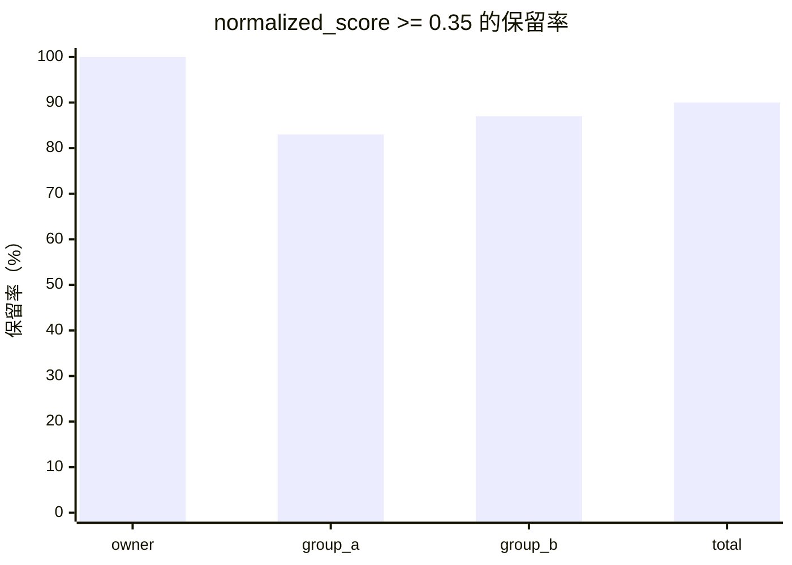

# RAG 质量对照测试报告（2026-08-24）

## 1. 测试目标

比较当前 RAG 候选结果在三种策略下的表现：

1. 不过滤：保留检索器返回的前 5 条；
2. BM25 原始分数：观察原始分数是否可以跨私聊、群聊统一设阈值；
3. `normalized_score`：按本次查询最高分归一化，并模拟 `normalized_score >= 0.35` 的过滤。

本报告只用于评估，不修改线上配置、索引、记忆内容或 RAG 代码。

## 2. 测试前提

### 环境

| 项目 | 值 |
|---|---|
| 环境 | devserver（192.168.110.51） |
| 数据 | 当前测试账号的 owner 记忆与两个 QQ 群 scope |
| 检索来源 | Memory |
| 词法检索 | Rust sidecar；不可用时使用 LegacyBM25 回退 |
| 每组候选数 | 5 |
| 查询数 | 6 |
| scope 数 | 3 |
| 总候选数 | 6 × 3 × 5 = 90 |
| 写入操作 | 无 |

### 测试查询

```text
GTA 6
画布 卡片
项目文件
提醒
图片搜索
记忆
```

### Scope

| 报告名称 | 实际含义 |
|---|---|
| owner | 私聊/网页 owner 记忆 |
| group_a | QQ 群 scope A |
| group_b | QQ 群 scope B |

群 ID、用户 ID、正文内容均未写入报告；候选通过 `chunk_fp` 与 `content_fp` 标识。

## 3. Embedding 前置检查与补测

devserver 当前配置为：

```text
embedding.enabled = true
provider = bailian
model = tongyi-embedding-vision-flash
base_url = 已配置
```

补测结果如下：

| 请求地址 | 结果 |
|---|---|
| `{base_url}/embeddings` | HTTP 404 |
| `{base_url}/compatible-mode/v1/embeddings` | HTTP 404；模型不支持 OpenAI compatibility mode |
| 百炼多模态 embedding endpoint | 请求成功，返回 768 维向量 |
| 当前 Memory 索引缓存向量 | 0 条与当前 model tag 匹配 |

因此当前 RAG 召回链路仍不能执行真实的向量或混合召回：`embedding.embed()` 使用的是 OpenAI 兼容文本路径，返回 404；虽然多模态专用 endpoint 可以返回查询向量，但没有候选文档向量缓存，无法计算候选余弦分数。下面的完整候选结果仍是 BM25 对照结果，不应误读为混合召回结果。

## 4. 策略定义

### 策略 A：不过滤

保留每个查询返回的前 5 条，不检查分数。

### 策略 B：BM25 原始分数

保留 BM25 原始分数和排名，但不使用未经校准的全局阈值。原因是不同 scope 的分数分布不一致。

### 策略 C：归一化分数

```text
normalized_score = 当前候选分数 / 本次查询最高分
```

本次模拟过滤条件：

```text
normalized_score >= 0.35
```

这只是离线评估阈值，不代表已经上线。

## 5. 总体结果



| 策略 | 保留候选 | 过滤候选 | 保留率 | 结论 |
|---|---:|---:|---:|---|
| 不过滤 | 90 | 0 | 100% | 覆盖率高，但低相关结果全部进入上下文 |
| BM25 原始分数 | 90 | 0 | 100% | 可用于排序，不能直接跨 scope 统一设阈值 |
| normalized ≥ 0.35 | 81 | 9 | 90% | 能过滤明显落后结果，适合作为第一轮灰度方案 |

按 scope 统计：

| Scope | 候选 | normalized 保留 | 过滤 | 保留率 |
|---|---:|---:|---:|---:|
| owner | 30 | 30 | 0 | 100% |
| group_a | 30 | 25 | 5 | 83.3% |
| group_b | 30 | 26 | 4 | 86.7% |

## 6. 原始分数不可直接统一比较

以查询 `GTA 6` 为例：

| Scope | 最高分 | 第五名分数 | 分数区间 |
|---|---:|---:|---:|
| owner | 18.230 | 10.698 | 10.698–18.230 |
| group_a | 7.486 | 2.168 | 2.168–7.486 |
| group_b | 3.111 | 1.140 | 1.140–3.111 |

如果统一使用 `raw_score >= 5`：

- owner 会保留大多数结果；
- group_a 只保留部分结果；
- group_b 基本全部被过滤。

因此 BM25 原始分数适合排序，不适合直接作为跨群聊、私聊的统一质量门槛。

## 7. 完整候选结果

字段说明：

- `chunk_fp`：候选 chunk 标识指纹；
- `content_fp`：正文指纹；
- `raw`：BM25 原始分数；
- `norm`：本次查询内归一化分数；
- `keep`：是否通过模拟的 `norm >= 0.35`。

### owner

| 查询 | # | source | chunk_fp | content_fp | raw | norm | keep |
|---|---:|---|---|---|---:|---:|:---:|
| GTA 6 | 1 | daily | 3ea8b05ad7 | 616aa64e3b | 18.230 | 1.000 | ✓ |
| GTA 6 | 2 | daily | 4a465f92e1 | 192b38b7bc | 16.589 | .910 | ✓ |
| GTA 6 | 3 | profile | bf8d18932e | f096e550b6 | 11.218 | .615 | ✓ |
| GTA 6 | 4 | memory | 1af1367e9d | e7953b06b7 | 10.841 | .595 | ✓ |
| GTA 6 | 5 | daily | 548f7d9926 | 90c1f2ebd8 | 10.698 | .587 | ✓ |
| 画布 卡片 | 1 | pattern | 93b5461197 | ad10434405 | 16.645 | 1.000 | ✓ |
| 画布 卡片 | 2 | memory | 92418fc8f2 | e082751c4c | 14.782 | .888 | ✓ |
| 画布 卡片 | 3 | pattern | 70080dcf24 | 48eb32797f | 14.779 | .888 | ✓ |
| 画布 卡片 | 4 | pattern | c18f300776 | 5be0e07e4a | 14.260 | .857 | ✓ |
| 画布 卡片 | 5 | profile | 0b304b2fee | c8e0d0244e | 14.192 | .853 | ✓ |
| 项目文件 | 1 | pattern | 93b5461197 | ad10434405 | 24.574 | 1.000 | ✓ |
| 项目文件 | 2 | profile | 0b304b2fee | c8e0d0244e | 24.512 | .997 | ✓ |
| 项目文件 | 3 | profile | f9025bcd17 | d5f38bedef | 21.728 | .884 | ✓ |
| 项目文件 | 4 | pattern | c0daab1aa1 | 10bd8fb6c0 | 20.549 | .836 | ✓ |
| 项目文件 | 5 | pattern | 04b367c12a | 8b7fb3ec91 | 20.490 | .834 | ✓ |
| 提醒 | 1 | pattern | 61d22364eb | cae67187bf | 16.257 | 1.000 | ✓ |
| 提醒 | 2 | pattern | f4a5b87303 | 32580b0c99 | 15.763 | .970 | ✓ |
| 提醒 | 3 | daily | bf3bb02469 | ea7f50d513 | 15.297 | .941 | ✓ |
| 提醒 | 4 | pattern | 0a802f90f9 | 7718a5bb5a | 14.859 | .914 | ✓ |
| 提醒 | 5 | daily | 56e7756758 | ade74e3f3a | 14.859 | .914 | ✓ |
| 图片搜索 | 1 | pattern | 5a3ed125bc | 2d25e8ed83 | 25.859 | 1.000 | ✓ |
| 图片搜索 | 2 | daily | 7ce7013df6 | 3b202bbe74 | 19.038 | .736 | ✓ |
| 图片搜索 | 3 | daily | b1486d6959 | 1a78cf106d | 18.260 | .706 | ✓ |
| 图片搜索 | 4 | daily | d31157c751 | e125fb30d2 | 16.203 | .627 | ✓ |
| 图片搜索 | 5 | pattern | 50dc05ed01 | 22138669a4 | 15.741 | .609 | ✓ |
| 记忆 | 1 | pattern | 3a86dc84f6 | 6275e2bb2b | 2.726 | 1.000 | ✓ |
| 记忆 | 2 | memory | 205c5d9eb7 | b296879b07 | 2.532 | .929 | ✓ |
| 记忆 | 3 | memory | 74a31e6ab9 | ed523ee114 | 2.532 | .929 | ✓ |
| 记忆 | 4 | daily | 34dc00cc18 | da9bc7fc2c | 2.377 | .872 | ✓ |
| 记忆 | 5 | profile | 5ea218ae42 | e4ef3b7f18 | 2.169 | .796 | ✓ |

### group_a

| 查询 | # | source | chunk_fp | content_fp | raw | norm | keep |
|---|---:|---|---|---|---:|---:|:---:|
| GTA 6 | 1 | memory | daf372b592 | 4e65e479f3 | 7.486 | 1.000 | ✓ |
| GTA 6 | 2 | memory | 7e26a7546e | 226d03225f | 5.063 | .676 | ✓ |
| GTA 6 | 3 | daily | 51f23261b5 | 9ee88d4bcf | 3.098 | .414 | ✓ |
| GTA 6 | 4 | daily | 530cb9fc8c | 2ba8c4a000 | 2.845 | .380 | ✓ |
| GTA 6 | 5 | daily | 8e961930b2 | 72c73df528 | 2.168 | .290 | ✗ |
| 画布 卡片 | 1 | daily | c01ddebc2d | 6e97dd2b7c | 3.948 | 1.000 | ✓ |
| 画布 卡片 | 2 | daily | 312811c05d | d314856cb1 | 2.794 | .708 | ✓ |
| 画布 卡片 | 3 | daily | 97b72ad272 | 6cfa61c75e | 1.186 | .300 | ✗ |
| 画布 卡片 | 4 | profile | 8c2221e031 | a14796998f | 1.117 | .283 | ✗ |
| 画布 卡片 | 5 | daily | 9f461b2423 | 578eee598b | .920 | .233 | ✗ |
| 项目文件 | 1 | daily | 312811c05d | d314856cb1 | 6.606 | 1.000 | ✓ |
| 项目文件 | 2 | daily | 49ec5b1bad | b09ba593cd | 6.024 | .912 | ✓ |
| 项目文件 | 3 | profile | 8c2221e031 | a14796998f | 4.848 | .734 | ✓ |
| 项目文件 | 4 | memory | daf372b592 | 4e65e479f3 | 3.779 | .572 | ✓ |
| 项目文件 | 5 | daily | 8f67e997ae | f34121f25f | 3.617 | .548 | ✓ |
| 提醒 | 1 | daily | 9f461b2423 | 578eee598b | 1.018 | 1.000 | ✓ |
| 提醒 | 2 | daily | 8f67e997ae | f34121f25f | .893 | .877 | ✓ |
| 提醒 | 3 | daily | 64806d285d | 906b351ec5 | .867 | .851 | ✓ |
| 提醒 | 4 | daily | 530cb9fc8c | 2ba8c4a000 | .685 | .673 | ✓ |
| 提醒 | 5 | daily | 8e961930b2 | 72c73df528 | .685 | .673 | ✓ |
| 图片搜索 | 1 | daily | c01ddebc2d | 6e97dd2b7c | 9.225 | 1.000 | ✓ |
| 图片搜索 | 2 | daily | 97b72ad272 | 6cfa61c75e | 7.862 | .852 | ✓ |
| 图片搜索 | 3 | daily | 312811c05d | d314856cb1 | 5.739 | .622 | ✓ |
| 图片搜索 | 4 | profile | 8c2221e031 | a14796998f | 4.234 | .459 | ✓ |
| 图片搜索 | 5 | daily | 9f461b2423 | 578eee598b | 3.037 | .329 | ✗ |
| 记忆 | 1 | memory | daf372b592 | 4e65e479f3 | .998 | 1.000 | ✓ |
| 记忆 | 2 | memory | 7e26a7546e | 226d03225f | .983 | .985 | ✓ |
| 记忆 | 3 | daily | 51f23261b5 | 9ee88d4bcf | .682 | .683 | ✓ |
| 记忆 | 4 | daily | 530cb9fc8c | 2ba8c4a000 | .654 | .655 | ✓ |
| 记忆 | 5 | daily | 8e961930b2 | 72c73df528 | .621 | .623 | ✓ |

### group_b

| 查询 | # | source | chunk_fp | content_fp | raw | norm | keep |
|---|---:|---|---|---|---:|---:|:---:|
| GTA 6 | 1 | daily | 1f9a670f34 | 418dae488c | 3.111 | 1.000 | ✓ |
| GTA 6 | 2 | daily | 3392b597ad | decd36074a | 2.919 | .938 | ✓ |
| GTA 6 | 3 | daily | 90cbf9b7e5 | 591d6d493b | 2.279 | .733 | ✓ |
| GTA 6 | 4 | memory | 9bd5c5cbc7 | 61d2f7ac7d | 1.184 | .381 | ✓ |
| GTA 6 | 5 | memory | 2a9b876be5 | 34a3f819e3 | 1.140 | .366 | ✓ |
| 画布 卡片 | 1 | memory | 84074b1803 | 86d1cc1d52 | 7.030 | 1.000 | ✓ |
| 画布 卡片 | 2 | profile | 38affb532b | 64ac2c6a18 | 1.688 | .240 | ✗ |
| 画布 卡片 | 3 | memory | 2a9b876be5 | 34a3f819e3 | 1.283 | .182 | ✗ |
| 画布 卡片 | 4 | profile | ac148c6e78 | 241efa5f03 | 1.055 | .150 | ✗ |
| 画布 卡片 | 5 | daily | 3392b597ad | decd36074a | .905 | .129 | ✗ |
| 项目文件 | 1 | profile | ac148c6e78 | 241efa5f03 | 6.146 | 1.000 | ✓ |
| 项目文件 | 2 | profile | 38affb532b | 64ac2c6a18 | 5.920 | .963 | ✓ |
| 项目文件 | 3 | memory | 3b62428d82 | f31aa1e2ad | 5.772 | .939 | ✓ |
| 项目文件 | 4 | memory | 9bd5c5cbc7 | 61d2f7ac7d | 4.303 | .700 | ✓ |
| 项目文件 | 5 | memory | 84074b1803 | 86d1cc1d52 | 2.895 | .471 | ✓ |
| 提醒 | 1 | daily | 90cbf9b7e5 | 591d6d493b | 1.554 | 1.000 | ✓ |
| 提醒 | 2 | daily | 1f9a670f34 | 418dae488c | 1.220 | .785 | ✓ |
| 提醒 | 3 | memory | 2a9b876be5 | 34a3f819e3 | 1.194 | .769 | ✓ |
| 提醒 | 4 | memory | 84074b1803 | 86d1cc1d52 | 1.121 | .722 | ✓ |
| 提醒 | 5 | profile | 38affb532b | 64ac2c6a18 | .829 | .534 | ✓ |
| 图片搜索 | 1 | profile | ac148c6e78 | 241efa5f03 | 6.116 | 1.000 | ✓ |
| 图片搜索 | 2 | profile | 38affb532b | 64ac2c6a18 | 5.378 | .879 | ✓ |
| 图片搜索 | 3 | daily | 1f9a670f34 | 418dae488c | 4.205 | .688 | ✓ |
| 图片搜索 | 4 | daily | 90cbf9b7e5 | 591d6d493b | 3.653 | .597 | ✓ |
| 图片搜索 | 5 | memory | 84074b1803 | 86d1cc1d52 | 2.608 | .426 | ✓ |
| 记忆 | 1 | memory | 3b62428d82 | f31aa1e2ad | 1.272 | 1.000 | ✓ |
| 记忆 | 2 | daily | 7efa99fc3f | a1ca960a4a | 1.242 | .976 | ✓ |
| 记忆 | 3 | memory | 84074b1803 | 86d1cc1d52 | 1.207 | .949 | ✓ |
| 记忆 | 4 | memory | 9bd5c5cbc7 | 61d2f7ac7d | 1.172 | .921 | ✓ |
| 记忆 | 5 | memory | 2a9b876be5 | 34a3f819e3 | 1.086 | .854 | ✓ |

## 8. 结果解释

### 8.1 归一化有效，但单独使用仍不够

`normalized_score >= 0.35` 能有效过滤同一 scope 内明显落后的候选，尤其是 group_b 的“画布 卡片”查询，5 条只保留 1 条。

但归一化有一个已知风险：如果一批候选整体都不相关，最高分仍然会被归一化成 1。因此不能只使用相对门槛。

### 8.2 “原始分数 + 归一化分数”更合理

正式方案建议：

```text
通过 = absolute_quality_floor AND normalized_score >= relative_floor
```

其中：

- `absolute_quality_floor` 按检索类型校准，不能直接复用不同引擎的分数；
- `relative_floor` 初始可从 0.35 灰度；
- BM25、向量、混合检索分别计算自己的归一化分数；
- 群聊、私聊、Web 共用质量策略，只保留权限 scope 差异。

### 8.3 向量测试前置工作

需要先完成以下任一项：

1. 把 embedding base URL 配置为支持该模型的百炼 embedding endpoint；或
2. 更换为支持 OpenAI `/embeddings` 兼容模式的模型；或
3. 为百炼多模态 embedding 增加专用 adapter，不复用聊天兼容端点。

完成后再补同一组查询的：

- BM25 原始分数；
- 向量余弦原始分数；
- 混合分数；
- 各自归一化分数；
- 过滤前后候选差异。

## 9. 建议的下一步

1. 保留当前线上行为不变，先加入 dry-run 质量统计；
2. 先对 BM25 使用 `normalized_score >= 0.35` 做灰度统计，不立即过滤；
3. 收集一批真实查询后校准 BM25 的绝对门槛；
4. 修复 embedding 配置后补做向量/混合检索对照；
5. 最终在 `UnifiedRecallService` 统一过滤，避免群聊和私聊出现两套阈值。

## 10. 2026-08-24 embedding 开启后的补测结论

本次只改变了 devserver 的 embedding 开关，没有修改仓库代码。验证结果：

1. 配置开关已为 `true`；
2. 当前模型的文本兼容接口仍为 404；
3. 多模态接口可以生成查询向量，但现有 Memory 索引没有匹配的缓存向量；
4. 因此没有新增“BM25 原始分数 vs 向量原始分数 vs 混合分数”的有效对照数据；
5. 需要先完成 embedding adapter 和索引向量重建，再重新运行本报告的 18 组测试。
