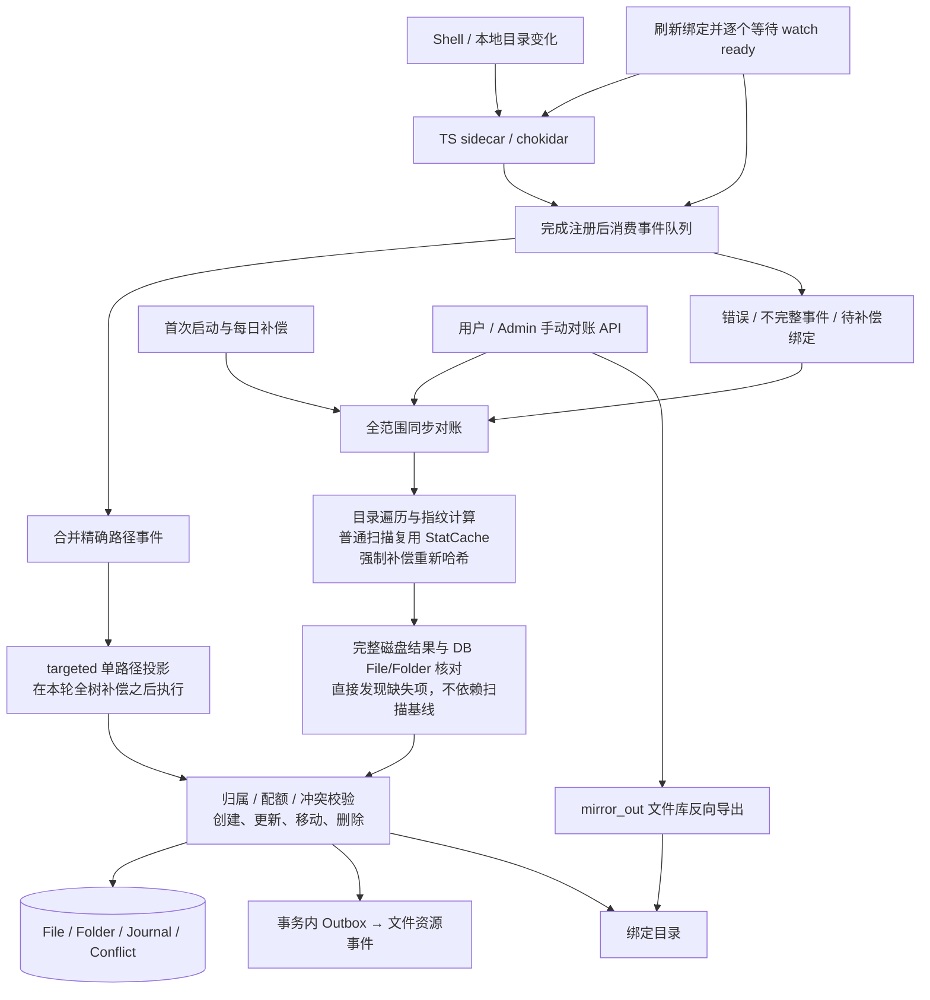
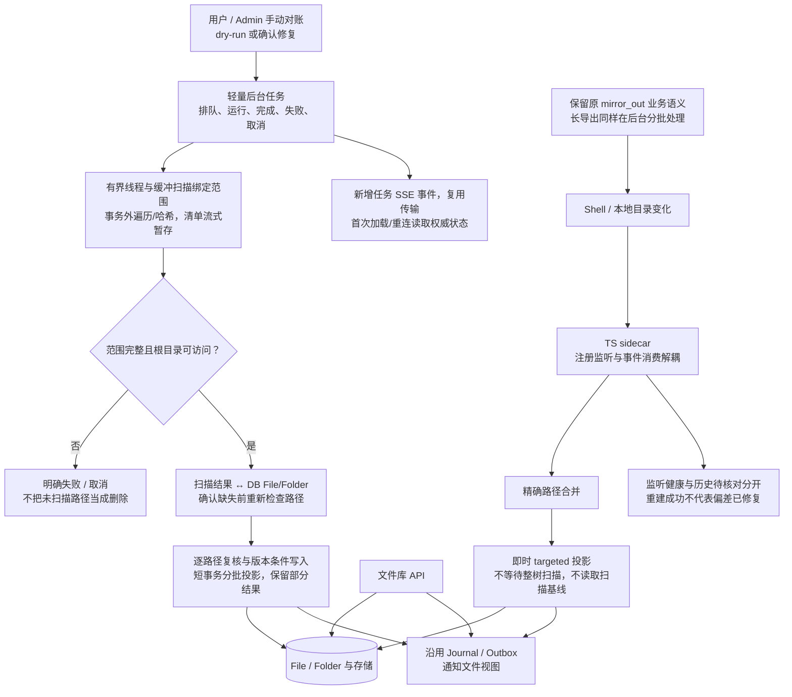

# 文件同步旧架构与手动对账收敛方案

状态：方案已确认，新实现待实施。旧快照重构已保存并推送到 `codex/archive-filesync-snapshot-20261007`（`04f339176`）；开发线恢复至 `a0ed9ccb8` 的运行实现，保留全部非同步提交和既有数据库迁移。实施清单以 [PRD-FS-7](../prds/PRD-FS-7-实时文件同步与手动异步对账.md) 为准；本轮未重启服务或操作数据库。

## 旧版依据

以本轮开始时的已提交版本 `c83427508` 为依据，不以工作区尚未提交的 FS-6 实现为依据。核对入口：

- `backend/app/services/filesync/watcher.py`：监听注册、事件消费、首次与周期补偿。
- `backend/app/services/filesync/ts_sidecar.py` 和 TS watcher：注册请求与 ready 应答。
- `backend/app/services/filesync/targeted.py`：精确路径投影。
- `backend/app/services/filesync/reconcile.py`：全范围扫描与数据库记录核对。
- `backend/app/services/filesync/bindings.py`、用户及 Admin API：直接执行手动对账。

此处“旧版”指运行实现，不代表数据库没有预先提交的迁移：已有迁移链必须单独审计，不能因为决定撤回工作区重构，就删除已发布/已执行的迁移。

## 旧版架构

旧版没有运行中的持久扫描队列、检查点或不可变基线。全树扫描在异步函数里执行同步遍历，并占用调用方的执行流程与数据库会话；API 请求可能等待扫描完成。Watcher 同一轮先完成监听注册，再消费事件，先执行整树补偿，再执行 targeted。

所以需要分开解决两个问题：全树扫描的超时/事务占用，以及监听初始化阻塞实时消费。旧版也存在后一个问题，撤回 FS-6 不会自动解决它。

## 目标架构

### 取舍与范围

1. 取消每日自动整树扫描；不让实时事件、监听注册或恢复重连触发隐式全树扫描。首次绑定如需要历史导入，复用明确可见的初始化对账任务；不在 watcher 启动时隐式扫所有用户。
2. 保留现有 targeted、路径安全、归属、冲突、配额、Journal/Outbox 和 mirror_out 业务语义；普通路径变更仍即时更新。mirror_out 的文件库变更触发方式单独核对，不因取消每日扫描而丢失。
3. 手动对账只需要任务状态、进度、取消标记、执行归属与防重复领取。数据库原子领取必须覆盖多 Worker；线程数有限，同一绑定不得重复扫描。不再增加独立用户租约表、活动周期状态或基线发布状态机。
4. 扫描与哈希进入有界线程执行器，在遍历/文件读取边界检查取消和时间预算；不能把协程取消误认为线程已经停止。数据库会话只在查询/投影批次短期开启，线程不共享 AsyncSession。
5. 接受失败、重启、超时后重新扫描，不做跨进程扫描检查点续跑。进度可持续更新，但超时/取消不发布“对账完成”；已经成功提交的投影批次不宣称回滚。
6. 全范围扫描结果必须与 DB 中该绑定覆盖的现存 File/Folder 分批核对，不能只比较两份扫描快照。根目录不可用、遍历异常、取消或扫描不完整均不能触发缺失删除。删除前重新检查磁盘，冲突与失败保留并可见；扫描期间新增变更继续由实时路径处理，手动任务不宣称拥有原子文件系统快照。
7. 不新增扫描基线、分片代次、CAS 发布、持久目录游标或活动用户跳过规则。若以后有明确的扫描性能指标需要指纹缓存，作为扫描内部优化单独验证，不成为实时同步或缺失检测的正确性依赖。
8. Watcher 独立修复：消费事件不等待目录 ready；注册/命令并发有界，区分已注册与 ready。监听错误、队列溢出、资源额度耗尽必须可见，不能吞错后标为可靠。

取消自动补偿不是“监听绝不漏事件”的保证。服务停机、监听失败或队列溢出期间的变更可能留在磁盘而未入库；管理员/用户需手动对账恢复。这是目标方案明确接受的运维取舍。

### 2026-10-07 补充的执行边界

- **健康可见**：后台显示监听健康及“需要手动核对”。监听恢复只恢复后续事件，不自动清除历史提示；完整修复覆盖原缺口且未出现新缺口后才能清除，dry-run 不清除。
- **SSE 是扩展协议，不是现成进度能力**：复用传输、鉴权与用户隔离，新增任务状态/进度及健康失效事件，配套过滤、类型和订阅。首次加载与重连查询权威快照；事件合并、限频且处理重复/乱序，不新增固定高频轮询。
- **线程有界不代表内存有界**：清单流式写入任务私有临时索引，条目数/字节数双重限额与背压，DB 分页、哈希分块和文件句柄有上限。不能先把整树载入内存；清单确认完整后才处理缺失项，临时盘不足也不得判为删除。临时清单不成为基线或持久检查点。
- **扫描不能覆盖实时新结果**：创建、更新、移动、删除均复核当前磁盘与路径变更事实；发现较新状态就重读或跳过。写入阶段使用与 targeted 共用的对象版本条件或锁内检查，堵住复核后到提交前的竞态；移动核对两端，新路径唯一性冲突后重读，不新增全树水位框架。
- **部分副作用与幂等性**：已提交变更计数同业务批次提交，失败/取消重载后仍可见，和扫描/计划进度分开；UI 明示未整轮回滚。从头重试不重复增加版本、配额或业务事件，不以任务 ID 替代业务幂等条件。
- **协作取消验收**：分别覆盖目录遍历和大文件分块读取，在实际线程退出及事务收口前不释放任务占用；测试观察线程与后续任务，不能只断言等待协程被取消。

上述补充仅收紧实施契约与验收，不增加基线、周期调度或检查点；详细要求与 TODO 以 PRD-FS-7 为准。

## 实施顺序

- [x] 保存并清点 FS-6 工作区改动，提交推送至独立分支；保留已提交迁移。已部署数据状态待实施前核对。
- [x] 恢复原运行主干，保留其他功能提交及迁移链，不降级数据库。
- [ ] 单独修复 watcher 注册阻塞/队列消费，探针覆盖大根目录初始化期间创建、等长修改和删除。
- [ ] 将全树对账扫描移到有界线程/缓冲与短事务批次，API 返回任务；扩展任务 SSE 事件并实现重连权威状态补读。
- [ ] 移除每日整树调度；明确初始化导入、手动恢复和 mirror_out 的入口。
- [ ] 验收：实时删除不依赖快照；手动对账能处理磁盘缺失的 DB 记录；根不可用不删记录；扫描不阻塞实时事件；取消/超时/重启可见且不误报完成；跨用户隔离与重复领取受保护。
