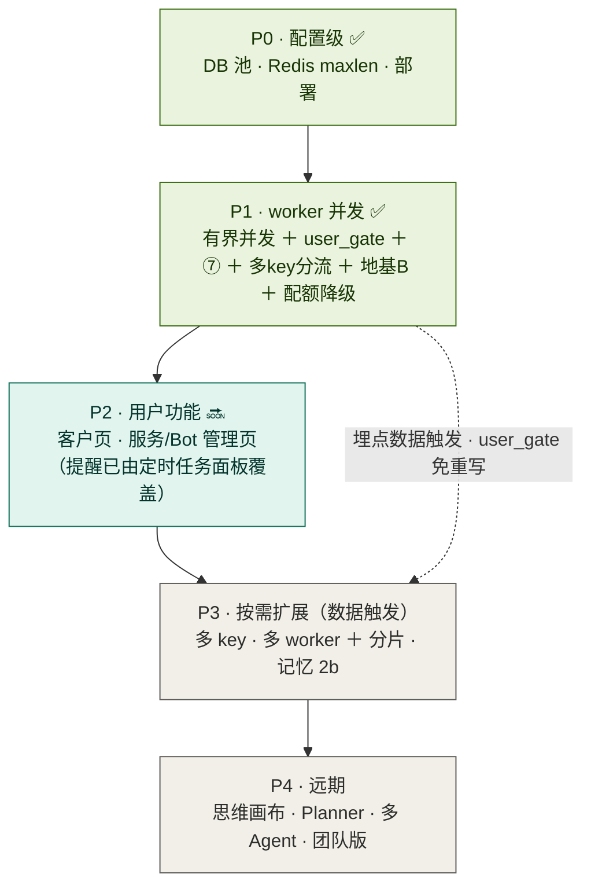

# 咕咕 · 并发优化 Roadmap

> 创建 2026-06-24｜核实 2026-07-02（对照代码 + CHANGELOG 复核 P0–P4 完成度，见文中 ✅ 更新标注）
> 范围：IM/Agent 扩量主线的分期 + 依赖 + Admin 可管理项
> 相关：[决策环](../agent/决策环.md) · [IM 接入架构](../agent/IM接入架构.md) · [压测结果](并发压测结果.md)

## 易读概述（不懂后端也能看懂）

> 想直接看"不带术语的大白话版"，跳到下方 [每一步在做什么（通俗版）](#每一步在做什么通俗版) ——已经写好了逐条大白话解释，这里只做全局导读。

这份文档在回答一个问题：**咕咕现在能同时服务多少人聊天，还能不能撑更多？** 现状是"够用但有上限"——不是加机器就能无脑扩容，真正的瓶颈是**大模型 API 的限流额度**（每个 key 同时能处理的请求数是有上限的，超了会被拒绝）。

优化按"从便宜到贵"分成五期（P0–P4）：先调几个配置数字（免费）、再让程序能同时处理多个人的消息而不是排队（P1，核心改动，已完成）、然后加用户看得见的功能页面（P2）、真撑不住了再加机器或多备几个 API key（P3，按数据触发，不提前做）、远期才是更大的功能构想（P4）。**当前 P0/P1 已完成，P2 大部分就绪，P3/P4 尚未开始**（见下方状态总览表）。

**核心决策：默认单机。** 扩量靠单机内手段（async 并发、多 LLM key、DB 池、`uvicorn --workers N`），不上跨主机控制面。`user_gate` 用进程内锁即终态，P3 多 worker/分片 park。**瓶颈是 LLM provider 限流额度，不是机器。**

图例：✅ 完成 · 🔜 进行中 · ⬜ 未开始 · ⏸️ 按需/数据触发

---

## 当前状态一览

| 阶段 | 状态 | 内容 |
|------|------|------|
| 已交付 | ✅ 已部署 | 取消修复 / 对账 / 批量工具 / 多模态 / 搜索 + 定时任务多平台投递 |
| P0 配置级 | ✅ 基本完成 | DB 池 ⑤ · Redis maxlen · 提交部署 |
| **P1 worker 并发** | ✅ **核心完成** | ①⑦ + 并发热配 + 多 key 分流 + 地基 B + 配额降级 全部上线；地基 A 跟 ④ 后推（按数据触发） |
| P2 用户功能 | 🟡 大部分就绪 | 服务/Bot 管理页 ✅ 已建；提醒由定时任务面板覆盖；客户页 ⏸️ 暂不做 |
| P3 按需扩展 | ⏸️ | 多 key / 多 worker，由埋点数据触发 |
| P4 远期 | ⬜ | 思维画布 · Planner · 多 Agent · 团队版 |

**下一步**：P1 核心全部上线（①⑦ + 并发热配 + 多 key 分流 + 地基 B + 配额降级，见[压测](并发压测结果.md)）。地基 A 跟 ④（web 多 worker）后推、由埋点数据触发。可转 **P2 用户功能**（客户页 / 服务·Bot 管理页；提醒已由用户自定义定时任务面板覆盖）。

---

## 分期总览



---

## 分期明细

### ✅ P0 · 配置级（基本完成）

- ✅ 提交 + 部署（devserver 跑最新代码）
- ✅ ⑤ DB 连接池 `pool_size=15 / max_overflow=25 / timeout=10 / recycle=1800`
- ✅ Redis stream `maxlen=10000`（早已设）
- 🔜 后推：④ `uvicorn --workers N`（挂 P1-地基A 之后）· ⑥ 换 provider（按需，随时可换 flash 模型，不阻塞）

### 🔜 P1 · 解锁 worker 并发 → 50+ 人（架构核心）

**① 并发化** — ✅ 已上线（~6× 提速，worker 已重启加载；端到端实测 6 条 8.1s vs 串行 24s）

- ✅ `run_once` 串行 `for await` → 有界并发（`asyncio.create_task` + 空闲槽背压）
- ✅ `user_gate(puid)`：进程内 `asyncio.Lock`，同用户串行保序、不同用户并发（单机下即终态）
- ✅ 优雅 drain：SIGTERM 停收新消息、等在跑的跑完再退
- ✅ `msg_id` 幂等去重（修 `claim_stale` 60s 重投的重复回复）
- ✅ 并发上限可热配（`agent.worker_concurrency` 默认 16，Admin→Agent→行为，worker 30s 热读；已上线）

**地基加固**

| 项 | 状态 | 问题 | 修法 |
|----|------|------|------|
| A 周期任务单实例化 | ⏸️ **后推（跟 ④）** | `lifespan` 清理/刷日志循环每 uvicorn worker 重复跑——**只有 web 多 worker 才出现**，现在单进程没事 | Redis leader 锁（SETNX+TTL）或搬到 worker。**是 ④ 的前置，跟 ④ 一起做** |
| B 死 consumer 清理 | ✅ 完成 | `CONSUMER={host}-{pid}` 重启换 pid，旧的留组里累积（曾堆 79 个） | 改稳定名 `{host}`（重启复用、不再积累）+ 启动 `cleanup_dead_consumers`（空闲>30min+无pending 即删，保留自己）。已清掉 78 个 |
| D supervisor 轮询 | ⬜ 次要 | 每 1s 查 DB（user_bots 很少变） | 间隔拉长 / bot 变更 pub/sub |

**韧性 & 观测**

- ✅ ⑦ 慢尾兜底：LLM 调用瞬时错误（429/超时/网络/5xx）出 token 前退避重试（实测 sem=20 带工具 0/12→12/12）
- ✅ 配额能力降级：配额耗尽不再硬拦，降级到只读工具集（12/47）+ 提示婉拒重操作——查询/对话照常（web 路；`adapters/web.py` + `profile.light_tool_names`）
- 🟡 埋点：任务耗时 / 队列深度（⑨ 监控已在服务页，为 P3 供数）

> 配套：动了取消/状态核心，需并发冒烟测（多用户并发 + 同用户连发，验顺序/取消/状态不串）——逻辑层已单测通过。

### ⬜ P2 · 用户功能（依赖 P1 地基/埋点）

- 客户管理页（后端 + Agent 工具就绪，只差前端）—— ⏸️ 暂不做
- ~~主动触达 / 截稿提醒（系统默认）~~ **改为用户自定义**：定时任务面板已建（用户自己设提醒/任务，结果走通知+IM），不做系统默认截稿扫描
- ✅ 服务状态页 / Bot 管理页：`Admin/Services` 已建——三进程状态/PID/心跳 + 一键重启 + Redis/DB 依赖 + IM 队列(length/lag/pending) + supervisor 网关总览(各 bot) + worker 定时任务。实测三服务 online、网关 feishu/qq 都在

### ⏸️ P3 · 按需扩展（数据驱动，别提前）

- **多 provider key**（扩吞吐的正道：每 key ~16 并发，总 ≈ 16×key 数）
- 多 worker + `hash(puid)` 分片（撞单进程 CPU 上限才上；届时 `user_gate` 换 Redis 锁，上层不动）
- 记忆 2b：`summary.md` 快照 + 分层压缩（记忆真溢出才做）

### ⬜ P4 · 远期

思维画布 · Planner（不预造框架）· 多 Agent · 小模型意图分类（需 GPU）· 团队版 ToB · OSS 直传 · Casdoor SSO

---

## 每一步在做什么（通俗版）

> 不带术语地讲清每个阶段和每项任务到底解决什么问题。

### 阶段（P0–P4）一句话

- **P0 配置级**：不改代码架构，只调几个配置数字（数据库连接数、Redis 队列上限）就能拿到的余量。最便宜的那批。
- **P1 worker 并发**（核心）：让 worker 能**同时处理多个人**的消息。现在是「一次一条、排队」，做完能从「个位数同时在线」提到「50+ 人」。
- **P2 用户功能**：给用户加看得见的功能——客户管理页、后台服务/Bot 管理页。（到点提醒已由「用户自定义定时任务面板」覆盖，不做系统默认截稿扫描。）
- **P3 按需扩容**：单机真撑不住了才上的重武器（多机、按用户分片）。**靠监控数据触发，不提前做。**
- **P4 远期**：雄心功能（思维画布、Planner、多 Agent、团队版），以后再说。

### 任务 ①–⑨ + 地基，逐个讲

- **① worker 串行→并发**：worker 处理一条消息时大部分时间在**干等大模型回话**。原来一次只处理一条，第 5 个人得等前 4 个跑完。改成**同时处理多条**（不同人并行、同一个人按顺序），吞吐 ~6×。✅
- **② 标题/反思移出关键路径**：开新对话时，原来要等「自动生成对话标题」那次大模型调用跑完，回复才发出去——白等 1~10 秒。改成**回复先发，标题后台慢慢补**。✅
- **③ 多开 worker 进程**：一个 worker 进程不够用时，多开几个分担（Redis 消费组会自动把消息分给它们）。⏸️ 数据触发才做。
- **④ uvicorn 多 worker**：web 接口进程也多开几个吃满多核 CPU。后推（要先做地基 A，否则周期任务会重复跑）。
- **⑤ 数据库连接池调大**：数据库同时能开的连接数原来默认才 15，高并发会不够用。调到 40。✅
- **⑥ 换/加大模型 provider**：换个更快更稳的模型，或多备几个 API key（每个 key 一份限流额度，凑起来吞吐更高）。**多备 key 分流已做完**（后台选「多 key 分流」策略即可用）；换用更智能的路由算法自动选模型仍是空插槽，按需再接。
- **⑦ 慢尾兜底（重试）**：大模型偶尔抽风（限流 429、超时）。原来直接失败，现在**自动等几秒重发**，把「硬失败」变「慢几秒但成功」。✅
- **⑧ IM 流式体验**：飞书/QQ 里**边生成边显示**，或先回个「思考中…」占位，让慢的时候有反馈、不像卡死。
- **⑨ 队列监控+告警**：盯着消息队列**积压了多少**，超过阈值就告警提醒「该加 worker 了」。监控已有，告警待做。
- **地基 A · 周期任务单实例化**：像「定时清理」这种循环任务，多开进程后会**每个进程各跑一遍**（重复）。让它**只在一个进程跑**。是 ④ 的前提。
- **地基 B · 清死 consumer** ✅：worker 每次重启换名字注册到 Redis 消费组，旧名字永留（曾堆 79 个）。已改稳定名 + 启动清理，**不再堆垃圾**（已清掉 78 个）。
- **地基 D · supervisor 别狂查库**：管 Bot 的进程每秒查一次数据库（其实 Bot 很少变），拉长间隔即可。次要。

---

## ①–⑨ backlog ↔ 分期

| № | 任务 | 分期 | 状态 |
|---|------|------|------|
| ① | worker 串行 → 有界并发 + user_gate | P1 | ✅ 已上线 + 端到端验证（8.1s vs 串行 24s） |
| ② | 标题/反思移出关键路径 | — | ✅ 完成（均 fire-and-forget） |
| ③ | 多开 worker（消费组 + systemd） | P3 | ⏸️ 依赖 ①；需 `user_gate` 升级分片/Redis 锁 |
| ④ | uvicorn --workers N | P1 后推 | ⬜ 需先做地基A；dev 现用 --reload 单进程 |
| ⑤ | DB 连接池调大 | P0 | ✅ 完成（15+25） |
| ⑥ | 换/加 provider · 多 key 分流 | 按需 | 🟡 多 key 分流已完成（`pick_model` 解析层 active/pool/router 已实现，见上节 + [压测](并发压测结果.md) §三点五）；Router 策略仍是空插槽，智能路由本身待做 |
| ⑦ | 慢尾兜底：瞬时错误退避重试 | P1 | ✅ 完成（anthropic 路；实测 sem=20 全 429→全成功） |
| ⑧ | IM 流式体验 | P2 | ⬜ 独立 UX 轨 |
| ⑨ | 队列水位监控 + 告警 | P2 | 🟡 监控已有，告警待做 |

---

## 模型解析层 `pick_model`（多 key 分流 + Router 铺路）

> 给 ⑥（多 key 扩吞吐）和未来 Router 铺一层统一的「选哪个模型」抽象——调用层只对接这一个口子。

**✅ 已实现（核实于 2026-07-02，`backend/agent/llm_select.py`）**：下面描述的铺路方案**已经落地**，不再是计划中——`pick_model(settings, ctx)` 已是调用层唯一决策点，三种策略（`active`/`pool`/`router`）、三种池内选取方式（`random`/`round_robin`/`least_loaded`）均已实现并在[压测结果](并发压测结果.md) §三点五 实测验证（`least_loaded` 吞吐最优，已成结论）。`release()` 配合 `least_loaded` 做在途计数、`set_router()` 是给未来 Router 的注册口。

**现状**（原描述，仍准确刻画了设计动机）：预设 CRUD + 激活已有（`agent_admin.py` / `Admin/Agent`），调用层**不再**直接读 `settings.ai`，而是统一走 `pick_model`。

**分支逻辑**（已实现，非计划）：

```
strategy = active → 激活预设            （= 老行为，默认，无预设/兜底走此路）
strategy = pool   → 勾了 in_pool 的预设里按 pool_mode 选一个（random / round_robin / least_loaded）
strategy = router → 调注册的 router(ctx)，没注册退回 active（Router 插槽，尚未接入具体路由器）
```

**配置**（`ai_presets`）：`strategy`（active/pool/router）+ 每个预设 `in_pool` 布尔 + `pool_mode`。
**后台 LLM 页**：策略下拉（单一激活 / 多 key 分流 / 智能路由）+ 选「分流」时每预设显示「加入分流池」勾选。

**收益**：
- 后台点一下切策略，不改代码；多 key 分流已可用（选 pool + 勾几个 key，`pool_mode` 建议选 `least_loaded`，见压测结论）。
- **Router 目前仍是插槽未接入**——`set_router()` 已就位，等真正的智能路由器实现后注册进去即可，`pick_model` 内部逻辑不用再动。

**改动**：`config.py`（已加字段）+ `agent/llm_select.py`（已实现 `pick_model`）+ `runner.py`/`core.py`（已改用 `pick_model`）+ 前端 LLM 配置页（已有策略下拉）。关联 backlog ⑥（⑥ 本身"多 key 分流"已完成，"智能路由"仍待做）。

---

## 关键依赖链

```
P0 部署 ✅ → ① 并发 + user_gate + ⑦ + 埋点 (P1) ─〔埋点触发〕→ 多 key / 多 worker (P3)
                        └→ 配额降级 ─────────────→ 稳扛 50+ 人
客户后端 ✅ ──────────────────────────────────→ 客户页 (P2，只差前端)
```

一句话：P1 用一个 `user_gate` 缝把「未来多 worker」从重写变成加组件；功能（P2）和真扩量（P3）挂在 P1 地基和埋点数据上，**P3 由数据触发、不提前**。

---

## Admin 可管理项

> 机制：`config.override.json`（Admin 写、`get_settings` 合并、优先级最高，八节卡片）+ `health.beat`（每进程 5s 上报，TTL 20s）+ `services_admin`（按 pid 安全 kill，配 systemd `Restart=always` = 现成「重启」，不碰 systemctl）。

| 能管什么 | 放哪 | 现状 | 生效 |
|---------|------|------|------|
| 服务状态盘（进程在线/pid/心跳） | 服务管理页 | 🟢 拼装即可 | 实时 |
| 重启 / 停某服务 | 服务管理页 | 🟢 kill + systemd 拉起 | 即时 |
| Bot 开关/增删 | Bot 管理页 | 🟢 toggle→supervisor 1s reconcile | 1s |
| 存储对账 | 数据库卡片 | ✅ 已建 | — |
| DB 池 / **Worker 并发度 C** / MAX_ROUNDS | 数据库 / 行为卡片 | 🟡 加字段 | ⚠️ 需重启 worker |
| 配额能力降级阈值 | 配额卡片 | 🟡 扩展现有 | 热 |
| Redis `maxlen` | Redis 卡片 | 🟡 加字段 | 新消息起 |
| AI 多 key/预设、温度、搜索上限 | Agent 配置 | ✅ 已有 | 热 |

**热生效 vs 需重启**：web 每请求 `get_settings`（热）；worker 启动读一次（DB 池/并发度 → 改后需重启）；prompts 每轮现读（热）。
**暂不放**：worker 扩缩容、分片/分布式锁（是代码不是配置）。
