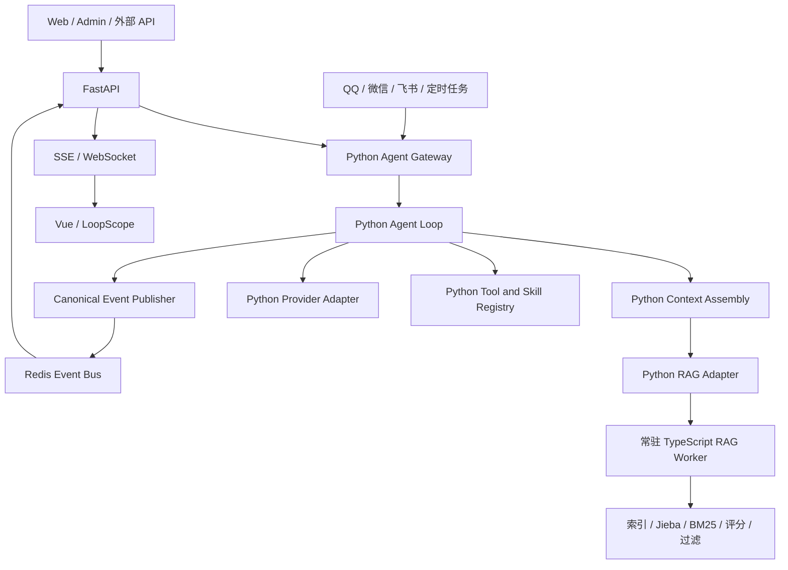

# PRD-ARCH-6：从安全原点恢复 FastAPI 与 Python 后端

## 1. 文档状态

- 状态：恢复目标与实施方案已确定，待实施。
- 基线原点：`8bad5dcd7883d1d7a63d7362482108ce54d6ad02`。
- 目标：恢复原本的 Python/FastAPI API 与 Python Agent 生产链路，保留 pnpm 迁移、完整 TypeScript RAG 链路、后续 Python/前端补丁，并将实时事件能力迁回 Python/FastAPI。
- 本文是独立的功能恢复目标，不要求通过回退或重写当前 Git 历史实现。实施时可以从安全原点建立临时恢复分支，也可以在新分支按文件和功能重新应用补丁。
- 关联文档：`PRD-ARCH-1-TypeScript后端迁移.md`、`PRD-ARCH-5-恢复Python Agent并保留TS RAG.md`、`PRD-UI-2-统一实时事件更新.md`。

## 2. 背景与问题

`8bad5dcd...` 是 API 迁移开始前的安全原点。其后的变更同时包含：

- pnpm workspace、构建和部署改造；
- Python Agent、上下文、RAG、缓存、工具、IM 和稳定性修复；
- Vue 前端功能和视觉修复；
- TypeScript RAG worker 的完整链路增强；
- TypeScript API、TypeScript Agent Runtime、TS DB 和 TS 工具注册迁移。

后续变更不是单一方向的连续迁移，直接整段回退会丢失大量有效修复；直接保留当前 HEAD 又会使 TS API/Agent 与 Python/FastAPI 并存，形成双 owner、启动入口冲突和协议漂移。

本 PRD 采用“安全原点 + 领域筛选 + 目标架构验收”的恢复方式：Git 提交只作为补丁来源，最终是否保留由代码职责和验收结果决定。

## 3. 目标架构



### 3.1 唯一职责

| 能力 | 生产 owner | 约束 |
|---|---|---|
| HTTP、认证、Admin、CRUD | FastAPI | 所有公开 API 只有一个入口 |
| SSE、WebSocket、事件查询 | FastAPI | 不由 TS API 代理或接管 |
| Agent loop、provider、上下文、压缩 | Python Agent | 一个 session/run 只有一个 owner |
| 工具、Skill、权限、确认门 | Python 注册与 dispatch | 保留完整 Python 注册字段和行为 |
| QQ、微信、飞书、定时任务 | Python Worker | 统一提交 canonical command/event |
| RAG 索引和召回 | TypeScript RAG worker | 只处理 RAG，不拥有 API、Agent 或业务权限 |
| PostgreSQL 业务数据 | SQLAlchemy/Alembic/Python | TS DB 不成为业务数据库 owner |
| 实时事件发布 | Python 业务写入/Agent/IM | 通过 Redis canonical event bus 发布 |

### 3.2 明确不保留

- TS API 生产监听、公开路由和 FastAPI 代理入口。
- TS Agent Runtime、TS Agent command host、TS context bridge 和 TS Agent worker。
- TS native business tools、迁移期 Python tool bridge 和第二套工具注册事实源。
- TS DB repository 对业务 PostgreSQL 的写入 owner。
- 仅为了 TS API/TS Agent 迁移增加的启动参数、Compose 服务和 feature flag。

### 3.3 必须保留

- pnpm workspace、锁文件、Node 依赖和 RAG 构建制品流程。
- `backend/ts/workers/rag/`、TS RAG sidecar 协议、Python `ts_sidecar` client、索引缓存、TTL、chunk revision 和诊断 trace。
- 安全原点之后已经完成的 Python Agent、FastAPI、前端、LoopScope、上下文、缓存、工具和 IM 修复。
- 实时事件功能的产品行为、Redis event bus、前端实时刷新和 LoopScope 事件观测；传输入口迁回 FastAPI/Python。
- Makefile 中的 pnpm、Python、RAG 构建、测试、部署、迁移和服务管理命令；删除或隔离 TS API/TS Agent 专属目标。

## 4. 安全原点之后的提交盘点

安全原点到当前 HEAD 共 95 个提交，聚合差异为 445 个文件、约 37,421 行新增和 3,449 行删除。以下分类是恢复时的决策依据，不要求原样 cherry-pick。

### 4.1 直接保留或重新应用

#### pnpm 与构建基础

```text
23ac4ca9  docs: 完善 pnpm 迁移验收记录
cf474745  docs: 统一 pnpm 开发与部署命令
d04124c7  test: 对齐 pnpm 迁移后的 workspace 测试
b17870d7  docs: 记录原生依赖测试环境边界
```

保留 `package.json`、`pnpm-workspace.yaml`、锁文件、`.npmrc` 和与 TS RAG 构建相关的 Makefile/Compose 片段，但不因此启用 TS API。

#### 前端与交互修复

```text
50d48882  修复设计页咕咕球层级
81477f84  修复画布拖入时事件刷新竞态
8dc3b228  修复笔记最近记录搜索
0c1ef88c  统一操作按钮渐变与过渡
b7d151f1  修复画布落地刷新竞态
905f0af7  修复画布移动期间的刷新竞态
6b7fda51  修复画布重抓收尾刷新竞态
ef2ea9e6  清理画布拖拽诊断探针与超时补丁
3a504875  修复聊天表格格式解析
e4841cff  调暗暗色模式开关轨道
823a684a  修复登录按钮悬停动效令牌
00f41317  修复按钮悬停离开淡出动效
89862932  新增咕咕配色与主题解耦 PRD
ee57d37c  修复顶栏按钮悬停文字闪烁
5ac3fc17  统一顶栏主按钮亮色悬停
c9b790a9  调整聊天命令菜单滚动条
08948adc  修复亮色模式文档表格分隔线
a726761c  修复文件面包屑切换动画与重复导航
0be9714f  整理前端文件移动与界面样式
ffe5c39a  统一项目卡片主题样式
4453969d  修复顶栏控件高度对齐
```

应用时只保留 `frontend/` 变更，不把同一提交中的 TS API 路由或 TS API client 一并带入。

#### Python Agent、上下文、稳定性与工具

```text
611d1c7a  修复工具续轮中断后的错误收束
29733530  统一工具续轮异常恢复
21a222c8  修复Web生成收尾状态未初始化
93861b23  优化定时任务工具参数契约
a00570c9  修复跨 run provider 前缀缓存重放
ed3e3c97  修复实时日期写入会话历史
a9949288  修复 RAG 历史重复写入
f4de57bb  修复发送时间重复注入
9ef2d44d  保证 worker 异常退出释放数据库连接
1962a5d9  补 worker 异常退出资源释放回归
c2f96b44  等待 scheduler 作业释放数据库连接
259f2efa  锁定 scheduler 等待式关闭语义
5e824458  放宽 run context 用户消息形状断言
b871ceb0  校正 dynamic tail 回归断言
2d6a965a  重整 Agent 文档与上下文工程说明
```

上下文和缓存相关提交需要按源码职责重新应用，最终以 Python `run_context`、`canonical history`、`batch`、`baseline` 和 compaction 测试为准，不能只按提交先后叠加。

#### TS RAG

安全原点已经位于 TS RAG 构建依赖修复之后，RAG 基础链路本身应直接保留。安全原点之后涉及 RAG 的有效补丁包括：

```text
2d394e55  完成 ARCH-1 Phase2 RAG 快照生命周期
ca2c85f0  修复 RAG 并发数据库会话冲突
3ea2c184  清理 Python RAG 评分并统一 TS 检索链路
c5f8598e  区分 lexical 和 rank 缓存的数据结构
bc1785fc  增加 conversation RAG 当前消息水位
b37ccf46  在 conversation RAG 检索前应用消息水位
```

只保留其中实际落在以下边界内的文件：

```text
backend/agent/rag/ts_sidecar.py
backend/ts/workers/rag/**
backend/tests/test_rag_*.py
backend/scripts/*rag*
.github/workflows/rag-sidecar-release.yml
```

RAG 的索引、召回、BM25、评分、过滤、去重、预算、TTL、chunk revision 和诊断必须继续由 TS worker 承担；Python 只做调用、权限复核、正文回填和上下文注入。

### 4.2 排除 TS API/TS Agent 迁移提交

以下提交只作为 parity 参考，不进入最终生产实现：

```text
7a7b7686  按Python Agent职责整理TypeScript后端目录
301a4d9d  整理TypeScript API测试目录
b77c4f39  完成ARCH-1 Phase1并整理TS职责目录
50d49d28  完成ARCH-1 Phase3网关与SSE验收
a0707674  完成ARCH-1 Phase1边界复查
da377ee0  完成ARCH-1 Phase1 API接管
f52ea8df  完成ARCH-1 Phase3网关与SSE验收
52863d38  清理已迁移模块的FastAPI公开路由
ed31ec44  完成文件库单文件操作TS API迁移
1e27790f  补齐文件写入事件与快照失效
64f33437  接管文件夹核心写入TS API
999abb9c  明确TypeScript后端以Drizzle为ORM迁移目标
59e65b40  整理TypeScript迁移基线与运行配置
8dbeb56c  修复TS API日历写入
661a6906  centralize phase1 repositories
fa84b330  complete phase1 owners and gateway errors
c5fc775e  enable phase1-3 owners and document handoff
10c45e71  auth-service 适配 redis 5.x
8006dced  修复TS API偏好写入
088c6947  修复TS API项目/工作区创建
c7ceab25  整理 TypeScript 后端迁移与 Agent 运行边界
```

同时排除以下类型的文件变化：

- `backend/ts/api/**` 的生产路由、网关、SSE 和 API repository；
- `backend/ts/workers/agent/**` 的 runtime、command host、context bridge 和 provider loop；
- `backend/ts/packages/db/**` 的业务 repository 与事务 owner；
- `backend/bin/gugu-ts-api.mjs`、TS Agent 制品及对应 systemd/Compose 服务；
- 只服务于上述迁移路径的测试、bridge、manifest 和 feature flag。

### 4.3 Makefile 与部署提交的处理规则

Makefile 不能整体回退，也不能整体照搬 TS 迁移版本。当前提交链中与 Makefile/部署有关的迁移提交包括：

```text
767419d0  统一TypeScript构建与部署工作区
f555af75  统一RAG来源失效与pnpm镜像构建
13b70e68  统一RAG跨来源选择与TS worker构建
fd1cf6b9  补齐TypeScript后端独立启动与部署入口
bf5af00e  接入TypeScript API服务编排
8a2f1c9d  补齐TypeScript API容器编排
f358ec66  修正TS API开发容器依赖挂载
0978e462  统一Web API进入TypeScript网关
b4cbd230  固定TypeScript Agent Worker制品与切换编排
fc59c63d  固定TypeScript API构建制品
821b4393  让部署流程构建TypeScript运行制品
```

保留规则：

1. 保留 pnpm workspace、前端构建、Python 安装、数据库迁移、测试、RAG worker 构建、RAG sidecar 启动和 devserver 同步命令。
2. 删除或改为 no-op 的 TS API/TS Agent build、start、restart、systemd、Compose service 和 owner switch。
3. `make update`、`make install`、`make restart`、`make stop/start` 的默认路径必须启动 FastAPI、Python worker 和 TS RAG worker，不得隐式启动 TS API/TS Agent。
4. Makefile 中的 RAG 构建物必须来自固定 TS worker 构建流程；业务部署不能在运行时临时编译 TS。
5. 运行配置、数据库、用户文件、RAG 索引和密钥不参与 Git 回退或补丁应用。

## 5. 实时事件迁回 Python/FastAPI

### 5.1 保留产品能力

实时事件功能本身不回退。安全原点已经包含 Python/Redis 事件能力，恢复目标是保留其行为：

- Python 业务 API、Agent、IM 和 scheduler 在事务成功后发布 canonical event；
- Redis pub/sub 或 event bus 作为事件分发层；
- FastAPI 提供 `/live/stream` 等 SSE/WebSocket 接口；
- Vue stores 按 `event_id`、资源类型、操作和版本更新；
- 断线后按游标或版本补偿，不能靠重新加载页面猜测状态；
- LoopScope 继续记录 run、round、tool、RAG 和资源事件。

### 5.2 不保留 TS 实时入口

历史 TS 实时事件迁移提交可以作为协议参考，但不保留 `TS API / SSE` 生产入口。前端 URL、事件 envelope、游标、重连、去重和刷新行为保持兼容，服务实现改为：

```text
Python transaction / Agent / IM
        ↓
canonical event publisher
        ↓
Redis event bus
        ↓
FastAPI SSE / WebSocket
        ↓
Vue stores / LoopScope
```

如果当前前端已经指向 TS API，恢复阶段应只修改 API base 或反向代理目标，不复制第二套事件协议。

### 5.3 验收重点

- Web、Admin、文件库、项目、日历、画布、笔记、终端和 IM 写入后，在线页面能收到事件。
- 同一事件不会因 Python worker、FastAPI 或前端重连重复应用。
- FastAPI SSE 断线重连后能补齐游标之后的事件。
- Agent 生成流、工具事件和资源刷新事件不会互相覆盖。
- TS RAG trace 仍能进入 LoopScope，但不通过 TS API SSE 入口传输。

## 6. 实施阶段

### 6.1 Commit 分组与应用规则

恢复按领域顺序推进，每组最多处理 10 个 commit。commit 数量是控制审查和回归范围的边界，不代表必须凑满 10 个。

状态标记：`[x]` 已完成，`[~]` 已拆分且仍有后续阶段内容，`[ ]` 待处理。

每组统一执行以下步骤：

1. 以 `8bad5dcd...` 或上一组已验证的提交为基点，先阅读 `git show --stat`、完整 diff 和涉及目录。
2. 按本阶段保留清单筛选提交；混合提交使用 `cherry-pick --no-commit` 后按文件撤掉非目标改动，不直接整提交照搬。
3. 完成当前组的静态扫描、定向测试和构建，再提交一个或多个职责清晰的恢复 commit。
4. 每组结束记录实际保留、拆分和排除的 commit，确认没有引入 TS API/TS Agent 的隐式启动或重复实现。

阶段顺序固定为：

```text
npm/pnpm 基础
    ↓
前端修复
    ↓
Python Agent 与 FastAPI 平台
    ↓
TS RAG
    ↓
Makefile、部署与运维
    ↓
全链路验收与实时事件收口
```

### Phase 0：冻结与依赖盘点 ✅

候选 commit：无。Phase 0 是基线审查和清单冻结，不应用安全原点之后的业务提交。

- [x] 从 `8bad5dcd...` 建立普通恢复分支或临时工作树，不改写现有分支历史。
- [x] 对每个提交生成“保留、排除、拆分应用”清单；混合提交使用文件级应用，不整提交照搬。
- [x] 记录现有 FastAPI 路由、Python worker、TS RAG worker、Makefile 和 Compose 入口。
- [x] 明确运行配置、数据库、用户文件和 RAG 索引不参与 Git 恢复，也不得被覆盖。

### Phase 1：恢复 npm/pnpm 基础

目标是先恢复前端和 TS RAG 所需的 Node 依赖与构建基础，但不启用 TS API 或 TS Agent。

候选 commit：

```text
[x] c3aec744  文件级恢复根 package.json、pnpm-workspace.yaml、.npmrc
[x] 8f022aed  文件级恢复前端显式依赖
[x] 23ac4ca9  docs: 完善 pnpm 迁移验收记录
[x] cf474745  docs: 统一 pnpm 开发与部署命令
[x] d04124c7  验收文档与前端回归测试已应用
[x] b17870d7  docs: 记录原生依赖测试环境边界
```

- [x] 按 pnpm 提交清单恢复根目录 `package.json`、`pnpm-workspace.yaml`、`pnpm-lock.yaml`、`.npmrc` 及相关 workspace manifest。
- [x] 恢复前端、LoopScope 和 TS RAG 的依赖声明、脚本、类型配置与构建入口。
- [x] 确认依赖安装、前端 typecheck/build、TS RAG build/test 均可独立执行。
- [x] 扫描并排除 TS API/TS Agent 专属依赖、启动脚本和生产入口，避免依赖恢复顺带改变后端 owner。

Phase 1 实际补充修复：为 `backend/ts` 声明 `@types/node`，并让其 `tsconfig` 优先解析本 workspace 的 Node 类型；按当前 manifest 清理锁文件中已删除的 TS API 专属依赖。该补充不恢复 TS API 或 TS Agent。

### Phase 2：恢复前端修复

只应用前端领域提交，前端 API 目标保持 FastAPI；涉及后端协议的混合提交必须拆分后再应用。

候选 commit（按前端路径应用；第一组已完成）：

```text
[x] 50d48882  [x] 81477f84  [x] 8dc3b228  [x] 0c1ef88c  [x] b7d151f1
[x] 905f0af7  [x] 6b7fda51  [x] ef2ea9e6  [x] 3a504875  [x] e4841cff
[x] 823a684a  [x] 00f41317  [x] 89862932  [x] ee57d37c  [x] 5ac3fc17
[x] c9b790a9  [x] 08948adc  [x] a726761c  [x] 0be9714f  [x] ffe5c39a
[x] 4453969d
```

第一组实际处理记录：

- `50d48882`、`81477f84`、`0c1ef88c`、`b7d151f1`、`905f0af7`、`6b7fda51`、`ef2ea9e6`、`e4841cff`：按前端文件应用。
- `3a504875`：仅应用前端 Markdown 解析实现及其回归测试，排除 TS API/TS Agent 文件。
- `8dc3b228`：该提交没有前端文件，按恢复范围跳过后端内容。
- `d04124c7`：前端测试已随第一组纳入；其中 scheduledTasks 测试补充 Pinia 测试上下文，未改变生产逻辑。

第一组验证：前端 Vitest `50 files / 323 tests` 通过，`vue-tsc --noEmit` 通过，Vite 生产构建通过。下一组继续处理剩余前端候选提交。

第二组实际处理记录：

- `823a684a`、`00f41317`、`ee57d37c`、`5ac3fc17`、`c9b790a9`、`08948adc`、`a726761c`、`0be9714f`、`ffe5c39a`：按前端文件应用。
- `89862932`：该提交没有前端文件，按恢复范围跳过。

第二组验证：前端 Vitest `50 files / 323 tests` 通过，`vue-tsc --noEmit` 通过，Vite 生产构建通过。`4453969d` 的前端补丁已在收尾提交 `0f078a1d` 中按文件级应用，内容与候选提交一致。

每完成一个 commit 或一个拆分后的前端补丁，将对应 `[ ]` 改为 `[x]`，并在阶段记录实际保留的文件范围。

- [x] 按前端提交清单恢复 Vue 页面、组件、交互、样式、LoopScope 和 Admin 修复。
- [x] 保持现有 design token、多主题、权限边界和路由行为，不引入 TS API 地址或 TS Agent 依赖。
- [x] 修复前端对 FastAPI SSE/WebSocket、文件流、工具事件和实时资源事件的调用契约。
- [x] 完成前端 typecheck/build、关键页面回归和 LoopScope 数据展示验证。

Phase 2 完成记录：三组前端补丁已按文件级应用并分别提交为 `2fda197b`、`ff4dabc9` 及当前收尾提交；`89862932` 无前端改动，`8dc3b228` 仅含后端改动，均按恢复范围排除。最终验证通过：Vitest `50 files / 323 tests`、`vue-tsc --noEmit`、Vite 生产构建。

### Phase 3：恢复 Python Agent 与 FastAPI 平台

本阶段同时恢复业务 API 和 Python Agent，统一确定 Python/FastAPI 为生产 owner；实时事件能力先恢复其 Python 侧实现，最终入口收口在 Phase 6 验收。

候选 commit（初始状态，均待按 Python/FastAPI 路径应用）：

```text
[x] 611d1c7a  [x] 29733530  [x] 21a222c8  [x] 93861b23  [x] a00570c9
[x] ed3e3c97  [x] a9949288  [x] f4de57bb  [x] 9ef2d44d  [~] 1962a5d9
[x] c2f96b44  [x] 259f2efa  [ ] 5e824458  [x] b871ceb0  [~] 2d6a965a
```

本阶段还补入了恢复 `a00570c9` 所必需的上下文前置实现：`3fd39402`、`0f5ea681`、
`ebf335a1`、`1eaa9293`、`2302bbba`、`5a98d215` 和 `5c4d1de9` 的 Python/context
部分。它们用于固定 Batch 的 canonical/provider 双投影、provider-only dynamic tail、
历史冗余时间过滤和跨 run 前缀形状，不能省略或改用旧的直接拼装逻辑。

`1962a5d9` 的 worker shutdown 回归测试依赖 Phase 4 才恢复的 TS RAG sidecar 关闭接口，
因此暂缓到 Phase 4；`5e824458` 只修改同一条未纳入本阶段的 run-context 测试，暂缓；
`2d6a965a` 的内容是 Agent 文档重整和前端混合改动，文档目录已在当前分支按恢复目标单独维护，
不重复应用其混合提交。

其中包含混合提交时，只有目标 Python/FastAPI 文件应用完成后才能标记 `[x]`；未保留的 TS API/TS Agent 文件要记录为排除，而不是标记为完整应用。

- [x] 恢复 `backend/app/api/**`、认证、Admin、CRUD、文件、画布、笔记、终端、SSE 和 WebSocket API。
- [x] 恢复 SQLAlchemy/Alembic/asyncpg 为业务数据库访问 owner，保持原有配置、用户数据和迁移语义。
- [x] Python Agent 恢复为 command、session/run、tool、Skill、provider、context 和 compaction 的唯一 owner。
- [x] QQ、微信、飞书、Web 和 scheduler 统一进入 Python Agent，不启动 TS Agent host/worker。
- [x] 应用 Python Agent/context/tools/IM/scheduler/LoopScope 补丁，清理 TS Agent registry、native handler、context bridge 和重复 dispatch。
- [x] 验证工具调用、交互选择、确认门、IM 回复、压缩、取消、恢复和 LoopScope trace；定向回归测试通过。

Phase 3 验证记录：Python `compileall` 通过；定向上下文/工具续轮/scheduler 关闭测试
`15 passed`；全量 `backend/tests` 为 `1573 passed, 10 failed`，10 个失败均因测试环境未启动
Redis `localhost:6379`，集中在 scheduler 分布式锁测试，待具备 Redis 的 CI/devserver 环境复验。

### Phase 3.5：Devserver 数据库恢复

数据库恢复必须在 Python/FastAPI 代码恢复完成后、TS RAG 与 Make/部署收口前执行。这样可以先确定最终的 SQLAlchemy/Alembic schema 和业务 owner，再处理已经经历过 TS 后端迁移的 devserver 数据库；不通过 Git cherry-pick 解决，也不能用本地数据库覆盖远端数据。

- [x] 在 devserver 上生成带时间戳的数据库备份，并验证备份可以读取和恢复到临时数据库。
- [x] 对比安全原点对应的 Python/FastAPI schema、当前 devserver schema、Alembic 迁移记录和 TS 迁移新增字段/表/索引。
- [x] 区分 Python/FastAPI 必需结构、TS 迁移遗留结构和仍被业务数据使用的结构；先保留数据，再处理无 owner 的旧结构。
- [x] 使用可审计、可重复的 Alembic/SQL 迁移恢复 Python/FastAPI 所需表、字段、约束、索引和枚举，不直接执行不可逆删除。
- [x] 将 TS API 专属 repository、owner 字段或事件表迁回 Python 语义；若存在数据映射，先做数量、主键、外键和归属校验。
- [x] 验证用户、会话/run、消息、工具调用、文件、项目、画布、记忆、知识、定时任务、终端和事件数据均可被 Python API 正常读取。
- [x] 数据库验证通过后，才允许执行旧 TS 专属结构的清理；本次核对未发现无 owner 且可安全删除的结构，因此不执行删除。

Phase 3.5 验证记录（2026-08-28）：

- 备份：`~/Gugu-backups/gugu-db-20260828-104553.dump`，PostgreSQL 18 custom dump，`pg_restore --list` 校验通过，大小约 9.8 MB；随后恢复到临时数据库 `gugu_restore_verify_20260828_105157` 并成功删除临时库。此前因 PostgreSQL 客户端版本不匹配产生的空文件未作为备份使用。
- 迁移：恢复 `20260827000001_add_canonical_batches.py` 后，devserver 执行 `alembic upgrade head` 成功，当前版本为 `20260827000001 (head)`。
- Schema：数据库公共表 43 张；当前 Python 模型 40 张业务表全部存在。额外的 `conversation_batches` 由 Python canonical history 使用，`mind_canvas_batch_requests` 由 Python 画布批处理幂等服务使用，均保留。
- 数据抽样：users 19、conversation_sessions 113、conversation_messages 8589、files 519、folders 214、projects 105、mind_nodes 510、mind_canvas_items 140、memory_entries 446、knowledge_index_entries 4063、scheduled_tasks 6、terminal_sessions 2、terminal_events 109。
- 服务冒烟：`gugu-backend`、`gugu-worker`、`gugu-supervisor` 均为 active，FastAPI 本机健康检查返回 HTTP 200。`alembic check` 仍报告 TS 迁移遗留索引/类型与当前模型的差异；由于其中包含已有数据和 Python 仍使用的结构，本阶段不执行自动删除，后续由专门 schema 收口阶段处理。
- 运行态收口：停止并禁用 devserver 上残留的 `gugu-ts-api` 与 `gugu-live`，未发现 TS Agent/Live 进程；当前 Python 后端、Worker、Supervisor 为唯一运行中的 Agent/API 后端 owner。

数据库恢复验收必须记录：备份位置和校验结果、schema 差异、执行的迁移、保留/转换/清理的数据范围，以及 Python/FastAPI 冒烟结果。

### Phase 4：恢复并固定 TS RAG

候选 commit（初始状态，均待应用或按文件拆分）：

```text
[ ] 2d394e55  [ ] ca2c85f0  [ ] 3ea2c184
[ ] c5f8598e  [ ] bc1785fc  [ ] b37ccf46
```

安全原点之后没有新的 TS RAG 基线替代这些提交；如果某个 commit 的有效代码已由安全原点保留，则将其标记为“已具备”，不重复应用。

- [ ] 保留 TS RAG worker、固定构建物、sidecar client、TTL、增量索引和 chunk revision。
- [ ] 删除 Python BM25/Rust/重复评分实现，但保留 Python RAG adapter、权限复核和 history 注入。
- [ ] 确保每轮只有一个 RAG recall 入口，结果不重复进入 snapshot/history，且不改变 Python Agent 的 owner。
- [ ] 完成冷启动、常驻、缓存命中、增量 patch、跨 scope、超时和真实业务 benchmark。
- [ ] 确认 TS RAG 只通过 Python adapter 被 Agent 消费，不新增 TS API 或 TS Agent 入口。

### Phase 5：恢复 Makefile、部署与运维

候选 commit（初始状态，均待按 Makefile、部署和运维路径拆分）：

```text
[ ] 767419d0  [ ] f555af75  [ ] 13b70e68  [ ] fd1cf6b9  [ ] bf5af00e
[ ] 8a2f1c9d  [ ] f358ec66  [ ] 0978e462  [ ] b4cbd230  [ ] fc59c63d
[ ] 821b4393
```

本阶段允许一个 commit 拆成多个职责补丁：pnpm、Python、TS RAG 和 sandbox 相关部分可以保留；TS API/TS Agent 服务部分必须排除并记录。

- [ ] 重新整理 `make install/update/start/stop/restart`，默认只启动 FastAPI、Python worker 和 TS RAG worker。
- [ ] 保留 pnpm workspace、前端/RAG 构建和固定构建物，不在业务运行时自建 TS API/TS Agent。
- [ ] 保留必要的数据库、文件迁移、sandbox、ACL、Compose 和部署能力，但按当前 Python/FastAPI owner 更新依赖顺序。
- [ ] 清理 TS API/TS Agent systemd、Compose、Dockerfile、bin、环境变量和默认启动项。
- [ ] 扫描 import、服务名、端口、反向代理、前端 API base、文档和 CI，确认没有悬挂 TS API/Agent 入口。

### Phase 6：全链路验收与实时事件收口

候选 commit：

```text
[ ] 各阶段标记为“拆分待复核”的剩余补丁
[ ] 实时事件回迁所需的 Python/FastAPI 文件级补丁
[ ] 未归类但通过功能扫描发现的必要 parity 补丁
```

Phase 6 不预先批量应用新功能 commit，只处理前五阶段留下的拆分残余和验收发现；每个残余项必须先归属到具体 owner，再决定保留、重写或排除。

- [ ] 将实时事件 HTTP/SSE/WebSocket owner 明确收口为 FastAPI。
- [ ] 保留 Python canonical publisher、Redis event bus、事件游标、重连补偿、幂等去重、前端 stores 和 LoopScope 记录。
- [ ] 确认 Agent 生成流、工具事件、资源刷新事件不会互相覆盖，也不会因重连重复应用。
- [ ] Phase 3.5 数据库恢复与数据校验完成后，再切换 devserver 默认服务。
- [ ] Python/FastAPI 全量测试、前端/Admin/文件库/画布/终端/IM 回归通过。
- [ ] TS RAG typecheck、单元测试、协议测试、性能测试和真实数据测试通过。
- [ ] 生产进程中只有 FastAPI、Python Agent/Worker 和 TS RAG worker；同一 session/run 没有双 owner、重复回复、重复工具结果、重复 RAG 注入或重复事件。

### 6.3 全部阶段完成后的剩余清点

- [ ] 汇总每个阶段仍为 `[ ]` 的候选 commit，区分“尚未处理”“已由其他提交覆盖”“按文件拆分保留”“明确排除”四类。
- [ ] 对所有未处理 commit 重新执行路径和运行入口扫描，确认没有遗漏 FastAPI、Python Agent、前端、TS RAG、Make 或实时事件补丁。
- [ ] 确认排除的 TS API/TS Agent commit 不再被 Make、Compose、systemd、前端 API base、CI 或文档引用。
- [ ] 将最终清点结果写回本 PRD，只有剩余项全部有明确归类后才允许标记恢复完成。

## 7. 最终验收标准

1. 所有公开 API 都由 FastAPI 提供，前端和外部入口不再依赖 TS API。
2. Python Agent 是唯一 Agent 生产 owner，工具、Skill、IM、scheduler、上下文和压缩行为保持可用。
3. TS RAG 从索引到召回仍为完整生产链路，Python 只负责适配、权限复核和注入。
4. pnpm 迁移仍然有效，Makefile 能构建和部署前端、Python 后端与 TS RAG 固定构建物。
5. 实时事件能力保留，但其入口和发布链路为 Python/FastAPI + Redis，不再由 TS API 承担。
6. 不存在 TS API/TS Agent 双启动、隐式 fallback、重复 API repository、重复工具注册或重复事件协议。
7. 恢复过程不覆盖用户运行配置、数据库、用户文件、凭据和运行时 RAG 索引。

## 8. 风险与处理

| 风险 | 处理 |
|---|---|
| 混合提交无法直接 cherry-pick | 使用 `cherry-pick --no-commit` 或按文件重新应用，只保留目标领域文件 |
| TS API 迁移曾删除 FastAPI 路由 | 以 `backend/app/api`、OpenAPI 和前端实际请求清单为恢复依据 |
| Makefile 同时服务两套后端 | 先固定默认进程图，再逐项删除 TS API/Agent target |
| 实时事件回迁后前端无刷新 | 保持 canonical envelope、游标和 SSE URL 语义，只替换 owner |
| RAG 被误清理 | 以 `backend/agent/rag/ts_sidecar.py` 和 `backend/ts/workers/rag/**` 为保留白名单 |
| 旧 session/run 格式不兼容 | 保留 Python canonical history、snapshot、baseline 和必要的一次性读取兼容，不维护第二套长期组装逻辑 |
