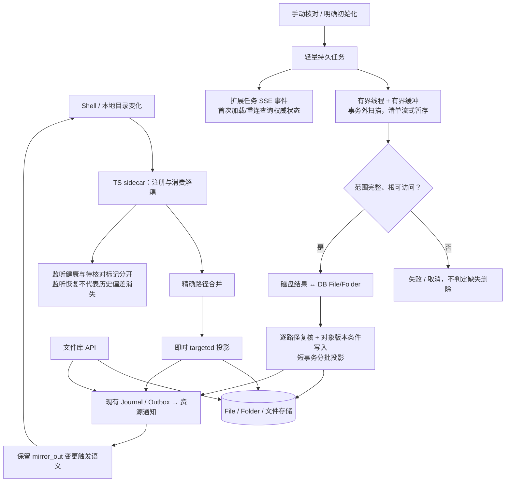

# PRD-FS-7 实时文件同步与完整异步对账

> 状态：实施中；每周严格完整扫描方案已确认，尚未完成 devserver 部署验收。
> 创建：2026-10-07
> 最近更新：2026-10-08；调整为每周严格完整扫描、扩展执行时限，并明确普通 worker 重启不制造缺口。
> 运行实现基线：`a0ed9ccb8`，保留上一轮非文件同步提交。
> 替代范围：旧「PRD-FS-6 文件同步快照与增量对账」；不替代同编号的 Agent 办公文档结构化编辑需求。
> 旧重构归档：`codex/archive-filesync-snapshot-20261007`，提交 `04f3391762e476412659d9cf10a4184f0c42954f`。
> 参考：[旧架构与收敛方案](../devlog/2026-10-07-文件同步旧架构与手动对账收敛方案.md)、[文件事实源与双向同步](./【已完成】PRD-FS-3-文件事实源与双向同步.md)。

## 1. 问题与目标

最初问题是每日整树对账扫描耗时长、占住事件循环和数据库事务，可能超过数据库空闲事务时限。解决目标不是建立快照调度平台，而是保留现有实时同步，将整树核对放入可观察、可取消的后台任务；周期性严格完整扫描用于停机/漏事件后的低频核验，不替代实时 targeted 投影。

旧 watcher 注册监听时等待整树 ready，注册和消费事件互相阻塞；整树补偿还会先于精确路径投影执行。这是独立问题，撤回快照重构不能自动解决。

### 目标

- TS sidecar → 精确路径合并 → targeted → Journal/Outbox 保持实时主干，不依赖扫描快照或整树任务。
- 移除每日、进程启动和监听异常自动触发的整树核对；对活跃窗口内绑定每周排入一次严格完整修复扫描，首次历史导入仍必须是明确可见的初始化任务。
- 用户/Admin 手动发起 dry-run 或修复对账，API 立即返回任务，不等待扫描完成。
- 遍历、读取、哈希不占住事件循环，不持有数据库事务；投影使用短事务批次。
- 仍能通过完整磁盘范围与 DB File/Folder 的核对发现孤儿记录，不依赖曾经成功扫描过。

### 非目标

- 不提高或关闭数据库空闲事务超时保护。
- 不建立独立用户租约表、快照代次、基线 CAS、跨进程扫描检查点或持久目录游标；不以文件/目录 mtime 跳过严格完整扫描的内容哈希。
- 不重写文件事实源、归属、配额、冲突处理、RAG 或反向导出协议。
- 不改变 Shell 权限，不增加未经确认的用户目录忽略规则。
- 不承诺文件事件永不丢失、扫描原子快照或整轮失败自动回滚已提交批次。

## 2. 目标架构



### 实现涉及的项目模块与文件

以下是按当前代码结构预计会触及的文件清单，用于评估实现边界，不要求机械地把所有逻辑塞进这些文件。`现有·改造` 表示复用并扩展已有职责，`新增` 表示目标实现需要的新模块；实施中若拆出更合适的文件，应同步更新本树。文件/目录的创建、修改、移动、删除投影仍由实时 targeted 路径和手动完整对账共同覆盖，不能因目录拆分而形成两套业务规则。

```text
backend/
├── app/
│   ├── api/v1/
│   │   ├── filesync.py                         # 现有·改造：用户 dry-run、初始化/修复任务、查询与取消
│   │   ├── filesync_admin.py                   # 现有·改造：Admin 发起、查询/取消任务及绑定健康状态
│   │   └── live.py                             # 现有·改造：放行新增的文件同步任务/健康失效事件
│   ├── core/
│   │   ├── config.py                            # 现有·改造：扫描预算、并发与缓冲上限配置
│   │   └── events.py                           # 现有·改造：发布用户级任务和绑定健康失效通知
│   ├── models/
│   │   └── __init__.py                         # 现有·改造：最小持久任务及绑定健康/待核对字段
│   └── services/filesync/
│       ├── watcher.py                          # 现有·改造：注册/消费解耦、健康缺口
│       ├── ts_sidecar.py                       # 现有·核对/必要改造：注册受理与 ready 协议
│       ├── targeted.py                         # 现有·改造：精确路径 CRUD 投影和并发保护
│       ├── reconcile.py                        # 现有·改造：复用路径规则，替换同步整树核对执行
│       ├── jobs.py                             # 新增：任务生命周期、原子领取、取消和状态
│       ├── runner.py                           # 新增：持久任务领取后的扫描、投影与收尾编排
│       ├── scan.py                             # 新增：有界线程扫描、临时清单与完整性判定
│       ├── inventory.py                        # 新增：分页暂存绑定范围内活动 File/Folder 记录
│       ├── health.py                           # 现有·改造：独立维护监听健康和待核对状态
│       ├── outbox.py                           # 现有·复用/必要改造：投影后的资源刷新通知
│       └── __init__.py                         # 现有·改造：服务公开入口
├── worker.py                                   # 现有·改造：启动/停止手动核对任务执行器
├── alembic/versions/
│   └── 20261007000003_add_manual_filesync_runs.py # 新增：任务表及必要字段/索引，不触碰既有文件数据
└── tests/
    ├── test_filesync_phase1.py                 # 现有·扩展：精确路径 CRUD 与实时/扫描竞态
    ├── test_filesync_watcher_health.py         # 现有·扩展：监听状态与待核对标记边界
    ├── test_filesync_reconcile_jobs.py         # 新增：任务领取、互斥、取消、期限及部分结果
    ├── test_filesync_runner.py                  # 新增：任务执行、完整清单投影与持久部分结果
    ├── test_filesync_scan.py                   # 新增：扫描完整性、资源上限、临时清单和取消
    ├── test_filesync_inventory.py               # 新增：DB 清单分页、绑定范围与重复路径保留
    ├── test_filesync_run_migration.py           # 新增：迁移兼容性，不合并/改写已有 File 记录
    └── test_filesync_*.py                       # 现有·扩展：对账、冲突、所有者隔离及 mirror_out 回归

frontend/src/
├── api/filesync.ts                             # 现有·改造：任务创建、状态查询、取消及 Admin API 类型
├── types/live-events.ts                        # 现有·改造：任务/绑定健康失效事件类型与校验
├── stores/live.ts                              # 现有·核对/必要改造：SSE 分发及重连后的失效处理
├── components/filesync/
│   ├── FileSyncAdminPanel.vue                  # 现有·改造：Admin 健康、任务、部分结果及确认/取消
│   └── FileSyncReconcilePanel.vue               # 新增（若用户入口不在既有绑定界面）：用户手动核对交互
└── i18n/sections/filesync.ts                   # 现有·改造：三语状态、错误、确认与部分结果文案

docs/
└── prds/PRD-FS-7-实时文件同步与手动异步对账.md  # 当前需求、阶段 TODO 与验收证据
```

其中 SSE 传输、过滤与重连链路涉及 `backend/app/api/v1/live.py`、`backend/app/core/events.py`、`frontend/src/types/live-events.ts` 和 `frontend/src/stores/live.ts`；任务状态的权威来源仍是 API/数据库，不将 SSE 当作任务日志。用户侧 UI 应优先扩展现有绑定管理入口；只有确认没有合适承载点时才新增 `FileSyncReconcilePanel.vue`。

### 文件/目录树增删改映射

文件库的 `File/Folder` 是同一棵逻辑树在数据库中的投影，本地绑定目录是其物理视图。实时事件只投影精确路径；手动对账则在完整扫描后核对整棵树。目录重命名/移动按源路径和目标路径作为一个变更处理，不能误拆成无关的删除与新增；无法唯一识别移动对象时保留双方并报告，不猜测文件身份。

处理顺序对应为：Watcher 的精确路径事件直接映射单个树节点；手动或每周对账先完成整棵绑定目录扫描，再将扫描树与活动 `File/Folder` 投影逐路径比较，随后复核并分批应用。文件库 API 的 `mirror_out` 仍只按原规则把文件库内容导出到绑定目录，不反向导入。

| 目录树变化 | 实时精确事件 | 手动或每周完整对账 | 安全边界 |
| --- | --- | --- | --- |
| 新增文件 / 目录 | 创建对应 `File` / `Folder`，登记 Journal/Outbox | 磁盘有、DB 无时列为新增 | 校验归属、路径、软链接与配额；空目录也要建 `Folder` 链 |
| 修改文件内容 / 元数据 | 重算内容指纹并更新现有对象 | 同路径内容或归属不同则列为更新 | 同 size/mtime 不代表正文未变；写入前重查并核对对象版本 |
| 移动 / 改名 | 精确事件合并源、目标路径后尝试识别 | 以完整范围比较源缺失与目标新增 | 只在身份唯一且源/目标均通过复核时更新原对象；歧义时跳过并报告 |
| 删除文件 / 目录 | 精确 unlink 事件处理对应路径 | 仅在扫描范围完整后，DB 有而磁盘无时列为缺失 | 手动修复须有删除许可；周期任务默认不软删除 DB 行，缺失项保留冲突；任何不完整扫描都不能据此删除 |

`mirror_out` 是相反方向的既有文件库导出路径，不表示本地磁盘扫描会反向覆盖文件库；其触发和覆盖规则保持原样。实时事件处理失败只形成精确路径重试/健康缺口，不立即升级为整树任务；每周扫描独立负责低频完整核验。

## 3. 功能与边界

### FR-FS7-001 实时事件独立执行

监听注册与事件消费使用独立执行流程，注册并发有界。区分注册受理、初始遍历中、ready 和失败；不得把 ready 遍历时长当成命令受理超时，也不得因一个大根目录尚未 ready 而停止其他绑定事件消费。

精确创建、等长修改、移动与删除直接进入 targeted。不得等待手动扫描、查询扫描基线或排入整树队列。保留路径合并与短暂去抖；事件路径安全、符号链接及所有者边界沿用现有规则。

监听失败、额度耗尽、队列溢出、无精确路径或投影失败必须有可见健康状态及脱敏错误，允许有界的精确路径重试和监听重建；不能吞错后标为可靠，也不能偷偷升级成整树扫描。

### FR-FS7-002 显式核对入口

支持手动 dry-run、确认后的修复核对和显式初始化导入。禁止每日整树扫描、启动自动全扫和异常自动整树回退；worker 每小时检查周期任务，只为活跃窗口内到期的有效绑定排入每周一次完整修复核对。周期任务复用持久化任务队列，完整读取并计算扫描范围内每个文件的 SHA-256，不以目录或文件 mtime 跳过内容校验；跨用户并发受现有全局上限约束，同一用户仍串行。普通 worker 重启只重建监听，不单独制造同步缺口，停机期间的手工文件变化由下一次完整扫描发现。

扫描任务固定绑定、范围版本、模式和删除许可；绑定失效或范围变化时停止，不悄悄扩大扫描范围。初始化是否导入历史文件由入口明确表达，不与建立监听混为一谈。

异常状态显示“可能存在未同步变化，可手动核对”，并提供入口。每周完整扫描只覆盖活跃窗口内绑定；非活跃用户恢复活跃后再纳入。周期修复不会自动软删除磁盘缺失对应的 DB 行，相关冲突仍需人工决策；产品文案不得宣称无需恢复或零漏检。

监听健康与“需要手动核对”是不同事实：重建监听成功只恢复后续事件接收，不能清除真实监听故障留下的待核对提示。首次建立监听不偷偷扫描；普通进程重启不单独置缺口标记。只有覆盖同一绑定范围的完整修复任务成功，且没有任务启动后新增的已知监听缺口，才清除该提示；dry-run、部分修复、失败及取消不清除。周期完整核对默认不授权删除 DB 行：磁盘缺失项保留为冲突，自动软删除须经用户明确授权后另行启用。后台显示上述状态和恢复入口，不能仅记录日志。

### FR-FS7-003 轻量任务与资源限制

状态限定为 `queued/running/cancelling/succeeded/failed/cancelled`，阶段为扫描、核对、投影；只保存执行归属、有效期限、进度计数、结果计数、取消请求与安全错误类别等必要事实。

Worker 原子领取必须防止跨进程重复执行；同一用户整树任务串行、跨用户并发有界，同一绑定不能重复排队。互斥复用任务事实或现有数据库原语，不增加独立用户周期/租约体系。实时事件不占用扫描执行槽。

执行总预算默认 7200 秒，可配置；超时为明确失败而非自动暂停续跑。重启后无法继续的任务标记中断失败，由用户重新发起，从头扫描；周期失败有界退避，不后台无限重试。

取消以线程协作标志为准，在目录项之间与哈希分块之间检查。仅取消等待 `to_thread()` 的协程不表示线程停止；实际线程结束且当前短事务收口后才能释放执行权。取消后不开始新投影批次。

### FR-FS7-004 扫描与事务分离

目录遍历、stat、内容读取和哈希在有界线程执行器执行，线程不使用 AsyncSession。绑定规格先在短事务读取，查询结束后释放会话，再开始耗时 I/O。

DB File/Folder 查询与投影分页分批；不把所有用户或整棵目录的 ORM 实例长期留在会话里。大范围清单允许临时落盘以控制内存，但它不是成功基线或可恢复检查点，终态清理临时产物。

扫描清单按路径流式写入任务私有的临时索引存储（可采用临时 SQLite），差异核对从中分页读取；禁止先构建整树列表、字典或集合再落盘。生产者缓冲同时设置条目数和字节数上限，哈希读取使用固定大小分块，DB 查询/投影批次和打开文件句柄数也有明确上限。达到缓冲上限施加背压，不继续累计目录结果；内存工作集不得随目录总条目数线性增长。

遍历全部完成、临时清单写入成功且根目录/范围仍有效后，才能进入缺失项核对；临时盘空间不足、清单写入错误或遍历中断均标为扫描不完整，不生成缺失删除。临时存储权限受限，不对外暴露路径；任务终态清理，进程异常后只清理确认属于失效任务的临时产物，不作为续跑依据。实施前记录缓冲字节、批大小、句柄及临时空间预算的默认值，压力测试按这些上限验收，而不是只限制线程数。

普通精确事件重新计算需要的指纹；不能以相同 size/mtime 推断正文未变。扫描指纹缓存若后续实测确有必要，仅作为内部加速，不能成为删除判断或实时同步的正确性依赖。

当前实现的资源预算基线：扫描哈希分块 1 MiB、相对路径上限 1000 UTF-8 字节、目录句柄栈上限 64、临时 SQLite 页缓存 8 MiB、扫描清单提交批次默认 256 项且总量上限 4 GiB；数据库 File/Folder 分页分别为 256/64 项，对账投影批次默认 128 项，进度缓冲只保留 1 个最新快照。后续压力验收应记录并验证这些实现上限，不以放宽预算代替修复阻塞。

### FR-FS7-005 安全核对与删除

完整扫描范围必须与该绑定覆盖的 DB 现存 File/Folder 核对，而不是仅比较两份扫描快照。根不可访问、遍历错误、超时、取消或范围不完整时不得判定缺失删除；完整性必须显式记录，不能把空清单当成成功扫描。

确认缺失前重新 stat，核对绑定范围版本、对象版本和已有冲突。磁盘或数据库在扫描后发生变化时，重新读取受影响路径或跳过并报告，不用旧扫描覆盖较新修改。复核与最终写入仍存在文件系统并发窗口，不能宣称原子快照；实时事件继续消费以收敛后续变化。

此规则覆盖新增、更新、移动和删除，不限于删除前复查。扫描记录每个候选的磁盘身份/指纹、所见对象版本及路径变更记录边界；投影前在事务外复核该路径的当前状态，必要时重新计算指纹，并检查扫描期间该路径是否已有 targeted/File API 变更。发现较新事实时重新规划该路径或跳过并报告，不继续应用旧候选。

复核完成后，短事务写入必须与 targeted/File API 共用对象级并发保护：通过对象版本条件更新或行锁内版本检查确认所见版本仍有效，条件不符则放弃旧写入。新路径创建依赖既有唯一性约束，遇到实时路径已创建的对象须重读，不能重复建档或覆盖。不得将“写入前读了一次版本”当成并发保护；读取后到提交前的竞态也必须受保护。移动同时核对源、目标及冲突，不能只锁住其中一端。所用 Journal 是现有路径事实，不新增整树水位重放/CAS 发布框架。

沿用配额、路径安全、移动识别、回收站与冲突规则。dry-run 不修改文件、File/Folder、业务 Journal、Outbox 或 RAG；可写任务自身状态及计数。修复入口涉及删除、覆盖时沿用统一确认门。

已提交批次保留，失败/取消必须展示部分应用结果；任务不误报整轮成功，不声称全部回滚。

任务结果分别记录扫描数量与已提交的创建、更新、移动、删除数量，以及跳过、冲突、逐路径失败数量；扫描/计划完成数量不等于已应用数量。业务批次与已应用计数在同一短事务提交，异常退出后的权威状态也能表达部分副作用。`failed/cancelled` 终态必须保留这些结果，UI 明示“已应用部分变更，未整轮回滚”，而不是只展示一个失败标签。

重新发起是新的从头扫描，不复用旧清单。投影按当前内容、对象版本及既有幂等规则判断是否需要变更：相同最终事实不再增加 File 版本、重复计入配额或产生业务 Journal/Outbox/RAG 事件；不能仅用新任务 ID 作为业务幂等键。dry-run 始终显示零已应用变更。

### FR-FS7-006 UI 与诊断

展示绑定健康、任务状态/阶段、数量进度、耗时、结果及安全错误；未知总量不伪造百分比。使用现有用户级 SSE 发送轻量失效通知，客户端再读取权威状态；断线重连补读，不新增固定高频轮询。

这里只复用 SSE 传输、认证及用户隔离，不假定现有文件资源刷新事件已经支持任务进度。需新增任务状态/进度失效事件和绑定健康失效事件（建议协议名 `filesync.run.changed`、`filesync.binding.health.changed`），同步调整后端发布、事件过滤、前端类型与订阅。事件只携带 run/binding 标识、状态修订号及必要安全枚举，不携带完整扫描结果。

任务状态 API 返回权威快照：状态、阶段、进度、部分结果、取消状态及修订号；绑定状态 API 返回健康与待核对标记。首次加载和 SSE 重连后读取当前绑定及活动/最近任务快照，事件到达后按 ID 合并补读，忽略较旧修订与重复通知。进度发布限频并合并，终态及时通知；通知丢失不能使服务端事实消失，必要的可靠投递复用既有 outbox，不把 Redis Pub/Sub 当持久任务日志。接入完成前不能把“沿用 SSE”记为已经实现。

状态提交后发通知；通知失败不撤销任务提交。跨用户查询、订阅及取消均校验归属；可见日志和事件不携带真实路径、文件名、内容或原始异常，受限诊断保留根因类别与关联标识。

### FR-FS7-007 保留反向导出与数据库兼容

取消自动整树扫描不等于取消 `mirror_out` 的文件库变更触发。核对并保留原有反向导出规则，长导出可复用简单后台执行与分页，不能反向导入磁盘文件，也不能另造快照调度框架。

已提交的 `20261006000001_add_filesync_reconcile_runs.py` 及其后续迁移链保留；不得删除已执行迁移、自动降级数据库或清空同步表。新任务最小模型与既有表结构兼容的处理在实施时核对；确需调整采用新增前向迁移，不因归档撤回而操作用户数据库。

2026-10-07 用户另行授权清理 devserver 遗留结构：新增前向迁移 `20261007000001`，只移除已撤回的快照任务/扫描状态表及专用字段，保留原绑定、Journal、冲突与其他业务表。执行前备份，存在未结束快照任务时拒绝执行；不能用 Alembic 降级越过后续项目摘要和回收站迁移。归档任务事实的恢复使用备份，不伪造空表降级。新任务实施时不复用已移除的复杂快照结构。

## 4. 分阶段 TODO 与验收

### Phase 0：归档与开发线恢复

- [x] 将剩余 99 个同步相关文件的改动提交到独立归档分支并正常推送。
- [x] `dev` 恢复至 `a0ed9ccb8` 的运行代码；保留非同步功能提交和既有迁移。
- [x] 建立本 PRD；旧方案仅在归档分支保留，不作为开发线待实施目标。
- [x] 核对 devserver 数据库版本和运行模型；用户另行授权后备份并执行前向清理至 `20261007000001`，精准重启加载撤回后的代码，运行配置未变；新方案部署时仍需核对其他环境。

### Phase 1：实时监听可靠性

- [x] 解耦注册与消费，明确受理/ready/失败边界；注册串行受理，并发上限为 1。
- [x] 验证监听未 ready 时路径事件仍及时投影；TS 层覆盖创建、等长更新、删除，Python 集成覆盖注册阻塞期间的 targeted 投影。
- [x] 验证监听错误、额度不足及队列溢出可见，重建不伪造 ready，恢复监听不清除历史缺口。
- [x] 删除每日、启动与异常触发的整树扫描；每周完整扫描通过持久任务队列排入；精确路径最多重试 3 次，耗尽后提示核对。

### Phase 2：手动异步核对

- [x] 最小任务模型、原子领取、同用户互斥、全局并发限制及有效期限。
- [x] 事务外线程扫描、条目/字节双重有界缓冲、流式临时清单、超时和进程中断处理。
- [x] 协作取消覆盖目录项和哈希分块；确认线程退出及事务收口后才释放任务占用。
- [x] 完整磁盘与 DB 核对、全部变更类型的路径复核和对象版本条件写入。
- [x] 短事务批次、持久部分结果及重新执行的业务幂等性。
- [x] dry-run、确认修复及显式初始化入口；保留 mirror_out 变更触发。

### Phase 3：界面与验收

- [x] 扩展任务/绑定健康 SSE 协议及过滤、类型、订阅；首次加载/重连查询权威快照，重复/乱序通知安全。
- [x] 展示健康与待核对标记；监听恢复不清除历史待核对提示，完整修复覆盖后才清除。
- [x] 部分应用结果展示、统一确认与取消路径。
- [x] 用同一组合成文件集记录旧式整树路径/哈希参照与流式清单扫描耗时、内存；另以 10,000 文件完整 PostgreSQL dry-run 记录耗时、峰值 RSS、事务 P95/最大时长，并用真实 TS watcher + PostgreSQL File/journal 落库记录 Shell 事件端到端延迟；详见 `docs/devlog/2026-10-07-PRD-FS-7-Phase3本地运行验收.md`。该本地验收未声称 devserver/生产吞吐改善，也没有等价旧版 PostgreSQL 全链路基准。
- [x] 真实 Shell 创建/等长修改/删除探针验证；测试后清理测试产物与记录。
- [x] 验证扫描超过数据库空闲事务时限仍不占用空闲事务连接，心跳、聊天取消和事件消费不被扫描阻塞。
- [x] 验证无历史快照仍可找出 DB 孤儿；空/不可用根、部分扫描及取消均不误删。
- [x] 验证并发覆盖、新建、移动、删除不会被旧扫描覆盖；冲突保留可见。
- [x] 用同步屏障复现扫描旧指纹后 targeted 更新，以及复核后/提交前实时写入；证明旧候选不能覆盖新版本，新路径不能重复建档。
- [x] 在固定内存预算下扩大目录条目数，验证缓冲背压和峰值内存不随总条目数线性增长；临时清单写入失败不产生缺失删除。
- [x] 先提交一个批次再失败/取消，重载仍展示部分结果；从头重新执行不重复增加版本、配额或业务事件。
- [x] 验证多 Worker 不能重复领取，取消等待线程实际结束，重启不误报成功或自动扫描。
- [x] 分别在目录遍历和大文件分块读取期间取消/超时：线程退出前同用户任务不能接管，事务收口后才能释放执行槽；不以协程取消结果替代线程存活断言。
- [x] 验证所有者隔离、错误脱敏、dry-run 无业务副作用及 mirror_out 行为。

验收测试保护运行时行为，不用源码字符串匹配替代及时同步、线程取消或事务生命周期验证。完成与否按上述清单及实际证据更新，不将归档测试结果算作新方案已通过。
