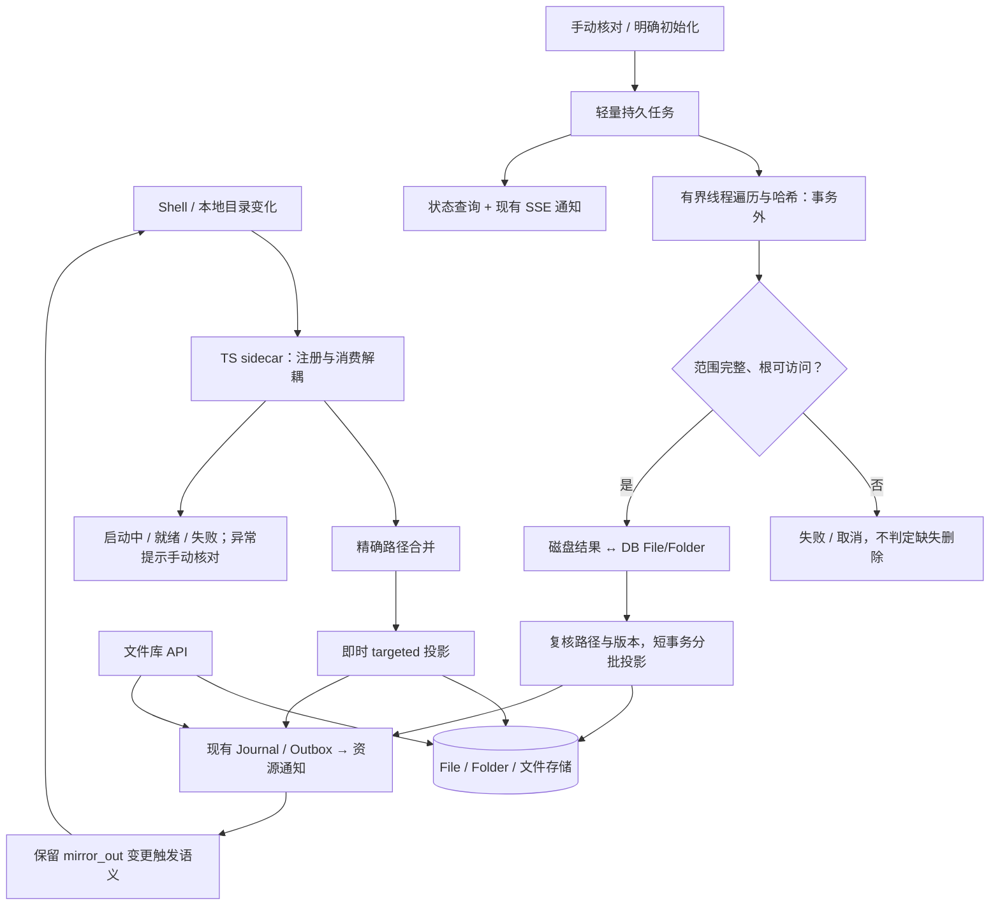

# PRD-FS-7 实时文件同步与手动异步对账

> 状态：待实施，用户已确认方向；本轮只归档旧实现并建立需求，不表示功能已完成。
> 创建：2026-10-07
> 运行实现基线：`a0ed9ccb8`，保留上一轮非文件同步提交。
> 替代范围：旧「PRD-FS-6 文件同步快照与增量对账」；不替代同编号的 Agent 办公文档结构化编辑需求。
> 旧重构归档：`codex/archive-filesync-snapshot-20261007`，提交 `04f3391762e476412659d9cf10a4184f0c42954f`。
> 参考：[旧架构与收敛方案](../devlog/2026-10-07-文件同步旧架构与手动对账收敛方案.md)、[文件事实源与双向同步](./【已完成】PRD-FS-3-文件事实源与双向同步.md)。

## 1. 问题与目标

最初问题是每日整树对账扫描耗时长、占住事件循环和数据库事务，可能超过数据库空闲事务时限。解决目标不是建立快照调度平台，而是保留现有实时同步，将必要的整树核对改成可观察、可取消的手动后台操作。

旧 watcher 注册监听时等待整树 ready，注册和消费事件互相阻塞；整树补偿还会先于精确路径投影执行。这是独立问题，撤回快照重构不能自动解决。

### 目标

- TS sidecar → 精确路径合并 → targeted → Journal/Outbox 保持实时主干，不依赖扫描快照或整树任务。
- 移除每日、进程启动和监听异常自动触发的整树核对；首次历史导入必须是明确可见的初始化任务。
- 用户/Admin 手动发起 dry-run 或修复对账，API 立即返回任务，不等待扫描完成。
- 遍历、读取、哈希不占住事件循环，不持有数据库事务；投影使用短事务批次。
- 仍能通过完整磁盘范围与 DB File/Folder 的核对发现孤儿记录，不依赖曾经成功扫描过。

### 非目标

- 不提高或关闭数据库空闲事务超时保护。
- 不建立每日活动跳过、独立用户租约表、快照代次、基线 CAS、跨进程扫描检查点或持久目录游标。
- 不重写文件事实源、归属、配额、冲突处理、RAG 或反向导出协议。
- 不改变 Shell 权限，不增加未经确认的用户目录忽略规则。
- 不承诺文件事件永不丢失、扫描原子快照或整轮失败自动回滚已提交批次。

## 2. 目标架构

## 3. 功能与边界

### FR-FS7-001 实时事件独立执行

监听注册与事件消费使用独立执行流程，注册并发有界。区分注册受理、初始遍历中、ready 和失败；不得把 ready 遍历时长当成命令受理超时，也不得因一个大根目录尚未 ready 而停止其他绑定事件消费。

精确创建、等长修改、移动与删除直接进入 targeted。不得等待手动扫描、查询扫描基线或排入整树队列。保留路径合并与短暂去抖；事件路径安全、符号链接及所有者边界沿用现有规则。

监听失败、额度耗尽、队列溢出、无精确路径或投影失败必须有可见健康状态及脱敏错误，允许有界的精确路径重试和监听重建；不能吞错后标为可靠，也不能偷偷升级成整树扫描。

### FR-FS7-002 显式核对入口

支持手动 dry-run、确认后的修复核对和显式初始化导入。删除每日整树调度、启动自动全扫和异常自动整树回退；服务启动可以恢复任务状态和监听，但不因此创建扫描。

扫描任务固定绑定、范围版本、模式和删除许可；绑定失效或范围变化时停止，不悄悄扩大扫描范围。初始化是否导入历史文件由入口明确表达，不与建立监听混为一谈。

异常状态显示“可能存在未同步变化，可手动核对”，并提供入口。取消自动补偿意味着停机、监听失败或漏事件期间的变化可能滞留，需用户/Admin 手动恢复；产品文案不得宣称无需恢复或零漏检。

### FR-FS7-003 轻量任务与资源限制

状态限定为 `queued/running/cancelling/succeeded/failed/cancelled`，阶段为扫描、核对、投影；只保存执行归属、有效期限、进度计数、结果计数、取消请求与安全错误类别等必要事实。

Worker 原子领取必须防止跨进程重复执行；同一用户整树任务串行、跨用户并发有界，同一绑定不能重复排队。互斥复用任务事实或现有数据库原语，不增加独立用户周期/租约体系。实时事件不占用扫描执行槽。

执行总预算默认 1800 秒，可配置；超时为明确失败而非自动暂停续跑。重启后无法继续的任务标记中断失败，由用户重新发起，从头扫描；无后台无限重试。

取消以线程协作标志为准，在目录项之间与哈希分块之间检查。仅取消等待 `to_thread()` 的协程不表示线程停止；实际线程结束且当前短事务收口后才能释放执行权。取消后不开始新投影批次。

### FR-FS7-004 扫描与事务分离

目录遍历、stat、内容读取和哈希在有界线程执行器执行，线程不使用 AsyncSession。绑定规格先在短事务读取，查询结束后释放会话，再开始耗时 I/O。

DB File/Folder 查询与投影分页分批；不把所有用户或整棵目录的 ORM 实例长期留在会话里。大范围清单允许临时落盘以控制内存，但它不是成功基线或可恢复检查点，终态清理临时产物。

普通精确事件重新计算需要的指纹；不能以相同 size/mtime 推断正文未变。扫描指纹缓存若后续实测确有必要，仅作为内部加速，不能成为删除判断或实时同步的正确性依赖。

### FR-FS7-005 安全核对与删除

完整扫描范围必须与该绑定覆盖的 DB 现存 File/Folder 核对，而不是仅比较两份扫描快照。根不可访问、遍历错误、超时、取消或范围不完整时不得判定缺失删除；完整性必须显式记录，不能把空清单当成成功扫描。

确认缺失前重新 stat，核对绑定范围版本、对象版本和已有冲突。磁盘或数据库在扫描后发生变化时，重新读取受影响路径或跳过并报告，不用旧扫描覆盖较新修改。复核与最终写入仍存在文件系统并发窗口，不能宣称原子快照；实时事件继续消费以收敛后续变化。

沿用配额、路径安全、移动识别、回收站与冲突规则。dry-run 不修改文件、File/Folder、业务 Journal、Outbox 或 RAG；可写任务自身状态及计数。修复入口涉及删除、覆盖时沿用统一确认门。

已提交批次保留，失败/取消必须展示部分应用结果；任务不误报整轮成功，不声称全部回滚。

### FR-FS7-006 UI 与诊断

展示绑定健康、任务状态/阶段、数量进度、耗时、结果及安全错误；未知总量不伪造百分比。使用现有用户级 SSE 发送轻量失效通知，客户端再读取权威状态；断线重连补读，不新增固定高频轮询。

状态提交后发通知；通知失败不撤销任务提交。跨用户查询、订阅及取消均校验归属；可见日志和事件不携带真实路径、文件名、内容或原始异常，受限诊断保留根因类别与关联标识。

### FR-FS7-007 保留反向导出与数据库兼容

取消自动整树扫描不等于取消 `mirror_out` 的文件库变更触发。核对并保留原有反向导出规则，长导出可复用简单后台执行与分页，不能反向导入磁盘文件，也不能另造快照调度框架。

已提交的 `20261006000001_add_filesync_reconcile_runs.py` 及其后续迁移链保留；不得删除已执行迁移、自动降级数据库或清空同步表。新任务最小模型与既有表结构兼容的处理在实施时核对；确需调整采用新增前向迁移，不因归档撤回而操作用户数据库。

## 4. 分阶段 TODO 与验收

### Phase 0：归档与开发线恢复

- [x] 将剩余 99 个同步相关文件的改动提交到独立归档分支并正常推送。
- [x] `dev` 恢复至 `a0ed9ccb8` 的运行代码；保留非同步功能提交和既有迁移。
- [x] 建立本 PRD；旧方案仅在归档分支保留，不作为开发线待实施目标。
- [ ] 实施前核对已部署数据库版本和运行模型；本轮未重启服务或变更运行配置。

### Phase 1：实时监听可靠性

- [ ] 解耦注册与消费，明确受理/ready/失败边界，注册并发有界。
- [ ] 验证大目录未 ready 时创建、等长修改、删除仍及时投影。
- [ ] 验证监听错误、额度不足及溢出可见，重建不伪造可靠状态。
- [ ] 删除周期、启动与异常自动整树扫描；精确路径重试保持局部范围。

### Phase 2：手动异步核对

- [ ] 最小任务模型、原子领取、同用户互斥、全局并发限制及有效期限。
- [ ] 事务外线程扫描、协作取消、超时和进程中断处理。
- [ ] 完整磁盘与 DB 核对、删除前复查、短事务批次和部分结果。
- [ ] dry-run、确认修复及显式初始化入口；保留 mirror_out 变更触发。

### Phase 3：界面与验收

- [ ] 状态/健康/SSE、重连补读、统一确认与取消路径。
- [ ] 用大目录记录扫描耗时、内存、实时事件端到端延迟和数据库事务时长；先记录基线，再用同一数据验证优化，不以增加数据库超时掩盖问题。
- [ ] 真实 Shell 创建/等长修改/删除探针验证；测试后清理测试产物与记录。
- [ ] 验证扫描超过数据库空闲事务时限仍不占用空闲事务连接，心跳、聊天取消和事件消费不被扫描阻塞。
- [ ] 验证无历史快照仍可找出 DB 孤儿；空/不可用根、部分扫描及取消均不误删。
- [ ] 验证并发覆盖、新建、移动、删除不会被旧扫描覆盖；冲突保留可见。
- [ ] 验证多 Worker 不能重复领取，取消等待线程实际结束，重启不误报成功或自动扫描。
- [ ] 验证所有者隔离、错误脱敏、dry-run 无业务副作用及 mirror_out 行为。

验收测试保护运行时行为，不用源码字符串匹配替代及时同步、线程取消或事务生命周期验证。完成与否按上述清单及实际证据更新，不将归档测试结果算作新方案已通过。
