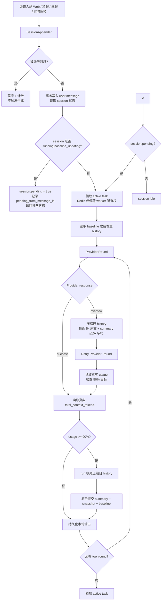
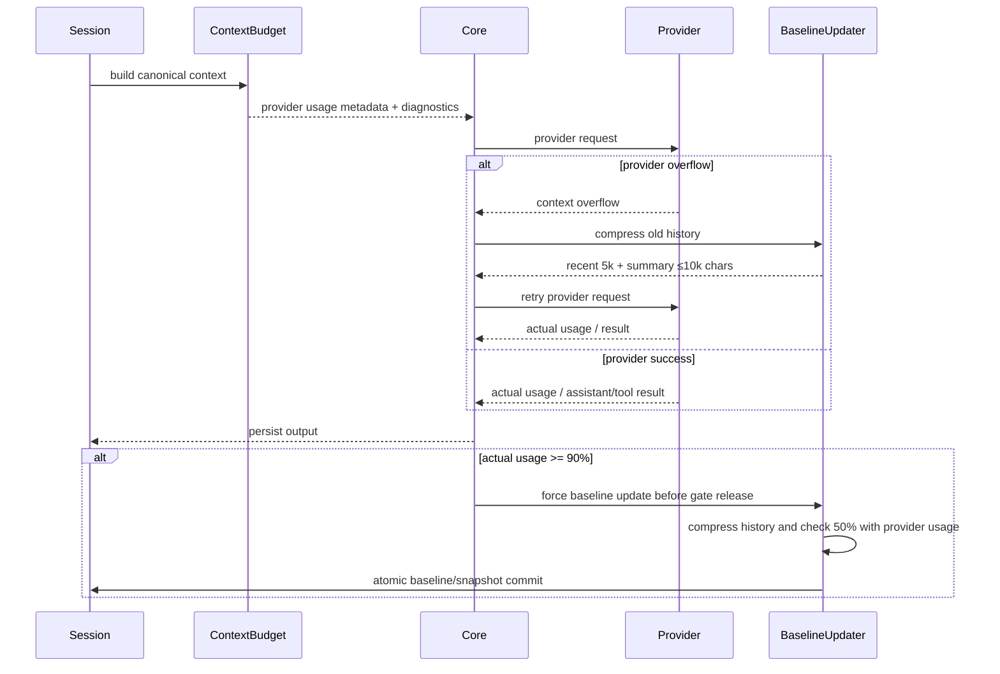
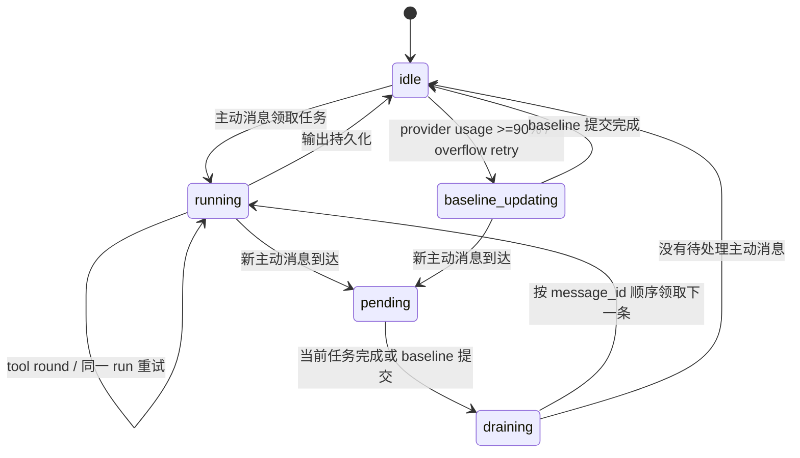

# PRD-AGENT-4：统一 ContextBudget 上下文压缩重构

## 状态

实施中（2026-08-24，Phase 0-5 已完成）。分支式摘要候选与缓存保持另见 PRD-AGENT-5；本 PRD 继续作为预算、baseline、retry 和 session 生命周期的总规范。

## 本任务目标

稳定单一的 session 上下文生命周期：

```text
baseline
  → 基于 baseline 增量组装上下文
  → 抵达 ContextBudget 阈值
  → 只压缩旧 history
  → 原子更新唯一 baseline
  → 继续基于新 baseline 增量运行
  → 循环
```

最终不再存在互相冲突的预算、历史注入、运行中压缩和后台压缩行为。所有入口都遵循同一套生命周期。未来预算实现只保留 `backend/agent/context/budget.py` 一份语义；`context_budget.py` 不作为新模块创建，`ContextBudget` 只是其中的计划/数据结构名称。

本文统一替代并收口以下文档中的会话上下文预算与压缩语义：

- `docs/product/PRD/【已归档】PRD-AGENT-1-会话上下文增量与压缩.md`
- `docs/product/PRD/PRD-AGENT-3-统一会话历史窗口与持久化基线.md`
- `docs/agent/context/context-budget-baseline-design.md`
- `docs/product/PRD/【已完成】PRD-LLM-8-Prompt-Caching优化.md` 中的上下文压缩部分
- `docs/product/PRD/【已完成】PRD-IM-6-IM会话复用与消息窗口裁剪.md` 中的窗口裁剪部分

长期记忆（daily、profile、pattern、群成员记忆）的内容压缩仍由对应 Memory/RAG PRD 负责；本 PRD 只处理「单个会话发给模型的对话上下文」和其持久化 baseline，不把两种压缩混成一个任务。

---

## 1. 背景与问题

当前 Web、私聊、群聊、定时任务虽然都使用 `baseline_message_id`、session snapshot 和持久化 summary，但预算与压缩逻辑分散在多层：

1. `budget.py` 使用 `SAFE_BUDGET_RATIO`、`POST_RUN_CHECKPOINT_RATIO`、`HARD_TARGET_RATIO`，`compaction.py` 又维护一套 `COMPACTION_*` 常量，`compress_conv.py` 再定义 `FORCE_COMPRESS_TARGET`。
2. `session_history.history_budget_for_context()` 使用固定 reserve heuristic；入口在组装历史前先算一次，core 又按另一套总量再算一次，导致 Web、私聊和群聊的首轮输入不一致。
3. 旧压缩目标是上下文的 20%，这个数字同时被运行中压缩、后台 baseline 更新和确定性截断复用，既不表达语义，也会产生过度压缩、重复压缩和 cache 前缀抖动。
4. 某些路径会先加载超过模型预算的完整历史，再等待压缩；群聊被动消息量大时更容易在相邻 run 中重复 inline compaction。
5. inline compaction 只改变当前 run 内存中的消息，不一定推进持久化 baseline；下一轮仍从旧水位加载，造成压缩重复、输入 token 突然变大和 Round 1 cache 降低。
6. Redis gate 目前承担了执行互斥、baseline 更新等待和“是否有待处理消息”多种语义；session 没有可靠的 pending 状态，多个 worker 可能重复生成。
7. Web 与 IM 的入口包装层不同，部分 baseline 等待、历史读取、错误重试和动态尾部保护代码重复，修复容易只覆盖一个渠道。
8. snapshot、summary、baseline 的生命周期虽然已有基础字段，但没有清晰的“唯一活跃 baseline 版本”契约，旧任务存在覆盖新版本的风险。

### 1.1 用户可见后果

- 同一群连续消息有时每轮都压缩，有时上一轮只有 20k 下一轮却重新压缩。
- 超过上下文限制时直接返回“当前模型无法处理”，没有先按硬预算裁剪并重试。
- 压缩期间同一 session 并行生成，回答顺序不稳定，或出现重复回答。
- 运行中的消息、工具结果和后台 baseline 更新互相覆盖，破坏 provider prompt cache。

---

## 2. 目标与非目标

### 2.1 目标

1. Web、私聊、群聊、微信、飞书和定时任务使用同一个 provider usage 归一化和 baseline 生命周期。
2. `ContextBudget` 只负责 provider usage 分项、诊断和本地字符/条数兜底，不在发送前预计算 token 触发压缩。
3. provider 成功且真实 usage 达到 90% 后，让当前 run 完成，再压缩并提交 baseline。
4. provider 返回 context overflow 时立即压缩旧 history 并 retry；不再以本地 95% token 预检作为正常流程。
5. 压缩后只保留最近 5k token 对应的完整 history；其余旧 history 全部滚动合并为 summary，最终 summary 限制为 10,000 字符。50% 只在 retry 后用 provider 实际 usage 检测。
6. 压缩只处理 history，不删除当前 run 的用户消息、assistant/tool call、tool result 和最终输出。
7. snapshot/summary 统一归属于一个活跃 baseline 版本，摘要、业务 snapshot 和覆盖水位原子提交。
8. 一个 session 同时只允许一个生成任务；运行中或 baseline 更新中收到的新消息进入该 session 的 pending 状态，生成结束后按顺序继续。
9. baseline 更新完成后必须重试被暂停的当前 round；不得返回半完成的“压缩成功”状态。
10. 被动群消息可以落库、推进计数和参与下一次历史窗口，但不触发回复生成。
11. 通过脱敏日志可解释每次预算决策、压缩原因、baseline 变化和 pending 排队情况。
12. 重构完成后的运行时代码量尽量维持现状：新增抽象必须替代旧实现，不能在旧逻辑旁边再叠加一套“统一封装”。

### 2.2 非目标

- 不删除数据库中的原始会话消息。
- 不把 daily/profile/pattern 的长期记忆维护合并到 session baseline。
- 不重新设计各 provider 的 API payload、tool schema 或图片附件格式；provider 专属 payload 清洗继续由 provider adapter 负责。
- 不要求压缩到固定比例或固定消息条数。
- 不用 Redis key 代替持久化 session 状态；Redis 只负责跨 worker 的执行所有权和短暂恢复。
- 不以增加代码层级为目标；除非能删除等量或更多重复代码，否则不新增模块、wrapper、状态机或兼容层。

---

## 3. 已确认的设计决策

以下决策为本 PRD 的硬约束，后续实现不得恢复旧的同义常量或隐式规则：

| 决策 | 规则 |
| --- | --- |
| 唯一预算名 | 只使用 `ContextBudget`。`safe_budget`、`history_budget`、`compaction_budget`、`hard_target` 等重复语义必须迁移后删除或改为 ContextBudget 的字段。 |
| 总量口径 | budget 覆盖所有 context：system、snapshot、工具定义、动态尾部、history、当前消息、工具轮、输出/推理预留和 provider overhead。 |
| 软阈值 | 达到模型 ContextBudget 的 90% 后，本轮先完成回复；完成后再推进 baseline。 |
| 截断上限 | 不再维护 95% 的本地 token 触发线；仅在 provider overflow 或异常 payload 时执行字符/条数兜底。 |
| 压缩目标 | provider overflow 或 run 收尾压缩后，用 provider 实际 usage 检查是否已降至 `<= 50% * model_context_tokens`；无下限，尽量低但优先保持历史语义。 |
| 原文保留窗口 | 只保留最近 5k token 的完整 history；user/assistant/tool call/tool result 按完整 round 原子保留，超过窗口的旧 history 不保留原文。 |
| 压缩范围 | 只压缩 baseline 之后的旧 history；当前 run 的消息链受到保护。 |
| 重试 | provider overflow 分支的压缩完成并提交后，当前 round 必须重新组装并重试；run 收尾 baseline 更新不重复当前输出；最多按统一 retry policy 防止无限循环。 |
| pending | pending 是 session 自身的持久状态，不依赖 Redis lock 推断。新消息可先落库，执行器只处理一个 active task。 |
| Redis | Redis gate 只负责跨 worker 的执行所有权、短时租约和故障恢复；不能作为业务消息是否 pending 的唯一事实来源。 |
| baseline | session 只有一个 active baseline 版本；旧压缩任务不能覆盖新 baseline。 |
| 压缩结果 | `compact_context()` 返回 `CompactionResult`，包含 `changed`、`before_tokens`、`after_tokens` 和 `return_reason`；摘要候选优先走 PRD-AGENT-5 的 branch，超限才走 rolling fallback。原因区分 `no_compressible_history`、`summary_failed`、`shape_validation_failed`、`budget_inconsistent` 和 `compacted`。 |
| 被动群消息 | 被动群消息继续存储，但不触发生成；后续被提及或主动响应时从当前 baseline 增量读取。 |

---

## 4. 核心定义

### 4.1 ContextBudget

`ContextBudget` 是一次 provider 请求的完整预算计划，不是一个只给 history 留空间的整数。

```text
ContextBudget {
  model_context_tokens        # 模型硬上限
  output_reserve_tokens       # 输出/推理预留
  provider_overhead_tokens    # provider/tool 格式开销
  system_prompt_tokens        # system prompt
  snapshot_tokens             # 稳定 snapshot/固定前缀消息
  tool_schema_tokens          # 当前可用工具定义
  dynamic_tail_tokens         # 当前时间、RAG、提醒、渠道动态提示
  current_turn_tokens         # 当前 user + 当前 run 的 tool 链
  history_tokens              # baseline 之后可注入的 history
  total_tokens                # 上述各项总和
  soft_limit_tokens           # provider 实际 usage 的 0.90 观察线
  compression_cap_tokens      # provider retry 后观察目标，不做本地硬判断
  recent_history_keep_tokens  # 5000，最近完整 history 原文窗口
  truncation_limit_tokens     # 仅保留兼容诊断字段，不作为正常触发器
}

实现上统一通过 `ContextBudget.from_messages()` 或 `ContextBudget.from_parts()`
记录 provider usage 分项。正常请求不再调用本地 token 预检；provider 返回的
`total_context_tokens` 才是压缩触发事实。本地字符/条数限制只作为数据库读取和异常
payload 兜底。
```

计算规则：

```text
total_context_tokens = provider_reported_input + provider_reported_cache
soft_observation = floor(model_context_tokens * 0.90)
compression_observation = floor(model_context_tokens * 0.50)
```

本地字符/条数兜底触发时，仍不得删除动态尾部、当前 user 或当前工具轮。provider
overflow 后最多按 retry 策略继续收敛，不进行无限重试。

### 4.2 Baseline 与 Snapshot

- `baseline_message_id/hash` 表示当前 baseline 已覆盖到的历史水位。
- `snapshot_revision/epoch` 表示该 baseline 的稳定版本。
- snapshot 内容仍可包含稳定 system/context、业务概览和 RAG 去重上下文；对话 summary 作为同一 baseline 版本的一部分维护，不再存在多个互相竞争的 snapshot 水位。
- 一次 baseline 更新事务必须同时提交：summary、snapshot 内容/哈希、baseline id/hash、revision、覆盖范围和状态。
- 读取时只加载 `baseline` 之后的增量；不因为普通消息变化就重建稳定 snapshot。

### 4.3 Session 状态

建议在 `ConversationSession` 持久化以下语义（字段名可按迁移时的模型约定落地）：

```text
execution_state: idle | running | baseline_updating | draining
pending: boolean
pending_from_message_id: 最早尚未派发的主动消息
active_run_id: 当前执行任务标识（可恢复）
baseline_revision: 正在/最后完成的 baseline 版本
```

状态字段是“是否有任务、是否需要排队”的事实来源；Redis 租约失效后，worker 可以依据 session 状态恢复或重新排队。

---

## 5. 新的压缩架构

### 5.1 总体架构图



### 5.2 单次请求的预算流程



### 5.3 状态机



---

## 6. 运行时行为

### 6.1 读取历史

所有入口调用同一个 `load_incremental_history(budget, baseline)`：

1. 先读取稳定 snapshot/summary 和 baseline 元数据。
2. 按 `available_history` 反向选取最新的完整消息单元，再恢复正序。
3. tool call 与 tool result、assistant tool_use 与对应结果视为不可拆分单元。
4. 不先把超过硬预算的完整 history 读入内存；SQL 查询必须带 token/条数上限和 baseline 条件。
5. 旧 session 没有 baseline 时仍按 ContextBudget 计算窗口，不能以 `baseline=0` 读取全量数据库历史。
6. 动态 RAG、提醒、当前时间和渠道提示属于 dynamic tail；随 provider 请求发送，发生压缩时不得被 history 裁剪误删。

### 6.2 硬预算与当前 round 重试

- 正常请求直接发送给 provider；不以本地 token 估算触发压缩或截断。
- provider 返回 context overflow 时，保护当前 turn，压缩 baseline 之前的旧 history 并重新组装、重试当前 round。
- provider 成功且真实 usage 达到 90% 时，本轮完整结束后再推进 baseline，不打断当前输出。
- LLM 压缩成功、确定性字符/条数兜底或 baseline 提交后，必须重新组装并重试当前 round。
- 每个 round 使用统一 retry counter；压缩无进展时停止重复压缩并执行下一阶段的确定性裁剪。
- provider overflow 的 retry 次数受统一策略限制；不能无限压缩或重试。

### 6.3 软阈值 baseline 更新

- provider 实际 usage < 90%：当前 run 正常结束，保持 baseline。
- provider 实际 usage >= 90%：当前 run 仍完整完成并持久化；随后推进 baseline。
- baseline 更新只处理 baseline 之后的旧 history，不能删当前 run。
- baseline 更新后重新请求或验证 provider usage；50% 是验证目标，不是发送前的本地硬限制。
- baseline 更新完成后，pending session 必须重新领取排队消息；不发送重复回答。

### 6.4 Pending 与并发

- 新主动消息先落库，再在同一事务中将 `pending=true` 并设置最早 pending message id。
- 已有 running/baseline_updating 时，不再启动第二个 agent loop。
- 被动群消息只落库，不把 session 标成需要生成的 pending。
- 当前任务结束后按 message id 顺序 drain pending；若多条消息可安全合并，合并规则必须明确记录且不能跨用户/群权限边界。
- worker 崩溃时，租约过期后由新 worker 根据持久化状态恢复；不可仅根据 Redis key 是否存在判断“没有 pending”。

### 6.5 Snapshot/baseline 原子性

baseline 更新事务必须：

1. 对 session 行加锁或使用 revision CAS。
2. 确认任务覆盖的 baseline 仍是当前 baseline。
3. 写入新 summary、snapshot_context/hash、baseline id/hash、revision 和 baseline 更新时间。
4. 成功提交后再发布 invalidation/event。
5. 旧任务发现 baseline/revision 已变化时放弃写入并重新排队，不覆盖新内容。

---

## 7. 当前实现审查与修改盘点

| 文件/目录 | 当前职责与问题 | 本 PRD 计划修改 | 完成后清理 |
| --- | --- | --- | --- |
| `backend/agent/context/budget.py` | provider usage 分项、诊断和本地字符/条数兜底 | 原地收口为唯一 usage 归一化与诊断 API | 删除发送前 token 预检和 95% token 触发语义 |
| `backend/agent/context/compaction.py` | overflow/90% 收尾压缩，保留最近 5k 原文 | provider overflow retry 或真实 usage ≥90% 后执行；summary 输入/输出 ≤10k 字符，retry 后用 provider usage 检查 50% | 删除本地 token 预检和 50% 硬截断 |
| `backend/agent/context/compress_conv.py` | 后台 baseline 更新、Redis 压缩锁、local task、baseline CAS；仍有 `token_budget`/force 20% | 原地收口为统一 baseline 更新入口；只有在文件职责无法承载时才拆出 coordinator，并删除原入口 | 删除 `FORCE_COMPRESS_TARGET`、独立 `token_budget` 语义、无法跨进程恢复的本地 task 作为事实来源 |
| `backend/agent/context/session_history.py` | `history_budget_for_context` 固定 reserve 35%，入口各自计算 | 只保留 baseline 增量读取，预算由 ContextBudget 传入；统一工具消息组选择 | 删除 `history_budget_for_context`、固定 reserve heuristic |
| `backend/agent/context/tokens.py` | `HISTORY_TOKEN_BUDGET=120000`、`HISTORY_MAX_MSGS=500` 作为独立上限 | 将条数/单页保护变成 ContextBudget 的查询安全上限 | 删除与模型预算冲突的固定 history token 常量；保留必要的查询保护常量并改名说明 |
| `backend/agent/context/session_snapshot.py` | snapshot TTL、hash、baseline 辅助函数并存，存在旧兼容路径 | 明确一个 active baseline revision；统一 snapshot、summary 与 baseline 的提交/读取契约 | 清理旧 snapshot/summary 双水位、无效 invalidate 顺序和临时 legacy 注入分支 |
| `backend/agent/context/message_assembly.py` | fixed prefix、dynamic tail、conversation replacement 边界 | 由 ContextBudget 输出组装计划，保证动态尾部不被误裁剪 | 删除入口自定义拼接分支和重复的固定前缀计数 |
| `backend/agent/context/history.py` | tool history 规范化、时间提示和原子消息组 | 保留原子化能力，接入统一 history unit/token 计量 | 不删除 provider/tool 合法性清理；删除重复的窗口裁剪实现 |
| `backend/agent/context/provider_history.py` | provider tool_use/tool_result 规范化 | 保持 provider payload 合法性，预算只由 ContextBudget 决定 | 删除与会话压缩重复的历史裁剪；保留 provider 特有格式清理 |
| `backend/agent/core.py` | provider round、overflow retry 和 baseline 事件曾分散在多套预算分支 | 统一 provider usage/round retry/baseline 事件；压缩完成强制重试当前 round | 删除重复 safe/hard 预算分支、重复计数器和无进展 retry |
| `backend/agent/runner.py` | IM/定时入口、历史读取、生成、baseline wrapper 多处重复 | 抽取可复用的最小执行函数，优先复用现有 runner；不再叠加新的入口 wrapper | 删除两套 `_run_*_unlocked` 中重复历史预算/等待 baseline 代码 |
| `backend/agent/gateway/web.py` | Web 独立加载历史、生成 wrapper、baseline 更新 | 复用 runner/context 的最小执行函数；保留 Web stream/event 输出 | 删除 Web 专属 `history_budget`、重复 gate/wait 和旧后台生成分支 |
| `backend/agent/im/loop.py` | 被动群落库 shortcut 与主动生成 | 以 session pending 状态区分主动/被动；统一 drain 与单任务执行 | 删除仅依靠入口局部判断的并发/重复回复防护 |
| `backend/app/models/__init__.py` | 有 baseline/snapshot 字段，无完整执行/pending 事实状态 | 只增加无法由现有字段表达的 execution/pending/baseline revision 字段 | 删除仅供旧 Redis 推断使用的冗余字段（迁移确认后） |
| 数据库迁移目录 | 尚未承载统一 pending/revision schema | 新增可回滚迁移、旧 session 默认 idle、旧 baseline 可安全兼容 | 清理临时迁移和未使用索引 |
| `backend/agent/loop_drivers.py` | provider 工具 JSON/单结果字段级截断 | 保持 provider payload 安全，调用统一 ContextBudget 的 retry 信号 | 不删除 provider 专属字段截断；删除重复 context history 裁剪 |
| `backend/agent/rag/**` | RAG 动态尾部/快照去重 | 明确 dynamic tail 计入总预算，超限时不误删当前 RAG 结果；必要时按 RAG 结果数降级 | 删除把 RAG 当作独立历史预算的旧分支 |
| `backend/tests/test_compaction.py` | 压缩、inline compaction、gate 测试 | 覆盖最近 5k 原文窗口、旧 history 全量滚动摘要、当前 round 重试、无进展保护 | 删除旧最近 20 条断言和重复 gate 断言 |
| `backend/tests/test_session_history.py` | 固定 35% reserve/history budget 测试 | 改测 ContextBudget 全量分项、baseline 增量和硬 cap 读取 | 删除 `history_budget_for_context` 专属测试 |
| `backend/tests/test_im_protocol.py` | 被动群消息不触发生成测试 | 增加 pending、顺序 drain、单任务和跨 worker 场景 | 清理仅模拟 Redis key 的旧并发测试 |
| 新增 `backend/tests/test_budget.py` | 无统一预算契约测试 | 覆盖总量、90%、50%、动态尾部、工具轮、单条超限 | — |
| 新增 `backend/tests/test_session_execution.py` | 无 session 状态机测试 | 覆盖 running/baseline_updating/pending/draining/崩溃恢复 | — |
| 新增 `backend/tests/test_baseline_atomicity.py` | 无 baseline/snapshot 原子提交回归 | 覆盖 CAS、revision、旧任务放弃写入、提交后 drain | — |
| `docs/product/PRD/**` | 多份文档拥有旧 20%/固定窗口语义 | 更新交叉引用；本文件作为唯一 ContextBudget 权威 | 标记旧段落已替代，移除矛盾的执行 TODO |

### 7.1 不应误删的代码

以下不是本 PRD 要删除的“重复压缩逻辑”：

- provider 的消息格式清洗、tool_use/tool_result 配对和 API payload 合法性修复；
- 单个文件、图片、视频、工具结果的字段级大小限制；
- Memory/RAG 的长期记忆维护、embedding/BM25/ILIKE 搜索和索引更新；
- 渠道消息发送、键盘/降级文本、权限和 destructive confirm；
- 当前 run 的 tool round 原子保护和异常脱敏日志。

---

## 8. 新建与修改文件清单

### 8.1 建议新建

- `backend/tests/test_budget.py`。
- `backend/tests/test_session_executor.py`（只有现有 runner 无法承载统一执行测试时才新增）。
- `backend/tests/test_baseline_atomicity.py`。
- 数据库迁移文件：ConversationSession 执行状态、pending、水位 revision（实际目录按项目迁移约定落地）。

实现代码原则上不新增预算/执行模块：`budget.py`、`compress_conv.py`、`runner.py` 和 `web.py` 原地收口。只有确认某个新模块能删除对应旧职责时，才允许新增 `session_executor.py` 或 `baseline_coordinator.py`；新增后必须在同一阶段删除被替代的函数和 wrapper。

### 8.2 必须修改

- `backend/app/models/__init__.py`
- `backend/agent/context/budget.py`（保留为唯一预算模块，清理其中旧的重复语义）
- `backend/agent/context/compaction.py`
- `backend/agent/context/compress_conv.py`
- `backend/agent/context/session_history.py`
- `backend/agent/context/session_snapshot.py`
- `backend/agent/context/message_assembly.py`
- `backend/agent/context/tokens.py`
- `backend/agent/core.py`
- `backend/agent/runner.py`
- `backend/agent/gateway/web.py`
- `backend/agent/im/loop.py`
- 相关 provider history/loop driver 调用点
- 所有受影响的单元测试、集成测试和上下文文档

---

## 9. 完整实施 TODO

### Phase 0：审计、基线与可观测性（已完成）

- [x] 固化当前 Web/私聊/群聊/定时任务的 history、snapshot、baseline 调用链图。
- [x] 建立重构前代码量基线：运行时代码总行数、预算/压缩相关函数数、入口 wrapper 数和重复分支数。
- [x] 列出所有预算常量、history loader、compaction caller 和 retry caller，建立删除清单。
- [x] 为 `ContextBudget` 定义 Python 类型、字段命名和日志 schema。
- [x] 增加脱敏 `budget` 事件：总量、各分项、baseline、round、action、retry 次数；禁止记录正文。
- [x] 为长群会话、短私聊、Web 多工具、单条超大结果建立固定 fixture。
- [x] 明确旧 session/旧 snapshot/无 baseline 的迁移兼容策略。

### Phase 1：唯一 ContextBudget 与统一历史读取（已完成）

- [x] 在唯一 `budget.py` 中实现总量计算、soft 90%、compression cap 50% 和 history capacity。
- [x] 将 `session_history` 改为接收 ContextBudget 计划，不再由业务入口计算 35% reserve。
- [x] 将 Web、IM、定时任务入口改为同一 history loader。
- [x] 查询层按 baseline、token 上限和条数安全上限加载，禁止全量超预算读取。
- [x] 保证动态尾部、工具 schema、当前消息和当前工具轮计入总量且不被历史裁剪误删。
- [x] 保留 tool call/tool result 原子消息组。
- [x] 补齐 ContextBudget 单元测试和入口一致性测试。

Phase 1 仍保留旧 API 的短期兼容函数，供迁移中的外部调用和旧测试使用；它只委托 `budget.py`，不再拥有独立预算算法。该兼容层在 Phase 5 清理。

### Phase 2：硬预算、压缩 cap 与当前 round 重试

- [x] 将 core 的 preflight 改为 ContextBudget plan，并在每个 tool round 前调用。
- [x] inline compaction 只处理保护边界前的 history。
- [x] 将所有 20%目标改为“压缩后总量 <=50%，无下限”。
- [x] 压缩完成后重新组装当前 round 并强制重试。
- [x] 增加无进展检测、统一 retry counter 和单条输入过大错误。
- [x] provider overflow 仅保留一次确定性兜底，不启动无限 LLM 压缩。
- [x] 验证超预算历史从数据库读取阶段即被限制。

Phase 2 的原 token 预检实现已被新的 provider usage 驱动方案替代：正常请求不再在发送前按本地 token 触发压缩；overflow 才进入压缩 retry，成功响应达到真实 usage 90% 后在 run 收尾推进 baseline。`ContextBudget` 仅保留 usage 分项、诊断和字符/条数兜底。

### Phase 3：Snapshot 单一 baseline

- [x] 把 inline compaction、后台 baseline 更新、手动 `/compact` 的提交契约统一到 baseline coordinator。
- [x] 设计并执行 ConversationSession revision/pending/baseline schema 迁移。
- [x] 在一项事务中提交 summary、snapshot、baseline、hash、revision 和覆盖范围。
- [x] 使用 row lock/CAS 防止旧压缩任务覆盖新 baseline。
- [x] 保证普通 run 不重建稳定 snapshot；只有 TTL/provider usage ≥90%/overflow retry/明确维护点刷新。
- [x] baseline 更新成功后发布 invalidation/event，失败保留可恢复状态。
- [x] 更新 snapshot/hash/cache 相关测试。

Phase 3 已完成：现有 `ConversationSession.baseline_message_id/baseline_message_hash` 与 `session_context.context_revision` 已足够承载唯一 baseline；pending 属于 Phase 4 的执行状态，不额外扩张本阶段 schema。baseline 提交在同一事务内完成，并以行锁 + baseline hash CAS 防止旧摘要覆盖新水位；普通 run 不再刷新稳定 snapshot。baseline 触发改由 provider overflow 或成功 usage ≥90% 决定。

### Phase 4：单 session 执行与 pending

- [x] 以现有 `session_run_gate` 作为统一执行协调入口，覆盖 Web/IM/定时任务。
- [x] 主动消息在 `ConversationSession.execution_state` 为 running/baseline_updating 时累加 pending，不启动并行 loop。
- [x] gate 释放后按排队请求继续执行；每个请求只消费一次 pending 计数，避免重复发送。
- [x] 被动群消息不进入 session gate，因此只落库、不标记主动 pending。
- [x] Redis gate 只负责跨 worker ownership/lease；pending 事实保存在 session 字段。
- [ ] 增加 worker 崩溃、租约过期、重复投递和跨进程 drain 测试。

Phase 4 的运行时协调已完成；故障恢复与高并发 drain 测试归入 Phase 6 验收，不在本次代码清理中伪造通过。

### Phase 4.1：provider usage 驱动的压缩结果与 baseline 原子收口（已完成）

- [x] 仅在 provider context overflow，或 provider 成功且真实 usage ≥90% 的 run 收尾触发上下文压缩；普通最终回复和工具回合都经过同一条检查，正常请求不得使用本地 token 预检触发压缩。
- [x] 统一使用 run 内 provider context usage 的高水位作为判定依据；多次 provider 请求的 input 不相加，避免工具轮数放大预算。
- [x] 本轮发生 LLM 压缩或 provider overflow 后的确定性字符/条数兜底时，标记 `compaction_applied=True`，并贯穿到 run 收尾；`CompactionResult.return_reason` 必须保留实际原因。
- [x] overflow 分支压缩后必须重新组装并 retry 当前 round；retry 后读取 provider 实际 usage，记录是否达到 50% 目标。run 收尾压缩不重复当前已经完成的输出。
- [x] `compaction_applied=True` 时强制提交唯一 baseline；summary、baseline 水位和 hash 提交完成前不得释放 session gate。baseline 提交后下一轮只能从新 baseline 增量组装。
- [x] baseline 更新状态改为可跨 worker 感知的持久状态；`_baseline_tasks` 只能作为当前进程的等待优化，不能作为事实来源。
- [x] session gate 的 Redis 锁键收敛为 canonical `session_id`，pending 事实保存在 session 状态；Redis 只负责跨 worker ownership/lease，不能代替业务状态。
- [x] 增加脱敏生命周期日志：provider usage 分项、`provider_overflow`、`usage_ratio`、`baseline_before`、`baseline_after`、`baseline_hash_before`、`baseline_hash_after`、`compaction_applied`、`persisted` 和 `execution_state`。
- [x] 本地字符/条数兜底只在 overflow retry 仍失败或异常 payload 时执行，不新增 95% token 触发线，也不删除当前消息、动态尾部或不完整工具链。
- [x] 增加回归测试：overflow 压缩后 retry、90% run 收尾 baseline、50% provider usage 验证、压缩后下一轮从新 baseline 开始、跨 worker baseline 更新不能被跳过、同 session 不得出现并行生成。

Phase 4.1 已完成：baseline 更新状态写入 `ConversationSession.execution_state`，Redis 仅保留跨 worker lease；provider usage、压缩原因和 baseline 前后水位均有脱敏生命周期日志。普通最终回复收尾前也会执行一次 90% 检查，避免无工具长回复漏掉压缩；核心循环和 runner 使用同一 run 级 provider context usage 高水位。旧的路由元数据锁键已从执行协调路径移除，预算字段仅保留为兼容诊断和 provider overflow 兜底所需的数据。

### Phase 5：清理重复实现与兼容迁移

- [x] 删除/改名 `history_budget_for_context`、旧 budget ratio 和 20% target 常量。
- [x] 删除入口重复的 `_unlocked` 历史预算、等待 baseline 和 retry 分支。
- [x] 清理 local baseline task 作为事实来源的旧逻辑；仅保留可取消的进程内调度优化。
- [x] 清理旧 snapshot 双水位、legacy group 注入和临时 fallback 分支。
- [x] 复核 provider history/loop driver，确保只保留 payload 合法性处理。
- [x] 更新旧 PRD 的替代说明，删除互相矛盾的 TODO 和 20%描述。

Phase 5 已完成：预算、压缩、snapshot、baseline 的旧兼容 wrapper 与重复比例常量已删除；旧文档中的 checkpoint 仅保留迁移背景，并明确指向本 PRD。

### Phase 6：测试、压测、部署与收口

已执行 Phase 6 自动化回归：上下文/压缩/baseline/gate 专项及新增 session gate 测试通过；全量 pytest 为 `1348 passed, 5 failed`。5 个失败均来自当前工作区既有的能力目录数量、飞书降级调用、Rust sidecar 配置测试，与本 PRD 改动无关，待对应模块单独处理后再完成最终验收。

- [ ] 单元测试：ContextBudget、消息原子组、压缩 cap、硬截断、重试。
- [ ] 集成测试：Web/私聊/群聊/定时任务统一历史窗口和 baseline 更新。
- [ ] 并发测试：同 session 10 条消息只有一个 active task，pending 顺序稳定。
- [ ] 回归测试：工具调用、图片附件、RAG 动态尾部、provider overflow、模型切换。
- [ ] 使用真实脱敏 LoopScope/trace 对比 cache、输入 token、压缩次数和响应顺序。
- [ ] 在 devserver 执行迁移、重启 web/worker/supervisor，验证旧 session 可继续对话。
- [ ] 清理探针、临时日志、临时迁移和无用兼容导出。
- [ ] 对比重构前后代码量；新增抽象代码必须由删除的旧逻辑抵消，禁止保留双实现。
- [ ] 更新 changelog、devlog 和本 PRD 状态；提交前执行全量 typecheck/test。

---

## 10. 验收标准

### 10.1 正确性

- [ ] 正常请求不执行本地 token 预检；压缩触发只来自 provider overflow 或成功 usage ≥90%。
- [ ] provider overflow 后压缩并 retry，retry 后记录真实 usage 是否达到 50% 目标。
- [ ] provider 成功且真实 usage ≥90% 时，当前 run 完成后才推进 baseline，不打断正常输出。
- [ ] 本地字符/条数兜底不会替代 provider usage，也不会产生 95% token 触发语义。
- [ ] 发生压缩或确定性截断的 run 必须在释放 session gate 前完成 baseline 持久化，下一轮不得重新读取旧 baseline。
- [ ] baseline 更新状态、锁键和生命周期日志在单 worker/多 worker 场景下保持一致。
- [ ] 当前 run 的 user、assistant/tool_use、tool_result 不会被压缩删除。
- [ ] baseline、summary、snapshot、revision 同事务提交，旧任务不能覆盖新任务。
- [ ] 同一 session 永远只有一个 active generation；pending 消息按顺序继续。
- [ ] 被动群消息可见于下一次上下文，但不自动回复。

### 10.2 性能与缓存

- [ ] 跨 run 首轮在 baseline 未变化时 history 前缀稳定，cache 不因每轮 inline summary 变化而抖动。
- [ ] 长群会话不再每轮重复压缩；压缩次数与 provider overflow/真实 usage ≥90% 事件一致。
- [ ] 超大历史不会在数据库查询或 Python 内存中先完整加载。
- [ ] pending drain 不产生重复 provider 请求和重复渠道发送。

### 10.3 可观测性

每次决策至少记录以下脱敏字段：

```json
{
  "event": "provider_context_usage",
  "session_id_fp": "…",
  "run_id": "…",
  "round": 1,
  "model_context_tokens": 128000,
  "total_context_tokens": 0,
  "uncached_input_tokens": 0,
  "cached_input_tokens": 0,
  "cache_write_tokens": 0,
  "fixed_prefix_tokens": 0,
  "dynamic_tail_tokens": 0,
  "history_tokens": 0,
  "current_turn_tokens": 0,
  "usage_ratio": 0,
  "compression_target_reached": false,
  "overflow": false,
  "compaction_applied": false,
  "persisted": false,
  "baseline_before": 0,
  "baseline_after": 0,
  "baseline_message_id": 0,
  "action": "none|trim|compact|baseline_update|retry|queue",
  "pending": false,
  "attempt": 0
}
```

不得写入聊天正文、附件名、URL token、用户昵称或原始 provider 异常。

### 10.4 代码量与重复逻辑

- [ ] 运行时代码总行数相对重构前保持同量级；新增的协调逻辑必须由删除旧实现抵消。
- [ ] 预算计算、历史窗口、压缩触发、baseline 更新、pending 排队各自只有一个权威实现。
- [ ] Web、IM、定时任务不得通过复制函数体实现统一行为；入口只保留渠道适配和调度。
- [ ] 不保留旧函数的“兼容转发”超过一个迁移周期；迁移完成后直接删除旧 API、旧常量和旧 wrapper。
- [ ] 代码审查清单必须列出新增行数、删除行数、重复函数数和重复 CSS/日志/请求数。

---

## 11. 风险与迁移策略

| 风险 | 缓解措施 |
| --- | --- |
| 旧 session 没有 baseline/revision | 迁移默认 baseline=0、revision=1，首轮按 ContextBudget 受限读取并在成功 baseline 更新后建立新水位。 |
| 旧 summary/snapshot 结构不一致 | 读取时做一次结构归一化，写回新版本；不在每轮重建。 |
| provider usage 差异 | 记录归一化后的实际 usage 分项，并保留一次 overflow 确定性兜底；不以本地估算触发正常压缩。 |
| 压缩模型失败 | 先执行本地原子裁剪；当前 run 不因后台 baseline 更新失败而丢回复。 |
| worker 崩溃留下 running | lease + heartbeat 超时恢复；session pending/active_run_id 负责判断是否可重试。 |
| cache 率下降 | 固定前缀只在 baseline/revision 变化时更新；动态成员记忆/RAG 留在动态尾部并计入预算。 |
| 长期记忆与 session 压缩混淆 | Memory PRD 继续维护 daily/profile/pattern；本 PRD 仅消费其 snapshot/RAG 结果。 |

---

## 12. 文档与发布要求

- [ ] 更新 `docs/agent/context/context-budget-baseline-design.md`，改为引用本 PRD 的唯一预算语义。
- [ ] 更新 `PRD-AGENT-3`，标注其历史窗口方案已被本 PRD 替代。
- [ ] 更新 `PRD-LLM-8`，删除旧 20%压缩目标和重复 baseline 更新 TODO。
- [ ] 更新 `PRD-IM-6`，仅保留渠道会话复用与消息窗口的兼容说明。
- [ ] 在 `docs/devlog.md` 记录迁移前后 token/cache/压缩次数对比，不记录正文。
- [ ] changelog 只记录用户可感知的上下文稳定性、长群会话和并发行为变化。
- [ ] 完成代码审查后清理所有无效探针、旧 ratio、临时 fallback、重复 API 和未使用类型。
