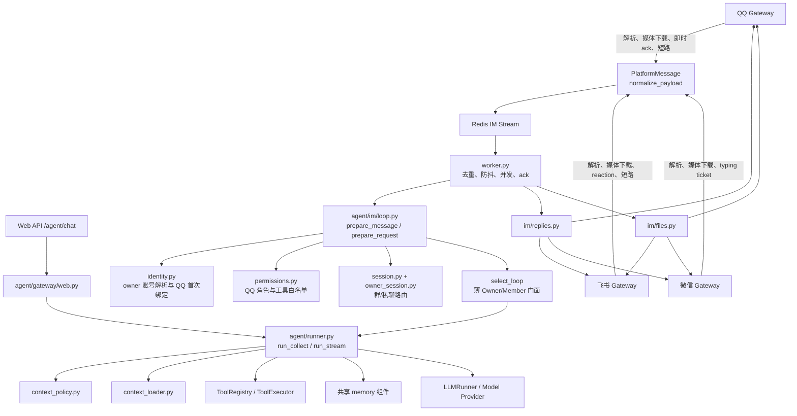

# IM Loop 与 Gateway 解耦 PRD

> 状态：Phase 4 代码完成，待三平台手动验收
> 创建：2026-08-03
> 最近更新：2026-08-03
> 关联模块：`backend/agent/gateway/qq.py`、`backend/agent/gateway/feishu.py`、`backend/agent/gateway/wechat.py`、`backend/worker.py`、`backend/agent/runner.py`
> 关联文档：[`PRD-IM-1-im接入稳定性与qq自建websocket.md`](./PRD-IM-1-im接入稳定性与qq自建websocket.md)、[`20-IM接入架构.md`](../../agent/20-IM接入架构.md)、[`21-群聊消息架构.md`](../../agent/21-群聊消息架构.md)、[`22-IM用户数据结构.md`](../../agent/22-IM用户数据结构.md)

## 0. 实施状态

| 阶段 | 状态 | 说明 |
|---|---|---|
| Phase 0：边界与协议设计 | ✅ 已完成 | 明确 Gateway、IM Loop、通用 Agent Runtime 的职责边界和消息协议。 |
| Phase 1：统一消息协议 | ✅ 已完成 | 已新增入站 `PlatformMessage`、出站 `PlatformReply`，三个 Gateway 在入队前归一化消息，worker 在发送边界消费统一回复协议，并保留旧平台发送实现。 |
| Phase 2：抽出身份与权限层 | ✅ 已完成 | 身份、权限、上下文策略、ActorContext、上下文装配和 Loop 选择门面已接入 runner/dispatch；worker 仅保留队列、session 和发送兼容边界。 |
| Phase 3：建立 IM Loop | ✅ 已完成 | 已完成 Owner/Member Loop 门面、上下文与权限编排、session 路由、显式 Web session 绑定、统一回复和 worker 职责收口。 |
| Phase 4：收窄 Gateway | ✅ 代码完成，待验收 | owner 绑定、身份协议、shortcut 和出站能力门禁已收口；平台媒体 API、即时 ack/reaction/typing 作为纯协议适配仍保留在 Gateway。 |
| Phase 5：隔离修复与编排清理 | 🔲 待实施 | 先修复 scope/身份边界，再收回 worker 编排，最后统一 Web/owner Loop 和出站协议。 |
| Phase 6：群组与成员记忆 | 🔲 后续 | 复用 memory 组件，但使用独立的群组/平台用户 namespace，不与 owner 记忆混用。 |

## 0.1 当前实现基线与代码审查

以下内容以当前代码为准，和后面的“目标架构”分开记录。当前实现已经完成了协议、身份/权限门面和部分出站收口，但还不是完全独立的 `OwnerAgentLoop` / `MemberAgentLoop` 架构。

### 当前 Agent Loop 架构图



### 当前职责划分

| 模块 | 当前实际职责 | 边界判断 |
|---|---|---|
| `agent/gateway/{qq,feishu,wechat}.py` | 长连接/轮询、平台事件解析、引用和媒体下载/转码、平台即时 ack/reaction、部分 intent 短路、入 Redis、平台发送 API | 平台协议职责基本合适；仍有部分业务短路和群策略判断，尚未完全纯化。 |
| `agent/im/models.py` | `PlatformMessage`、带 capability 的 `PlatformReply` 与旧 dict payload 互转，并校验目标平台能力 | 适合作为兼容协议层；文本/引用已接入，文件/流式仍在迁移中。 |
| `agent/im/identity.py` | 根据 Bot owner 解析咕咕账号、QQ C2C 首次 sender 绑定、owner 显示名裁剪 | 账号归属职责合适；member 身份解析仍主要在 QQ 权限服务中。 |
| `agent/im/permissions.py` | QQ 群/C2C 角色查询、非 QQ 私聊 owner/群聊 unknown 策略、工具白名单裁剪和 dispatch 二次门禁、群开关读取 | 权限职责合适；跨平台 owner 绑定仍需后续补充，群聊未知身份已默认最小权限。 |
| `agent/im/session.py` | IM session Redis 路由、群消息窗口裁剪、数据库会话创建 | 方向合适；当前 key 仍没有包含 `bot_id`，属于 Phase 5 隔离修复。 |
| `agent/im/context_policy.py` / `context_loader.py` | 根据 `im_role` 决定 owner 上下文范围并读取上下文数据 | 责任边界合适；`prepare_request()` 已保证 IM 缺失/异常身份先降级为 `unknown`。 |
| `agent/im/loop.py` | 请求准备、身份/权限串联、session 解析、被动群消息持久化、命令短路、typing 生命周期、IM ContextVar、回复状态 | 目前是“准备门面 + 多个 worker helper”，还不是完整的消息执行 Loop。文件职责偏重。 |
| `agent/im/replies.py` / `files.py` | 文本、流式 fallback、文件读取、平台限制和 Gateway 发送调用；`files.py` 也统一入站暂存门面 | 统一入口方向正确，但模块仍直接依赖各 Gateway，属于出站适配层而非完全平台无关的 reply model。 |
| `worker.py` | Redis 消费、去重、防抖合并、同用户串行锁、调用准备门面、被动群记录、命令处理、执行生命周期、流式分支、session 写回、文本/文件发送、ack | 仍承担较多 IM 编排，是当前最大职责集中点。 |
| `agent/runner.py` | Web 和 IM 的上下文读取、会话创建/历史、附件解析、prompt、模型/工具循环、持久化、用量、标题/摘要、反思、压缩 | 共享 Runtime 的核心，但 Web/IM 入口尚未通过同一个 Loop 门面；流式/非流式流程仍有较多重复。 |

### 审查发现

| 优先级 | 位置 | 发现 | 风险与建议 |
|---|---|---|---|
| P1 | `worker.py` 的 `_user_buffers`、`_user_locks`、`_user_deadline`、`_user_flush` | 防抖和串行键只有 `platform_user_id`，没有 `platform`、`bot_id`、`chat_type`、`chat_id`。同一用户跨 Bot、跨群或私聊/群聊同时发消息时可能合并到同一轮。 | 改为稳定的 `ImConversationKey(platform, bot_id, chat_type, scope_id)`；防抖、锁和并发状态全部使用该 key。补跨群并发回归测试。 |
| P1 | `agent/im/session.py` 的 `session_key()`、`resolve_route()` | Redis session key 只有 `platform + scope_id`，没有 `bot_id`；文档要求的 `platform + bot_id + chat_id` 尚未落地。 | 不同 Bot 或同平台同 ID 场景可能共享会话。先扩充 `SessionRoute` 与 Redis key，再迁移旧 key。 |
| ✅ P1 已修复 | `agent/im/models.py`、`agent/im/loop.py`、微信 Gateway | 微信 payload 使用 `wechat_group_id`，统一协议只读取 `chat_id`；因此微信群会话的 `chat_id` 可能为空或退化为发言人 ID。 | 已在协议层统一 `chat.id`，并补充微信群协议回归测试。 |
| ✅ P1 已修复 | `agent/im/permissions.py` 的 `resolve_access()`、`context_policy.py` | 非 QQ 平台原先返回 `ImAccess()`，可能以 `role=None` 进入 owner 上下文。 | 已改为：私聊按当前单 Bot owner 规则，群聊和身份异常统一 `unknown + web_search`；跨平台 owner 绑定仍是后续扩展。 |
| P2 | `worker.py` 91-185 行 | worker 仍直接编排被动群记录、命令短路、typing、流式选择、回复兜底、session 写回和文件发送。 | 与 PRD 中“worker 只负责队列消费”不一致。Phase 5 应把这些收进可测试的 `ImLoop.dispatch/execute/finalize`，worker 只保留队列生命周期和异常边界。 |
| P2 | `agent/im/loop.py` 的 `OwnerAgentLoop` / `MemberAgentLoop` | 两个类目前只有同样的 `run_collect/run_stream` 转发，member 的限制实际由 `context_policy` 和工具过滤完成。 | 当前称为“两个 Loop”会夸大隔离程度。短期保留薄门面，文档明确它们是编排入口；长期将 policy/session/reply 作为显式参数传入共享 Runtime。 |
| P2 | `agent/im/replies.py`、`agent/im/files.py` | 出站协议已创建，但实际仍按 payload 直接调用各 Gateway；文件和流式回复没有完全变成 `PlatformReply` part。 | 不属于立即 bug，但职责仍是“IM reply adapter”；Phase 5 再统一 capability 和 part 路由，不要在 Gateway 之外复制平台发送规则。 |
| P2 | `agent/runner.py` `run_collect()` / `run_stream()` | 两条路径各自完成上下文、session、历史、附件、持久化、事件、反思和压缩，当前只是共享了部分 loader。 | 修改一条路径容易漏另一条。后续抽出共享执行上下文和 finalize pipeline，保留流式/非流式唯一差异。 |

本次审查结论：模块拆分方向基本正确，但“职责已完成迁移”的表述过早。当前可接受的边界是 Gateway 负责平台协议、`im` 负责身份/策略/路由门面、runner 负责共享模型执行；`worker.py` 仍是过渡期编排中心。上述 P1 先修复后，再继续 Phase 5 的清理。

## 1. 背景与目标

### 1.1 当前问题

当前 `agent/runner.py` 同时承担 Web 和 IM 的大量流程：

- Web 与 IM 的会话创建、历史加载和持久化。
- IM 平台身份解析和 owner/member 权限判断。
- 群聊消息窗口拼接。
- owner 的项目、文件、日程、profile、pattern、memory 注入。
- 工具白名单过滤、语音和附件处理、平台回复。

随着 QQ 群聊、群成员权限和平台用户名接入，`worker.py` 与 `runner.py` 中逐渐出现大量 `if platform`、`if chat_type`、`if im_role` 分支。最危险的后果是：非 owner 的群消息沿用了 owner 的 `user_id`，从而误注入 owner 的个人上下文或写入 owner 的长期记忆。

### 1.2 目标

建立一条独立的 IM 编排链路：

```text
Platform Gateway
  -> PlatformMessage
  -> ImLoop
  -> Identity / Permission / Context Policy
  -> Agent Runtime
  -> PlatformReply
  -> Platform Gateway
```

目标包括：

1. Web 保持当前行为和入口，但与 owner IM 共享同一套完整 AgentLoop 和能力组件。
2. IM 负责用户识别、owner/member 隔离、群消息上下文和平台回复编排。
3. Gateway 只负责平台连接、消息解析、入队和发送。
4. owner 在 IM 中保持 Web 同等权限和用户记忆，并按会话路由规则复用 Web 上下文。
5. 非 owner 进入轻量的 member 编排，不读取或写入 owner 的个人上下文。
6. 模型、工具、记忆接口、会话、附件和回复渲染等底层能力全部复用，不复制多套 Agent 实现。

### 1.3 非目标

- 不重写 Web runner。
- 不改变现有 QQ 自建 WebSocket、飞书 WebSocket、微信 iLink 的连接方式。
- 不在本 PRD 中实现群成员长期记忆；只为后续留出隔离边界。
- 不把平台名称、群名称当作身份主键。
- 不把 `owner_user_id` 继续作为当前发言人的身份字段传递给模型。

## 2. 功能需求

### FR-IM-1：统一入站消息协议（待实施）

所有 Gateway 将平台事件转换成统一的 `PlatformMessage`。IM Loop 不直接依赖 QQ、飞书或微信 SDK 的事件对象。

```python
PlatformMessage(
    platform="qqbot",
    bot_id="...",
    message_id="...",
    chat=ChatTarget(id="...", type="group"),
    sender=PlatformSender(id="...", name="..."),
    content="...",
    attachments=[],
    quoted_message=None,
    mentioned=True,
    received_at=...,
)
```

要求：

- `sender.id` 是平台身份识别字段。
- `sender.name` 只用于称呼，不参与权限和身份判断。
- `chat.id` 只用于回复路由和群消息窗口。
- `mentioned`、引用和附件是平台元数据，不在 Gateway 做业务决策。
- 保留消息去重所需的 `message_id`。

### FR-IM-2：统一出站回复协议（待实施）

IM Loop 输出平台无关的 `PlatformReply`，Gateway 只负责转换为对应平台的发送请求。

```python
PlatformReply(
    target=ChatTarget(id="...", type="group"),
    messages=[
        ReplyPart(type="text", text="..."),
        ReplyPart(type="file", file_id="..."),
        ReplyPart(type="keyboard", payload={...}),
    ],
    reply_to_message_id="...",
)
```

### FR-IM-3：owner 身份与上下文（待实施）

owner 消息进入 `OwnerContext`：

- 读取 owner 的 profile、pattern、preferences、memory 和 daily。
- 读取 owner 的项目、文件、日程和个人设置。
- 使用 Web 同等的完整工具权限。
- 允许写入 owner 的对话记忆。
- 群聊中的近期消息可作为额外 `GroupContext` 注入，但必须标明每条消息的发送者。

### FR-IM-4：非 owner loop 隔离（待实施）

member/unknown 消息进入独立的 `MemberContext`：

- 只保留当前平台身份元数据和必要的群聊消息窗口。
- 不注入 owner 用户名、profile、pattern、preferences、memory、项目、文件或日程。
- 不注入 owner 的跨会话续接桥。
- 不写入 owner 的长期记忆。
- 默认只开放网页搜索等明确白名单工具。
- 当前平台用户名可以用于自然称呼，但不能作为身份或权限依据。

非 owner 的 `owner_account_id` 只用于定位机器人所属账号和读取权限配置，不代表当前发言人。

### FR-IM-5：群聊上下文隔离（待实施）

群聊近期消息作为独立窗口保存和注入：

- 按 `platform + bot_id + chat_id` 区分群聊窗口。
- 每条消息保留 `sender_id`、`sender_name`、正文和时间。
- 当前阶段最多注入最近 50 条有效群消息。
- owner 的个人记忆不进入群成员 loop。
- 群成员消息不进入 owner 的长期记忆。
- 模型必须根据 `sender_id` 区分发言人，不能根据昵称或历史语气猜测身份。

### FR-IM-5A：群组与平台用户记忆（待实施）

群组/member 记忆复用现有 memory 组件的提取、压缩和检索能力，但不复用 owner 的记忆 namespace、加载范围和写入策略。两类记忆按平台、Bot 和作用域隔离：

```text
.agent/im/
├── qq/
│   ├── platform-users/{platform_user_id}/
│   │   ├── profile.md
│   │   ├── pattern.md
│   │   └── summary.md
│   └── groups/{group_id}/
│       ├── profile.md
│       ├── daily.md
│       └── memory.md
├── feishu/
└── weixin/
```

逻辑唯一作用域必须包含 `platform + bot_id`：

```text
platform + bot_id + platform_user_id
platform + bot_id + group_id
```

平台用户记忆只记录轻量资料、表达模式和阶段性摘要；群组记忆沿用现有 `profile.md`、`daily.md`、`memory.md` 结构，分别记录群资料、近期群聊和压缩后的稳定群知识。成员个人资料不能自动写入群记忆，群内公开信息也不能反向写入 owner memory。

MemberLoop 的读取顺序为：当前群 `daily.md` → 当前群 `memory.md` → 当前群 `profile.md` → 当前发言人的平台用户记忆 → 当前群消息窗口。写入和压缩应异步执行，不阻塞群聊回复；成员记忆需要独立的可见范围、删除、过期和群解散清理策略。

### FR-IM-6：Gateway 纯传输职责（待实施）

Gateway 只负责：

- 建立和维护平台连接。
- 解析平台事件为 `PlatformMessage`。
- 平台级消息去重、ack、重连和限流。
- 将消息送入 Redis Streams 或 IM Loop 队列。
- 将 `PlatformReply` 转换为平台发送 API。

Gateway 不负责：

- 判断 owner/member/unknown。
- 查找咕咕账号绑定关系。
- 加载 profile、memory、项目、文件或日程。
- 选择工具白名单。
- 拼接 Agent prompt。
- 决定是否写入长期记忆。

平台特有的 `@`、引用、附件下载和消息类型解析仍属于 Gateway 的协议适配职责，但是否回复、是否记录、是否调用模型由 IM Loop 决定。

## 3. 目标架构

### 3.1 分层关系

```text
Web Request
  -> OwnerAgentLoop
      -> OwnerContextAssembler
      -> Shared Agent Runtime
      -> Web Reply Adapter

QQ / 飞书 / 微信 Gateway
  -> PlatformMessage
  -> Redis Streams
  -> ImLoop
      -> IdentityResolver
      -> ImSessionStore
      -> OwnerAgentLoop       # owner：完整上下文和权限
      -> MemberAgentLoop      # member/unknown：轻量上下文和白名单
          -> Shared Agent Runtime
      -> PlatformReply Adapter
  -> Gateway Sender
```

共享关系应明确为：

```text
Web / Owner IM
      -> OwnerAgentLoop
            -> OwnerContextAssembler
            -> Shared ToolRegistry / ToolExecutor
            -> Shared ModelClient / AgentModelLoop
            -> Shared Memory / Attachment / Response components

Member IM
      -> MemberAgentLoop
            -> MemberContextAssembler
            -> MemberPermissionPolicy
            -> Shared ToolRegistry / ToolExecutor
            -> Shared ModelClient / Response components
```

Web 与 owner IM 共享完整的 owner 编排和能力组件，差异只保留在入口、session 路由和回复适配器。Member 不复制工具或模型执行逻辑，只使用更严格的上下文和权限策略。

### 3.2 OwnerLoop 与 MemberLoop 的边界

`OwnerAgentLoop` 是 Web 和 owner IM 的共同入口，负责：

- 加载 owner 的完整个人上下文。
- 使用完整工具权限和 destructive 确认门。
- 读取和写入 owner 的会话、记忆与附件。
- 调用共享的模型/工具执行循环。

`MemberAgentLoop` 只负责轻量编排，负责：

- 组装当前群的近期消息和当前发言人元数据。
- 根据 member/unknown 身份应用工具白名单。
- 调用同一套模型、工具执行、回复渲染和错误处理组件。
- 明确禁止加载 owner 的个人上下文，也禁止写入 owner 的长期记忆。

两者不是两套工具系统或两套模型 Loop，而是两种上下文、权限和会话编排策略。共享组件必须接收显式的 `ActorContext` 和 `ContextScope`，不能通过隐式的当前用户变量决定权限。

### 3.3 Owner 会话与 Web 上下文

owner 身份统一后，必须由 `OwnerSessionResolver` 解决“使用哪一个会话”，不能把所有 Web session 自动拼接到 IM。

默认规则：

- Web 请求继续使用页面传入的 `session_id`。
- owner 私聊 IM 使用绑定的 owner 私聊 session。
- owner 群聊使用对应群 session，但可以读取 owner 的完整个人上下文。
- owner IM 只有在明确建立 session 绑定后，才继续某个 Web session 的对话历史。
- 没有显式绑定时，不读取其他 Web session 的正文，只复用统一的 owner profile、memory、项目和工具权限。

这样可以保证 owner 的 Web 与 IM 体验一致，同时避免把不同网页标签页、不同任务或不同时间线无条件混到一起。`session_id` 是对话范围，`owner_user_id` 是权限和个人上下文范围，两者必须分开建模。

### 3.4 身份模型

```text
owner_account_id
  = 绑定 Bot 所属的咕咕账号

speaker_id
  = 当前平台发言人的 platform user id

speaker_name
  = 当前平台显示名，仅用于称呼

chat_id
  = 当前私聊或群聊会话，用于回复路由和消息窗口
```

禁止把 `owner_account_id` 直接当成 `speaker_id`。只有身份解析明确返回 `owner` 时，才允许进入 owner loop。

### 3.5 两种 IM Loop

```text
ImLoop.dispatch(message)
  -> identity = resolver.resolve(message)
  -> if identity.role == owner:
       OwnerAgentLoop.run(message, identity, session=OwnerSessionResolver.resolve(...))
     else:
       MemberAgentLoop.run(message, identity, session=ImSessionStore.resolve(...))
```

`OwnerAgentLoop` 由 Web 和 owner IM 共同调用；`MemberAgentLoop` 只负责 member/unknown 的轻量编排。二者共享 `AgentModelLoop`、工具注册表、工具执行器、附件处理、回复渲染和错误处理，但不得共享个人上下文加载器、owner 记忆写入策略或隐式 owner session。

## 4. 目标文件结构

```text
backend/agent/
├── gateway/
│   ├── base.py                 # 平台适配接口
│   ├── qq.py                   # QQ Gateway：连接、解析、发送
│   ├── feishu.py               # 飞书 Gateway：连接、解析、发送
│   ├── wechat.py               # 微信 Gateway：轮询、解析、发送
│   └── supervisor.py            # Gateway 进程生命周期
├── im/
│   ├── __init__.py
│   ├── models.py               # PlatformMessage / PlatformReply / identity DTO
│   ├── actor.py                # 共享 Runtime 使用的 ActorContext 快照
│   ├── loop.py                 # IM 总入口和 owner/member 分流
│   ├── identity.py             # 平台身份解析、owner 绑定和角色判断
│   ├── permissions.py           # 工具白名单和 destructive 权限
│   ├── context_loader.py        # 按 ContextPolicy 装配本轮上下文输入
│   ├── session.py              # 私聊/群聊 session 与消息窗口
│   ├── owner_session.py         # owner IM 与 Web session 的显式路由/绑定
│   ├── context_policy.py       # OwnerContext / MemberContext 规则
│   ├── context_builder.py      # 群消息与身份上下文组装
│   ├── owner_loop.py            # Web/owner IM 共用的完整编排门面
│   ├── member_loop.py           # member/unknown 轻量编排门面
│   └── response.py              # AgentResponse -> PlatformReply
├── runner.py                   # Web 兼容入口；调用共享 OwnerAgentLoop
└── models.py                   # AgentRequest / AgentResponse 等共享 DTO

backend/worker.py               # 队列消费入口，最终只负责调用 ImLoop
```

迁移期间允许 `im/` 先以小模块形式存在，不要求一次性完成全部目录移动。优先抽出 `context_policy.py` 和 `identity.py`，再迁移 loop。

## 5. 关键实现流程

### 5.1 入站流程

```text
1. Gateway 收到平台事件
2. 解析 sender/chat/message/attachments/quoted/mentioned
3. 生成 PlatformMessage
4. 按 message_id 去重
5. 入 Redis Streams
6. Gateway 立即 ack 或发送平台要求的确认
7. ImLoop 消费消息
8. IdentityResolver 查询 owner 绑定与当前 speaker 角色
9. OwnerSessionResolver 或 SessionStore 选择会话范围
10. OwnerAgentLoop 或 MemberAgentLoop 选择对应编排
11. ContextPolicy/ContextBuilder 构造 OwnerContext 或 MemberContext
12. Shared AgentModelLoop 执行模型和工具
13. ResponseMapper 生成 PlatformReply
14. Gateway 按目标平台发送
15. Persistence 保存消息和必要的身份元数据
```

### 5.2 owner 回复流程

```text
PlatformMessage
  -> resolve owner
  -> OwnerSessionResolver
  -> OwnerAgentLoop
  -> owner personal context + optional group context
  -> full tools and memory reflection
  -> shared model/tool runtime
  -> PlatformReply
```

### 5.3 非 owner 回复流程

```text
PlatformMessage
  -> resolve member/unknown
  -> MemberAgentLoop
  -> member session or group context window
  -> identity metadata + group context only
  -> allowlisted tools only through shared ToolExecutor
  -> no owner memory read/write
  -> PlatformReply
```

### 5.4 普通群消息流程

普通群消息是否进入模型由 IM Loop 的群聊策略决定，而不是 Gateway 决定：

- `group_chat_enabled=false`：丢弃或只记录平台级诊断元数据。
- `group_read_enabled=true` 且未 @：写入群消息窗口，不调用模型。
- 被 @ 或明确触发：进入 owner/member loop。
- 权限失败：按 unknown 最小工具白名单执行，不能升级为 owner。

## 6. 数据与日志要求

### 6.1 持久化边界

继续保存以下元数据：

- `platform`
- `platform_user_id`
- `platform_user_name`
- `chat_type`
- `chat_id`
- `message_id`
- `owner_account_id`
- `im_role`

但必须区分：

- `owner_account_id`：账号归属和资源权限。
- `platform_user_id`：当前发言人身份。
- `platform_user_name`：展示字段，不是身份主键。

非 owner 消息可以落库为群聊上下文，但不能触发 owner 记忆反思或 profile 更新。

### 6.2 日志边界

- 不记录聊天正文、附件文件名、token 或上游响应体。
- 诊断日志只记录脱敏后的 `platform_user_id` 指纹、角色、chat 类型和 trace。
- Gateway 日志记录连接、ack、去重和发送结果。
- IM Loop 日志记录身份解析结果、上下文策略和工具权限结果。
- 不在 Gateway 日志中记录 owner 资料或记忆内容。

## 7. 实施计划

### Phase 1：统一协议与兼容门面

- 新增 `agent/im/models.py`。
- 将 QQ、飞书、微信现有 payload 映射为 `PlatformMessage`。
- 增加 `PlatformReply` 到现有发送方法的兼容转换。
- 保留旧 payload 字段，确保现有 worker 可回退。
- 验收通过后再进入身份层拆分。

### Phase 2：抽出身份与上下文策略

- 新增 `identity.py`、`permissions.py`、`context_policy.py` 和 `context_loader.py`。
- 已将工具白名单过滤和 dispatch 权限门统一到 `agent.im.permissions`。
- 已将 owner/member/unknown 的上下文范围集中到 `context_policy`，并由 `context_loader` 统一装配项目、日程、文件、偏好、记忆和通知渠道。
- 已将 `runner.py` 的非流式/流式重复上下文读取路径接入同一装配入口；member/unknown 只保留时区，不读取 owner 个人上下文。
- 已新增 `ActorContext` 并接入 `AgentRequest`，显式区分 `owner_user_id`、`platform_user_id`、角色、会话范围和工具白名单。
- 已新增轻量 `agent/im/loop.py` 请求准备门面，worker 不再直接编排权限解析和 AgentRequest 字段；Owner/Member 仍复用同一套模型、工具和回复运行时。
- 已新增 `agent/im/session.py`，集中管理 12 小时滑动 session TTL、群/私聊作用域 key、显式 session 优先规则、同平台同群归属校验和每群 50 条消息保留策略。
- 已将 runner 两条执行路径重复的会话查找、创建和旧会话清理逻辑收拢到 `get_or_create_session()`，作为 `OwnerSessionResolver` 的基础实现。
- 已由 `select_loop()` 选择 `OwnerAgentLoop` 或 `MemberAgentLoop`，两个门面共享同一套 runner、模型、工具和回复运行时，不复制执行逻辑。
- ✅ 身份解析已由 `prepare_message()` 门面统一完成，worker 不再直接解析 owner 或拼装 AgentRequest；worker 中保留的 session/发送兼容边界转入 Phase 3 清理。
- 增加防回归测试：member 不读 owner memory，不写 owner reflection。

### Phase 3：建立 ImLoop

- ✅ 已新增 `im/loop.py`、`session.py`，并由 `context_loader.py` 承担上下文装配。
- ✅ 已抽出共享 `OwnerAgentLoop` 和轻量 `MemberAgentLoop` 门面；两者共享同一套模型、工具和回复运行时。
- ✅ `get_or_create_session()` 已作为 `OwnerSessionResolver` 基础实现；`owner_session.py` 已提供 owner 私聊与 Web session 的显式绑定，群聊不读取该绑定。
- ✅ 新增 owner-only `bind_web_session(session_id)` 工具，绑定前校验 Web session 归属和来源，群聊/member 不可使用。
- ✅ 群聊 50 条窗口、私聊 session、发言人身份标注已接入现有 IM 流程；引用和附件仍沿用共享处理链路。
- ✅ 未 @ 的群聊消息记录入口已移入 `agent/im/loop.py`，不再由通用 `runner.py` 持有 IM 专属持久化逻辑。
- 🔄 `worker.py` 已不再负责身份/权限字段组装和基础 session 路由，但仍保留被动群消息、命令短路、执行生命周期、session 写回和平台发送等过渡编排。
- ✅ IM 命令短路入口已移入 `agent/im/loop.py`，worker 只消费命令处理结果。
- ✅ 文本回复已移入 `agent/im/replies.py`，统一消费 `PlatformReply` 并按平台转发；工具进度消息也走同一入口。
- ✅ 文件回复已移入 `agent/im/files.py`，统一处理文件库/暂存附件读取、平台大小限制和媒体发送。
- ✅ IM 忙碌态和微信 typing 生命周期已由 `agent/im/loop.py` 统一管理，异常和取消路径也使用同一清理入口。
- ✅ IM 可触达地址登记已由 `agent/im/loop.py` 统一封装，worker 不再直接调用定时任务存储实现。
- ✅ 定时任务主动 IM 投递已直接使用 `agent/im/replies.py`，不再依赖 worker 的发送函数。
- ✅ worker 已删除文本发送兼容别名，内部和测试直接使用统一回复入口。
- ✅ 取消和 `awaiting` 状态更新已移入 `agent/im/loop.py`，worker 只提交回复结果。
- ✅ IM 工具上下文绑定已移入 `agent/im/loop.py`，worker 不再直接调用 `imctx.set_im()`。
- ✅ 新增文本出站路由测试，覆盖 QQ 群聊/私聊目标和无发送通道边界。
- ✅ 新增附件出站路由测试，覆盖 QQ 群聊限制、飞书大小限制和未知平台边界。
- ✅ 飞书流式回复已移入 `agent/im/replies.py`，worker 只消费流式发送结果。
- ✅ 飞书流式失败后的普通文本 fallback 已移入 `agent/im/replies.py`，worker 只消费统一结果。
- ✅ IM session 写回和群消息窗口裁剪已移入 `agent/im/loop.py`，worker 不再直接操作 session 细节。
- ✅ QQ 群普通消息的被动记录策略已移入 `agent/im/loop.py`，worker 不再持有平台规则判断。
- 🔄 `runner.py` 保持 Web 入口和外部协议不变；Web 继续经 `gateway/web.py` 进入 runner，owner IM 经 `OwnerAgentLoop` 转发到同一套 runner、模型和工具执行逻辑，二者的统一 Loop 门面尚未完成。

### Phase 4：收窄 Gateway

- ✅ QQ 首次 owner sender 绑定已移入 `agent/im/identity.py`，Gateway 不再直接访问身份服务。
- ✅ QQ/飞书 intent shortcut 决策和取消状态已移入 `agent/im/loop.py`。
- ✅ QQ 群聊开关策略查询已移入 `agent/im/permissions.py`。
- ✅ IM 附件暂存已统一经 `agent/im/files.py`，Gateway 只保留下载、解密和转码。
- ✅ 三平台统一协议已补齐 `bot_id`、`chat.id`、`chat.type`、`sender.id`；微信 `wechat_group_id` 会进入统一 `ChatTarget`，并保留旧 payload 字段兼容。`platform_user_id` 提取也已集中到协议层。
- ✅ 飞书/微信私聊保持当前单 Bot owner 体验；群聊暂按 `unknown + web_search` 处理，身份无法解析时不会以 `role=None` 进入 owner 上下文。
- ✅ QQ/飞书普通 intent shortcut 已由 worker 转交 `agent/im/loop.py` 决策和执行；仅“取消”保留 Gateway 即时控制信号，保证正在运行的任务能及时中断。附件消息不会被 shortcut 提前吞掉。
- ✅ 即时 reaction 的关键词选择已移入 `agent/im/loop.py`；Gateway 只负责调用平台 reaction API，不再持有关键词业务规则。即时 ack、typing 仍保留在 Gateway/typing adapter，且不决定是否调用 Agent 或改变业务权限。
- 🔄 `PlatformReply` 已加入文本/引用/文件/图片/Keyboard/流式能力枚举、part 类型推导和平台能力校验；文本、文件门禁和流式门禁已接入，具体上传/流式 API 仍在各自 adapter 路径，后续继续迁移为 reply parts。
- 🔲 逐个平台验证收发、引用、附件、群聊身份和重连。

### Phase 5：隔离修复与编排清理

按以下顺序执行，任一步骤的权限或会话验收失败，都不得进入下一步：

1. **先修复会话作用域**
   - 新增不可变的 `ImConversationKey(platform, bot_id, chat_type, scope_id)`。
   - worker 的防抖 buffer、串行锁、deadline、flush task 和并发状态全部使用该 key。
   - `SessionRoute`、Redis session key 和数据库会话查询统一包含 `platform + bot_id + chat_type + scope_id`。
   - 设计旧 Redis key 的平滑失效策略，不把旧会话错误迁移到新作用域。

2. **修复平台协议归一化**
   - `PlatformMessage.from_payload()` 统一处理微信群 ID，不在 worker 中添加平台分支。
   - 为 QQ、飞书、微信补齐私聊/群聊、同用户跨群、同群多人和多 Bot 测试。

3. **补齐身份安全边界**
   - 为飞书/微信定义 owner 绑定查询和 member/unknown 角色解析。
   - 权限解析异常、缺失或不支持的平台身份统一使用最小权限 `unknown`。
   - 增加断言：只有明确 `role=owner` 才能加载 owner 项目、文件、日程、profile、pattern、memory 或触发 owner reflection。

4. **收回 worker 编排**
   - 将被动群消息记录、命令短路、执行 activity、session 写回和最终回复编排收进 `agent/im/loop.py` 的明确入口：`dispatch`、`execute`、`finalize`。
   - worker 只负责 Redis 消费、去重、防抖调度、优雅退出和最外层异常边界。
   - 防抖仍属于 worker 的队列调度职责，但不得再携带身份、权限和平台业务判断。

5. **统一 Web/owner Loop 门面**
   - 保持 Web API 协议不变，让 Web 和 owner IM 共同经过稳定的 `OwnerAgentLoop` 入口。
   - `OwnerAgentLoop` 只编排请求范围和调用共享 Runtime，不复制 `runner.py` 的模型/工具逻辑。
   - `MemberAgentLoop` 只提供上下文策略、权限和 session scope，不把 member 伪装成另一套模型执行器。

6. **最后清理重复实现**
   - 合并 `run_collect()` / `run_stream()` 的共享 session、历史、附件解析、持久化、反思和压缩 finalize pipeline。
   - 删除旧 payload 兼容分支和 worker 中已经迁移的 IM 判断。
   - 完成 `PlatformReply` capability 路由后，再删除各平台出站兼容函数。

### Phase 6：群组与成员记忆预留

- 只有 Phase 5 的身份和 scope 隔离验收通过后才开始。
- 将群消息窗口与个人记忆存储边界写入数据库约束和测试。
- 复用现有 memory 组件，但使用独立的群组/平台用户 namespace。
- 仅完成长期群聊记忆的接口预留，不在本 PRD 中实现压缩算法。

每个阶段单独提交。任一阶段出现 owner 权限、群回复路由或上下文差异时，不进入下一阶段。

## 8. 验收清单

### 自动验收

- [ ] `PlatformMessage` 可由 QQ、飞书、微信事件生成。
- [ ] `PlatformReply` 可转换为三平台文本、文件和 Keyboard 回复。
- [ ] 相同 `message_id` 只处理一次。
- [ ] owner/member/unknown 解析结果稳定。
- [ ] member 不加载 owner 的项目、文件、日程、profile、pattern、memory。
- [ ] member 不触发 owner 的 memory reflection。
- [ ] member 只能使用配置的工具白名单。
- [ ] 群消息按 `platform + bot_id + chat_id` 隔离。
- [ ] 不同群的消息不会进入同一上下文窗口。
- [ ] `owner_account_id` 不会被当成 `platform_user_id`。
- [ ] 防抖、串行锁和 session key 均包含 `platform + bot_id + chat_type + scope_id`。
- [ ] 微信群 `wechat_group_id` 能正确进入统一 `PlatformMessage.chat.id`。
- [ ] 飞书/微信身份缺失或解析失败时只能进入 `unknown` 最小权限路径。
- [ ] Gateway 不依赖 Agent prompt 或个人记忆模块。
- [ ] 可在不启动 Web runner 的情况下单测 IM Loop。
- [ ] Web 与 owner IM 调用同一个 `OwnerAgentLoop` 和共享能力组件，不存在两套工具/模型执行逻辑。
- [ ] member 使用 `MemberAgentLoop`，只能替换上下文、权限和会话编排，不能读取 owner 个人上下文。
- [ ] 同一用户跨群、跨 Bot、群聊/私聊并发发送时，不会合并消息或共享错误 session。
- [x] owner 私聊默认使用绑定的 owner session；未显式绑定时不会自动拼接任意 Web session 正文。
- [x] 显式绑定 Web session 后，owner IM 可以继续该 session 的上下文，Web 侧也能看到同一 session 的 IM 消息。

### 手动验收

1. owner 私聊查询项目、文件、日程，结果与 Web 一致。
2. owner 私聊和 Web 调用结果一致，且都经过同一个 OwnerAgentLoop。
3. 显式绑定 Web session 后，owner 从 IM 继续对话，网页能看到同一 session 的消息和附件。
4. 未绑定 Web session 时，owner IM 不会误拼接其他标签页或其他任务的对话正文。
5. owner 在群里 @ 咕咕，能使用完整 owner 权限，但群消息仍按群 session 保存。
6. 非 owner 在群里 @ 咕咕，只能聊天和使用白名单工具。
7. 非 owner 询问“我是谁”时，不会被回答成 owner，也不会注入 owner 个人资料。
8. 非 owner 连续对话时，能使用群聊上下文，但看不到 owner 的个人记忆和资源概览。
9. 两个不同 QQ 账号使用不同用户名发言，身份和称呼均不串线。
10. 同一用户换群后，平台身份仍可识别，但不同群的消息窗口不混用。
11. 未 @ 的普通群消息开启只读模式时只记录、不调用模型、不回复。
12. owner 和 member 连续交替发言，双方 loop 不互相覆盖 session、权限和上下文。
13. QQ、飞书、微信断线重连后，消息仍能进入同一 IM Loop。
14. Gateway 发送文本、文件和 Keyboard 时，IM Loop 不感知平台 API 细节。
15. 重启 worker 后不会重复处理已经 ack 的消息。

## 9. 风险与待确认问题

| 风险 | 影响 | 对策 |
|---|---|---|
| 当前群 session 仍可能包含 owner 之前说过的敏感正文 | member 看到不应看到的群内历史 | Phase 3 增加按消息可见范围和上下文裁剪策略；至少标注 speaker 和 scope。 |
| `owner_account_id` 仍用于现有资源查询 | 迁移期间可能误把 member 当 owner | Phase 2 增加显式 `ContextScope` 和工具层权限守卫。 |
| 三个平台出站能力不一致 | 文件、Keyboard 或引用回复行为不同 | `PlatformReply` 使用 capability 声明，不支持的 part 必须显式降级。 |
| Gateway 与 worker 同时保留旧/新 payload | 迁移期间字段含义可能冲突 | 每阶段保留兼容解析，但只允许一处做业务身份解析。 |
| member 长期记忆尚未定义 | 可能污染 owner 记忆或造成隐私越界 | Phase 6 单独设计存储、可见范围、删除和用户授权。 |

待确认：

- 🔲 群聊历史对 owner 与 member 是否完全一致，还是按消息 scope 做进一步过滤。
- 🔲 member 是否允许使用 Keyboard 触发需要身份确认的动作。
- 🔲 非 owner 的群消息是否建立独立会话，还是只使用群消息窗口加临时 response session。
- 🔲 飞书和微信是否也采用与 QQ 相同的 owner/member 绑定策略。
