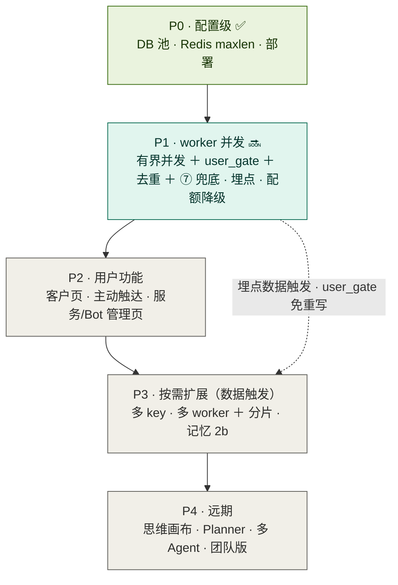

# 咕咕 · 并发优化 Roadmap

> 创建 2026-06-24｜范围：IM/Agent 扩量主线的分期 + 依赖 + Admin 可管理项
> 相关：[决策环](agent-决策环.md) · [IM 接入架构](agent-im接入架构.md) · [压测结果](并发压测结果.md)

**核心决策：默认单机。** 扩量靠单机内手段（async 并发、多 LLM key、DB 池、`uvicorn --workers N`），不上跨主机控制面。`user_gate` 用进程内锁即终态，P3 多 worker/分片 park。**瓶颈是 LLM provider 限流额度，不是机器。**

图例：✅ 完成 · 🔜 进行中 · ⬜ 未开始 · ⏸️ 按需/数据触发

---

## 当前状态一览

| 阶段 | 状态 | 内容 |
|------|------|------|
| 已交付 | ✅ 已部署 | 取消修复 / 对账 / 批量工具 / 多模态 / 搜索 + 定时任务多平台投递 |
| P0 配置级 | ✅ 基本完成 | DB 池 ⑤ · Redis maxlen · 提交部署 |
| **P1 worker 并发** | 🔜 **进行中** | ①⑦ 代码完成 + 压测通过，待 worker 重启 + 端到端；地基 A/B、配额降级待做 |
| P2 用户功能 | ⬜ | 客户页 · 主动触达 · 服务/Bot 管理页 |
| P3 按需扩展 | ⏸️ | 多 key / 多 worker，由埋点数据触发 |
| P4 远期 | ⬜ | 思维画布 · Planner · 多 Agent · 团队版 |

**下一步**：worker 重启一次激活 ①⑦ + 并发热配 → 真号端到端验证 → 余下地基 A/B、配额降级。并发量默认 16（单 key 实测安全上限，见[压测](并发压测结果.md)）。

---

## 分期总览



---

## 分期明细

### ✅ P0 · 配置级（基本完成）

- ✅ 提交 + 部署（devserver 跑最新代码）
- ✅ ⑤ DB 连接池 `pool_size=15 / max_overflow=25 / timeout=10 / recycle=1800`
- ✅ Redis stream `maxlen=10000`（早已设）
- 🔜 后推：④ `uvicorn --workers N`（挂 P1-地基A 之后）· ⑥ 换 provider（按需，随时可换 flash 模型，不阻塞）

### 🔜 P1 · 解锁 worker 并发 → 50+ 人（架构核心）

**① 并发化** — 代码完成 + 压测通过（~6× 提速），待 worker 重启激活 + 真号端到端

- ✅ `run_once` 串行 `for await` → 有界并发（`asyncio.create_task` + `Semaphore`）
- ✅ `user_gate(puid)`：进程内 `asyncio.Lock`，同用户串行保序、不同用户并发（单机下即终态）
- ✅ 优雅 drain：SIGTERM 停收新消息、等在跑的跑完再退
- ✅ `msg_id` 幂等去重（修 `claim_stale` 60s 重投的重复回复）
- 🔜 `_MAX_CONCURRENCY = 16`（单 key 安全上限）

**地基加固**

| 项 | 问题 | 修法 |
|----|------|------|
| A 周期任务单实例化 | `lifespan` 清理/刷日志循环每 uvicorn worker 重复跑 | Redis leader 锁（SETNX+TTL）或搬到 worker。**是 ④ 前置** |
| B 死 consumer 清理 | `CONSUMER={host}-{pid}` 重启换 pid，旧的留组里累积 | 稳定名 / 启动 `XGROUP DELCONSUMER` 清 idle |
| D supervisor 轮询 | 每 1s 查 DB（次要） | 间隔拉长 / bot 变更 pub/sub |

**韧性 & 观测**

- ✅ ⑦ 慢尾兜底：LLM 调用瞬时错误（429/超时/网络/5xx）出 token 前退避重试（实测 sem=20 带工具 0/12→12/12）
- ⬜ 配额能力降级（忙时简单对话/查询仍可用，只暂缓重操作）
- 🟡 埋点：任务耗时 / 队列深度（⑨ 监控已在服务页，为 P3 供数）

> 配套：动了取消/状态核心，需并发冒烟测（多用户并发 + 同用户连发，验顺序/取消/状态不串）——逻辑层已单测通过。

### ⬜ P2 · 用户功能（依赖 P1 地基/埋点）

- 客户管理页（后端 + Agent 工具就绪，只差前端，低风险快赢）
- 主动触达 / 截稿提醒（复用 IM 出口 + APScheduler）
- 服务状态页 / Bot 管理页（读 `health` 心跳 + `services_admin`，不碰 systemctl）

### ⏸️ P3 · 按需扩展（数据驱动，别提前）

- **多 provider key**（扩吞吐的正道：每 key ~16 并发，总 ≈ 16×key 数）
- 多 worker + `hash(puid)` 分片（撞单进程 CPU 上限才上；届时 `user_gate` 换 Redis 锁，上层不动）
- 记忆 2b：`summary.md` 快照 + 分层压缩（记忆真溢出才做）

### ⬜ P4 · 远期

思维画布 · Planner（不预造框架）· 多 Agent · 小模型意图分类（需 GPU）· 团队版 ToB · OSS 直传 · Casdoor SSO

---

## ①–⑨ backlog ↔ 分期

| № | 任务 | 分期 | 状态 |
|---|------|------|------|
| ① | worker 串行 → 有界并发 + user_gate | P1 | 🔜 代码完成 + 压测过，待激活 |
| ② | 标题/反思移出关键路径 | — | ✅ 完成（均 fire-and-forget） |
| ③ | 多开 worker（消费组 + systemd） | P3 | ⏸️ 依赖 ①；需 `user_gate` 升级分片/Redis 锁 |
| ④ | uvicorn --workers N | P1 后推 | ⬜ 需先做地基A；dev 现用 --reload 单进程 |
| ⑤ | DB 连接池调大 | P0 | ✅ 完成（15+25） |
| ⑥ | 换稳/快 provider / flash 模型 | 按需 | ⏸️ 非必选，`ai_presets` 热生效，不阻塞 |
| ⑦ | 慢尾兜底：瞬时错误退避重试 | P1 | ✅ 完成（anthropic 路；实测 sem=20 全 429→全成功） |
| ⑧ | IM 流式体验 | P2 | ⬜ 独立 UX 轨 |
| ⑨ | 队列水位监控 + 告警 | P2 | 🟡 监控已有，告警待做 |

---

## 关键依赖链

```
P0 部署 ✅ → ① 并发 + user_gate + ⑦ + 埋点 (P1) ─〔埋点触发〕→ 多 key / 多 worker (P3)
                        └→ 配额降级 ─────────────→ 稳扛 50+ 人
客户后端 ✅ ──────────────────────────────────→ 客户页 (P2，只差前端)
```

一句话：P1 用一个 `user_gate` 缝把「未来多 worker」从重写变成加组件；功能（P2）和真扩量（P3）挂在 P1 地基和埋点数据上，**P3 由数据触发、不提前**。

---

## Admin 可管理项

> 机制：`config.override.json`（Admin 写、`get_settings` 合并、优先级最高，八节卡片）+ `health.beat`（每进程 5s 上报，TTL 20s）+ `services_admin`（按 pid 安全 kill，配 systemd `Restart=always` = 现成「重启」，不碰 systemctl）。

| 能管什么 | 放哪 | 现状 | 生效 |
|---------|------|------|------|
| 服务状态盘（进程在线/pid/心跳） | 服务管理页 | 🟢 拼装即可 | 实时 |
| 重启 / 停某服务 | 服务管理页 | 🟢 kill + systemd 拉起 | 即时 |
| Bot 开关/增删 | Bot 管理页 | 🟢 toggle→supervisor 1s reconcile | 1s |
| 存储对账 | 数据库卡片 | ✅ 已建 | — |
| DB 池 / **Worker 并发度 C** / MAX_ROUNDS | 数据库 / 行为卡片 | 🟡 加字段 | ⚠️ 需重启 worker |
| 配额能力降级阈值 | 配额卡片 | 🟡 扩展现有 | 热 |
| Redis `maxlen` | Redis 卡片 | 🟡 加字段 | 新消息起 |
| AI 多 key/预设、温度、搜索上限 | Agent 配置 | ✅ 已有 | 热 |

**热生效 vs 需重启**：web 每请求 `get_settings`（热）；worker 启动读一次（DB 池/并发度 → 改后需重启）；prompts 每轮现读（热）。
**暂不放**：worker 扩缩容、分片/分布式锁（是代码不是配置）。
