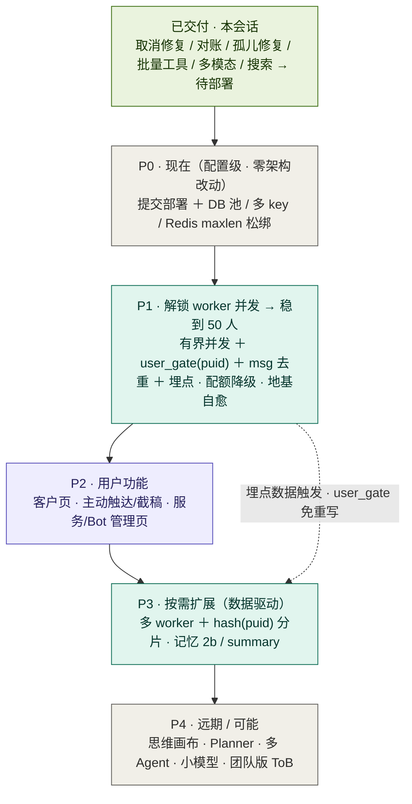

# 咕咕 · 功能开发链路 Roadmap

> **创建**：2026-06-24
> **范围**：IM/Agent 扩量为主线的分期开发链路 + 依赖关系 + Admin 可管理项清单。
> **原则**：right-sized——周边节点先用配置松绑，worker 并发先用「单进程有界并发 + per-user 闸门」解，多进程/分片**由埋点数据触发、不提前**。
> 相关：运行时决策环 [`agent-决策环.md`](agent-决策环.md)｜IM 接入与三进程部署 [`agent-im接入架构.md`](agent-im接入架构.md)。

> **部署形态决策（2026-06-24）：默认单机。** web + worker + supervisor + 网关同机 → 一套 `.env`/`override` 管全部、Admin 配置 + 重启全生效。**跨主机控制面（Redis 共享配置 + 命令频道）移出范围**；扩量靠单机内手段（`uvicorn --workers N`、**单 worker 进程 + async 并发**、多 LLM key、DB 池）。瓶颈是大模型延迟、非机器，一台机远超 50 人才到头。连带简化：`user_gate` 用进程内锁即**终态**，P3 多 worker/分片基本划掉（见下）。

---

## 分期总览



---

## 分期明细

### 已交付（本会话）

取消中途打断（流式途中查取消）、存储对账 + 修复、项目删除孤儿修复、文件集合操作（批量 move/rename/edit + 文件夹递归）、多模态看图、全局搜索、工具循环 10、服务状态页队列水位监控（⑨ 监控半）。

- ⚠️ **唯一待办：提交 + 部署** —— 否则在生产不生效（尤其取消修复，worker 主机需 `git pull` + 重启 `gugu-worker`）。

### P0 · 现在（配置级，今天就能做）

- 提交并部署本次修复（含取消修复，worker 主机需 `git pull` + 重启 `gugu-worker`）
- 周边松绑（零代码）：DB `pool_size` 调大（⑤）· Redis `maxlen` · `uvicorn --workers N`（④，⚠️ 需先做 P1-地基A 防周期任务重复跑）
- **provider 杠杆（⑥）**：多备 key / 换 DeepSeek-V3·Claude（`ai_presets` 已支持）—— 真瓶颈在大模型延迟/速率，这步性价比最高，建议和 ④⑤ 一起现在做
- **依赖**：无 ｜ **价值**：零/低代码拿到周边余量

### P1 · 解锁 worker 并发 → 稳到 50 人（架构核心）

**并发化（①）**
- `run_once` 串行 `for await` → **有界并发**（`Semaphore(C)`）
- **`user_gate(puid)` 抽象**（关键缝）：进程内 `asyncio.Lock`，同用户串行、不同用户并发。**单机决策下，进程内锁即终态**——不再需要分布式锁/分片（除非以后真上多 worker 进程）
- worker **优雅退出 drain（C）**：SIGTERM 先停取新消息、等在跑的跑完再退（并发后必须）
- `message_id` 幂等去重（顺手修 `claim_stale` 60s 重投导致的重复回复隐患）

**地基加固（进程优化）**
| 项 | 问题 | 修法 |
|----|------|------|
| **A 周期任务单实例化** | `lifespan` 的清理/刷日志循环在每个 uvicorn worker 重复跑（`--workers 2` 已双跑，④ 后 N 倍） | Redis leader 锁（SETNX+TTL）只一个进程跑；或搬到 worker（天然单例）。**是 ④ 的前置** |
| **B 消费组死 consumer 清理** | `CONSUMER={host}-{pid}` 重启换 pid，旧的永留组里累积 | 稳定名 `{host}` / `{host}-{slot}`；或启动 `XGROUP DELCONSUMER` 清 idle |
| D supervisor 轮询 | 每 1s 查 DB（`user_bots` 少变） | 间隔拉长 / bot 变更 pub/sub（次要） |

**其它**
- 任务耗时 / 队列深度 **埋点**（⑨ 监控部分✅ 已在服务页；为 P3 决策供数）
- 配额**能力降级**（忙时简单对话/查询仍可用，只暂缓重操作）
- 慢尾兜底：超时 + 重试（⑦）

- **依赖**：P0 部署完 ｜ **解锁**：单 worker 稳到 50 人；埋点为 P3 供数；`user_gate` 让 P3 免重写

> 配套：动了取消/状态核心，需并发冒烟测（模拟多用户并发 + 同用户连发，验证顺序/取消/状态不串）。

### P2 · 用户功能

- 客户管理页（后端 + Agent 工具已就绪，只差前端，低风险快赢）
- 主动触达 / 截稿提醒（复用 IM 出口 + APScheduler）
- **服务状态页 / Bot 管理页**（读 `health` 心跳 + `services_admin`，web 不碰 systemctl）
- **依赖**：P1 的埋点 / 地基（管理页要读心跳）

### P3 · 按需扩展（数据驱动，别提前）

- ~~多 worker + `hash(puid)` 分片~~ **暂不做（单机决策）**：单机优先「单 worker 进程 + async 并发」，进程内 `user_gate` 即够；真撞单进程 CPU 上限、被迫多进程时再上分片（届时 `user_gate` 实现从 asyncio 锁换 Redis 锁/分片路由，上层不动）
- 记忆 2b：`summary.md` 快照 + 分层压缩（记忆真溢出才做）
- **依赖**：埋点数据；多 worker 那条已 park

### P4 · 远期 / 可能

思维画布、Planner（不预先造框架）、多 Agent、小模型意图分类（需 GPU）、团队版 ToB、OSS 预签名直传、Casdoor SSO。

---

## 关键依赖链

```
提交部署(P0) → worker并发 + user_gate + 埋点(P1) ─〔埋点数据触发〕→ 多worker分片(P3)
                          └→ 配额降级 ───────────────→ 扛住 50 人负载
客户后端 ✅ ──────────────────────────────────────→ 客户页(P2，只差前端)
```

一句话：先**部署当下修复（P0）**，再做 **P1 这一坨**（既解决 50 人并发、又用一个 `user_gate` 缝把未来多 worker 从「重写」变「加组件」）；功能（P2）和真扩量（P3）分别挂在 P1 的地基和埋点数据上，**P3 由数据触发、不提前**。

---

## 任务 backlog（①–⑨）↔ 分期映射

> 分期 P0–P4 是战略视角，①–⑨ 是可勾选的任务视角，两者互补。

| № | 任务 | 分期 | 状态 / 依赖 |
|---|------|------|------------|
| ① | worker 串行 → 有界并发 + 按用户串行 | P1 | 核心（`user_gate`） |
| ② | 标题生成 + 反思移出关键路径 | —— | ✅ **已完成**（`runner._schedule_title` + `reflection.schedule` 均 fire-and-forget） |
| ③ | 多开 worker 进程（消费组 + systemd） | P3 | ⚠️ **依赖 ①**：进程内锁只在单进程有效，多开需 `user_gate` 升级为 `hash(puid)` 分片或 Redis 锁 + 新增 `gugu-worker@.service` 模板 |
| ④ | uvicorn --workers N | P0 | ⚠️ 需先做 P1-地基A（否则周期任务 N 倍重复） |
| ⑤ | DB 连接池调大 | P0 | 配置级，今天能做 |
| ⑥ | 换稳/快 provider（DeepSeek-V3 / Claude） | **P0（提前）** | 真瓶颈、杠杆最大；`ai_presets` 已支持多 key |
| ⑦ | 慢尾兜底：超时 + 重试 | P1 | 并发化时一起做（韧性） |
| ⑧ | IM 流式体验 | P2（独立轨） | 注：IM 现为非流式，飞书/QQ 靠卡片更新模拟 |
| ⑨ | 队列水位监控 + 告警 | P2 | 🟡 监控✅（服务页 length/lag/pending）；告警待做 |

**净结果**：② 已完成；⑨ 半完成；④⑤⑥ 现在就做；① 是 P1 核心；③⑦ 挂在 ① 上；⑧ 独立 UX 轨。

---

## Admin 可管理项清单

> 机制：`config.override.json`（Admin 写、`get_settings` 合并、优先级最高），已有 `db/redis/storage/ai/agent/quota/search/smtp` 八节卡片 → 加配置项 = 加字段。
> 状态/控制：`health.beat`（每进程每 5s 上报 pid/host/cmdline，TTL 20s）+ `services_admin`（读全部、可按 pid 安全 kill，cmdline 核对防误杀）→ 配合 systemd `Restart=always` = 现成的「重启」，不碰 systemctl。

| 能管什么 | 放哪 | 现状 | 生效 |
|---------|------|------|------|
| 服务状态盘（backend/worker/supervisor/网关 在线·pid·心跳） | 服务管理页 | 🟢 心跳+services_admin 已有，拼装即可 | 实时 |
| 重启 / 停某服务 | 服务管理页 | 🟢 services_admin 可 kill + systemd 拉起 | 即时 |
| Bot 开/关/增删 | Bot 管理页 | 🟢 toggle `user_bots.enabled`→supervisor 1s reconcile，缺总览 | 1s |
| 存储对账 | 系统配置→数据库 | ✅ 已建 | —— |
| DB 池 `pool_size/max_overflow` | 数据库卡片 | 🟡 加字段 | ⚠️ 需重启读它的进程 |
| Worker 并发度 C / MAX_ROUNDS / 取消检查间隔 | 行为卡片（`AgentBehaviorSettings`） | 🟡 加字段 | ⚠️ worker 重启（或接每轮热读） |
| 配额能力降级阈值 | 配额卡片（`QuotaSettings`） | 🟡 扩展现有 | 热（web 读） |
| Redis stream `maxlen` | Redis 卡片 | 🟡 加字段 | 新消息起 |
| AI 多 key/预设、max_tokens、温度、搜索每日上限 | Agent 配置 | ✅ 已有 | 热 |

**热生效 vs 需重启**：web 进程每请求 `get_settings`（热）；worker 很多值启动读一次（DB 池、并发度 → 改后需重启 worker，除非接成每轮热读）；prompts 每轮现读（热）。放 Admin 时每项要标清。

**暂不放**：worker 真正扩缩容（等 worker-supervisor 模式）、分片/分布式锁这类架构参数（是代码不是配置）。
