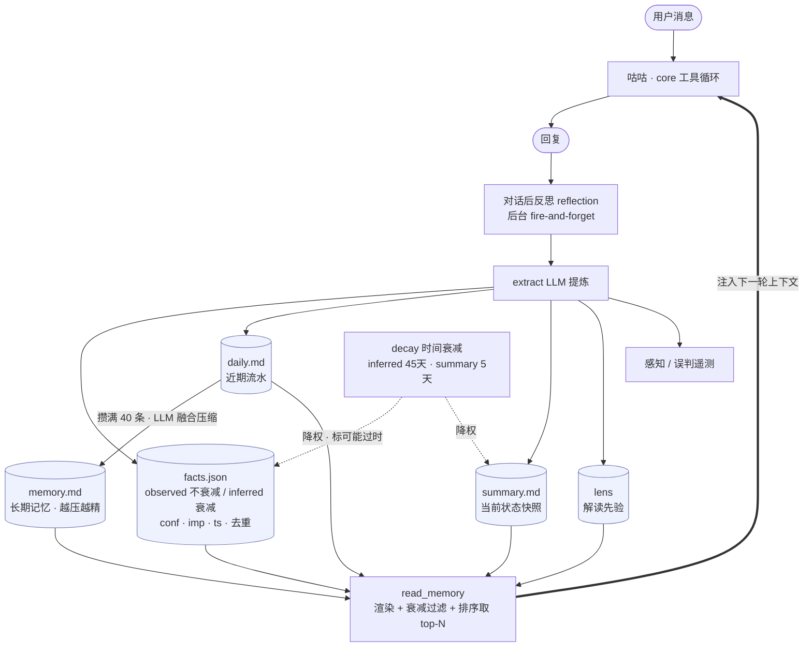

# 记忆系统架构

> 咕咕「伙伴」定位的地基:记忆不是功能,是核心(见 [`agent.md`](agent.md))。本文讲清这套记忆**有哪几层、怎么写入、怎么衰减、怎么注入**,以及守住的红线。代码在 `backend/agent/memory/` + `backend/agent/decay.py`。

---

## 总览图:记忆闭环



**一句话读图**:每轮对话「读」五层记忆注入上下文 → 咕咕回复 → 「写」端后台反思把这轮提炼进 facts/daily/summary/lens(+感知遥测)→ daily 攒满融合进 memory、衰减件给 summary/inferred-facts 降权 → 下一轮再「读」。捕捉(写)和注入(读)分离,反思失败不挡回复。

---

## 1. 五层记忆总览

`store.read_memory(user_id)` 一次返回五层,注入到每轮对话上下文(`context/builder`):

| 层 | 文件 | 是什么 | 生命周期 |
|---|---|---|---|
| **facts** | `facts.json` | 结构化稳定事实(2b),每条带 kind/conf/imp/ts | 增量增删改、衰减、去重、退休 |
| **daily** | `daily.md` | 本次/近期会话流水(新在上) | 攒够压缩进 memory,留最近 30 条 |
| **memory** | `memory.md` | 长期记忆(daily 沉淀融合而来) | 越压越精、不衰减 |
| **summary** | `summary.md` | 「用户当下在忙什么/近期重心」快照 | 增量演进 + 时间衰减(半衰期 5 天) |
| **lens** | (lens 存储) | 解读用户的预判先验(第 4 类记忆) | 规则带 conf + 衰减 + 去重 + gated 学习 |

设计意图:**facts=他是谁/长期事实**,**summary=他现在在忙啥**,**daily/memory=做过聊过的流水→沉淀**,**lens=怎么读懂他**。四种角度互补。

---

## 2. facts.json —— 结构化稳定事实(`memory/store.py`)

每条 fact:`{id, text, kind, conf, imp, ts}`

- **kind**:`observed`(用户明说/可直接观察,**不衰减**) vs `inferred`(推断,**置信半衰期 45 天**衰减,`FACTS_INFERRED_HALF_LIFE`)。
- **conf** 置信度、**imp** 重要度、**ts** 写入时间戳。
- **effective**(`_fact_eff`)= `conf × 时间衰减权重`。observed 衰减权重恒 1。

**去重**(`_fact_similar`):两条算「同一条」的判据——归一化相等 / 较短(≥6)是较长的子串 / 字符 bigram Jaccard ≥ 0.7。增量写入时合并,避免堆叠重复。

**注入渲染**(`render_facts`):退休 effective 过低的 → 按 `effective × importance` 排序取前 N → importance 过滤 → 低置信 inferred 标注「不太确定」。**注意:当前是按重要度全量注入 top-N,与本轮问题无关**(见 §7 优化方向)。

**增删改**(`apply_facts_ops`):反思产出 add/remove 后对列表应用一轮;旧 facts.md 首次读取自动迁移成 facts.json(`_migrate_md`,一律当 observed/中置信,避免被衰减淘汰)。

---

## 3. daily / memory / 压缩(`memory/compress.py`)

- **daily.md**:每轮反思 append 一句本轮流水(新在上)。
- **压缩触发**:daily 攒到 `DAILY_COMPACT_AT`(40) 条 → 取最老的(留最近 `DAILY_KEEP_RECENT`=30) → 连同已有 `memory.md` 交 LLM **融合**(合并重复、修正矛盾、丢弃琐碎、越压越精、不评判不推测) → 写回 memory.md,daily 只留最近 30。**约每 10 轮压一次**,按条数(不按天)控注入体积。
- 由 `reflection` 写完 daily **顺带触发**,失败不影响主流程。
- **防误删兜底**:原本有长期记忆、模型却返回空 → 不覆盖、也不裁 daily(避免丢数据)。

---

## 4. summary —— 当前状态快照 + 时间衰减(`memory/store.py` + `decay.py`)

- 一句「用户当下在忙什么/近期重心」,反思里**基于旧快照增量演进**(非空且变了才覆盖,防把快照清空/瞎改)。
- 带更新时间戳 `summary_ts`。注入时按 `decay.weight()` 半衰期衰减(`SUMMARY_HALF_LIFE` = 5 天:5 天权重 0.5、10 天 0.25);越久没更新越标「可能过时」。状态类信息几天就该打折。

---

## 5. lens —— 解读先验(第 4 类记忆,`memory/lens.py`)

- 不是「记住事实」,而是**记住「怎么读懂这个用户」的预判**:规范形如「触发语」→ 含义(如用户说「没事」其实是 X)。
- 每条规则带 confidence + **慢半衰期**衰减 + 去重(触发语是稳定判别键,退化时整句相似匹配)。
- **gated 学习**:不是每次都写,满足门槛才学(避免噪声)。注入时只出 effective ≥ 退休阈的规则、按置信选话术;空则不注入省 token。

---

## 6. 捕捉:对话后反思(`memory/reflection.py`)

每轮(`_worth_reflecting` 过滤掉不值得反思的轻量轮次后)后台 `reflect`:

1. `_extract` 用 LLM 从「本轮 user/assistant + 已有 facts + 已有 summary」提炼 → `{facts, daily, summary, perception}`。
2. **facts**:增量并入(`apply_facts_ops`),旧 prompt 回显整份则当 inferred 灰度兼容。
3. **summary**:非空且变了才覆盖。
4. **daily**:append + 触发压缩检查。
5. **perception**:`{intent / ambiguity / emotion / emo_strength}` → 感知遥测(见 [`感知系统-架构升级.md`](感知系统-架构升级.md))。
6. **误判捕获**(`_misperc_llm`/`_misperc_regex`):检测用户在纠正咕咕的误读 → 记 correction,区分「感知误读」vs「数据/执行错」。

reflection 是 fire-and-forget,任何失败不影响主回复。

---

## 7. 衰减共用件(`decay.py`)

置信/新鲜度随时间按半衰期衰减,**只降权 + 标「可能过时」,不删**:
- summary 半衰期 5 天;inferred facts 45 天;lens 慢半衰期;observed facts / memory.md 不衰减。
- 无时间戳 → 当新鲜(1.0,兼容旧数据,下次更新补 ts)。
- 设计哲学:状态会过时(打折),身份和历史不会(保留)。

---

## 8. 设计红线

- **0 脑补**(记忆边界):反思提取、压缩融合的 prompt 都钉死「不评判、不推测」——只整理真实发生/明说的,绝不推断出新结论。否则记忆会越积越「想当然」。
- **隐私脱敏**:决策轨迹/感知遥测只留结构不留用户内容(数据最小化,见 [`privacy.md`](privacy.md))。
- **防误删兜底**:压缩/summary 写入遇模型返回空 → 不覆盖,宁可不更新也不丢已有记忆。

---

## 9. 文件地图

```
backend/agent/
├── memory/
│   ├── store.py        # 五层读写 + facts.json 结构/衰减/去重/退休/渲染
│   ├── reflection.py   # 对话后反思:提炼 facts/daily/summary/perception + 误判捕获
│   ├── compress.py     # daily 攒够 → 融合进 memory.md
│   ├── lens.py         # 解读先验(第4类):规则学习/衰减/注入
│   └── _llm.py         # 记忆用的 complete_json(结构化输出)
├── decay.py            # 时间衰减共用件(summary/lens/facts 复用)
└── prompts/            # reflection.md / compress.md(可热编辑 / Admin 在线改)
```

---

## 10. 优化方向(待评估)

当前系统已较成熟(结构化 + 衰减 + 去重 + 压缩 + lens + 感知)。下一档优化按用户价值:

1. **检索从「按重要度注入 top-N」→「按当前问题语义相关性检索」**:给 facts 加向量检索,每轮 = 常驻核心档案(身份/硬偏好,不衰减) + 按本轮消息召回最相关 k 条。facts 长期增长后的精度/token 瓶颈。
2. **记忆驱动主动**(护城河「执行闭环」的真正落点):summary + 日历 deadline → 主动早报/提醒;久未推进的意图适时提醒。把「记忆 → 活动提醒工具」打通,让记忆从「知道」变「替你盯着」。
3. **记忆可见可编辑**:用户能看到/删/改咕咕记住的东西(信任 + 准确双赢),把禁忌做成用户可设的硬约束。
4. (次要)memory.md 周期再巩固(它本身无去重/退休);用 usage 反哺重要度(被引用的提权、长期没用到的加速衰减)。
